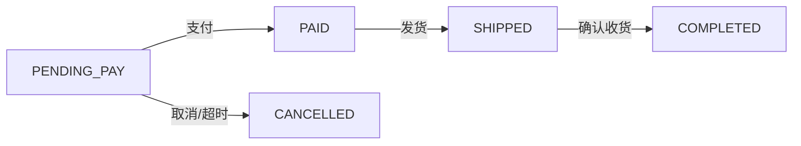

# Skill (A专属): 状态机枚举表规范生成

## Description

指导成员 A 生成/审查 4 类业务对象（订单、售后单、商家入驻、商品）的状态机枚举表，输出格式统一、可供全员签字确认，并作为前端页面清单与后端实现的状态唯一依据。

## When to Use

- 第一阶段 T1：产出状态机枚举表（签字版）
- 审查 B/C/D 文档中引用的状态是否与本表一致
- 第二阶段编写后端状态校验逻辑（对照本 skill 的禁止流转清单）

## 输出模板

每类状态机按以下四部分输出：

### 1. 状态集合表

| 状态值 | 中文名 | 说明 |
|--------|--------|------|
| PENDING_PAY | 待支付 | 订单已创建未支付 |
| ... | ... | ... |

### 2. 合法流转清单

| 流转 | 触发方 | 触发动作 | 附加条件 |
|------|--------|----------|----------|
| PENDING_PAY → PAID | 用户 | 模拟支付 | 校验库存与价格快照 |
| ... | ... | ... | ... |

### 3. 禁止流转清单

明确列出不允许的流转与原因，例如：
- COMPLETED → CANCELLED（已完成订单不可取消）
- CANCELLED → PAID（已取消订单不可支付）

### 4. 业务规则

- 仅待支付可取消；发货必须有运单号；退款须持久化商家回复与管理员处理结果等。

### 5. 流转图（mermaid stateDiagram 或 graph）

## 覆盖对象与基线（必须与 .qoder/rules/state-machine.md 一致）

- 订单：PENDING_PAY / PAID / SHIPPED / COMPLETED / CANCELLED
- 售后：REFUNDING / MERCHANT_AGREED / MERCHANT_REJECTED / ADMIN_INTERVENED / REFUNDED / CLOSED
- 商家入驻：PENDING_AUDIT / APPROVED / REJECTED
- 商品：DRAFT / PENDING_ON_SALE / ON_SALE / OFF_SALE

## 审查清单

1. 状态值是否与 rules/state-machine.md 完全一致（无自造状态名、无数字码）
2. 每条合法流转是否有触发方与触发动作
3. 禁止流转是否明确列出
4. 业务规则是否覆盖：退款留痕、审核原因、快照、审计日志
5. 流转图是否与清单一一对应

## Output Format

生成时输出：4 类状态机（每类含 1-5 部分）→ 全员签字区（姓名/日期/意见）→ 版本与日期。
