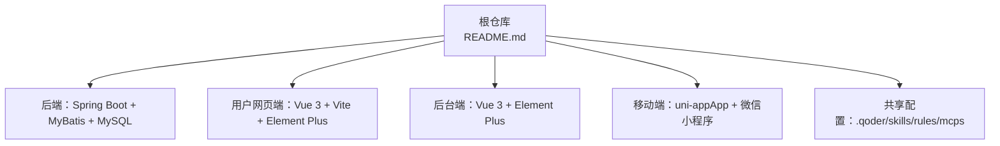
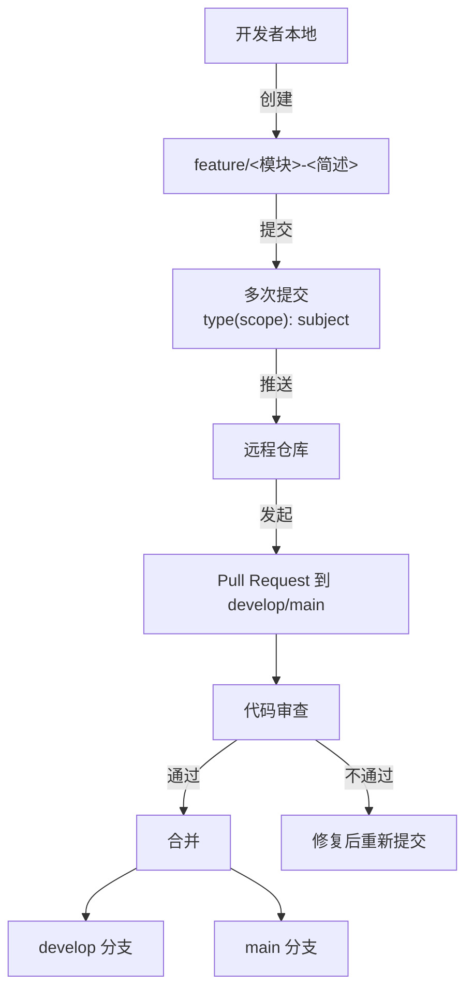
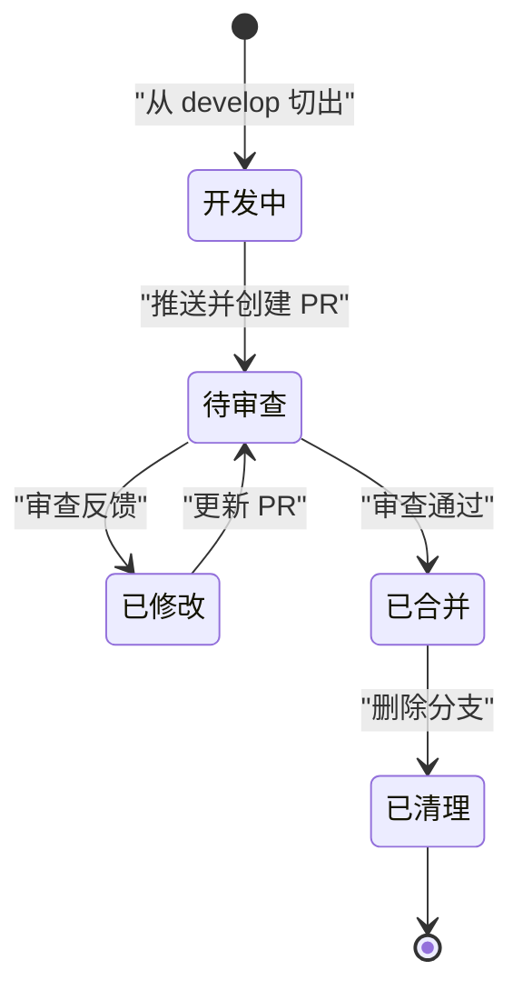
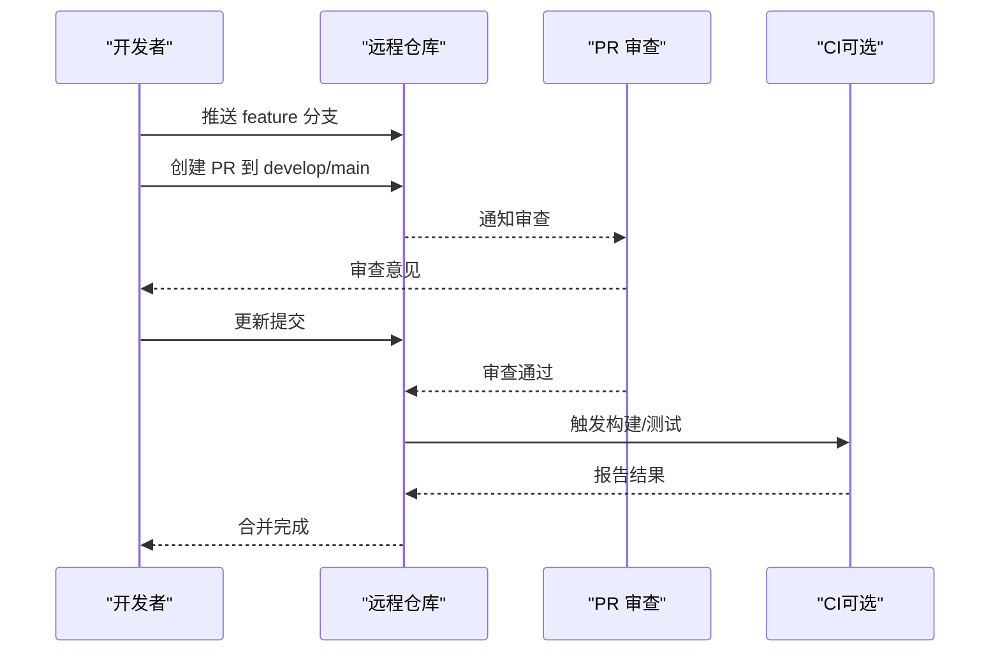
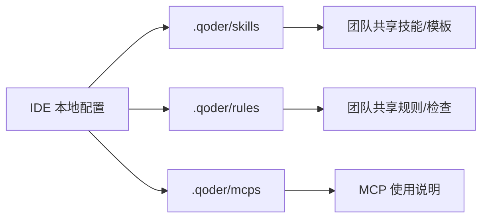
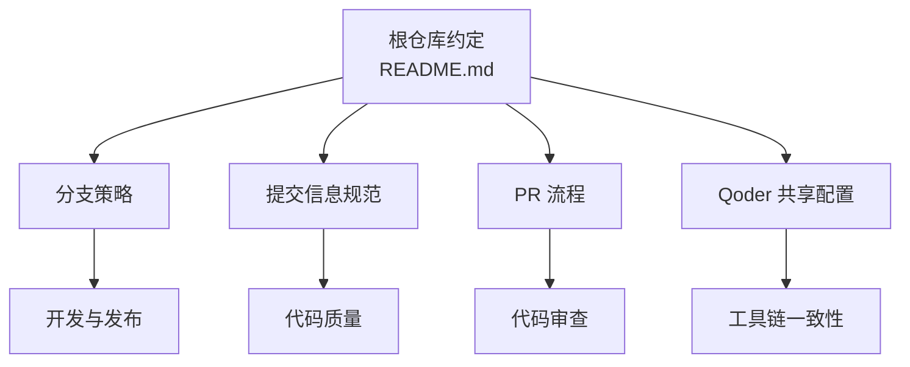

# 团队协作规范

<cite>
**本文引用的文件**   
- [README.md](file://README.md)
</cite>

## 目录
1. [引言](#引言)
2. [项目结构](#项目结构)
3. [核心组件](#核心组件)
4. [架构总览](#架构总览)
5. [详细组件分析](#详细组件分析)
6. [依赖分析](#依赖分析)
7. [性能考虑](#性能考虑)
8. [故障排查指南](#故障排查指南)
9. [结论](#结论)
10. [附录](#附录)

## 引言
本规范面向电商项目的多端协作团队，统一分支策略、提交信息格式、Pull Request 流程与代码质量标准，并说明 Qoder 共享配置（skills、rules、MCP）的使用方式。目标是降低沟通成本、提升交付质量与可维护性。

## 项目结构
仓库为课程作业的多端聚合工程，当前阶段以文档与协作约定为主，各端独立工程后续接入此仓库。

图表来源
- [README.md:18-24](file://README.md#L18-L24)
- [README.md:10-16](file://README.md#L10-L16)

章节来源
- [README.md:1-35](file://README.md#L1-L35)

## 核心组件
本节聚焦协作规范的核心要素：分支管理、提交信息、PR 流程、代码标准与 Qoder 共享配置。

- 分支管理
  - main：稳定分支，用于发布与生产基线。
  - develop：日常集成分支，承载已评审通过的集成变更。
  - feature/<模块>-<简述>：功能开发分支，从 develop 切出，完成后合并回 develop。
- 提交信息格式
  - type(scope): subject
  - type 建议包含：feat、fix、docs、style、refactor、perf、test、build、ci、chore、revert
  - scope 限定影响范围（如模块名或子系统）
  - subject 简明扼要描述变更目的
- Pull Request 流程
  - 所有合并到 develop 或 main 的变更必须通过 PR。
  - PR 需包含变更说明、关联需求/缺陷编号、自测结果与截图（如有）。
  - 至少一名审查者通过后才能合并。
- 代码质量标准
  - 命名：类/方法使用驼峰；常量全大写+下划线；包/模块按领域划分。
  - 文件组织：前后端各自遵循其生态最佳实践；公共逻辑抽取至共享模块。
  - 可测试性：关键路径具备单元测试或集成测试用例。
  - 可读性：复杂逻辑需注释；避免过长函数与深层嵌套。
- Qoder 共享配置
  - .qoder/skills：团队共享技能脚本或模板。
  - .qoder/rules：团队共享规则（如检查、格式化、生成器）。
  - .qoder/mcps：MCP 使用说明与示例。
  - 使用方式：在本地 IDE 中启用共享配置，确保团队成员一致的工具链行为。

章节来源
- [README.md:25-31](file://README.md#L25-L31)
- [README.md:10-16](file://README.md#L10-L16)

## 架构总览
下图展示协作工作流与分支流转关系，以及 PR 审查环节。

图表来源
- [README.md:25-31](file://README.md#L25-L31)

## 详细组件分析

### 分支管理与生命周期
- 分支角色
  - main：仅接受来自 develop 的受控合并，保持可发布状态。
  - develop：持续集成与联调环境的基础，允许频繁合并。
  - feature/<模块>-<简述>：短期存在，完成即合并并删除。
- 生命周期
  - 创建：从 develop 切出。
  - 开发：小步提交，保持可编译、可运行。
  - 合并：通过 PR 合并回 develop，必要时再合入 main。
  - 清理：合并后及时删除本地与远端分支。

图表来源
- [README.md:25-31](file://README.md#L25-L31)

章节来源
- [README.md:25-31](file://README.md#L25-L31)

### 提交信息规范
- 格式：type(scope): subject
- 类型建议
  - feat：新功能
  - fix：缺陷修复
  - docs：文档变更
  - style：不影响逻辑的样式/格式化
  - refactor：重构
  - perf：性能优化
  - test：测试相关
  - build：构建系统或外部依赖变更
  - ci：CI/CD 配置变更
  - chore：杂务（非业务逻辑）
  - revert：回滚
- 示例（示意）
  - feat(user): 新增用户注册接口
  - fix(order): 修复订单金额计算精度问题
  - docs(api): 补充支付回调文档
  - refactor(cart): 拆分购物车服务为子模块
  - test(auth): 增加登录失败重试用例
  - ci(deploy): 调整部署流水线镜像版本
  - chore(deps): 升级前端构建工具版本
  - revert(backend): 回滚数据库迁移脚本 v12

章节来源
- [README.md:29](file://README.md#L29)

### Pull Request 流程
- 创建
  - 选择目标分支（develop 或 main），填写变更背景与影响范围。
  - 附上自测结果、截图或日志片段（如有）。
- 审查
  - 至少一名审查者确认符合规范与质量要求。
  - 关注点：正确性、可维护性、性能与安全。
- 合并
  - 合并后触发 CI（若已接入），验证构建与测试。
  - 保留合并消息引用 issue/任务编号。

图表来源
- [README.md:25-31](file://README.md#L25-L31)

章节来源
- [README.md:25-31](file://README.md#L25-L31)

### 代码质量标准与文件组织
- 通用原则
  - 单一职责：模块/类职责清晰，避免“上帝对象”。
  - 可测试性：关键路径提供单测或集成测试。
  - 可观测性：关键操作记录必要日志，便于定位问题。
- 命名约定
  - 变量/方法：驼峰；常量：全大写+下划线；包/模块：按领域分层。
- 文件组织
  - 前后端分别遵循各自生态最佳实践；跨端公共逻辑抽离为共享模块。
- 安全与合规
  - 敏感信息不入仓；依赖漏洞定期扫描；最小权限访问。

[本节为通用指导，无需具体文件引用]

### Qoder 共享配置使用指南
- 目录结构
  - .qoder/skills：团队共享技能脚本或模板。
  - .qoder/rules：团队共享规则（检查、格式化、生成器等）。
  - .qoder/mcps：MCP 使用说明与示例。
- 使用方法
  - 在本地 IDE 中启用共享配置，确保团队一致的规则与工具链行为。
  - 将常用命令、模板与检查规则沉淀到 skills 与 rules，减少重复劳动。
  - 参考 mcps 中的说明，按需启用 MCP 能力。

图表来源
- [README.md:10-16](file://README.md#L10-L16)

章节来源
- [README.md:10-16](file://README.md#L10-L16)

## 依赖分析
- 仓库层面
  - README 定义了技术栈与协作规范，作为团队共识入口。
  - 各端工程后续接入，形成“聚合仓库 + 多端子工程”的结构。
- 协作依赖
  - 分支与 PR 流程是跨端协作的关键契约。
  - Qoder 共享配置是工具链一致性保障。

图表来源
- [README.md:10-16](file://README.md#L10-L16)
- [README.md:25-31](file://README.md#L25-L31)

章节来源
- [README.md:10-16](file://README.md#L10-L16)
- [README.md:25-31](file://README.md#L25-L31)

## 性能考虑
- 提交粒度：小而频繁的提交有助于快速定位问题与回滚。
- 分支规模：feature 分支尽量短小，避免长期大分支导致冲突与集成风险。
- 审查效率：PR 描述清晰、变更集中，缩短审查时间。

[本节为通用指导，无需具体文件引用]

## 故障排查指南
- 常见冲突
  - 现象：合并时出现大量冲突。
  - 处理：先拉取最新 develop，解决冲突后再提交；必要时与负责人对齐变更边界。
- 提交信息不规范
  - 现象：CI 或审查被打回。
  - 处理：按 type(scope): subject 修正；必要时使用 amend 或交互式 rebase 整理历史。
- PR 长时间未审查
  - 现象：阻塞发布节奏。
  - 处理：@相关审查者；补充必要上下文与自测证据；必要时升级协调。
- Qoder 配置不一致
  - 现象：本地格式化/检查行为与团队不一致。
  - 处理：同步 .qoder 配置；确认 IDE 插件版本与启用项一致。

[本节为通用指导，无需具体文件引用]

## 结论
通过统一的分支策略、提交信息规范、PR 流程与 Qoder 共享配置，团队可在多端并行开发中保持一致性与高质量。建议持续完善自动化检查与 CI 门禁，进一步降低协作摩擦。

[本节为总结，无需具体文件引用]

## 附录
- 术语
  - PR：Pull Request，拉取请求，用于代码审查与合并。
  - CI：持续集成，自动构建与测试。
  - MCP：Model Context Protocol，模型上下文协议（详见 .qoder/mcps）。
- 参考
  - 技术栈与共享配置位置见 README。

[本节为补充说明，无需具体文件引用]