# API接口开发规范

<cite>
**本文引用的文件**   
- [README.md](file://README.md)
</cite>

## 目录
1. [引言](#引言)
2. [项目结构](#项目结构)
3. [核心组件](#核心组件)
4. [架构总览](#架构总览)
5. [详细组件分析](#详细组件分析)
6. [依赖分析](#依赖分析)
7. [性能考虑](#性能考虑)
8. [故障排查指南](#故障排查指南)
9. [结论](#结论)
10. [附录](#附录)

## 引言
本规范面向“京东风格电商平台”的后端API设计与实现，目标是建立统一的RESTful接口规范、统一请求/响应格式、认证授权机制、版本管理与向后兼容策略、文档自动生成与集成、测试与Mock数据方法，并提供常用业务接口的参考实现示例。本项目技术栈为Spring Boot + MyBatis + MySQL，前端覆盖网页端、App、小程序、商家后台与管理后台等多端。

## 项目结构
当前仓库为课程作业主仓库，包含项目说明与共享配置入口。后端工程后续接入此仓库，具体启动方式由各端负责人补充。

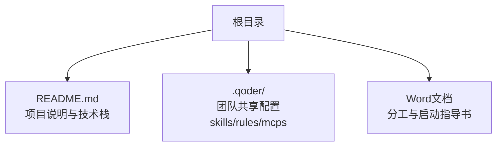

**图示来源**
- [README.md:1-35](file://README.md#L1-L35)

**章节来源**
- [README.md:1-35](file://README.md#L1-L35)

## 核心组件
本节定义统一的API设计原则与通用约定，适用于所有多端客户端（网页、App、小程序、商家后台、管理后台）。

- RESTful设计原则
  - URL命名：使用名词复数表示资源集合，层级清晰，避免动词；路径小写，连字符分隔；示例：/api/v1/users、/api/v1/products/{id}。
  - HTTP方法：GET读取、POST创建、PUT全量更新、PATCH部分更新、DELETE删除；幂等性遵循HTTP语义。
  - 状态码：遵循HTTP标准，如200成功、201创建、204无内容、400参数错误、401未认证、403权限不足、404不存在、409冲突、422校验失败、429限流、500服务端错误。
  - 查询参数：分页使用page、size；排序使用sort字段与order方向；过滤使用语义化键名。
  - 资源嵌套：体现从属关系，但避免过深嵌套；示例：/api/v1/orders/{orderId}/items。

- 统一请求/响应格式
  - 成功响应结构：包含code、message、data、traceId、timestamp。
  - 错误响应结构：包含code、message、details（可选）、traceId、timestamp。
  - 分页标准：返回total、page、size、list；或采用游标分页的cursor与hasMore。
  - 时间与时区：统一使用ISO 8601字符串或UTC毫秒时间戳，并在文档中明确时区。
  - 语言与编码：UTF-8；国际化通过Accept-Language头控制。

- 认证与授权
  - 认证：基于JWT的无状态认证；登录成功后返回access_token与refresh_token；敏感操作需携带Authorization: Bearer <token>。
  - 授权：基于角色的访问控制RBAC；支持细粒度资源级权限；鉴权失败返回403。
  - 安全：HTTPS强制；Token短期有效+刷新机制；密码哈希存储；防重放与签名校验（可选）。

- 版本管理与兼容性
  - 版本策略：URL前缀v1、v2；重大变更升级版本号；废弃接口保留至少两个大版本并标注弃用提示。
  - 兼容性：新增字段非破坏性；删除字段需灰度；行为变更提供开关与迁移期。

- 文档自动生成与Swagger集成
  - 使用OpenAPI/Swagger注解生成接口文档；统一基础路径、公共参数、错误码字典；提供在线调试。
  - 文档发布：随构建产物输出，或在网关层聚合多服务文档。

- 测试与Mock
  - 单元测试：对Service与工具类进行断言；集成测试覆盖关键接口链路。
  - Mock数据：使用WireMock或Spring Test RestTemplate/MockMvc构造场景；数据库使用H2或Testcontainers。
  - 契约测试：消费者驱动契约确保前后端一致性。

**章节来源**
- [README.md:18-24](file://README.md#L18-L24)

## 架构总览
下图展示典型的多端客户端通过网关访问后端服务的整体流程，涵盖认证、路由、业务处理与持久化。

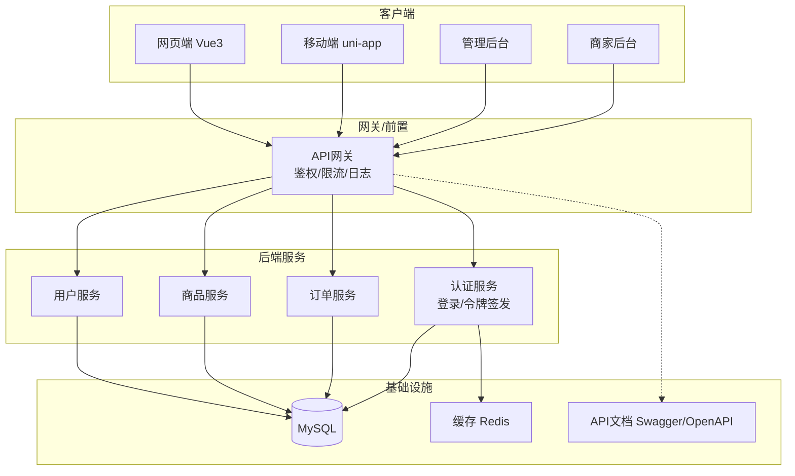

**图示来源**
- [README.md:18-24](file://README.md#L18-L24)

## 详细组件分析

### 统一响应体与分页模型
- 响应体字段
  - code：业务状态码（整数）
  - message：人类可读消息（字符串）
  - data：业务数据（对象/数组/空）
  - traceId：链路追踪ID（字符串）
  - timestamp：服务器时间（ISO 8601或毫秒）
- 分页模型
  - total：总记录数
  - page：当前页码
  - size：每页大小
  - list：数据列表
  - 或游标分页：cursor、hasMore

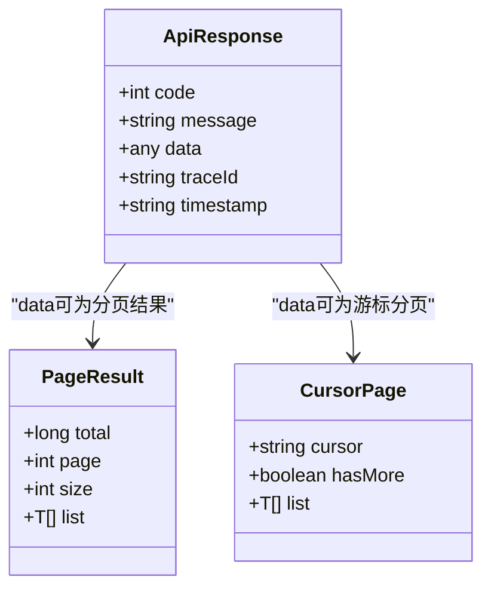

**图示来源**
- [README.md:18-24](file://README.md#L18-L24)

**章节来源**
- [README.md:18-24](file://README.md#L18-L24)

### 认证与授权流程
- 登录与令牌签发
  - 客户端提交用户名/密码或第三方凭证
  - 服务端校验后签发access_token与refresh_token
  - 将用户角色与权限写入缓存以便快速鉴权
- 受保护接口访问
  - 客户端在请求头携带Authorization: Bearer <token>
  - 网关或服务拦截器校验令牌有效性、过期时间与签名
  - 根据角色与资源权限决定是否放行
- 刷新令牌
  - access_token过期后使用refresh_token换取新令牌
  - 刷新失败则要求重新登录

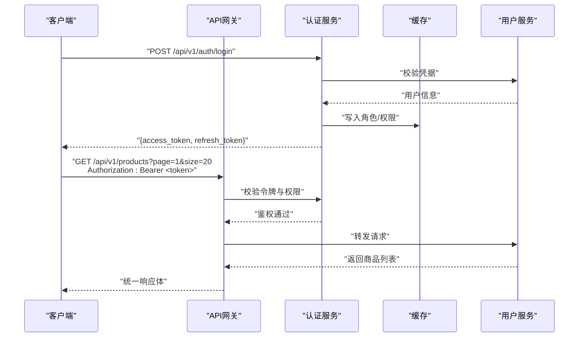

**图示来源**
- [README.md:18-24](file://README.md#L18-L24)

**章节来源**
- [README.md:18-24](file://README.md#L18-L24)

### 接口版本管理与向后兼容
- 版本策略
  - URL前缀区分版本：/api/v1、/api/v2
  - 重大不兼容变更升级主版本；仅新增字段或行为扩展保持同版本兼容
- 弃用与迁移
  - 废弃接口返回警告头或消息提示
  - 提供过渡期与迁移指南
- 兼容性保证
  - 新增字段默认值与非必填
  - 删除字段灰度下线
  - 行为变更提供特性开关

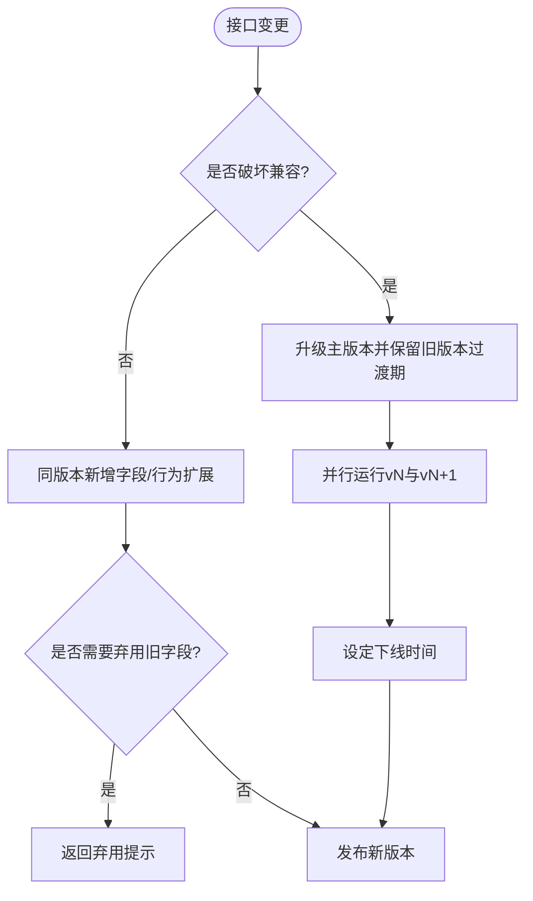

**图示来源**
- [README.md:18-24](file://README.md#L18-L24)

**章节来源**
- [README.md:18-24](file://README.md#L18-L24)

### 文档自动生成与Swagger集成
- 注解驱动：在控制器与方法上使用OpenAPI注解描述路径、参数、响应与错误码
- 公共信息：统一基础路径、版本、联系人、许可证
- 错误码字典：集中维护全局错误码与含义
- 在线调试：启用Swagger UI或Knife4j增强界面
- 多服务聚合：通过网关或文档中心聚合各服务文档

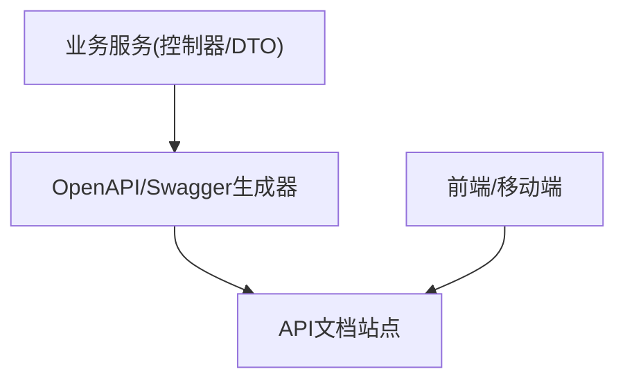

**图示来源**
- [README.md:18-24](file://README.md#L18-L24)

**章节来源**
- [README.md:18-24](file://README.md#L18-L24)

### 接口测试与Mock数据
- 单测与集成测试
  - Service层断言业务逻辑
  - Controller层使用MockMvc或WebTestClient验证统一响应体与状态码
- Mock数据
  - 外部依赖使用WireMock模拟
  - 数据库使用H2内存库或Testcontainers
- 契约测试
  - 消费者驱动契约保障前后端一致
- 自动化
  - 在CI流水线执行测试与覆盖率检查

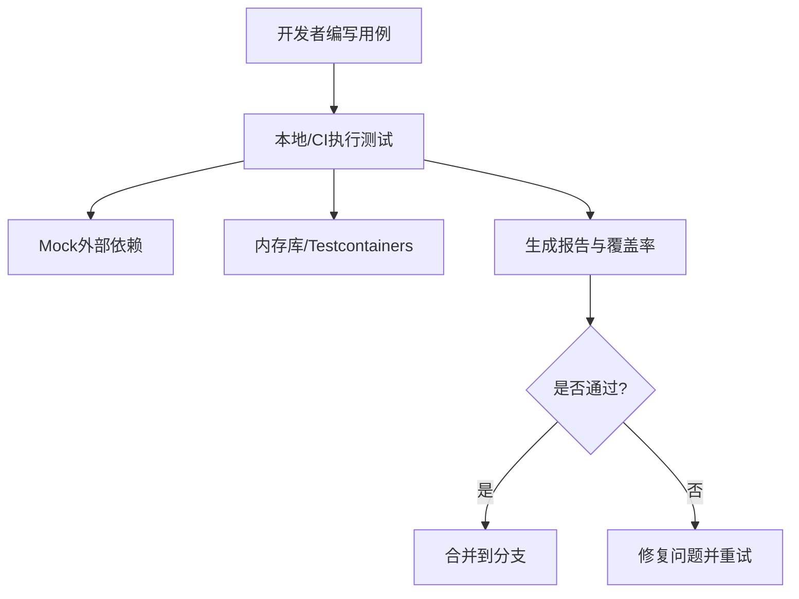

**图示来源**
- [README.md:18-24](file://README.md#L18-L24)

**章节来源**
- [README.md:18-24](file://README.md#L18-L24)

### 常用业务接口示例

#### 用户认证
- 登录
  - 方法：POST
  - 路径：/api/v1/auth/login
  - 请求体：用户名、密码（或第三方凭证）
  - 响应：access_token、refresh_token
  - 状态码：200成功、400参数错误、401认证失败
- 刷新令牌
  - 方法：POST
  - 路径：/api/v1/auth/token/refresh
  - 请求体：refresh_token
  - 响应：新的access_token
  - 状态码：200成功、401无效令牌
- 登出
  - 方法：POST
  - 路径：/api/v1/auth/logout
  - 响应：204无内容
  - 状态码：204成功、401未认证

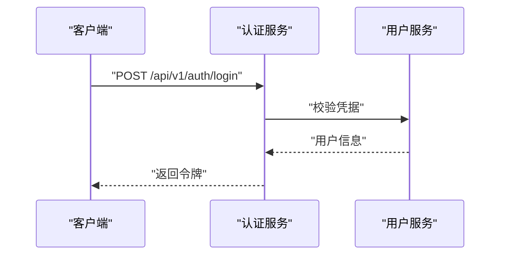

**图示来源**
- [README.md:18-24](file://README.md#L18-L24)

**章节来源**
- [README.md:18-24](file://README.md#L18-L24)

#### 商品查询
- 获取商品列表
  - 方法：GET
  - 路径：/api/v1/products
  - 查询参数：page、size、keyword、category、sort、order
  - 响应：分页结果（total、page、size、list）
  - 状态码：200成功、400参数错误
- 获取商品详情
  - 方法：GET
  - 路径：/api/v1/products/{id}
  - 响应：商品对象
  - 状态码：200成功、404不存在

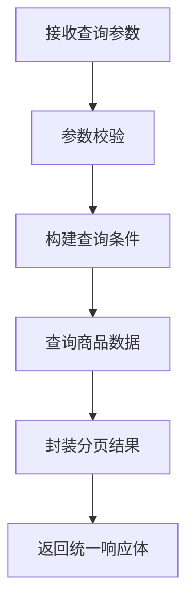

**图示来源**
- [README.md:18-24](file://README.md#L18-L24)

**章节来源**
- [README.md:18-24](file://README.md#L18-L24)

#### 订单创建
- 创建订单
  - 方法：POST
  - 路径：/api/v1/orders
  - 请求体：商品ID、数量、收货地址、优惠券等
  - 响应：订单ID与订单摘要
  - 状态码：201创建成功、400参数错误、409库存不足、500服务端错误
- 支付回调
  - 方法：POST
  - 路径：/api/v1/orders/{orderId}/pay/callback
  - 请求体：支付平台回传数据
  - 响应：200确认
  - 状态码：200成功、400参数错误、404订单不存在

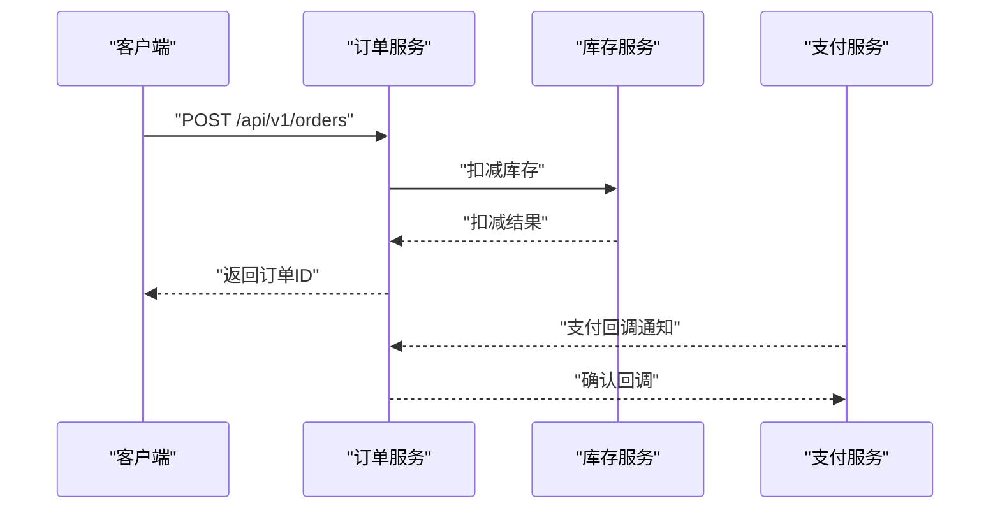

**图示来源**
- [README.md:18-24](file://README.md#L18-L24)

**章节来源**
- [README.md:18-24](file://README.md#L18-L24)

## 依赖分析
- 内部依赖
  - 网关依赖认证与鉴权服务
  - 业务服务依赖数据库与缓存
  - 文档生成器依赖控制器与DTO
- 外部依赖
  - MySQL用于持久化
  - Redis用于缓存与令牌黑名单
  - OpenAPI/Swagger用于文档生成

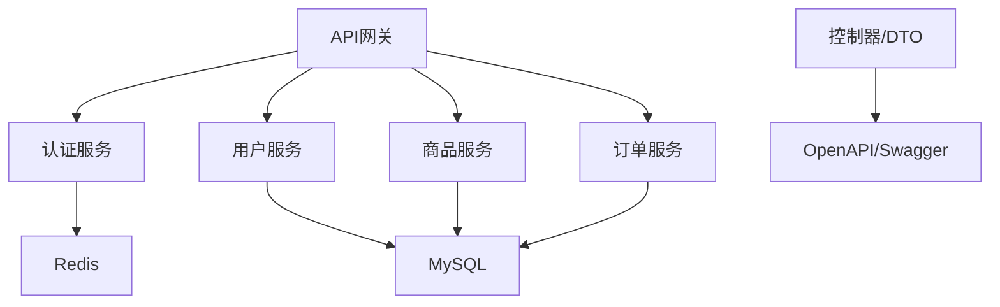

**图示来源**
- [README.md:18-24](file://README.md#L18-L24)

**章节来源**
- [README.md:18-24](file://README.md#L18-L24)

## 性能考虑
- 分页与索引：合理设置page/size上限；对高频查询字段建立索引
- 缓存策略：热点商品与用户信息缓存；缓存穿透与雪崩防护
- 连接池：数据库与HTTP客户端连接池调优
- 限流与熔断：网关层限流；服务间调用熔断降级
- 异步处理：耗时任务（如报表、通知）异步化
- 监控与告警：指标采集、链路追踪与异常告警

[本节为通用建议，无需特定文件引用]

## 故障排查指南
- 常见问题定位
  - 401未认证：检查Authorization头与令牌有效期
  - 403权限不足：核对角色与资源权限映射
  - 404资源不存在：确认路径与参数正确性
  - 422校验失败：查看请求体字段校验规则
  - 500服务端错误：查看traceId与服务日志
- 日志与追踪
  - 统一traceId贯穿请求链路
  - 关键节点打点与错误堆栈上报
- 回归与复现
  - 使用统一响应体与错误码字典快速定位
  - 借助Mock数据与契约测试复现场景

**章节来源**
- [README.md:18-24](file://README.md#L18-L24)

## 结论
本规范围绕RESTful设计、统一响应体、认证授权、版本兼容、文档生成、测试与Mock以及常见业务接口示例展开，旨在为多端电商平台的API开发与协作提供统一标准。结合Spring Boot + MyBatis + MySQL技术栈，可在保证质量与可维护性的同时提升交付效率。

[本节为总结性内容，无需特定文件引用]

## 附录
- 术语表
  - RBAC：基于角色的访问控制
  - JWT：JSON Web Token
  - OpenAPI：开放API规范
- 参考链接
  - 项目说明与技术栈见README

**章节来源**
- [README.md:1-35](file://README.md#L1-L35)