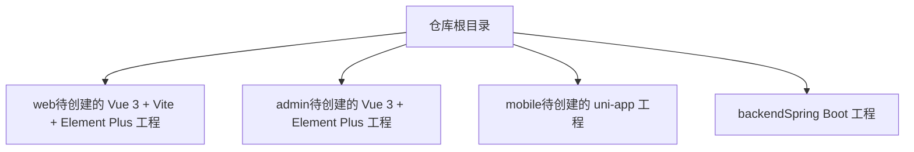
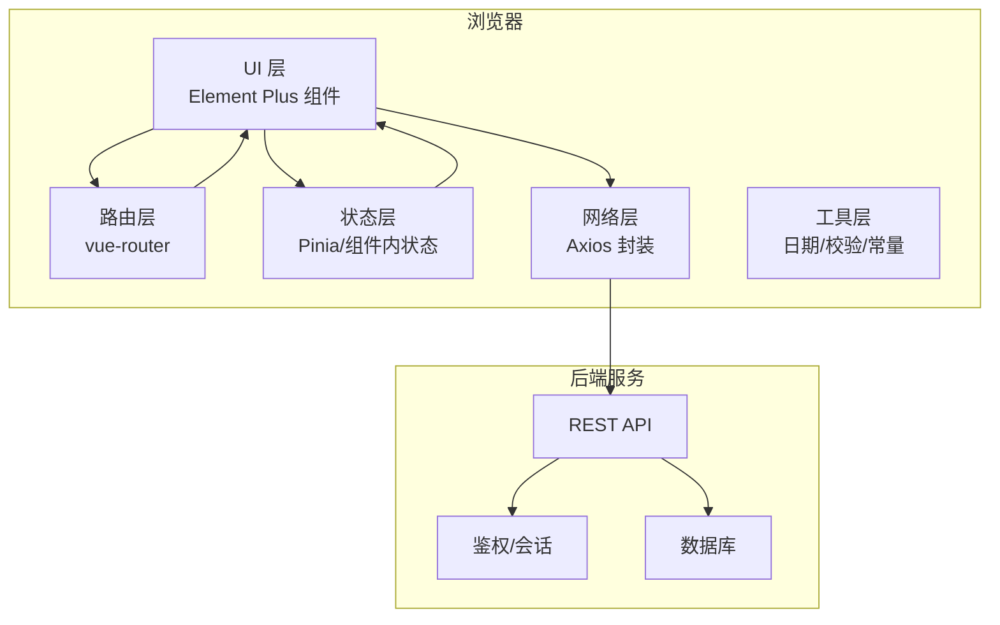
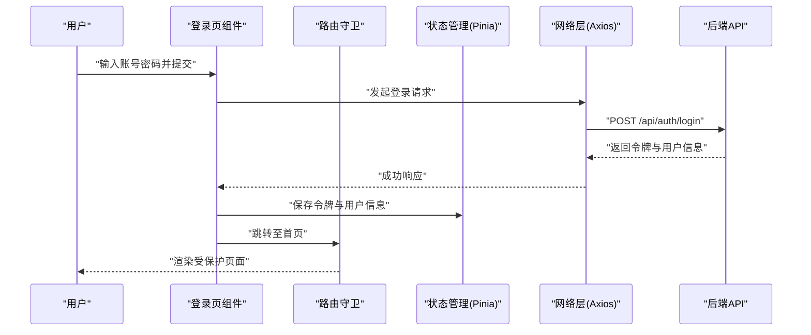
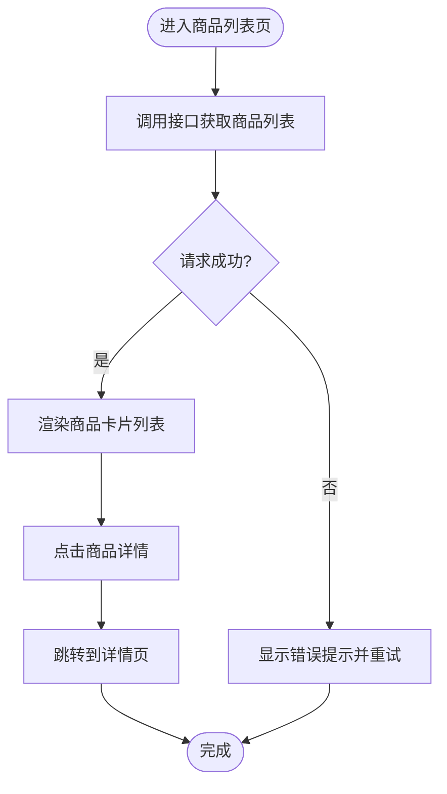

# 前端开发指南

<cite>
**本文引用的文件**
- [README.md](file://README.md)
</cite>

## 目录
1. [简介](#简介)
2. [项目结构](#项目结构)
3. [核心组件](#核心组件)
4. [架构总览](#架构总览)
5. [详细组件分析](#详细组件分析)
6. [依赖分析](#依赖分析)
7. [性能考虑](#性能考虑)
8. [故障排查指南](#故障排查指南)
9. [结论](#结论)
10. [附录](#附录)

## 简介
本指南面向基于 Vue 3 + Vite + Element Plus 的前端工程，目标是提供从项目初始化、组合式 API 使用、Element Plus 集成、路由与页面组织、静态资源管理与构建优化，到代码规范与常见业务场景实现的全流程开发指导。该仓库为多端电商课程作业，用户网页端技术栈明确为 Vue 3 + Vite + Element Plus，后续各端将独立接入本仓库。

**章节来源**
- [README.md:18-24](file://README.md#L18-L24)

## 项目结构
当前仓库处于“多端聚合”阶段，尚未包含前端源码与配置文件。根据 README 的说明，用户网页端（Vue 3 + Vite + Element Plus）与后台端（Vue 3 + Element Plus）、移动端（uni-app）以及后端（Spring Boot + MyBatis + MySQL）将在后续以独立工程的形式接入本仓库。因此，现阶段不存在 src、package.json、vite.config.* 等前端工程文件。

建议的前端工程落地位置：在仓库根目录下新增一个独立的子目录作为用户网页端工程（例如 web），并在其中创建标准 Vite + Vue 3 工程结构与配置。

[本节为概念性结构说明，不直接分析具体源文件]

## 核心组件
由于当前仓库未包含前端源码与配置，以下内容为通用实践建议，便于后续在独立工程中快速落地。

- 项目初始化
  - 使用 Vite 脚手架创建 Vue 3 工程，安装 Element Plus 及可选工具（如路由、状态管理、HTTP 客户端）。
  - 基础配置包括：Vite 入口与插件、环境变量、路径别名、代理与跨域、构建产物输出等。
- Vue 3 组合式 API
  - 组件采用单文件组件（SFC）+ Composition API 模式，使用 ref/reactive 管理响应式数据，使用 computed/watch 处理派生与副作用。
  - 生命周期钩子使用 onMounted/onUnmounted 等组合式函数替代选项式钩子。
- Element Plus 集成
  - 按需引入或全局注册组件与样式；统一主题与图标；封装常用 UI 交互（弹窗、表单校验、消息提示）。
- 路由与页面组织
  - 使用 vue-router 进行页面级路由；按功能模块划分 pages 与 components；统一布局容器与权限守卫。
- 状态管理
  - 小范围状态使用组件内响应式；跨组件共享状态使用 Pinia；持久化策略结合本地存储。
- HTTP 与错误处理
  - 统一封装请求实例，拦截器处理鉴权、重试、错误码映射；定义全局错误边界与用户提示。
- 静态资源与构建优化
  - 图片/字体等资源通过 assets 目录管理；启用 Gzip/Brotli、分包与懒加载；按需引入减少包体。
- 代码规范与 ESLint
  - 统一 ESLint/Prettier 规则；提交前自动格式化与检查；团队共享规则存放于 .qoder/rules（若启用）。

[本节为通用实践说明，不直接分析具体源文件]

## 架构总览
下图展示用户网页端在前端侧的典型分层与交互关系，便于理解后续在独立工程中的职责划分。

[本节为概念性架构图，不直接映射具体源文件]

## 详细组件分析
因当前仓库未包含前端源码，本节提供“落地后”的建议性分析与示例流程，帮助在独立工程中快速搭建并扩展。

### 登录流程（序列图）

[本节为概念性流程图，不直接映射具体源文件]

### 商品展示流程（流程图）

[本节为概念性流程图，不直接映射具体源文件]

**章节来源**
- [README.md:18-24](file://README.md#L18-L24)

## 依赖分析
当前仓库不包含前端依赖清单与构建配置，无法进行实际依赖关系分析。建议在独立工程中：
- 使用 package.json 声明生产与开发依赖，区分 devDependencies 与 dependencies。
- 使用 pnpm/yarn/npm lock 文件锁定版本，保证团队一致性。
- 定期执行安全扫描与依赖更新，避免已知漏洞。

[本节为通用建议，不直接分析具体源文件]

## 性能考虑
- 首屏优化
  - 路由懒加载、组件异步导入、关键 CSS 内联、预加载关键资源。
- 包体控制
  - 按需引入 Element Plus 组件与样式；拆分第三方库；开启 Tree Shaking。
- 缓存与离线
  - 合理使用浏览器缓存头；对静态资源添加内容哈希；必要时引入 PWA。
- 运行时性能
  - 大列表虚拟滚动；防抖节流；避免不必要的重渲染；合理拆分计算属性与监听器。

[本节为通用建议，不直接分析具体源文件]

## 故障排查指南
- 启动失败
  - 检查 Node 版本与包管理器一致性；清理缓存与 node_modules 后重装依赖；确认端口占用。
- 样式异常
  - 确认 Element Plus 样式已正确引入；检查 CSS 作用域与覆盖顺序；排查主题变量冲突。
- 路由跳转无效
  - 检查路由表注册与嵌套层级；确认导航守卫逻辑与参数传递；核对动态路由匹配规则。
- 请求失败
  - 查看网络面板与拦截器日志；确认跨域与鉴权头；统一错误码映射与用户提示。
- 构建体积过大
  - 分析打包报告；定位大依赖；启用按需引入与分包；关闭调试信息。

[本节为通用建议，不直接分析具体源文件]

## 结论
当前仓库为多端聚合仓库，前端工程尚未落地。建议尽快在独立子目录中创建 Vue 3 + Vite + Element Plus 工程，并按本指南完成初始化、组件与路由组织、状态与网络封装、构建优化与代码规范配置，以提升团队协作效率与工程质量。

[本节为总结性内容，不直接分析具体源文件]

## 附录
- 协作规范
  - 分支策略：main 稳定分支，develop 日常集成分支；feature/<模块>-<简述> 功能分支。
  - 提交信息：type(scope): subject。
  - 合并：通过 Pull Request 合并至 develop/main。
- 共享配置
  - 团队共享 skills、rules、MCP 使用说明存放在 .qoder/ 目录，可在后续工程中复用。

**章节来源**
- [README.md:25-31](file://README.md#L25-L31)
- [README.md:10-17](file://README.md#L10-L17)