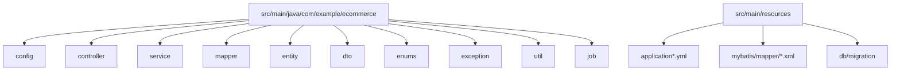
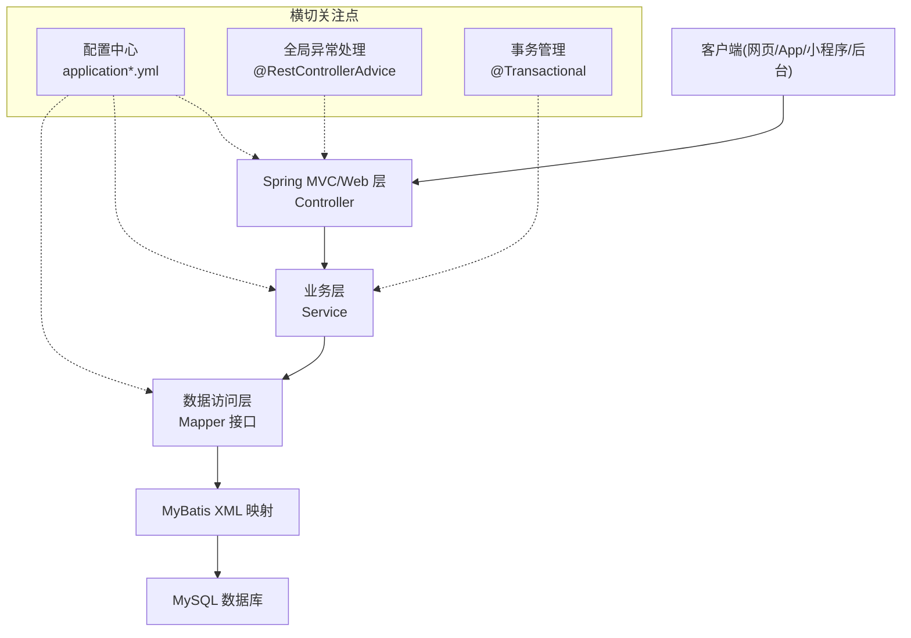

# 后端开发指南

<cite>
**本文引用的文件**   
- [README.md](file://README.md)
</cite>

## 目录
1. [简介](#简介)
2. [项目结构](#项目结构)
3. [核心组件](#核心组件)
4. [架构总览](#架构总览)
5. [详细组件分析](#详细组件分析)
6. [依赖分析](#依赖分析)
7. [性能考虑](#性能考虑)
8. [故障排查指南](#故障排查指南)
9. [结论](#结论)
10. [附录](#附录)

## 简介
本指南面向基于 Spring Boot + MyBatis + MySQL 的后端开发，目标是建立统一、可维护、可扩展的电商后端工程规范。内容涵盖：
- 包组织与分层架构（Controller-Service-Mapper）
- 配置管理（application.yml、多环境、数据库连接）
- MyBatis 映射规范（实体类、Mapper 接口、XML 映射文件）
- RESTful API 规范（命名约定、请求响应格式、错误处理）
- 事务管理与数据访问最佳实践
- 单元测试编写指南与代码质量检查工具配置

说明：当前仓库为课程作业仓库，仅包含 README 与协作说明，尚未包含后端源码。因此，本指南以通用工程规范为主，结合仓库中已声明的技术栈进行落地建议。

章节来源
- [README.md:1-35](file://README.md#L1-L35)

## 项目结构
建议采用“按功能域+分层”的组织方式，清晰划分职责，便于团队协作与持续集成。

推荐目录结构（示例）
- src/main/java/com/example/ecommerce
  - config：全局配置（Web、MyBatis、事务、安全等）
  - controller：REST 控制器（接收请求、参数校验、返回结果）
  - service：业务服务层（编排流程、调用 Mapper、事务边界）
  - mapper：MyBatis Mapper 接口（数据访问抽象）
  - entity：领域实体（与表结构对应）
  - dto：数据传输对象（入参/出参封装）
  - enums：枚举常量
  - exception：异常定义与全局异常处理
  - util：通用工具类
  - job：定时任务
- src/main/resources
  - application.yml：主配置
  - application-dev.yml / application-prod.yml：环境配置
  - mybatis/mapper/*.xml：SQL 映射文件
  - db/migration：数据库迁移脚本（可选）
- src/test/java：单元测试与集成测试
- pom.xml 或 build.gradle：构建与依赖管理

[本节为概念性结构建议，不直接分析具体源文件]

## 核心组件
- 配置中心
  - 使用 application.yml 作为默认配置，通过 spring.profiles.active 切换 dev/prod 等环境。
  - 数据库连接、日志、MyBatis 扫描路径、分页插件等集中管理。
- 数据访问层
  - 使用 MyBatis 作为 ORM，Mapper 接口与 XML 分离，SQL 集中在 XML 中维护。
  - 实体类与表一一对应，DTO 用于接口传输，避免将实体直接暴露给前端。
- 业务服务层
  - Service 负责业务流程编排、跨表操作、事务控制。
  - 对外暴露方法时尽量使用 DTO，保持接口稳定。
- 表现层
  - Controller 只做参数校验、调用 Service、组装统一响应体。
  - 统一响应格式与错误码，便于前后端联调与监控。
- 异常与错误处理
  - 自定义业务异常，配合 @RestControllerAdvice 做全局异常处理。
  - 区分系统异常与业务异常，记录必要上下文信息。

章节来源
- [README.md:18-23](file://README.md#L18-L23)

## 架构总览
整体采用经典的三层架构：表现层（Controller）→ 业务层（Service）→ 数据访问层（Mapper），并通过 Spring 容器统一管理 Bean 生命周期与依赖注入。

[本节为概念性架构图，不直接映射到具体源文件]

## 详细组件分析

### 配置管理（application.yml 与多环境）
- 默认配置
  - 应用端口、上下文路径、时区、编码、日志级别等基础项。
- 多环境配置
  - 使用 application-dev.yml、application-prod.yml 分别存放不同环境的差异化配置。
  - 通过 spring.profiles.active=dev|prod 激活对应环境。
- 数据库连接
  - 在对应环境文件中配置 JDBC URL、用户名、密码、驱动类名、连接池参数（如最大连接数、超时时间）。
- MyBatis 配置
  - 指定 mapper-locations 指向 XML 映射文件目录。
  - 开启驼峰命名自动映射、日志输出、分页插件等。
- 其他常用配置
  - 文件上传大小限制、静态资源缓存、跨域策略、Swagger/OpenAPI 开关等。

章节来源
- [README.md:18-23](file://README.md#L18-L23)

### MyBatis 映射规范
- 实体类设计
  - 字段与数据库列一一对应，必要时使用注解或配置文件完成映射。
  - 合理设置主键策略（自增/雪花/UUID），避免在 SQL 中硬编码生成逻辑。
- Mapper 接口定义
  - 每个实体一个 Mapper 接口，方法语义清晰，参数与返回值类型明确。
  - 复杂查询使用 @Param 命名参数，避免位置参数带来的可读性问题。
- XML 映射文件组织
  - 按模块/实体分文件存放，命名与实体保持一致。
  - SQL 片段抽取复用，动态 SQL 条件清晰，避免过度拼接。
- 分页与审计
  - 使用分页插件统一分页，避免手写 limit 偏移量。
  - 创建人、更新时间等审计字段由拦截器或触发器维护。

章节来源
- [README.md:18-23](file://README.md#L18-L23)

### RESTful API 开发规范
- 接口命名约定
  - 使用名词复数表示资源集合，动词表达动作（GET/POST/PUT/DELETE）。
  - 路径小写、连字符分隔，层级不超过 3 级。
- 请求与响应格式
  - 统一响应体包含状态码、消息、数据载荷；错误场景返回标准错误码与提示。
  - 日期统一 ISO 8601 字符串或时间戳，时区一致。
- 参数校验
  - 使用 JSR-303/JSR-380 注解在 DTO 上声明约束，Controller 层启用校验。
- 错误处理机制
  - 业务异常抛出并在全局异常处理器中捕获，转换为统一错误响应。
  - 非法参数、权限不足、资源不存在等错误码分类清晰。

章节来源
- [README.md:18-23](file://README.md#L18-L23)

### 事务管理与数据访问最佳实践
- 事务边界
  - 在 Service 层方法上使用 @Transactional，粒度适中，避免跨多个无关子服务的长事务。
  - 读写分离场景下注意只读事务优化。
- 数据访问
  - 优先使用预编译语句与参数绑定，防止 SQL 注入。
  - 批量操作使用批处理接口，减少往返次数。
- 幂等与重试
  - 对支付、下单等关键接口实现幂等设计，结合唯一索引或分布式锁。
- 连接池与慢查询
  - 合理配置连接池参数，开启慢查询日志，定期优化热点 SQL。

章节来源
- [README.md:18-23](file://README.md#L18-L23)

### 单元测试与集成测试
- 单元与集成
  - 使用 JUnit 5 编写单测，Mock 外部依赖；使用 Testcontainers 或内存库进行集成测试。
- 断言与覆盖率
  - 覆盖正常路径与异常分支，使用 AssertJ 增强断言能力；设定最低覆盖率阈值。
- 测试数据
  - 使用工厂方法或夹具生成测试数据，避免耦合真实数据库。
- 自动化
  - 在 CI 流水线中执行测试与报告生成，失败阻断合并。

章节来源
- [README.md:18-23](file://README.md#L18-L23)

### 代码质量检查与规范
- 静态检查
  - 引入 SonarQube 或 Checkstyle/PMD，统一代码风格与安全扫描。
- 提交前检查
  - 使用 pre-commit 钩子或 Git Hooks 执行格式化与检查。
- 文档与注释
  - 公共接口与复杂算法补充注释，保持与实现同步更新。

章节来源
- [README.md:18-23](file://README.md#L18-L23)

## 依赖分析
- 技术栈
  - 后端：Spring Boot + MyBatis + MySQL
  - 前端：Vue 3 + Vite + Element Plus（用户网页端）、Vue 3 + Element Plus（后台端）、uni-app（移动端）
- 版本与兼容性
  - 选择与 Spring Boot 兼容的 MyBatis 与 MySQL 驱动版本，确保连接池与方言支持。
- 第三方扩展
  - 分页插件、Redis 缓存、消息队列、对象存储等按需引入，遵循最小依赖原则。

章节来源
- [README.md:18-23](file://README.md#L18-L23)

## 性能考虑
- 数据库
  - 合理索引、避免全表扫描、分页查询优化、大字段拆分。
- 应用层
  - 接口缓存（本地/分布式）、异步化非关键路径、批量写入。
- 连接与线程
  - 调整 Tomcat 线程池与连接池大小，监控线程阻塞与连接泄漏。
- 监控与告警
  - 接入 APM 与日志聚合，设置关键指标阈值告警。

[本节提供通用指导，不直接分析具体源文件]

## 故障排查指南
- 常见问题定位
  - 启动失败：检查端口占用、数据库连通性、配置文件激活与环境变量。
  - 接口报错：查看统一错误码与日志上下文，确认参数校验与权限。
  - 慢查询：导出慢查询日志，结合 Explain 分析执行计划。
- 调试技巧
  - 开启 SQL 日志与参数打印，定位问题 SQL。
  - 使用断点与链路追踪，观察事务边界与异常传播。
- 回滚与恢复
  - 变更数据库结构前准备回滚脚本，灰度发布与快速回滚预案。

[本节提供通用指导，不直接分析具体源文件]

## 结论
本指南围绕 Spring Boot + MyBatis + MySQL 技术栈，给出了从项目结构、配置管理、数据访问、API 规范到测试与质量保障的完整落地方案。建议在团队内统一遵循上述规范，逐步完善工程脚手架与自动化流水线，提升交付效率与稳定性。

[本节为总结性内容，不直接分析具体源文件]

## 附录
- 分支与协作
  - main 为稳定分支，develop 为日常集成分支；功能分支命名 feature/<模块>-<简述>。
  - 提交信息遵循 type(scope): subject 格式；合并需通过 Pull Request。
- 共享配置
  - 使用 .qoder 目录下的 skills/rules/mcps 进行团队共享配置与规则管理。

章节来源
- [README.md:25-35](file://README.md#L25-L35)