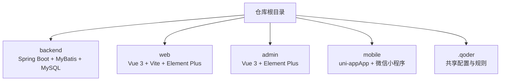
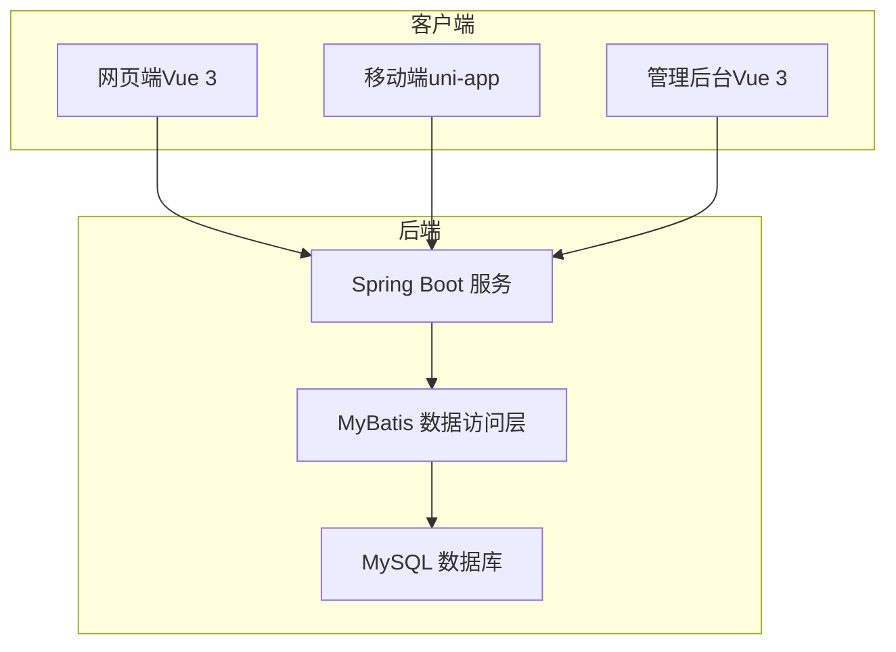
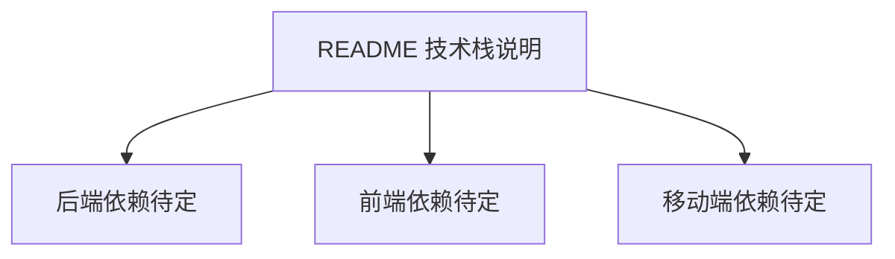

# 开发指南

<cite>
**本文引用的文件**
- [README.md](file://README.md)
</cite>

## 目录
1. [简介](#简介)
2. [项目结构](#项目结构)
3. [核心组件](#核心组件)
4. [架构总览](#架构总览)
5. [详细组件分析](#详细组件分析)
6. [依赖分析](#依赖分析)
7. [性能考虑](#性能考虑)
8. [故障排查指南](#故障排查指南)
9. [结论](#结论)
10. [附录](#附录)

## 简介
本仓库为“京东风格电商平台课程作业”的聚合仓库，目标是一套覆盖用户网页端、App、小程序、商家后台和管理员后台的多端电商平台。当前阶段各端工程尚未接入，后续将分别以独立子工程形式纳入此仓库。技术栈包括：后端 Spring Boot + MyBatis + MySQL；用户网页端与后台端使用 Vue 3 + Vite + Element Plus；移动端采用 uni-app（支持 App 与微信小程序）。协作规范明确了分支策略、提交信息格式与合并流程。

## 项目结构
目前仓库根目录包含说明文档与共享配置约定，具体工程代码待后续接入。建议的顶层组织方式如下（概念性示意）：
- backend：Spring Boot 后端工程
- web：Vue 3 用户网页端工程
- admin：Vue 3 管理后台工程
- mobile：uni-app 移动端工程
- .qoder：团队共享配置（skills、rules、MCP 使用说明）

[本节为概念性结构说明，未直接分析具体源码文件]

## 核心组件
基于 README 的技术栈与协作规范，可归纳出以下关键组件与职责：
- 后端服务（Spring Boot + MyBatis + MySQL）
  - 提供 RESTful API，统一错误码与响应体
  - 数据访问层使用 MyBatis 映射，结合事务管理
- 前端应用（Vue 3 + Vite + Element Plus）
  - 组件化开发、路由与状态管理、构建优化
- 移动端（uni-app）
  - 跨平台兼容处理、小程序特定能力封装
- 团队协作与质量保障
  - 分支策略、PR 合并、提交信息规范
  - 共享配置与规则（位于 .qoder）

**章节来源**
- [README.md:19-24](file://README.md#L19-L24)
- [README.md:25-31](file://README.md#L25-L31)

## 架构总览
多端电商平台的总体交互关系如下：
- 用户通过网页端或移动端访问系统
- 管理后台用于运营与商品/订单等管理
- 所有客户端均通过 HTTP 调用后端 API
- 后端持久化至 MySQL，使用 MyBatis 进行数据访问

[本节为概念性架构图，未直接映射到具体源码文件]

## 详细组件分析

### 后端（Spring Boot + MyBatis + MySQL）
- 包组织建议
  - controller：REST 接口层，负责请求解析与响应封装
  - service：业务逻辑层，编排用例与事务边界
  - mapper：MyBatis 接口与映射文件
  - model/entity：领域模型与实体
  - config：配置类（如安全、跨域、分页、缓存等）
  - common：通用工具、异常、统一响应体
- 配置文件管理
  - 按环境拆分（dev/test/prod），使用外部化配置
  - 敏感信息通过环境变量注入
- 依赖管理
  - 使用 Maven/Gradle 集中声明版本与依赖
  - 引入必要 starter（Web、MyBatis、MySQL、Validation、Actuator 等）
- API 设计规范
  - RESTful 资源命名、HTTP 动词语义、状态码规范
  - 统一响应体结构（code/message/data）
  - 参数校验与错误处理（全局异常处理器）
- 数据库操作最佳实践
  - MyBatis 映射文件清晰分层，避免 N+1 查询
  - SQL 索引与执行计划优化
  - 事务边界在 Service 层声明式管理
- 测试
  - 单元测试：Service 与 Mapper 隔离测试
  - 集成测试：启动上下文验证 API 链路
  - 使用 Testcontainers 或内存库简化依赖

[本节为通用实践建议，未直接分析具体源码文件]

### 前端（Vue 3 + Vite + Element Plus）
- 组件开发
  - 单文件组件（SFC）组织，按功能域分包
  - 组合式 API 优先，合理拆分可复用逻辑
- 状态管理
  - 使用 Pinia 管理全局状态，模块化管理
- 路由配置
  - 使用 Vue Router 定义页面与嵌套路由
  - 路由守卫实现鉴权与权限控制
- 构建优化
  - Vite 插件生态（压缩、图片优化、按需加载）
  - 分包与懒加载，减少首屏体积
- 样式与主题
  - Element Plus 主题定制与 CSS 变量
- 测试
  - 组件单元测试（Vitest + Testing Library）
  - 端到端测试（Playwright/Cypress）

[本节为通用实践建议，未直接分析具体源码文件]

### 移动端（uni-app）
- 跨平台兼容性
  - 条件编译处理平台差异
  - 统一 API 封装，屏蔽平台差异
- 小程序特性
  - 登录授权、支付、分享、订阅消息等能力封装
  - 注意小程序生命周期与渲染限制
- 性能与体验
  - 图片与资源优化，分包加载
  - 列表虚拟滚动与长列表优化
- 调试与发布
  - 开发者工具联调，真机调试
  - 多渠道打包与灰度发布

[本节为通用实践建议，未直接分析具体源码文件]

### 协作与质量保障
- 分支策略
  - main 稳定分支，develop 日常集成分支
  - feature/<模块>-<简述> 功能分支
- 提交规范
  - type(scope): subject 格式
- 合并流程
  - 通过 Pull Request 合并，要求评审通过
- 共享配置
  - .qoder/skills、.qoder/rules、.qoder/mcps 存放团队共享技能与规则

**章节来源**
- [README.md:25-31](file://README.md#L25-L31)
- [README.md:12-16](file://README.md#L12-L16)

## 依赖分析
当前仓库仅包含说明文档与共享配置约定，尚未包含实际工程代码与依赖清单。待各端工程接入后，可在对应子工程中维护依赖：
- 后端：pom.xml 或 build.gradle
- 前端：package.json
- 移动端：manifest.json 与 package.json

[本节为概念性依赖关系图，未直接映射到具体源码文件]

## 性能考虑
- 后端
  - 连接池与线程池参数调优
  - 慢查询监控与索引优化
  - 缓存策略（本地缓存/Redis）
- 前端
  - 资源压缩与 CDN 加速
  - 路由懒加载与组件按需加载
  - 静态资源缓存策略
- 移动端
  - 网络重试与降级策略
  - 图片与视频资源优化
  - 列表与动画性能优化

[本节为通用指导，未直接分析具体源码文件]

## 故障排查指南
- 日志与监控
  - 统一日志格式与级别
  - 接入 Actuator 暴露健康检查与指标
- 错误处理
  - 全局异常处理器捕获并返回统一错误体
  - 前端统一拦截器处理网络错误与提示
- 常见问题定位
  - 数据库连接失败、SQL 超时、索引缺失
  - 前端跨域、鉴权失败、路由守卫死循环
  - 移动端平台差异导致的运行时异常

[本节为通用指导，未直接分析具体源码文件]

## 结论
当前仓库作为多端电商项目的聚合入口，已明确技术栈与协作规范。后续需在各端工程接入后，完善具体的工程结构、配置与依赖清单，并据此落地统一的开发规范与质量保障体系。

[本节为总结性内容，未直接分析具体源码文件]

## 附录
- 快速开始
  - 各端独立工程后续接入此仓库，具体启动方式由各端负责人补充
- 共享配置
  - .qoder/skills：团队共享技能
  - .qoder/rules：团队共享规则
  - .qoder/mcps：MCP 使用说明

**章节来源**
- [README.md:32-35](file://README.md#L32-L35)
- [README.md:12-16](file://README.md#L12-L16)