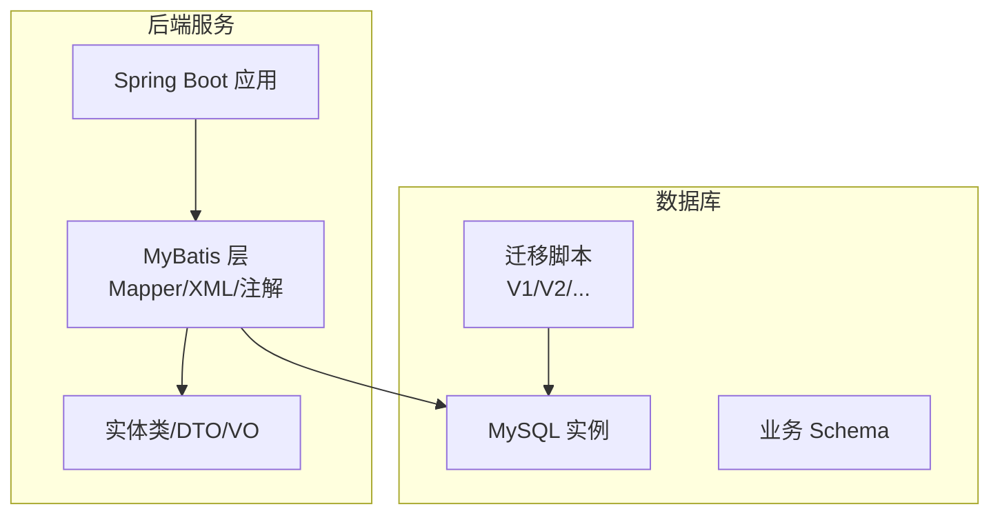
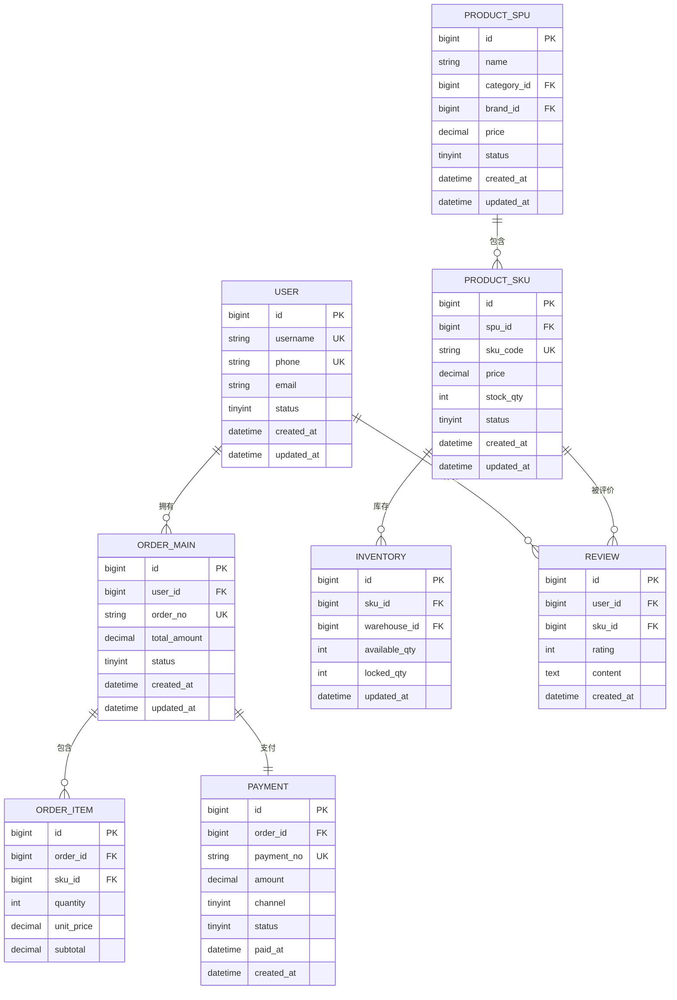
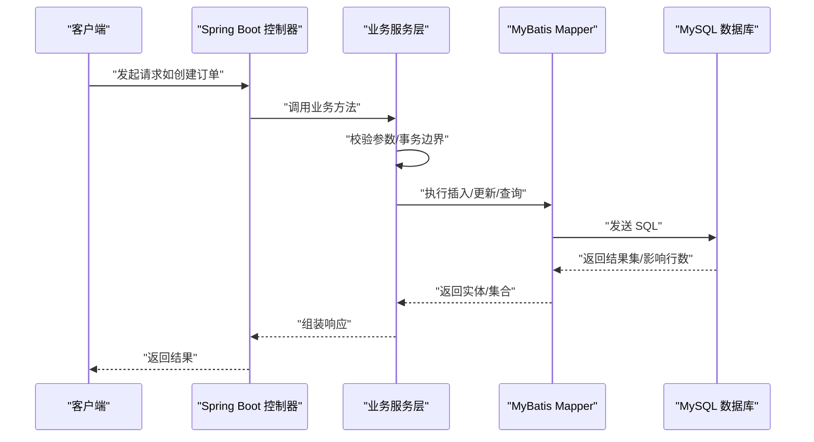
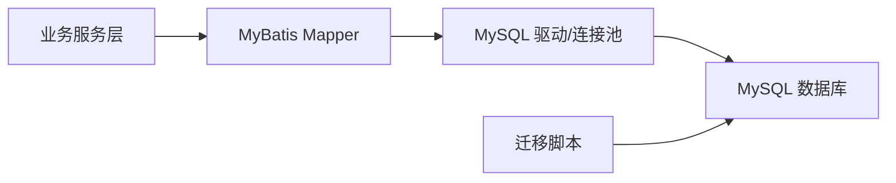

# 数据库设计与操作

<cite>
**本文引用的文件**
- [README.md](file://README.md)
</cite>

## 目录
1. [引言](#引言)
2. [项目结构](#项目结构)
3. [核心组件](#核心组件)
4. [架构总览](#架构总览)
5. [详细组件分析](#详细组件分析)
6. [依赖分析](#依赖分析)
7. [性能考虑](#性能考虑)
8. [故障排查指南](#故障排查指南)
9. [结论](#结论)
10. [附录](#附录)

## 引言
本指南面向京东风格电商平台课程的数据库设计与操作实践，目标是在 Spring Boot + MyBatis + MySQL 技术栈下，建立一套可落地、可扩展的数据库方案。内容涵盖：
- MySQL 设计原则：表结构设计、字段类型选择与索引优化策略
- 核心业务实体 ER 图：用户、商品、订单、库存等关键表
- MyBatis ORM 映射配置：实体类与表的映射关系、复杂查询与关联查询实现
- SQL 编写规范与性能优化建议
- 数据库迁移脚本管理与版本控制
- 数据备份恢复策略与监控方案
- 常用 SQL 查询示例与调优技巧

说明：当前仓库为课程作业初始仓库，尚未包含具体代码与脚本。本文基于 README 中明确的技术栈（Spring Boot + MyBatis + MySQL）给出通用且可落地的设计方案与最佳实践，便于后续在工程落地时直接套用。

章节来源
- [README.md:18-23](file://README.md#L18-L23)

## 项目结构
由于当前仓库仅包含 README 与忽略规则，未包含后端源码、SQL 脚本或配置文件，因此无法绘制与具体文件一一对应的架构图。本节提供概念性项目结构与数据库相关目录约定，供后续接入工程时参考。

[本图为概念结构示意，不直接映射到具体源文件]

## 核心组件
围绕电商核心域，定义以下关键实体与关系，作为数据库设计的起点：
- 用户（User）：账户信息、登录凭证、角色权限
- 商品（Product/SKU/SPU）：类目、品牌、规格、价格、上下架状态
- 订单（Order/OrderItem）：下单主体、收货地址、支付与物流状态
- 库存（Inventory/Warehouse）：仓库、库位、可用量、锁定量
- 支付（Payment）：支付流水、渠道、状态
- 评价（Review）：用户对商品的评价与评分

ER 关系要点：
- 用户与订单为一对多
- 订单与订单项为一对多
- 商品 SPU 与 SKU 为一对多
- 库存按仓库维度管理，SKU 与库存为一对多
- 订单与支付为一对一或多（视支付方式拆分）

[本图为概念 ER 示意，用于指导后续建表与建模]

## 架构总览
从系统视角看，数据库层位于持久化边界，承担数据一致性、完整性与高性能访问的职责。结合技术栈，整体交互如下：

[本图为概念流程示意，不直接映射到具体源文件]

## 详细组件分析

### 表结构设计原则
- 主键策略
  - 使用自增 bigint 或雪花算法生成 ID，避免 UUID 作为主键导致聚簇索引碎片
- 字段命名与类型
  - 统一小写下划线命名；金额使用 decimal(10,2)，数量使用 int/tinyint；时间使用 datetime/timestamp
  - 布尔值用 tinyint(1)，枚举用 tinyint 并维护字典表或常量
- 非空与默认值
  - 尽量设置 NOT NULL 与合理默认值，减少空值分支判断
- 冗余与规范化平衡
  - 适度冗余提升查询性能（如订单快照中的商品名称、价格），但需保证一致性
- 审计字段
  - 所有表增加 created_at、updated_at、is_deleted 等审计字段，便于追踪与软删除

章节来源
- [README.md:18-23](file://README.md#L18-L23)

### 索引优化策略
- 主键索引
  - 每个表必须定义主键，优先使用单列自增或雪花ID
- 唯一索引
  - 对外暴露的业务编号（如订单号、SKU编码、手机号、邮箱）建立唯一索引
- 普通索引
  - 高频查询条件列建立索引，注意区分选择性高的列
- 联合索引
  - 遵循最左前缀原则，将高选择性列放在左侧
- 覆盖索引
  - 针对热点查询构建覆盖索引，减少回表
- 索引维护
  - 定期分析慢查询日志，评估索引命中率与冗余索引清理

章节来源
- [README.md:18-23](file://README.md#L18-L23)

### 核心实体与映射（MyBatis）
- 实体类与表映射
  - 使用注解或 XML 配置进行字段映射，保持驼峰与下划线转换一致
- 复杂查询
  - 通过 <resultMap> 组合嵌套查询或连接查询，避免 N+1 问题
- 关联查询
  - 订单详情：订单主表 JOIN 订单项 JOIN 商品 SKU，按需分页
  - 库存查询：按仓库维度聚合可用量与锁定量
- 动态 SQL
  - 使用 <if>/<choose>/<foreach> 构建灵活条件
- 事务与批处理
  - 批量写入使用批处理接口，减少往返开销

章节来源
- [README.md:18-23](file://README.md#L18-L23)

### SQL 编写规范
- 禁止 SELECT *，显式列出所需字段
- 避免在 WHERE 中对列做函数计算，确保索引生效
- 合理使用 LIMIT 分页，深分页采用游标或延迟关联
- 大事务拆分为小事务，缩短锁持有时间
- 严格使用参数化查询，防止 SQL 注入

章节来源
- [README.md:18-23](file://README.md#L18-L23)

### 数据库迁移与版本控制
- 工具选型
  - 推荐使用 Flyway/Liquibase 进行版本化管理
- 脚本组织
  - 按版本号命名脚本（如 V1__init.sql、V2__add_order_index.sql）
- 变更策略
  - 新增字段默认允许 NULL 并提供默认值，再逐步填充
  - 索引变更先加后删，避免线上抖动
- 回滚策略
  - 为每次迁移准备反向脚本，支持快速回滚

章节来源
- [README.md:18-23](file://README.md#L18-L23)

### 数据备份与恢复
- 备份策略
  - 全量备份：每日一次（mysqldump 或物理备份）
  - 增量备份：开启 binlog，按小时归档
- 恢复演练
  - 定期在测试环境演练恢复流程，验证 RPO/RTO
- 安全与合规
  - 备份文件加密存储，限制访问权限

章节来源
- [README.md:18-23](file://README.md#L18-L23)

### 监控与告警
- 指标采集
  - QPS、TPS、慢查询数、连接数、锁等待、缓冲池命中率
- 可视化
  - 使用 Prometheus + Grafana 或云厂商监控面板
- 告警阈值
  - 慢查询超过阈值、连接数接近上限、磁盘空间不足等

章节来源
- [README.md:18-23](file://README.md#L18-L23)

### 常用 SQL 查询示例（路径指引）
以下为常见查询场景与定位方式，实际 SQL 可在对应模块的 Mapper XML 或注解中查找：
- 用户注册与登录
  - 根据用户名/手机号查询用户：搜索用户查询语句
  - 密码校验与状态检查：搜索登录校验逻辑
- 商品检索
  - 按类目/品牌/关键词分页查询：搜索商品列表查询
  - SKU 详情与库存聚合：搜索 SKU 详情与库存统计
- 订单流程
  - 创建订单与扣减库存：搜索下单事务与库存扣减
  - 订单列表与详情：搜索订单分页与详情联查
- 支付与评价
  - 支付流水记录与状态更新：搜索支付回调处理
  - 商品评价统计：搜索评价聚合查询

章节来源
- [README.md:18-23](file://README.md#L18-L23)

### 性能调优技巧
- 查询层面
  - 利用 EXPLAIN 分析执行计划，关注 type、key、rows、Extra
  - 避免隐式类型转换导致索引失效
- 索引层面
  - 识别重复与低效索引，合并或移除
  - 针对热点查询构建覆盖索引
- 事务与锁
  - 缩小事务范围，避免长事务
  - 合理设置隔离级别，减少死锁概率
- 缓存与异步
  - 热点数据引入 Redis 缓存，读写分离与分库分表规划

章节来源
- [README.md:18-23](file://README.md#L18-L23)

## 依赖分析
当前仓库未包含后端源码与数据库脚本，无法绘制精确的代码级依赖图。概念上，数据库层依赖如下：
- 业务服务层依赖 MyBatis Mapper
- Mapper 依赖 MySQL 驱动与连接池
- 迁移脚本由 CI/CD 触发执行

[本图为概念依赖示意，不直接映射到具体源文件]

## 性能考虑
- 读多写少场景
  - 引入二级缓存与只读副本
- 写多读少场景
  - 分库分表与消息队列削峰
- 热点数据
  - 本地缓存 + 分布式缓存双保险
- 容量规划
  - 预估增长曲线，预留扩展空间

[本节为通用性能建议，不直接分析具体文件]

## 故障排查指南
- 慢查询定位
  - 开启慢查询日志，结合 EXPLAIN 分析
- 锁等待与死锁
  - 查看 InnoDB 锁信息与死锁日志，优化事务粒度
- 连接泄漏
  - 检查连接池配置与异常路径释放
- 数据不一致
  - 核对幂等性与补偿机制，必要时重放日志

章节来源
- [README.md:18-23](file://README.md#L18-L23)

## 结论
本指南基于课程项目的技术栈，给出了电商领域数据库设计的系统性方案与实践建议。后续在工程落地时，可将上述 ER 模型、索引策略、迁移与监控方案直接应用到实际代码与脚本中，确保数据层具备高可用、高性能与可维护性。

[本节为总结性内容，不直接分析具体文件]

## 附录
- 术语
  - SPU：标准产品单位；SKU：库存量单位
- 参考
  - 团队共享配置与规则位于 .qoder/ 目录，可结合开发规范完善数据库命名与注释约定

章节来源
- [README.md:12-16](file://README.md#L12-L16)