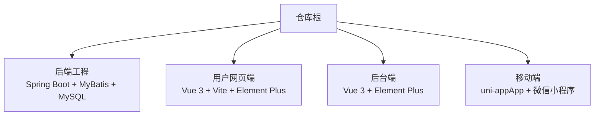
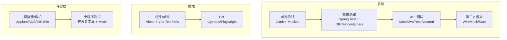
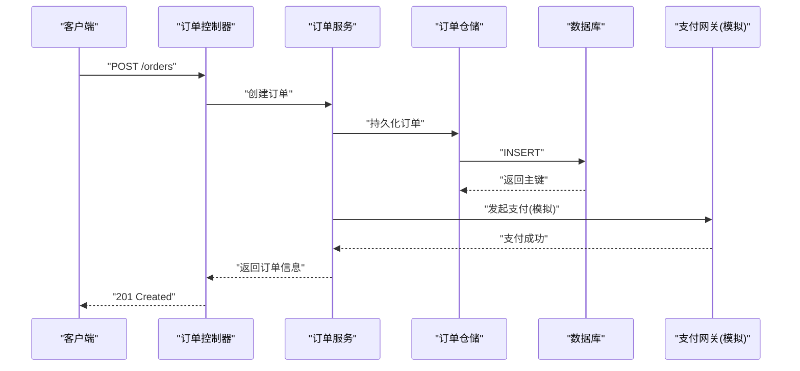
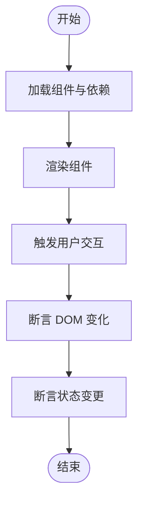
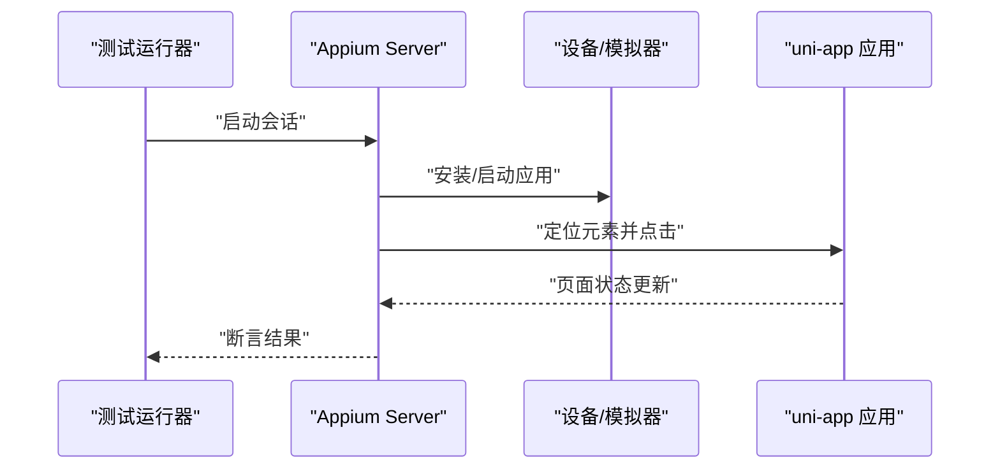
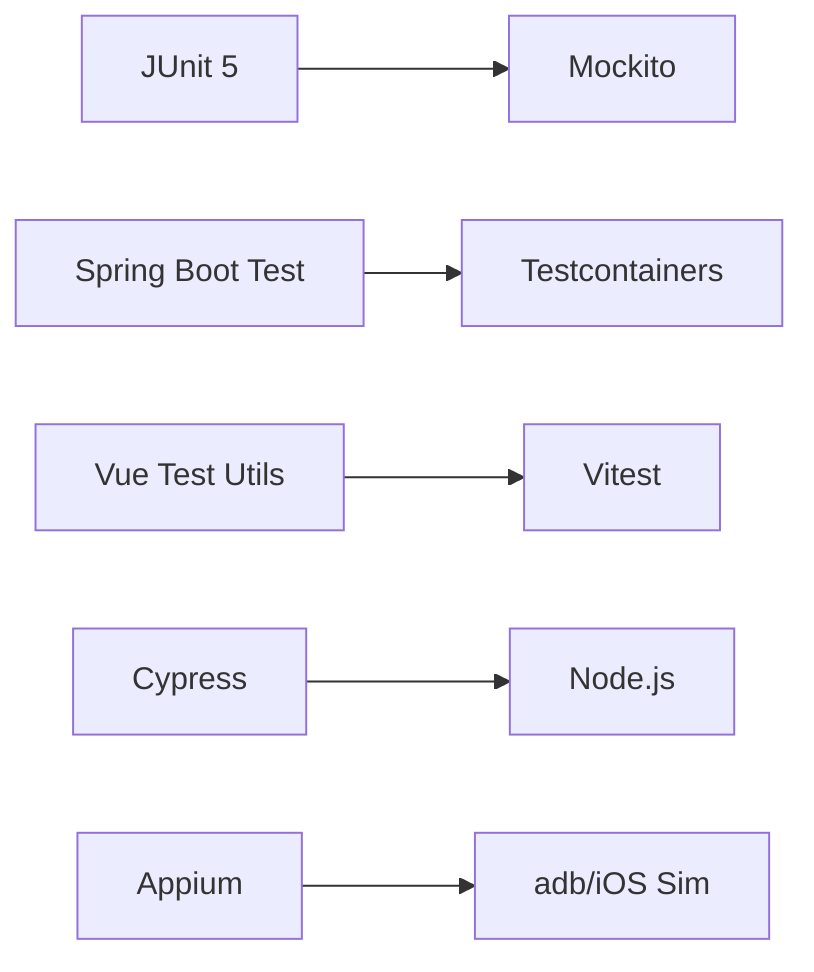

# 测试指南

<cite>
**本文引用的文件**
- [README.md](file://README.md)
</cite>

## 目录
1. [简介](#简介)
2. [项目结构](#项目结构)
3. [核心组件](#核心组件)
4. [架构总览](#架构总览)
5. [详细组件分析](#详细组件分析)
6. [依赖分析](#依赖分析)
7. [性能考虑](#性能考虑)
8. [故障排查指南](#故障排查指南)
9. [结论](#结论)
10. [附录](#附录)

## 简介
本测试指南面向“京东风格电商平台课程作业”的多端工程，覆盖后端、前端与移动端的测试方法与实践。根据仓库说明，该项目采用以下技术栈：
- 后端：Spring Boot + MyBatis + MySQL
- 用户网页端：Vue 3 + Vite + Element Plus
- 后台端：Vue 3 + Element Plus
- 移动端：uni-app（App + 微信小程序）

本指南将基于上述技术栈，给出端到端的测试策略与落地建议，包括单元测试、集成测试、E2E 测试、覆盖率要求与持续集成配置，并提供常见场景的示例路径与最佳实践。

## 项目结构
当前仓库为多端聚合根，各端独立工程后续接入。因此，测试相关代码与配置尚未在本仓库中体现，但可依据技术栈在各端工程中建立对应的测试目录与脚本。

图表来源
- [README.md:18-23](file://README.md#L18-L23)

章节来源
- [README.md:1-35](file://README.md#L1-L35)

## 核心组件
本节聚焦于测试体系中的关键角色与职责划分，便于在多端协作中统一标准与流程。

- 后端测试
  - 单元测试：针对 Service/Util 等纯逻辑进行隔离测试，使用 JUnit 与 Mockito。
  - 集成测试：对 Controller/Service/Repository 链路进行测试，使用 Spring Test 与内存数据库或 Testcontainers。
  - API 测试：使用 MockMvc 或 RestAssured 验证接口契约。
  - 第三方服务模拟：使用 WireMock 或自定义 Stub。
- 前端测试
  - 单元测试：使用 Vitest/Jest + Vue Test Utils 对组件与方法进行断言。
  - 组件测试：渲染组件、触发交互、校验 DOM 与事件。
  - E2E 测试：使用 Cypress 或 Playwright 验证关键业务流程。
- 移动端测试
  - 模拟器测试：Android Emulator / iOS Simulator 自动化用例。
  - 真机调试：USB/Wi-Fi 连接设备执行 UI 与功能用例。
  - 小程序测试：微信开发者工具 + 云开发/本地 Mock。

章节来源
- [README.md:18-23](file://README.md#L18-L23)

## 架构总览
下图展示多端测试在整体系统中的位置与交互关系。

图表来源
- [README.md:18-23](file://README.md#L18-L23)

## 详细组件分析

### 后端测试设计与实现

#### 单元测试（Service/Util）
- 目标：以最小粒度验证业务逻辑正确性，避免外部依赖。
- 要点：
  - 使用 JUnit 5 组织用例；使用 Mockito 创建 Mock 对象并设置期望行为。
  - 对异常分支与边界条件进行覆盖。
  - 使用参数化测试减少重复用例。
- 示例路径（占位）：
  - 后端单元测试示例：[后端工程/src/test/java/.../service/OrderServiceTest.java](file://backend/src/test/java/com/example/service/OrderServiceTest.java)
  - 工具类测试示例：[后端工程/src/test/java/.../util/PriceUtilsTest.java](file://backend/src/test/java/com/example/util/PriceUtilsTest.java)

章节来源
- [README.md:18-23](file://README.md#L18-L23)

#### 集成测试（Controller/Service/Repository）
- 目标：验证多层协作与数据访问的正确性。
- 要点：
  - 使用 @SpringBootTest 启动应用上下文；使用 @AutoConfigureTestDatabase 或 Testcontainers 管理数据库。
  - 使用 @Transactional 保证用例前后数据一致性。
  - 使用 H2/MySQL 容器化实例，确保与生产一致的数据类型与方言。
- 示例路径（占位）：
  - 控制器集成测试：[后端工程/src/test/java/.../controller/OrderControllerIT.java](file://backend/src/test/java/com/example/controller/OrderControllerIT.java)
  - 仓储层集成测试：[后端工程/src/test/java/.../repository/OrderRepositoryIT.java](file://backend/src/test/java/com/example/repository/OrderRepositoryIT.java)

章节来源
- [README.md:18-23](file://README.md#L18-L23)

#### API 接口测试
- 目标：从 HTTP 层面验证接口契约、状态码、响应体结构与鉴权流程。
- 要点：
  - 使用 MockMvc 进行无网络请求的控制器测试；或使用 RestAssured 发起真实 HTTP 请求。
  - 对分页、排序、过滤、错误码进行断言。
  - 结合安全配置验证权限控制。
- 示例路径（占位）：
  - API 测试：[后端工程/src/test/java/.../api/OrderApiTest.java](file://backend/src/test/java/com/example/api/OrderApiTest.java)

章节来源
- [README.md:18-23](file://README.md#L18-L23)

#### 第三方服务模拟
- 目标：隔离外部系统（支付、短信、物流、推荐等），提升稳定性与速度。
- 要点：
  - 使用 WireMock 定义请求匹配与响应模板。
  - 对超时、异常、幂等性进行模拟。
- 示例路径（占位）：
  - 支付网关模拟：[后端工程/src/test/resources/mappings/payment.json](file://backend/src/test/resources/mappings/payment.json)

章节来源
- [README.md:18-23](file://README.md#L18-L23)

#### 后端测试流程图（API 调用链）

图表来源
- [README.md:18-23](file://README.md#L18-L23)

### 前端测试设计与实现

#### 单元测试与组件测试（Vue 3 + Vite）
- 目标：快速反馈组件逻辑与交互问题。
- 要点：
  - 使用 Vitest 作为运行器；使用 Vue Test Utils 渲染与交互。
  - 对 props、emits、插槽、路由守卫、Pinia/Vuex 状态进行断言。
  - 使用 @testing-library/vue 关注用户视角的断言。
- 示例路径（占位）：
  - 组件测试：[用户网页端/src/components/__tests__/ProductCard.spec.js](file://frontend-user/src/components/__tests__/ProductCard.spec.js)
  - 组合式函数测试：[用户网页端/src/composables/__tests__/useCart.spec.js](file://frontend-user/src/composables/__tests__/useCart.spec.js)

章节来源
- [README.md:18-23](file://README.md#L18-L23)

#### E2E 测试（Cypress/Playwright）
- 目标：验证跨页面关键流程（注册登录、下单、支付跳转）。
- 要点：
  - 使用固定测试账号与种子数据。
  - 对关键页面进行截图与视频录制。
  - 并行执行与失败重试。
- 示例路径（占位）：
  - 下单流程：[用户网页端/cypress/e2e/order-flow.cy.js](file://frontend-user/cypress/e2e/order-flow.cy.js)

章节来源
- [README.md:18-23](file://README.md#L18-L23)

#### 前端测试流程图（组件渲染与交互）

图表来源
- [README.md:18-23](file://README.md#L18-L23)

### 移动端测试设计与实现

#### 模拟器与真机测试（uni-app）
- 目标：覆盖不同设备与平台差异。
- 要点：
  - Android：使用 Android Emulator 或真机，通过 adb 驱动 Appium。
  - iOS：使用 Xcode Simulator 或真机，通过 Appium。
  - 微信小程序：使用微信开发者工具 + 云开发/本地 Mock 进行功能验证。
- 示例路径（占位）：
  - App 自动化：[移动端/appium/tests/home.spec.js](file://mobile/appium/tests/home.spec.js)
  - 小程序用例：[移动端/miniprogram-test/pages/index.test.js](file://mobile/miniprogram-test/pages/index.test.js)

章节来源
- [README.md:18-23](file://README.md#L18-L23)

#### 移动端测试流程图（App 自动化）

图表来源
- [README.md:18-23](file://README.md#L18-L23)

## 依赖分析
测试框架与工具的依赖关系如下：

图表来源
- [README.md:18-23](file://README.md#L18-L23)

章节来源
- [README.md:18-23](file://README.md#L18-L23)

## 性能考虑
- 后端
  - 优先使用内存数据库或轻量容器，缩短集成测试时长。
  - 对热点查询添加必要索引，避免慢查询拖慢 CI。
  - 合理拆分大事务，减少锁竞争。
- 前端
  - 组件测试尽量无网络请求，使用本地 Mock。
  - E2E 用例精简到关键路径，避免全量回归导致 CI 缓慢。
- 移动端
  - 使用稳定的模拟器镜像，避免频繁下载。
  - 并行执行用例，按模块分组提高吞吐。

## 故障排查指南
- 后端
  - 数据库连接失败：检查端口、用户名密码、时区与字符集。
  - 事务未回滚：确认测试类是否启用事务与回滚注解。
  - Mock 不生效：核对包名、方法签名与拦截顺序。
- 前端
  - 组件渲染为空：检查异步数据加载与等待策略。
  - 路由/导航异常：确认路由守卫与全局前置钩子。
  - E2E 不稳定：增加显式等待与重试，避免硬编码 sleep。
- 移动端
  - 元素定位失败：检查动态 ID、层级变化与平台差异。
  - 真机连接失败：确认 USB 调试、驱动与防火墙设置。
  - 小程序环境差异：区分开发与生产环境变量。

## 结论
在多端电商项目中，建立分层清晰的测试体系是保障质量的关键。后端以单元与集成测试为主，辅以 API 与第三方模拟；前端以组件与 E2E 测试为核心；移动端则兼顾模拟器与真机。配合统一的覆盖率门槛与持续集成流水线，可有效降低回归风险并提升交付效率。

## 附录

### 覆盖率要求与报告
- 后端
  - 行覆盖率 ≥ 80%，分支覆盖率 ≥ 70%。
  - 使用 JaCoCo 生成 HTML 报告。
- 前端
  - 行覆盖率 ≥ 80%，语句覆盖率 ≥ 80%。
  - 使用 Vitest 内置覆盖率或 Istanbul。
- 移动端
  - 自动化用例通过率 ≥ 95%。
  - 关键路径需具备可视化报告（截图/视频）。

### 持续集成配置建议
- 触发条件：Push 至 develop/main、Pull Request。
- 阶段划分：
  - 构建与依赖缓存
  - 后端单测与集成测试
  - 前端单测与组件测试
  - 前端 E2E 测试
  - 移动端模拟器测试
  - 覆盖率汇总与上传
- 产物归档：测试报告、覆盖率报告、截图与视频。

### 常见测试场景与示例路径
- 后端
  - 用户注册与登录：[后端工程/src/test/java/.../api/AuthApiTest.java](file://backend/src/test/java/com/example/api/AuthApiTest.java)
  - 商品搜索与筛选：[后端工程/src/test/java/.../api/ProductApiTest.java](file://backend/src/test/java/com/example/api/ProductApiTest.java)
  - 订单创建与支付回调：[后端工程/src/test/java/.../api/OrderApiTest.java](file://backend/src/test/java/com/example/api/OrderApiTest.java)
- 前端
  - 购物车增减与合计计算：[用户网页端/src/components/__tests__/Cart.spec.js](file://frontend-user/src/components/__tests__/Cart.spec.js)
  - 搜索结果页交互：[用户网页端/src/components/__tests__/SearchResult.spec.js](file://frontend-user/src/components/__tests__/SearchResult.spec.js)
  - 下单流程 E2E：[用户网页端/cypress/e2e/checkout.cy.js](file://frontend-user/cypress/e2e/checkout.cy.js)
- 移动端
  - 首页轮播与商品列表：[移动端/appium/tests/home.spec.js](file://mobile/appium/tests/home.spec.js)
  - 小程序商品详情与加购：[移动端/miniprogram-test/pages/product.test.js](file://mobile/miniprogram-test/pages/product.test.js)