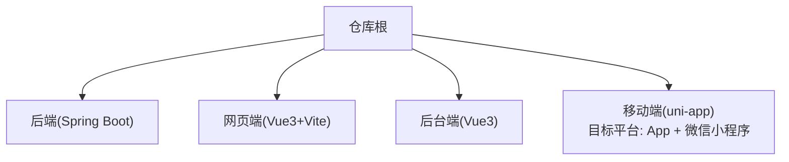
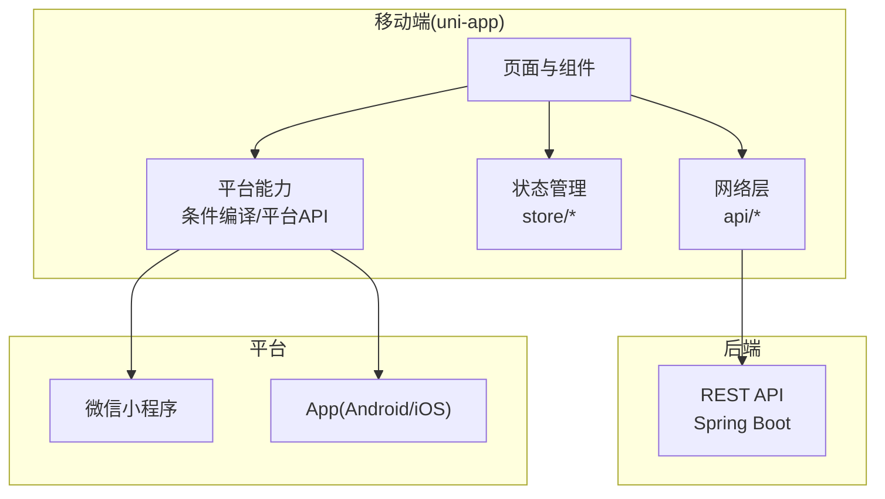
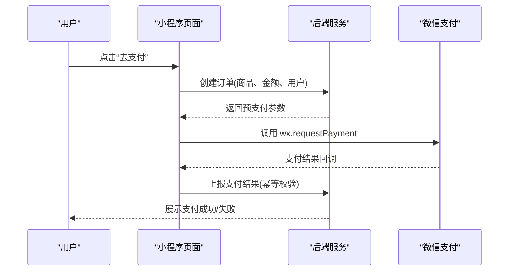
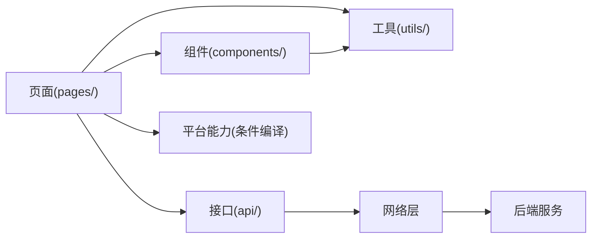

# 移动端开发指南

<cite>
**本文引用的文件**   
- [README.md](file://README.md)
</cite>

## 目录
1. [简介](#简介)
2. [项目结构](#项目结构)
3. [核心组件](#核心组件)
4. [架构总览](#架构总览)
5. [详细组件分析](#详细组件分析)
6. [依赖分析](#依赖分析)
7. [性能考虑](#性能考虑)
8. [故障排查指南](#故障排查指南)
9. [结论](#结论)
10. [附录](#附录)

## 简介
本指南面向基于 uni-app 的跨平台移动端开发，覆盖从环境搭建、HBuilderX 使用、开发者账号注册到跨平台注意事项、微信小程序特有功能实现、App 打包发布、UI 适配与性能优化等全流程。本项目为多端电商平台课程作业，技术栈明确包含“移动端：uni-app（App + 微信小程序）”，因此本指南将围绕该目标进行落地说明。

**章节来源**
- [README.md:1-35](file://README.md#L1-L35)

## 项目结构
当前仓库为多端工程聚合根，移动端具体代码尚未接入。根据 README 的技术栈说明，移动端采用 uni-app 框架，目标平台包括 App 与微信小程序。后续在仓库中新增移动端子工程后，可按如下方式组织：
- 移动端工程根目录（例如 mobile/）
  - pages/ 页面目录
  - components/ 公共组件
  - static/ 静态资源
  - utils/ 工具函数
  - api/ 接口封装
  - store/ 状态管理（可选）
  - manifest.json / pages.json / uni.scss 等 uni-app 配置

[本节为概念性结构说明，未直接分析具体源码文件]

## 核心组件
由于当前仓库未包含移动端源代码，本节聚焦于 uni-app 移动端工程的通用核心模块与职责划分，便于后续接入时快速定位与扩展。

- 应用入口与生命周期
  - main.js：应用初始化、插件注册、全局样式引入
  - App.vue：应用级生命周期、全局状态挂载、条件编译入口
  - manifest.json：应用标识、权限、渠道、图标、启动页等打包配置
  - pages.json：路由、导航栏、窗口、分包、条件编译页面配置

- 页面与组件
  - pages/：业务页面，按功能域拆分；注意条件编译与平台差异化处理
  - components/：可复用 UI 与业务组件，尽量保持平台无关

- 数据与网络
  - api/：统一请求封装、拦截器、错误码映射、重试策略
  - store/：全局状态（如用户信息、购物车），按需选择 Pinia/Vuex

- 工具与常量
  - utils/：日期、格式化、鉴权、设备信息、埋点
  - constants/：平台枚举、API 版本、特性开关

- 平台差异与兼容
  - 条件编译：通过 #ifdef/#ifndef 控制平台特定逻辑
  - 平台 API：优先使用 uni.* 抽象层，必要时调用 wx.* 或 plus.*

**章节来源**
- [README.md:18-24](file://README.md#L18-L24)

## 架构总览
下图展示 uni-app 移动端与后端、小程序平台的交互关系。移动端通过 uni.request 与后端 RESTful 接口通信；在微信小程序平台下，支付、消息推送、分享等功能需调用微信原生能力。

[本节为概念性架构图，未直接映射具体源码文件]

## 详细组件分析

### 环境准备与 HBuilderX 使用
- 安装 HBuilderX
  - 下载并安装最新稳定版 HBuilderX
  - 首次运行建议开启自动更新与插件市场常用插件
- 创建 uni-app 项目
  - 新建项目选择“uni-app”模板，勾选目标平台（App、微信小程序）
  - 初始化完成后，pages.json 自动生成默认首页
- 运行与调试
  - 运行到浏览器：用于快速验证页面与交互
  - 运行到微信开发者工具：需先完成微信开发者工具安装与登录
  - 运行到真机/模拟器：需配置 Android/iOS 开发环境与签名

**章节来源**
- [README.md:18-24](file://README.md#L18-L24)

### 开发者账号注册与平台配置
- 微信小程序
  - 注册微信公众平台账号并完成主体认证
  - 在微信公众平台获取 AppID，并在 HBuilderX 中配置 manifest.json 的小程序 AppID
  - 在微信开发者工具中导入项目并启用“增强编译”
- App 打包
  - Android：配置 keystore、包名、版本号、权限清单
  - iOS：配置证书与描述文件（企业/个人开发者）

**章节来源**
- [README.md:18-24](file://README.md#L18-L24)

### 跨平台开发注意事项
- 条件编译
  - 使用 #ifdef MP-WEIXIN 等宏区分平台逻辑
  - 页面级条件编译可在 pages.json 中按平台配置不同页面
- 平台特定 API
  - 优先使用 uni.* 抽象 API；当需要平台专属能力时再调用 wx.* 或 plus.*
  - 对平台差异进行集中封装，避免散落在业务代码中
- 样式兼容性
  - 谨慎使用 flex 布局与 CSS 变量，确保各端渲染一致
  - 图片尺寸与分辨率适配，避免拉伸变形
  - 字体与字号在不同系统下的显示差异需做降级处理

**章节来源**
- [README.md:18-24](file://README.md#L18-L24)

### 微信小程序特有功能实现
- 支付接口
  - 流程要点：前端发起下单 -> 后端统一下单 -> 返回支付参数 -> 调用 wx.requestPayment -> 回调处理结果
  - 安全要求：签名校验、订单幂等、回调验签
- 消息推送
  - 订阅消息：引导用户授权 -> 后端下发模板 ID -> 前端触发订阅 -> 服务端推送
  - 服务通知：结合公众号/小程序生态能力，注意合规与用户体验
- 分享功能
  - onShareAppMessage/onShareTimeline：自定义标题、封面、路径、参数
  - 分享统计与追踪：埋点上报、转化归因

[本节为概念性流程图，未直接映射具体源码文件]

### App 打包与发布流程
- Android
  - 生成 keystore -> 配置包名/版本/权限 -> 云打包或本地打包 -> 安装测试 -> 上架应用商店
- iOS
  - 申请证书与描述文件 -> 配置 Bundle ID/版本 -> 云打包或 Xcode 打包 -> TestFlight 内测 -> App Store 上架
- 版本管理与灰度
  - 语义化版本号、变更日志、灰度发布策略
  - 崩溃监控与埋点上报

**章节来源**
- [README.md:18-24](file://README.md#L18-L24)

### 移动端 UI 适配方案
- 响应式基础
  - 使用 rpx 单位实现屏幕自适应
  - 媒体查询与动态计算（如 pxToRpx）
- 布局策略
  - 以 flex 为主，避免复杂嵌套
  - 列表与卡片采用虚拟滚动或分页加载
- 图片与多媒体
  - 提供多倍图资源，按需加载
  - 视频与音频设置占位与懒加载
- 字体与可读性
  - 最小字号与行高规范
  - 深色模式与对比度检查

**章节来源**
- [README.md:18-24](file://README.md#L18-L24)

### 性能优化技巧
- 首屏优化
  - 分包加载、按需引入、骨架屏
  - 静态资源压缩与 CDN 加速
- 运行时优化
  - 减少 setData 频率与数据量
  - 长列表虚拟化、图片懒加载、防抖节流
- 内存与卡顿
  - 及时释放事件监听与定时器
  - 避免频繁重排重绘，合并样式更新
- 网络优化
  - 请求合并、缓存策略、断线重试
  - 接口限流与降级

**章节来源**
- [README.md:18-24](file://README.md#L18-L24)

### 调试方法
- HBuilderX 调试
  - 控制台输出、断点调试、网络抓包
- 微信开发者工具
  - 小程序调试面板、性能分析、真机调试
- App 调试
  - Android Studio/Xcode 日志、远程调试、崩溃堆栈
- 线上问题定位
  - 埋点与日志上报、错误分级告警、复现步骤收集

**章节来源**
- [README.md:18-24](file://README.md#L18-L24)

## 依赖分析
当前仓库为多端聚合根，移动端代码尚未接入。待接入后，建议在移动端工程中维护清晰的依赖边界：
- 内部依赖
  - 页面依赖组件与工具
  - 组件仅依赖自身 props/events，避免反向依赖页面
- 外部依赖
  - uni-app 核心库
  - 第三方 SDK（如地图、支付、统计）
- 平台依赖
  - 微信小程序：wx.* 能力
  - App：plus.* 能力

[本节为概念性依赖图，未直接映射具体源码文件]

## 性能考虑
- 构建与体积
  - 关闭无用插件、按需引入、Tree Shaking
  - 图片转 WebP、字体子集化
- 运行时体验
  - 首屏关键路径优化、异步加载非关键资源
  - 动画与过渡使用 GPU 加速属性
- 稳定性
  - 异常捕获与降级、超时与重试策略
  - 弱网与离线场景处理

[本节为通用指导，未直接分析具体源码文件]

## 故障排查指南
- 常见问题
  - 条件编译失效：检查宏定义与平台匹配
  - 样式错乱：确认 rpx 换算与容器高度
  - 支付失败：核对签名、商户号、回调域名
  - 分享无效：检查分享参数与权限
- 定位手段
  - 分层打印日志、保留上下文
  - 使用性能面板定位瓶颈
  - 复现最小用例，隔离平台差异

[本节为通用指导，未直接分析具体源码文件]

## 结论
本指南围绕 uni-app 跨平台移动端的开发全链路提供了系统化说明，涵盖环境搭建、跨平台注意事项、微信小程序特色能力、打包发布、UI 适配与性能优化等。随着移动端工程接入仓库，可在此基础上进一步沉淀团队规范与最佳实践，提升交付质量与效率。

[本节为总结性内容，未直接分析具体源码文件]

## 附录
- 协作规范参考
  - 分支策略、提交规范、PR 流程详见仓库 README 中的协作规范部分
- 文档与共享配置
  - 团队分工与公共配置、MCP 使用说明等位于 .qoder 目录（待完善）

**章节来源**
- [README.md:25-35](file://README.md#L25-L35)