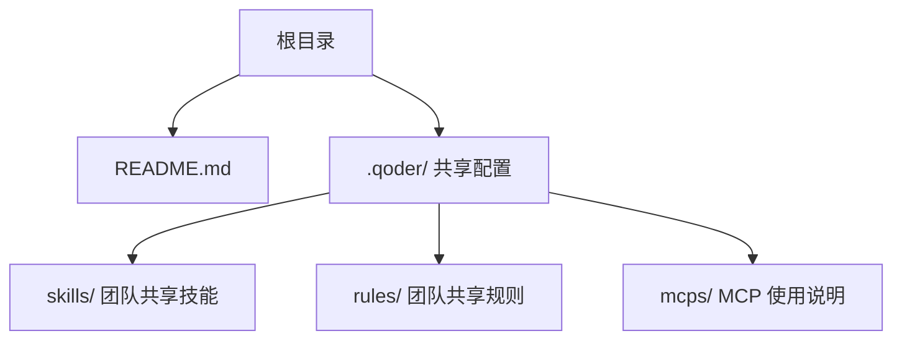
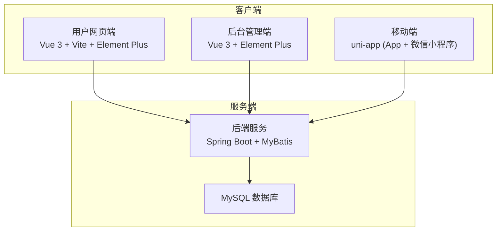
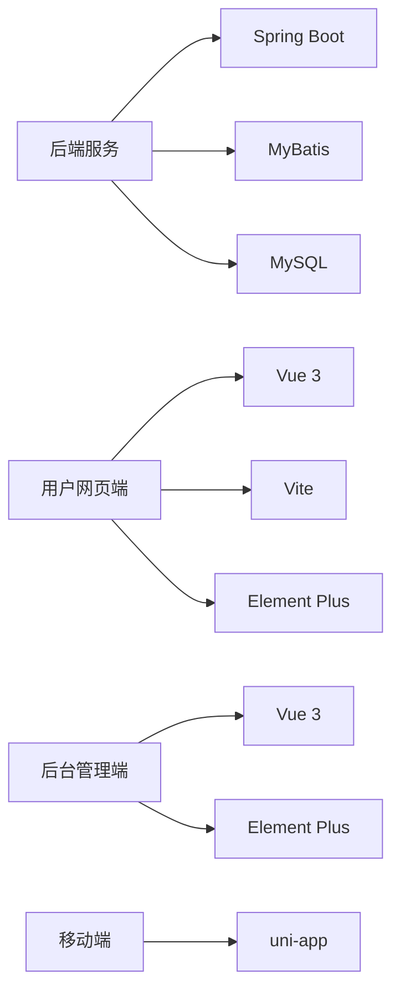

# 快速开始

<cite>
**本文引用的文件**   
- [README.md](file://README.md)
</cite>

## 目录
1. [简介](#简介)
2. [项目结构](#项目结构)
3. [核心组件](#核心组件)
4. [架构总览](#架构总览)
5. [详细组件分析](#详细组件分析)
6. [依赖分析](#依赖分析)
7. [性能考虑](#性能考虑)
8. [故障排查指南](#故障排查指南)
9. [结论](#结论)
10. [附录](#附录)

## 简介
本项目为课程作业，目标是构建一套覆盖用户网页端、App、小程序、商家后台和管理员后台的多端电商平台。当前处于初始阶段，各端应用将以独立工程的方式接入本仓库，后续由各端负责人补充具体启动方式与配置说明。

## 项目结构
- 根目录包含项目说明文档与共享配置说明。
- 共享配置位于 .qoder/ 目录（skills、rules、MCP 使用说明），用于统一团队规范与协作流程。
- 技术栈涵盖后端与多端前端：
  - 后端：Spring Boot + MyBatis + MySQL
  - 用户网页端：Vue 3 + Vite + Element Plus
  - 后台端：Vue 3 + Element Plus
  - 移动端：uni-app（App + 微信小程序）

图表来源
- [README.md:12-16](file://README.md#L12-L16)

章节来源
- [README.md:1-35](file://README.md#L1-L35)

## 核心组件
- 后端服务：基于 Spring Boot + MyBatis + MySQL，提供统一的业务接口与数据访问能力。
- 用户网页端：基于 Vue 3 + Vite + Element Plus，面向消费者进行商品浏览、下单等交互。
- 后台管理端：基于 Vue 3 + Element Plus，供运营与管理使用。
- 移动端：基于 uni-app，同时支持 App 与微信小程序。

章节来源
- [README.md:18-24](file://README.md#L18-L24)

## 架构总览
下图展示了多端与后端服务的整体关系。当前阶段各端以独立工程形式存在，通过 API 与后端服务交互；数据库由 MySQL 提供持久化存储。

图表来源
- [README.md:18-24](file://README.md#L18-L24)

## 详细组件分析

### 环境准备与安装要求
- Java 开发环境
  - 建议安装 JDK 并配置 JAVA_HOME，确保命令行可执行 java/javac。
  - 版本选择需与后端框架兼容（参考 README 中“后端：Spring Boot”）。
- Node.js 环境
  - 安装 Node.js 与 npm/yarn/pnpm（任选其一），用于前端工程构建与运行。
  - 版本建议与 Vue 3/Vite 生态兼容。
- MySQL 数据库
  - 安装并启动 MySQL 服务，创建项目所需的数据库与账号。
  - 根据各端接入时的数据库连接配置，准备初始化脚本或迁移工具。

说明：以上为通用环境要求，具体版本与配置细节将在各端接入时由负责人补充。

章节来源
- [README.md:18-24](file://README.md#L18-L24)

### 项目初始化与克隆仓库
- 克隆仓库到本地工作目录。
- 进入 .qoder/ 目录，阅读共享的 skills、rules 与 MCP 使用说明，了解团队协作规范与工具链约定。
- 等待各端负责人补充各自工程的启动方式与依赖说明后，按对应指引完成初始化。

章节来源
- [README.md:12-16](file://README.md#L12-L16)
- [README.md:32-35](file://README.md#L32-L35)

### 多端独立工程接入方式
- 当前阶段采用“各端独立工程”模式，分别维护各自的源码与依赖。
- 各端通过 API 与后端服务通信，数据库由 MySQL 统一管理。
- 具体启动命令、环境变量与配置文件路径，将由各端负责人在仓库中补充说明。

章节来源
- [README.md:32-35](file://README.md#L32-L35)

### 基本开发工作流程
- 分支策略
  - main：稳定分支，用于发布与归档。
  - develop：日常集成分支，承载最新集成代码。
  - feature/<模块>-<简述>：从 develop 切出，用于功能开发。
- 提交规范
  - 提交信息格式：type(scope): subject
- 合并流程
  - 合并到 develop 或 main 必须通过 Pull Request，并进行必要的评审与检查。

章节来源
- [README.md:25-31](file://README.md#L25-L31)

### 协作与共享配置
- 共享配置存放于 .qoder/ 目录：
  - skills：团队共享技能
  - rules：团队共享规则
  - mcps：MCP 使用说明
- 新成员应优先阅读这些内容，以便遵循统一的编码规范与协作流程。

章节来源
- [README.md:12-16](file://README.md#L12-L16)

## 依赖分析
- 后端依赖
  - Spring Boot：应用框架与运行时
  - MyBatis：数据访问层 ORM
  - MySQL：关系型数据库
- 前端依赖
  - 用户网页端：Vue 3、Vite、Element Plus
  - 后台端：Vue 3、Element Plus
  - 移动端：uni-app（App + 微信小程序）

图表来源
- [README.md:18-24](file://README.md#L18-L24)

章节来源
- [README.md:18-24](file://README.md#L18-L24)

## 性能考虑
- 后端
  - 合理设计数据库索引与查询语句，避免 N+1 查询问题。
  - 对热点接口引入缓存策略（如 Redis），降低数据库压力。
  - 使用连接池与线程池优化资源利用。
- 前端
  - 按需加载与路由懒加载，减少首屏体积。
  - 静态资源压缩与 CDN 加速。
  - 列表分页与虚拟滚动提升渲染性能。
- 移动端
  - 图片与资源压缩，合理使用缓存。
  - 网络请求合并与重试机制，提升用户体验。

[本节为通用指导，不直接分析具体文件]

## 故障排查指南
- 后端无法启动
  - 检查 Java 版本与环境变量是否正确配置。
  - 确认数据库连接信息与权限无误。
  - 查看日志定位异常堆栈。
- 前端构建失败
  - 检查 Node.js 版本是否满足要求。
  - 清理 node_modules 后重新安装依赖。
  - 确认端口未被占用。
- 数据库连接失败
  - 验证 MySQL 服务状态与监听端口。
  - 核对用户名、密码、库名与字符集设置。
- 跨域与鉴权问题
  - 检查后端 CORS 配置与前端请求头。
  - 确认 Token 传递与会话状态。

[本节为通用指导，不直接分析具体文件]

## 结论
当前仓库作为课程作业的初始骨架，明确了技术栈与协作规范，并预留了多端独立工程接入空间。新成员应先熟悉共享配置与分支策略，随后在各端负责人补充启动说明后，按指引完成本地环境搭建与联调。

[本节为总结性内容，不直接分析具体文件]

## 附录
- 相关文档
  - 电商项目团队分工与公共配置方案.docx
  - 京东风格电商平台项目启动指导书_修订版.docx
- 共享配置
  - .qoder/skills/
  - .qoder/rules/
  - .qoder/mcps/

章节来源
- [README.md:6-9](file://README.md#L6-L9)
- [README.md:12-16](file://README.md#L12-L16)