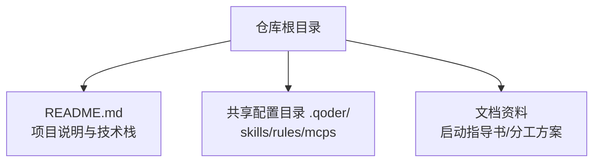
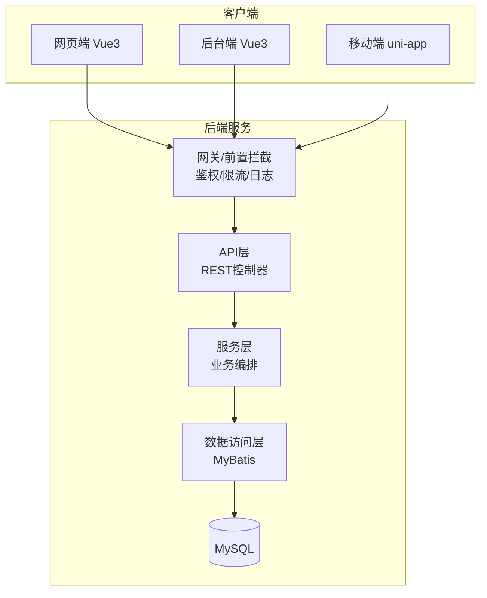

# API接口规范

<cite>
**本文引用的文件**   
- [README.md](file://README.md)
</cite>

## 目录
1. [引言](#引言)
2. [项目结构](#项目结构)
3. [核心组件](#核心组件)
4. [架构总览](#架构总览)
5. [详细组件分析](#详细组件分析)
6. [依赖分析](#依赖分析)
7. [性能考虑](#性能考虑)
8. [故障排查指南](#故障排查指南)
9. [结论](#结论)
10. [附录](#附录)

## 引言
本规范面向“京东风格电商平台”的后端API设计，目标是建立统一的RESTful接口约定、统一响应格式、认证授权策略以及各业务模块的接口定义与版本管理策略。当前仓库为课程作业仓库，包含项目说明与文档链接；后端技术栈为Spring Boot + MyBatis + MySQL，前端覆盖网页端、后台端与移动端（uni-app）。本规范将作为后续多端接入的统一契约，确保跨端一致性与可维护性。

## 项目结构
当前仓库以说明文档为主，尚未包含具体后端或前端工程代码。根据README中的技术栈信息，后续工程将以多端独立工程形式接入此仓库，并通过共享配置进行协作。

图表来源
- [README.md:1-35](file://README.md#L1-L35)

章节来源
- [README.md:1-35](file://README.md#L1-L35)

## 核心组件
基于技术栈与电商领域通用实践，建议将后端划分为以下核心能力域，并在API层按资源维度组织：
- 用户与权限：用户注册登录、角色与权限控制、JWT令牌签发与校验
- 商品中心：类目、商品详情、搜索与筛选
- 购物车：添加/修改/删除商品、合并本地与云端购物车
- 订单中心：下单、支付回调、发货、收货、评价
- 基础支撑：全局异常处理、统一响应体、分页与排序、日志与审计、限流与熔断

上述能力域将在后续实现中通过控制器层暴露REST接口，服务层承载业务逻辑，数据访问层对接MyBatis与MySQL。

章节来源
- [README.md:18-24](file://README.md#L18-L24)

## 架构总览
整体采用前后端分离架构，后端提供RESTful API，前端多端（Vue网页端、后台端、uni-app移动端）通过HTTP调用。安全方面引入JWT进行无状态认证，结合网关或拦截器进行鉴权与限流。

图表来源
- [README.md:18-24](file://README.md#L18-L24)

## 详细组件分析

### 一、RESTful设计与命名规范
- URL路径
  - 使用小写英文与短横线分隔，名词复数表示集合，层级不超过三层
  - 示例：/api/v1/users、/api/v1/products/{id}、/api/v1/carts/items、/api/v1/orders
- HTTP方法
  - GET：查询资源
  - POST：创建资源
  - PUT：全量更新
  - PATCH：部分更新
  - DELETE：删除资源
- 查询参数
  - 分页：page、size
  - 排序：sort=field,asc|desc
  - 过滤：按字段名传递，如 status=active
- 媒体类型
  - 请求与响应均使用 application/json
- 版本化
  - 在URL前缀中使用版本号，如 /api/v1/...
- 资源粒度
  - 每个资源对应一个实体或聚合根，避免过度嵌套
- 幂等性
  - GET、PUT、DELETE需保证幂等；POST非幂等，必要时由业务侧去重

章节来源
- [README.md:18-24](file://README.md#L18-L24)

### 二、统一请求与响应格式
- 成功响应
  - 结构：{ code, message, data }
  - code：业务状态码（0表示成功）
  - message：人类可读消息
  - data：业务数据（对象、数组或空）
- 错误响应
  - 结构：{ code, message, data }
  - code：业务错误码（非0）
  - message：错误描述
  - data：可选附加信息
- HTTP状态码
  - 2xx：成功
  - 4xx：客户端错误（未认证、参数错误、权限不足）
  - 5xx：服务端错误
- 分页数据结构
  - { content, totalElements, totalPages, number, size }
- 时间与时区
  - 统一使用ISO 8601字符串，时区UTC+8
- 字段命名
  - JSON字段使用驼峰命名，数据库字段使用下划线，映射在服务层完成

章节来源
- [README.md:18-24](file://README.md#L18-L24)

### 三、认证与授权机制
- 认证方式
  - 基于JWT的无状态认证，登录成功后返回access_token与refresh_token
  - 客户端在请求头携带 Authorization: Bearer <token>
- 令牌管理
  - access_token有效期较短，refresh_token用于续期
  - 支持黑名单或短期缓存以实现强制下线
- 权限控制
  - 基于角色的访问控制（RBAC），在路由或方法级注解校验
  - 细粒度权限可通过资源标识与操作位组合
- 安全策略
  - 全站HTTPS
  - 敏感字段脱敏输出
  - 防重放：时间戳+随机串签名
  - 输入校验与SQL注入防护
  - 速率限制与IP白名单

章节来源
- [README.md:18-24](file://README.md#L18-L24)

### 四、业务模块接口规范

#### 1) 用户管理
- 资源范围
  - 用户注册、登录、登出、个人信息、头像上传、密码重置
- 典型接口
  - POST /api/v1/auth/register
  - POST /api/v1/auth/login
  - POST /api/v1/auth/logout
  - GET /api/v1/users/me
  - PUT /api/v1/users/me
  - POST /api/v1/users/me/avatar
  - POST /api/v1/auth/password/reset
- 权限要求
  - 注册/登录无需认证；其余需要用户自身或管理员权限
- 注意事项
  - 密码不直接传输，使用加密通道与后端哈希存储
  - 手机号/邮箱唯一性校验

章节来源
- [README.md:18-24](file://README.md#L18-L24)

#### 2) 商品浏览
- 资源范围
  - 类目树、商品列表、商品详情、搜索与筛选
- 典型接口
  - GET /api/v1/categories
  - GET /api/v1/products
  - GET /api/v1/products/{id}
  - GET /api/v1/products/search
- 查询参数
  - page、size、keyword、categoryId、priceMin、priceMax、brandId、sort
- 权限要求
  - 公开访问

章节来源
- [README.md:18-24](file://README.md#L18-L24)

#### 3) 购物车
- 资源范围
  - 添加/修改/删除购物车项、清空购物车、合并本地与云端购物车
- 典型接口
  - POST /api/v1/carts/items
  - PATCH /api/v1/carts/items/{itemId}
  - DELETE /api/v1/carts/items/{itemId}
  - DELETE /api/v1/carts
  - POST /api/v1/carts/merge
- 权限要求
  - 已登录用户

章节来源
- [README.md:18-24](file://README.md#L18-L24)

#### 4) 订单处理
- 资源范围
  - 下单、支付回调、发货、收货、取消、退款、评价
- 典型接口
  - POST /api/v1/orders
  - GET /api/v1/orders/{id}
  - GET /api/v1/orders
  - POST /api/v1/orders/{id}/pay
  - POST /api/v1/orders/{id}/cancel
  - POST /api/v1/orders/{id}/confirm-receipt
  - POST /api/v1/orders/{id}/review
- 权限要求
  - 下单与查看需用户本人或管理员；支付回调由支付渠道回调地址触发（服务端间）
- 事务与一致性
  - 库存扣减与订单创建需保证一致性，必要时引入补偿或TCC

章节来源
- [README.md:18-24](file://README.md#L18-L24)

### 五、接口文档模板与Swagger集成
- 文档模板
  - 每个接口需包含：路径、方法、摘要、请求参数、响应体、错误码、权限、示例
- Swagger集成
  - 使用OpenAPI 3.0注解标注控制器与方法
  - 生成在线文档与离线规范文件
  - 启用模型校验与参数约束提示
- 文档维护
  - 接口变更同步更新注解与示例
  - 发布前执行文档对比与回归检查

章节来源
- [README.md:18-24](file://README.md#L18-L24)

### 六、接口测试与版本管理策略
- 接口测试
  - 单元测试：服务层断言
  - 集成测试：控制器端到端验证
  - 契约测试：前后端契约校验
  - 自动化：CI流水线执行
- 版本管理
  - URL版本化：/api/v1/...
  - 向后兼容：新增字段不破坏旧客户端
  - 废弃策略：弃用标记与迁移期提示
- 发布流程
  - 分支策略：develop集成分支，main稳定分支
  - PR审查：必须通过代码评审与自动化测试
  - 灰度发布：逐步放量与回滚预案

章节来源
- [README.md:25-35](file://README.md#L25-L35)

## 依赖分析
- 外部依赖
  - Spring Boot：Web、Security、Validation、Actuator
  - MyBatis：持久层框架
  - MySQL：关系型数据库
  - JWT：令牌签发与校验
  - OpenAPI/Swagger：接口文档
- 内部耦合
  - 控制器依赖服务层，服务层依赖数据访问层
  - 鉴权与日志通过拦截器/过滤器横切
- 潜在风险
  - 循环依赖：通过分层与接口抽象避免
  - 单点故障：关键服务引入冗余与降级

章节来源
- [README.md:18-24](file://README.md#L18-L24)

## 性能考虑
- 缓存策略
  - 热点商品与类目使用Redis缓存
  - 读多写少场景采用Cache-Aside模式
- 数据库优化
  - 合理索引、分页查询、批量操作
  - 读写分离与分库分表预留
- 异步与削峰
  - 下单后通知、积分发放等使用消息队列异步处理
- 连接与线程池
  - 合理配置Tomcat线程池与数据库连接池
- 监控与告警
  - 指标采集、慢查询日志、链路追踪

## 故障排查指南
- 常见问题
  - 401未认证：检查Authorization头与Token有效性
  - 403权限不足：检查角色与资源权限
  - 400参数错误：检查必填字段与格式
  - 429限流：降低频率或申请配额
  - 500服务端错误：查看应用日志与堆栈
- 定位手段
  - 开启调试日志与TraceID
  - 使用Actuator健康检查与指标
  - 数据库慢查询分析与索引优化
- 恢复策略
  - 快速回滚、熔断降级、扩容与重启

## 结论
本规范从RESTful设计、统一响应、认证授权、业务接口、文档与测试、版本管理等维度建立了统一的API契约。随着多端工程接入，应严格遵循本规范，持续完善接口文档与自动化测试，保障系统稳定性与演进效率。

## 附录

### A. 统一响应体结构
- 成功
  - code: 0
  - message: "success"
  - data: 业务数据
- 失败
  - code: 非0业务错误码
  - message: 错误描述
  - data: 可选附加信息

### B. 常见业务错误码
- 10001：参数校验失败
- 10002：重复提交
- 10003：库存不足
- 10004：订单状态不允许该操作
- 10005：支付失败
- 10006：权限不足
- 10007：会话过期

### C. 分页数据结构
- content: 数据列表
- totalElements: 总数
- totalPages: 总页数
- number: 当前页码
- size: 每页大小

### D. 时间与时区
- 统一使用ISO 8601字符串
- 默认时区UTC+8

### E. 安全清单
- HTTPS强制
- 输入校验与输出脱敏
- 防重放与签名
- 速率限制与IP白名单
- 敏感操作二次确认