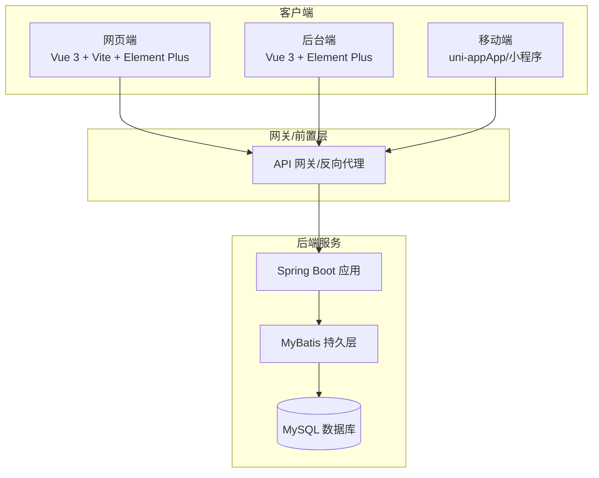
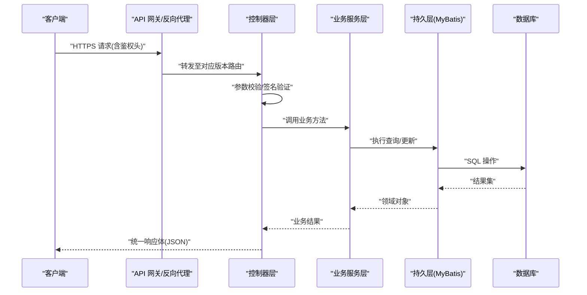
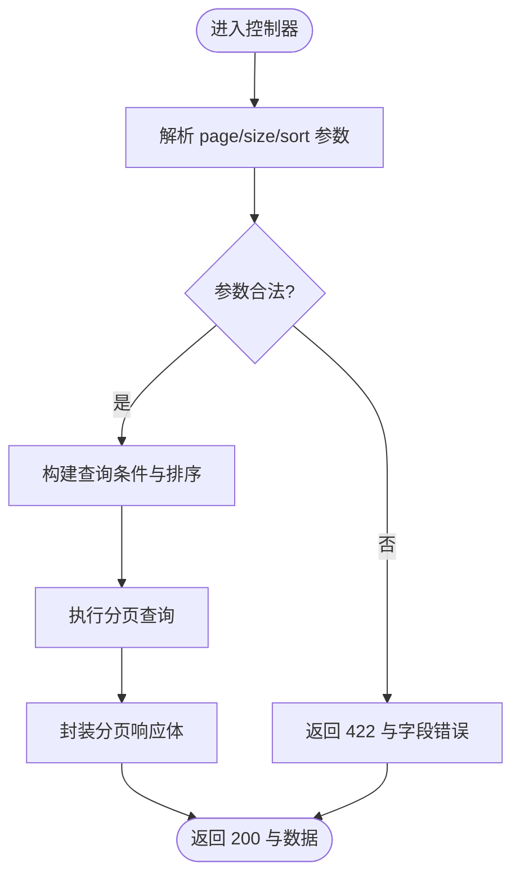
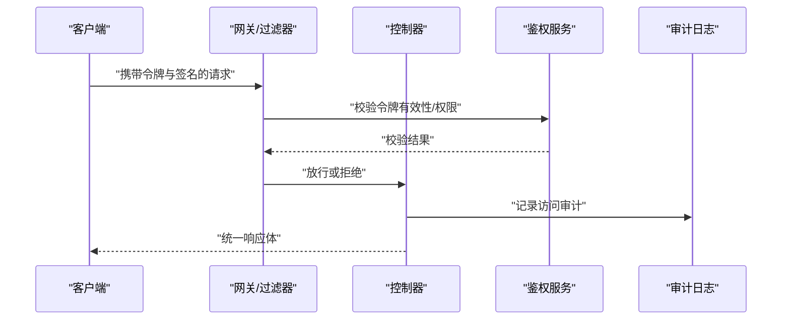
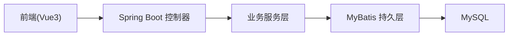

# API设计原则

<cite>
**本文引用的文件**   
- [README.md](file://README.md)
</cite>

## 目录
1. [引言](#引言)
2. [项目结构](#项目结构)
3. [核心组件](#核心组件)
4. [架构总览](#架构总览)
5. [详细组件分析](#详细组件分析)
6. [依赖分析](#依赖分析)
7. [性能考虑](#性能考虑)
8. [故障排查指南](#故障排查指南)
9. [结论](#结论)
10. [附录](#附录)

## 引言
本文件面向基于 Spring Boot + Vue 3 的多端电商平台，制定统一的 RESTful API 设计原则与最佳实践，覆盖 URL 路径命名、HTTP 方法使用、资源命名与版本管理；定义统一数据格式（JSON、日期时间、分页与排序）；规范错误处理（状态码、错误响应体、异常策略）；完善接口安全（认证授权、传输加密、防攻击）；并提供检查清单与示例路径，确保团队开发一致性。

## 项目结构
当前仓库为课程作业主仓库，包含多端工程接入说明与共享配置入口。后端技术栈为 Spring Boot + MyBatis + MySQL，前端用户端与后台端均为 Vue 3，移动端采用 uni-app。API 设计需同时满足网页端、App、小程序、商家后台与管理员后台的一致性与可演进性。

图表来源
- [README.md:18-23](file://README.md#L18-L23)

章节来源
- [README.md:1-35](file://README.md#L1-L35)

## 核心组件
- 统一响应体：所有接口返回一致的 JSON 结构，便于前后端解耦与跨端复用。
- 统一错误模型：标准化错误码、错误消息与调试信息，便于日志追踪与问题定位。
- 版本化路由：通过 URL 前缀或请求头进行 API 版本控制，保障向后兼容。
- 分页与排序：统一分页参数与排序字段约定，减少歧义。
- 安全基线：强制 HTTPS、鉴权令牌、输入校验、速率限制与敏感信息脱敏。

章节来源
- [README.md:18-23](file://README.md#L18-L23)

## 架构总览
下图展示从客户端到后端的典型请求链路，以及各层在 API 设计中的职责边界。

图表来源
- [README.md:18-23](file://README.md#L18-L23)

## 详细组件分析

### 1. RESTful 设计规范
- 资源命名
  - 使用名词复数表示集合资源，单数表示单个资源。
  - 层级关系用路径表达，避免动词出现在路径中。
  - 示例路径模式：/api/v1/users/{userId}/orders/{orderId}
- HTTP 方法
  - GET：幂等读取，不改变服务端状态。
  - POST：创建资源或触发非幂等操作。
  - PUT：全量替换资源，要求幂等。
  - PATCH：局部更新资源，要求幂等。
  - DELETE：删除资源，要求幂等。
- URL 路径约定
  - 小写英文字母、连字符分隔，禁止下划线。
  - 路径段不超过三层，复杂查询使用查询参数。
  - 文件下载/上传使用明确语义的 /download 与 /upload 子资源。
- 版本管理策略
  - 推荐 URL 前缀方式：/api/v1/...
  - 次版本变更保持向后兼容；破坏性变更升级主版本并保留旧版本过渡期。
  - 废弃接口通过响应头或文档标注弃用时间与替代方案。

章节来源
- [README.md:18-23](file://README.md#L18-L23)

### 2. 统一数据格式标准
- JSON 根结构
  - 成功响应：包含状态码、消息、数据体、请求标识等字段。
  - 失败响应：包含错误码、错误消息、可选的调试信息与请求标识。
- 日期时间
  - 统一使用 ISO 8601 字符串（UTC 或带时区偏移），避免时间戳歧义。
- 分页参数
  - 查询参数：page（页码）、size（每页条数）、sort（排序）。
  - 响应体：包含 total、pages、current、size、data 列表。
- 排序规则
  - sort=field1,asc|desc&field2,desc
  - 白名单校验字段名，防止注入与性能风险。
- 枚举与布尔
  - 枚举使用小写下划线或驼峰字符串，保持一致。
  - 布尔值使用 true/false，不使用数字或字符串。

章节来源
- [README.md:18-23](file://README.md#L18-L23)

### 3. 错误处理机制
- HTTP 状态码
  - 2xx：成功；3xx：重定向；4xx：客户端错误；5xx：服务端错误。
  - 业务错误尽量映射到合适的 4xx，如 400、401、403、404、409、422。
- 错误响应体
  - 统一包含错误码、错误消息、可选的字段级错误详情与请求标识。
- 异常处理策略
  - 全局异常处理器捕获未处理异常，转换为统一错误响应。
  - 参数校验失败返回 422 与字段错误明细。
  - 鉴权失败返回 401，权限不足返回 403。
  - 记录结构化日志，包含请求 ID、关键入参与堆栈摘要。

章节来源
- [README.md:18-23](file://README.md#L18-L23)

### 4. 接口安全设计
- 认证与授权
  - 推荐使用无状态令牌（如 JWT）作为认证凭据，置于请求头。
  - 细粒度权限控制结合角色与资源维度，支持接口级与方法级注解。
- 传输加密
  - 全站强制 HTTPS，启用 HSTS，禁用弱密码套件。
  - 敏感字段（如手机号、身份证）在传输层加密或在应用层二次加密。
- 防攻击措施
  - 输入校验：长度、类型、范围、正则、白名单。
  - 速率限制：按 IP/用户维度限流，防止暴力破解与滥用。
  - CSRF/XSS/SQL 注入防护：框架默认开启，必要时自定义策略。
  - 敏感日志脱敏：避免输出明文密码、密钥、身份证号等。
- 签名与防重放
  - 对高价值接口增加请求签名与时间戳校验，必要时加入随机数。

章节来源
- [README.md:18-23](file://README.md#L18-L23)

### 5. 分页与排序流程

图表来源
- [README.md:18-23](file://README.md#L18-L23)

### 6. 鉴权与安全校验序列

图表来源
- [README.md:18-23](file://README.md#L18-L23)

### 7. 代码示例路径
- 统一响应体与错误模型定义位置：待补充（请在实现后回填具体文件路径）
- 全局异常处理器：待补充
- 鉴权拦截器/过滤器：待补充
- 分页与排序工具类：待补充
- 版本路由配置：待补充

章节来源
- [README.md:18-23](file://README.md#L18-L23)

## 依赖分析
- 外部依赖
  - 后端：Spring Boot、MyBatis、MySQL
  - 前端：Vue 3、Vite、Element Plus
  - 移动端：uni-app（App/微信小程序）
- 耦合与内聚
  - 控制器层仅负责协议适配与参数校验，业务逻辑下沉至服务层，提升内聚与可测试性。
  - 持久层通过 MyBatis 抽象 SQL，降低与数据库实现的耦合。
- 潜在循环依赖
  - 服务层之间避免直接互相调用，必要时引入事件或领域服务协调。

图表来源
- [README.md:18-23](file://README.md#L18-L23)

章节来源
- [README.md:18-23](file://README.md#L18-L23)

## 性能考虑
- 缓存策略：热点数据使用 Redis 缓存，合理设置过期与失效策略。
- 数据库优化：索引设计、分页游标、批量读写、慢查询治理。
- 网络优化：GZIP/Brotli 压缩、HTTP/2、连接池调优。
- 异步处理：耗时任务使用消息队列异步化，缩短响应时间。
- 监控告警：APM 指标、错误率、延迟分位、容量水位。

## 故障排查指南
- 快速定位
  - 通过请求 ID 关联日志，查看网关、控制器、服务、持久层链路。
  - 关注统一错误响应中的错误码与消息，优先修复客户端传参与权限问题。
- 常见问题
  - 401/403：令牌过期、权限不足、签名校验失败。
  - 422：参数校验失败，检查字段类型、长度、枚举值。
  - 500：服务端异常，查看堆栈与上游依赖健康状态。
- 恢复建议
  - 灰度发布与回滚预案；熔断降级保护下游依赖；重试与退避策略。

## 结论
本 API 设计原则围绕一致性、安全性与可演进性展开，适用于多端电商平台的统一接口规范。落地过程中应配合代码审查与自动化检查，持续迭代完善。

## 附录

### A. API 设计检查清单
- 资源与路径
  - 是否使用名词复数？是否避免动词？层级是否清晰？
- 方法与状态码
  - 是否正确使用 GET/POST/PUT/PATCH/DELETE？状态码是否准确？
- 版本管理
  - 是否通过前缀或请求头进行版本控制？是否有弃用公告？
- 数据格式
  - 是否遵循统一响应体？日期是否为 ISO 8601？分页与排序是否一致？
- 错误处理
  - 是否全局异常处理？是否返回结构化错误信息？是否记录必要日志？
- 安全
  - 是否强制 HTTPS？是否实现鉴权与权限控制？是否做输入校验与限流？
- 文档与示例
  - 是否提供 OpenAPI/Swagger 文档？是否包含请求/响应示例？

### B. 示例路径占位
- 统一响应体定义：待补充
- 全局异常处理：待补充
- 鉴权过滤器：待补充
- 分页工具类：待补充
- 版本路由配置：待补充