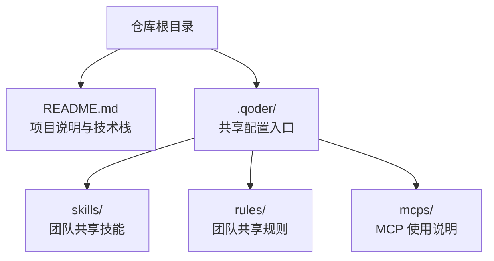
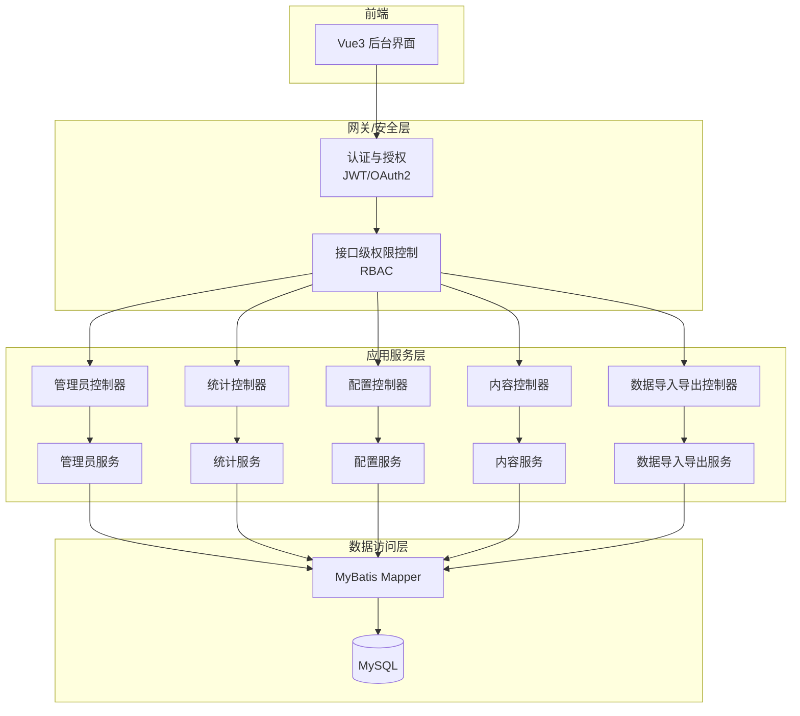
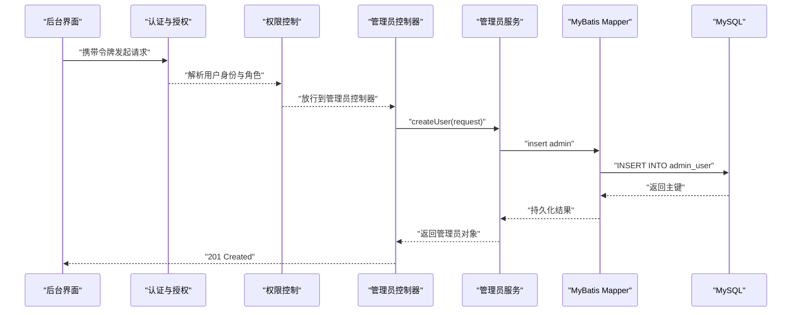
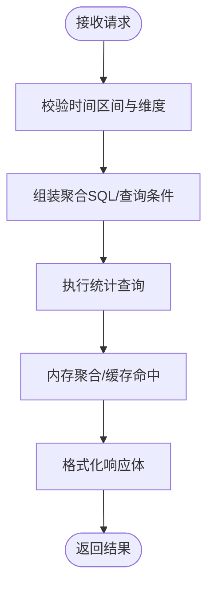
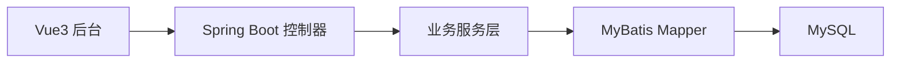

# 后台管理API

<cite>
**本文引用的文件**
- [README.md](file://README.md)
</cite>

## 目录
1. [简介](#简介)
2. [项目结构](#项目结构)
3. [核心组件](#核心组件)
4. [架构总览](#架构总览)
5. [详细组件分析](#详细组件分析)
6. [依赖分析](#依赖分析)
7. [性能考虑](#性能考虑)
8. [故障排查指南](#故障排查指南)
9. [结论](#结论)
10. [附录](#附录)

## 简介
本仓库为“京东风格电商平台课程作业”的根仓库，目标是一套覆盖用户网页端、App、小程序、商家后台和管理员后台的多端电商后端。当前仓库仅包含顶层说明与共享配置入口，后端技术栈采用 Spring Boot + MyBatis + MySQL，前端使用 Vue 3 + Element Plus。基于此背景，本文面向管理员后台，给出完整的后台管理 API 设计文档，涵盖管理员用户管理、数据统计、系统配置、内容管理、数据导入导出以及权限控制、审计与安全等能力。

## 项目结构
当前仓库为多端聚合仓库，各端工程后续接入。后端以 Spring Boot 为核心，结合 MyBatis 与 MySQL；前端（含后台）以 Vue 3 + Element Plus 构建。共享配置位于 .qoder/ 目录，用于团队技能、规则与 MCP 使用说明的统一管理。

图表来源
- [README.md:1-35](file://README.md#L1-L35)

章节来源
- [README.md:1-35](file://README.md#L1-L35)

## 核心组件
围绕管理员后台，建议将后端按领域划分如下模块（命名仅为约定，实际实现以代码为准）：
- 认证与授权：登录鉴权、RBAC 角色权限、接口级访问控制
- 管理员用户管理：账号创建、启用/禁用、密码重置、角色分配、操作日志
- 数据统计：销售报表、用户分析、商品统计、运营指标聚合
- 系统配置：网站设置、支付配置、物流配置、营销活动开关与参数
- 内容管理：公告发布、广告位与素材、页面配置、SEO 元信息
- 数据导入导出：批量处理、报表生成、备份恢复
- 通用支撑：统一响应体、异常处理、分页排序、校验、审计日志、限流熔断

章节来源
- [README.md:18-24](file://README.md#L18-L24)

## 架构总览
后台管理 API 整体遵循分层架构与 RESTful 风格，前后端通过 HTTP/JSON 交互，后端内部以 Controller-Service-Mapper 分层组织，数据库采用 MySQL。

图表来源
- [README.md:18-24](file://README.md#L18-L24)

## 详细组件分析

### 管理员用户管理
职责范围：管理员账号生命周期管理、角色与权限分配、操作日志记录。

- 管理员账号
  - 创建管理员：POST /api/admin/users
  - 更新管理员：PUT /api/admin/users/{id}
  - 删除/禁用管理员：DELETE /api/admin/users/{id} 或 PATCH /api/admin/users/{id}/status
  - 查询管理员列表：GET /api/admin/users?keyword=&role=&status=&page=&size=
  - 获取管理员详情：GET /api/admin/users/{id}
  - 重置密码：POST /api/admin/users/{id}/reset-password
- 角色与权限
  - 角色 CRUD：POST/PUT/DELETE /api/admin/roles，GET /api/admin/roles
  - 权限点定义：POST/PUT/DELETE /api/admin/permissions，GET /api/admin/permissions
  - 角色-权限绑定：POST /api/admin/roles/{roleId}/permissions
  - 管理员-角色绑定：POST /api/admin/users/{userId}/roles
- 操作日志
  - 查询日志：GET /api/admin/logs?operator=&action=&module=&dateFrom=&dateTo=&page=&size=
  - 导出日志：GET /api/admin/logs/export?query=...

示例调用序列（管理员创建）：

图表来源
- [README.md:18-24](file://README.md#L18-L24)

章节来源
- [README.md:18-24](file://README.md#L18-L24)

### 数据统计接口
职责范围：销售报表、用户分析、商品统计、运营指标聚合。

- 销售报表
  - 日/周/月销售汇总：GET /api/stats/sales?period=daily|weekly|monthly&dateFrom=&dateTo=
  - 订单明细：GET /api/stats/orders?status=&channel=&page=&size=
- 用户分析
  - 新增用户趋势：GET /api/stats/users/new?period=daily|weekly|monthly&dateFrom=&dateTo=
  - 活跃用户：GET /api/stats/users/active?period=daily|weekly|monthly&dateFrom=&dateTo=
- 商品统计
  - 销量排行：GET /api/stats/products/top?limit=50&category=
  - 库存预警：GET /api/stats/products/low-stock?threshold=
- 运营数据
  - 转化率漏斗：GET /api/stats/conversion?funnel=visit->cart->pay
  - 渠道效果：GET /api/stats/channels?from=&to=

数据处理流程（以销售汇总为例）：

图表来源
- [README.md:18-24](file://README.md#L18-L24)

章节来源
- [README.md:18-24](file://README.md#L18-L24)

### 系统配置管理
职责范围：网站设置、支付配置、物流配置、营销活动管理。

- 网站设置
  - 站点基础信息：GET/PUT /api/config/site
  - 域名与HTTPS：GET/PUT /api/config/domain
- 支付配置
  - 支付通道：GET/POST/PUT/DELETE /api/config/payments/{provider}
  - 密钥与证书：POST /api/config/payments/{provider}/secrets
- 物流配置
  - 物流公司：GET/POST/PUT/DELETE /api/config/logistics
  - 运费模板：GET/POST/PUT/DELETE /api/config/freight-templates
- 营销活动
  - 活动CRUD：POST/PUT/DELETE /api/config/campaigns
  - 活动开关与生效时间：PATCH /api/config/campaigns/{id}/status

章节来源
- [README.md:18-24](file://README.md#L18-L24)

### 内容管理
职责范围：公告发布、广告管理、页面配置、SEO优化。

- 公告
  - 公告CRUD：POST/PUT/DELETE /api/content/announcements
  - 置顶/下线：PATCH /api/content/announcements/{id}/status
- 广告
  - 广告位与素材：POST/PUT/DELETE /api/content/ads
  - 投放策略：GET/PUT /api/content/ads/{id}/strategy
- 页面配置
  - 首页区块：GET/PUT /api/content/pages/home
  - 专题页：POST/PUT/DELETE /api/content/pages/{slug}
- SEO
  - 全局SEO：GET/PUT /api/content/seo/global
  - 页面SEO：GET/PUT /api/content/seo/pages/{slug}

章节来源
- [README.md:18-24](file://README.md#L18-L24)

### 数据导入导出
职责范围：批量数据处理、报表生成、数据备份恢复。

- 批量导入
  - 商品导入：POST /api/data/import/products (multipart/form-data)
  - 用户导入：POST /api/data/import/users
  - 任务进度：GET /api/data/import/tasks/{taskId}
- 报表导出
  - 销售报表：GET /api/data/export/sales?dateFrom=&dateTo=
  - 用户报表：GET /api/data/export/users?status=&dateFrom=&dateTo=
- 备份恢复
  - 全量备份：POST /api/data/backup/full
  - 增量备份：POST /api/data/backup/incremental
  - 恢复：POST /api/data/restore/{backupId}

章节来源
- [README.md:18-24](file://README.md#L18-L24)

### 权限控制机制
- 模型：RBAC（角色-权限-资源），支持接口级与方法级控制
- 鉴权：JWT 令牌，登录后颁发，过期自动刷新
- 授权：基于注解或拦截器校验角色/权限点
- 最小权限原则：默认拒绝，显式授予

章节来源
- [README.md:18-24](file://README.md#L18-L24)

### 操作审计
- 审计事件：登录、增删改关键数据、敏感配置变更、批量导入导出
- 审计字段：操作人、IP、UA、时间、模块、动作、资源ID、结果、备注
- 存储：独立审计表，支持检索与导出

章节来源
- [README.md:18-24](file://README.md#L18-L24)

### 数据安全
- 传输安全：全站 HTTPS，强制 TLS 1.2+
- 口令安全：bcrypt/scrypt 加盐哈希，禁止明文存储
- 输入校验：服务端严格校验，防注入与越权
- 输出脱敏：手机号、身份证等敏感字段按需脱敏
- 访问控制：接口白名单、IP 白名单、频率限制
- 备份加密：静态数据与备份文件加密存储

章节来源
- [README.md:18-24](file://README.md#L18-L24)

## 依赖分析
- 技术栈依赖：Spring Boot 提供 Web 容器与生态，MyBatis 负责数据访问，MySQL 作为持久化存储
- 前后端分离：前端通过 HTTP/JSON 调用后端 API，跨域由后端统一处理
- 模块化边界：Controller 仅做参数校验与编排，业务逻辑下沉至 Service，数据访问封装在 Mapper

图表来源
- [README.md:18-24](file://README.md#L18-L24)

章节来源
- [README.md:18-24](file://README.md#L18-L24)

## 性能考虑
- 统计类接口：引入缓存（如 Redis）与预聚合表，避免实时重算
- 分页与索引：所有列表接口默认分页，热点查询建立合适索引
- 异步处理：大文件导入导出、报表生成采用消息队列异步化
- 连接池与批处理：合理配置连接池大小，批量写入使用批处理
- 限流与降级：对高频接口实施限流，必要时降级非核心功能

[本节为通用指导，不直接分析具体文件]

## 故障排查指南
- 常见问题
  - 401/403：检查 JWT 是否有效、角色/权限是否授予
  - 400：检查请求参数校验失败原因
  - 500：查看后端错误日志与堆栈
- 定位步骤
  - 开启调试日志，关注 SQL 执行时间与慢查询
  - 核对 RBAC 配置与接口权限映射
  - 检查第三方依赖（支付、物流、短信）状态
- 恢复手段
  - 使用备份恢复最近可用版本
  - 回滚配置变更并重启服务

[本节为通用指导，不直接分析具体文件]

## 结论
本文基于仓库提供的技术栈与多端规划，给出了管理员后台的完整 API 设计蓝图，覆盖管理员用户管理、数据统计、系统配置、内容管理、数据导入导出，并配套权限控制、操作审计与安全保障措施。后续可在具体工程落地时，依据本蓝图细化接口契约、数据模型与实现细节。

[本节为总结性内容，不直接分析具体文件]

## 附录
- 术语
  - RBAC：基于角色的访问控制
  - JWT：JSON Web Token
  - 预聚合：提前计算并缓存常用统计结果
- 参考
  - 技术栈与协作规范见 README

章节来源
- [README.md:1-35](file://README.md#L1-L35)