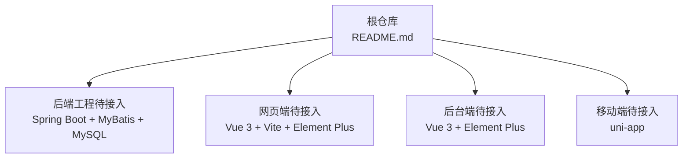
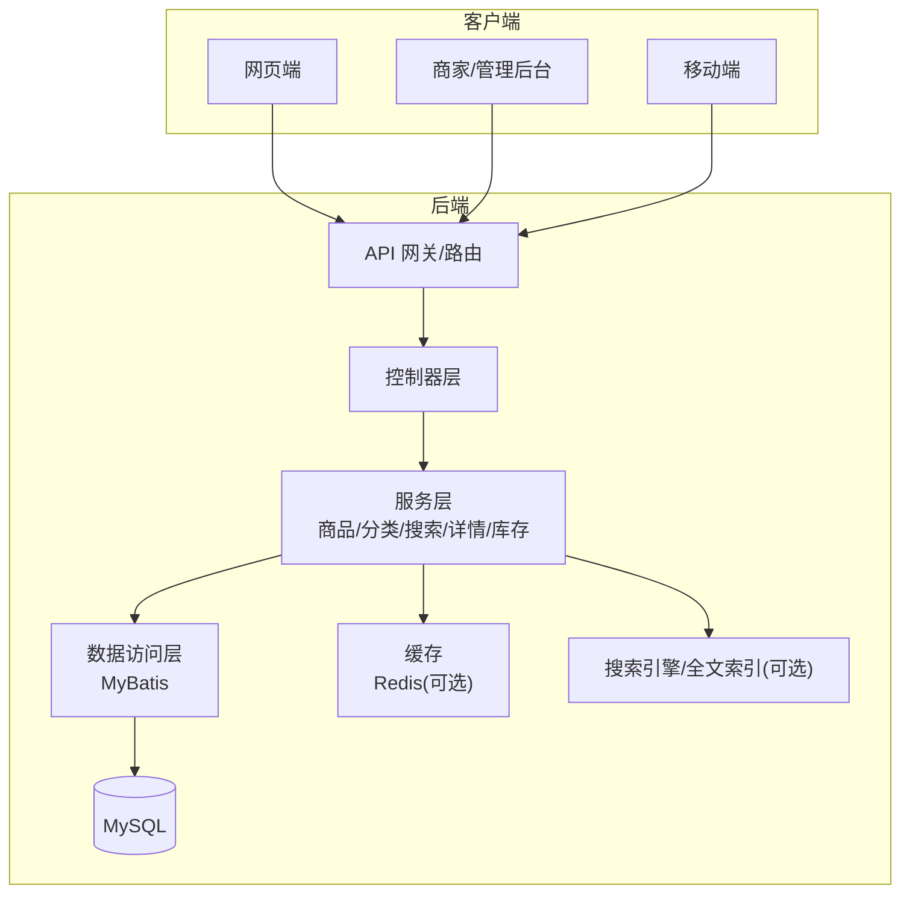
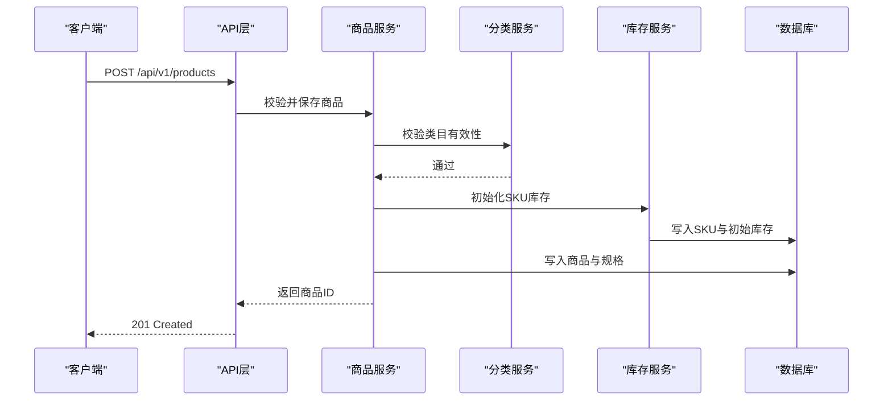
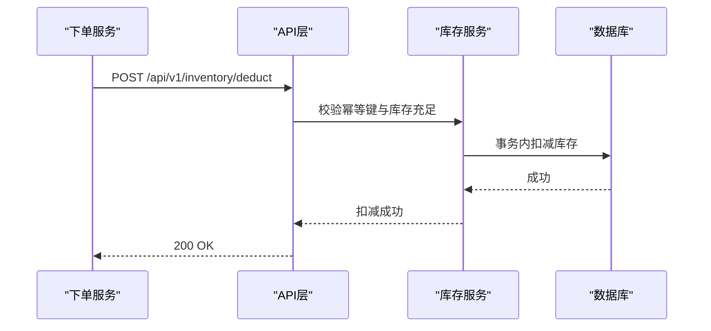
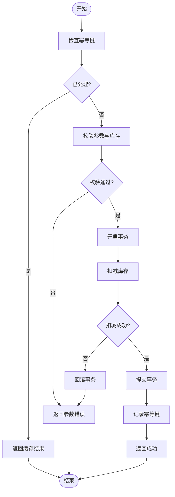
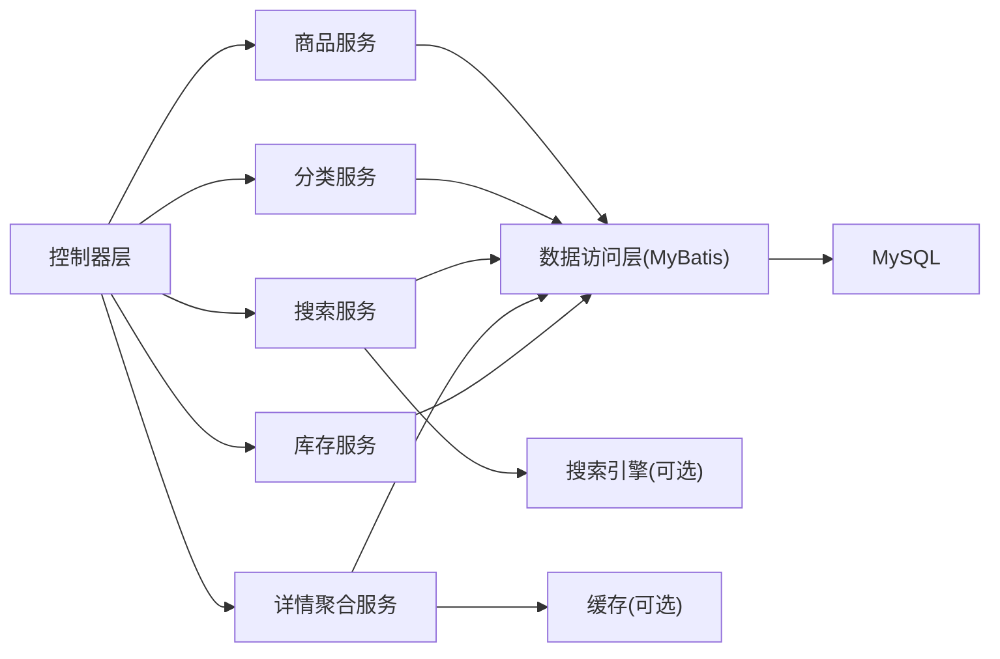

# 商品管理API

<cite>
**本文引用的文件**   
- [README.md](file://README.md)
</cite>

## 目录
1. [简介](#简介)
2. [项目结构](#项目结构)
3. [核心组件](#核心组件)
4. [架构总览](#架构总览)
5. [详细组件分析](#详细组件分析)
6. [依赖分析](#依赖分析)
7. [性能考虑](#性能考虑)
8. [故障排查指南](#故障排查指南)
9. [结论](#结论)
10. [附录](#附录)

## 简介
本文件面向“京东风格电商平台课程作业”的商品管理模块，提供一套完整的商品管理API接口规范。内容覆盖：
- 商品CRUD（创建、查询、更新、删除）
- 商品分类管理（层级结构、分类树查询、维护操作）
- 商品搜索与筛选（关键词、价格区间、品牌过滤、多条件组合）
- 商品详情聚合（商品信息、图片、规格参数、用户评价）
- 库存管理（库存查询、库存扣减、库存预警）
- 完整接口示例、数据模型定义与性能优化建议

技术栈参考后端：Spring Boot + MyBatis + MySQL；前端与移动端采用Vue 3/uni-app等。

章节来源
- [README.md:1-35](file://README.md#L1-L35)

## 项目结构
当前仓库为课程作业主仓库，包含项目说明文档与共享配置入口。商品管理API的实现将作为后端工程接入该仓库，遵循团队分支与提交规范。

图表来源
- [README.md:18-24](file://README.md#L18-L24)

章节来源
- [README.md:1-35](file://README.md#L1-L35)

## 核心组件
围绕商品域的核心能力划分为以下服务层组件：
- 商品服务：负责商品基础信息、上下架状态、图文详情、规格属性等
- 分类服务：负责分类树构建、分类维护与路径计算
- 搜索服务：负责关键词检索、多维筛选与排序分页
- 详情聚合服务：聚合商品、图片、规格、评价等多源数据
- 库存服务：负责库存查询、扣减、回滚与预警阈值判断

章节来源
- [README.md:18-24](file://README.md#L18-L24)

## 架构总览
整体采用分层架构：网关/路由 → 控制器层 → 服务层 → 数据访问层 → 数据库。搜索可结合搜索引擎或MySQL全文索引实现。缓存用于热点商品详情与分类树。

图表来源
- [README.md:18-24](file://README.md#L18-L24)

## 详细组件分析

### 通用约定
- 协议与格式
  - 传输协议：HTTPS
  - 请求/响应体：JSON
  - 字符编码：UTF-8
- 认证与鉴权
  - 使用统一鉴权中间件，携带令牌进行身份校验
  - 商家/管理员接口需具备相应角色权限
- 版本控制
  - URL前缀带版本号，如 /api/v1
- 错误码与响应体
  - 统一响应结构包含：code、message、data、traceId
  - 业务错误码范围：1xxxx（业务）、2xxxx（参数）、5xxxx（系统）
- 分页
  - 默认字段：page、size；返回 total、list、hasNext
- 幂等性
  - 写操作支持幂等键 idempotencyKey，避免重复提交

章节来源
- [README.md:18-24](file://README.md#L18-L24)

### 商品CRUD接口
- 创建商品
  - 方法：POST
  - 路径：/api/v1/products
  - 请求体关键字段：标题、副标题、类目ID、品牌ID、价格、原价、描述、主图、轮播图、规格属性集合、是否上架
  - 响应：返回商品ID与创建时间
- 查询商品列表
  - 方法：GET
  - 路径：/api/v1/products
  - 查询参数：keyword、categoryId、brandId、priceMin、priceMax、status、sort、page、size
  - 响应：分页结果
- 获取商品详情
  - 方法：GET
  - 路径：/api/v1/products/{id}
  - 响应：商品基本信息、图片集、规格参数、评分概览
- 更新商品
  - 方法：PUT
  - 路径：/api/v1/products/{id}
  - 请求体：可更新字段集合（部分更新）
- 删除商品
  - 方法：DELETE
  - 路径：/api/v1/products/{id}
  - 行为：逻辑删除，标记下架或删除标志位

章节来源
- [README.md:18-24](file://README.md#L18-L24)

### 商品分类管理接口
- 分类树查询
  - 方法：GET
  - 路径：/api/v1/categories/tree
  - 响应：树形结构，含节点ID、名称、父级ID、层级、子节点
- 新增分类
  - 方法：POST
  - 路径：/api/v1/categories
  - 请求体：名称、父级ID、排序权重、状态
- 更新分类
  - 方法：PUT
  - 路径：/api/v1/categories/{id}
- 删除分类
  - 方法：DELETE
  - 路径：/api/v1/categories/{id}
  - 约束：存在子分类或关联商品时禁止删除
- 批量移动/排序
  - 方法：PATCH
  - 路径：/api/v1/categories/batch-move
  - 请求体：目标父级ID与节点ID列表

章节来源
- [README.md:18-24](file://README.md#L18-L24)

### 商品搜索与筛选接口
- 关键词搜索
  - 方法：GET
  - 路径：/api/v1/products/search
  - 查询参数：q、categoryId、brandId、priceMin、priceMax、attrs、sort、page、size
- 高级筛选
  - 方法：GET
  - 路径：/api/v1/products/filter
  - 查询参数：同搜索，支持多值属性与布尔筛选
- 热门/推荐
  - 方法：GET
  - 路径：/api/v1/products/recommendations
  - 查询参数：limit、scene（首页/详情页/购物车等）

章节来源
- [README.md:18-24](file://README.md#L18-L24)

### 商品详情聚合接口
- 聚合详情
  - 方法：GET
  - 路径：/api/v1/products/{id}/detail
  - 响应：商品基础信息、图片展示、规格参数、用户评价摘要（评分、好评率、近N条评价）
- 评价列表
  - 方法：GET
  - 路径：/api/v1/products/{id}/reviews
  - 查询参数：page、size、rating、withImage、sort

章节来源
- [README.md:18-24](file://README.md#L18-L24)

### 库存管理接口
- 库存查询
  - 方法：GET
  - 路径：/api/v1/inventory/skus?skuIds=...
  - 响应：SKU维度库存数量、可售状态、预警标记
- 库存扣减
  - 方法：POST
  - 路径：/api/v1/inventory/deduct
  - 请求体：订单号、SKU与数量列表、幂等键
  - 行为：预占或实扣（按策略），失败回滚
- 库存释放
  - 方法：POST
  - 路径：/api/v1/inventory/release
  - 请求体：订单号、SKU与数量列表
- 库存预警
  - 方法：GET
  - 路径：/api/v1/inventory/alerts
  - 查询参数：threshold、categoryIds、brandIds
  - 响应：低于阈值的SKU清单

章节来源
- [README.md:18-24](file://README.md#L18-L24)

### 数据模型定义
- 商品
  - 字段：id、标题、副标题、类目ID、品牌ID、价格、原价、描述、主图、轮播图、规格属性、状态、创建时间、更新时间
- 分类
  - 字段：id、名称、父级ID、层级、排序权重、状态、创建时间、更新时间
- SKU
  - 字段：id、商品ID、规格组合、价格、成本价、库存数量、可售状态、创建时间、更新时间
- 评价
  - 字段：id、商品ID、用户ID、评分、内容、图片、创建时间、更新时间
- 库存预警
  - 字段：SKU ID、当前库存、阈值、触发时间、处理状态

章节来源
- [README.md:18-24](file://README.md#L18-L24)

### 接口调用时序示例

#### 创建商品流程

图表来源
- [README.md:18-24](file://README.md#L18-L24)

#### 库存扣减流程

图表来源
- [README.md:18-24](file://README.md#L18-L24)

### 复杂逻辑流程图：库存扣减与回滚

图表来源
- [README.md:18-24](file://README.md#L18-L24)

## 依赖分析
- 内部依赖
  - 控制器层依赖服务层（商品、分类、搜索、详情、库存）
  - 服务层依赖数据访问层（MyBatis）与可选缓存/搜索引擎
- 外部依赖
  - MySQL：持久化存储
  - Redis（可选）：缓存热点数据
  - 搜索引擎（可选）：Elasticsearch或MySQL全文索引
- 耦合与内聚
  - 服务层按领域划分，保持高内聚低耦合
  - 控制器仅做参数校验与响应封装

图表来源
- [README.md:18-24](file://README.md#L18-L24)

章节来源
- [README.md:18-24](file://README.md#L18-L24)

## 性能考虑
- 缓存策略
  - 分类树、商品详情、热销榜单等热点数据使用缓存
  - 设置合理TTL与失效策略（按类目/品牌/商品ID）
- 数据库优化
  - 对常用查询字段建立索引（类目、品牌、价格区间、状态）
  - 读写分离与分库分表预留设计
- 搜索优化
  - 关键词与多条件筛选走搜索引擎或全文索引
  - 分页游标替代偏移量以提升深页性能
- 并发与一致性
  - 库存扣减使用乐观锁或分布式锁保证一致性
  - 幂等键防止重复提交
- 限流与降级
  - 对高频接口实施限流与熔断降级策略

[本节为通用指导，不直接分析具体文件]

## 故障排查指南
- 常见问题定位
  - 参数校验失败：检查必填字段、类型与范围
  - 库存不足：核对SKU库存与预占策略
  - 分类无效：确认分类树完整性与父子关系
  - 搜索无结果：检查索引同步与关键词匹配规则
- 日志与追踪
  - 统一traceId贯穿请求链路
  - 关键操作记录审计日志（创建、更新、删除、库存变动）
- 监控指标
  - QPS、P99延迟、错误率、慢查询、缓存命中率、库存异常告警

章节来源
- [README.md:18-24](file://README.md#L18-L24)

## 结论
本文基于课程作业的技术栈与协作规范，给出了商品管理模块的端到端API规范，涵盖CRUD、分类、搜索、详情聚合与库存管理，并提供数据模型、时序与流程图示以及性能与排障建议。后续可在后端工程中落地实现，并与前后端联调验证。

[本节为总结性内容，不直接分析具体文件]

## 附录
- 接口示例（以路径与字段名为主，不含具体代码）
  - 创建商品：POST /api/v1/products，请求体包含标题、类目ID、品牌ID、价格、描述、主图、规格属性等
  - 查询商品列表：GET /api/v1/products?keyword=&categoryId=&brandId=&priceMin=&priceMax=&status=&sort=&page=&size=
  - 获取商品详情：GET /api/v1/products/{id}/detail
  - 更新商品：PUT /api/v1/products/{id}
  - 删除商品：DELETE /api/v1/products/{id}
  - 分类树：GET /api/v1/categories/tree
  - 新增分类：POST /api/v1/categories
  - 更新分类：PUT /api/v1/categories/{id}
  - 删除分类：DELETE /api/v1/categories/{id}
  - 搜索：GET /api/v1/products/search?q=&categoryId=&brandId=&priceMin=&priceMax=&attrs=&sort=&page=&size=
  - 筛选：GET /api/v1/products/filter?同上
  - 库存查询：GET /api/v1/inventory/skus?skuIds=
  - 库存扣减：POST /api/v1/inventory/deduct，请求体包含订单号、SKU与数量、幂等键
  - 库存释放：POST /api/v1/inventory/release
  - 库存预警：GET /api/v1/inventory/alerts?threshold=&categoryIds=&brandIds=

[本节为补充说明，不直接分析具体文件]