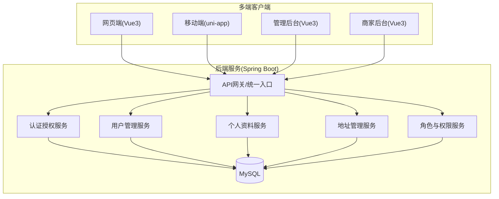
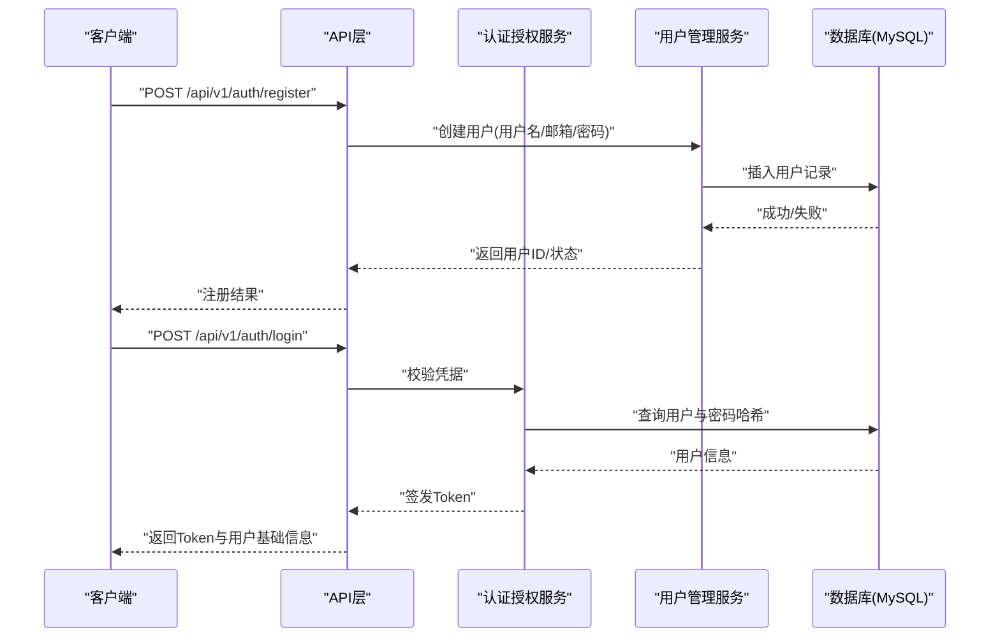
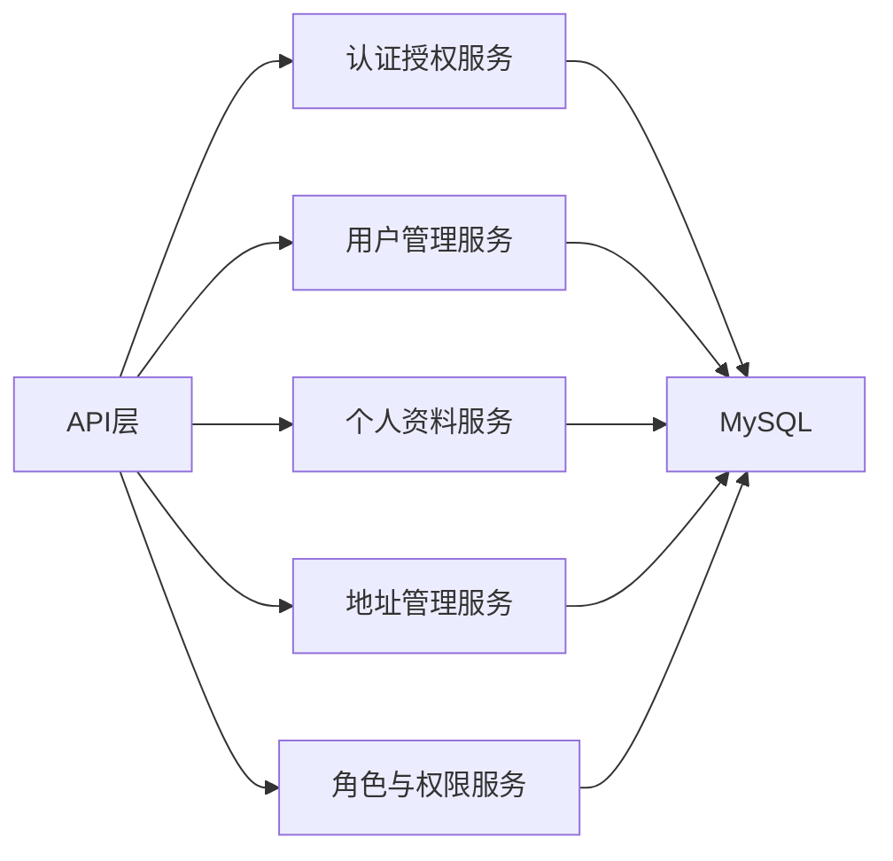

# 用户管理API

<cite>
**本文引用的文件**   
- [README.md](file://README.md)
</cite>

## 目录
1. [简介](#简介)
2. [项目结构](#项目结构)
3. [核心组件](#核心组件)
4. [架构总览](#架构总览)
5. [详细接口规范](#详细接口规范)
6. [依赖分析](#依赖分析)
7. [性能考虑](#性能考虑)
8. [故障排查指南](#故障排查指南)
9. [结论](#结论)
10. [附录](#附录)

## 简介
本仓库为“京东风格电商平台”课程作业，目标是一套覆盖用户网页端、App、小程序、商家后台和管理员后台的多端电商系统。当前仓库仅包含项目说明与共享配置入口，尚未包含后端或前端代码实现。基于技术栈（Spring Boot + MyBatis + MySQL）与多端接入目标，本文给出“用户管理API”的完整接口规范设计，包括注册、登录、个人信息管理、状态管理、权限管理等模块，并提供请求/响应示例、错误码定义、测试数据与Mock服务配置建议，便于后续在真实工程落地时直接对接。

## 项目结构
当前仓库根目录仅包含 README 与若干文档资料，未包含具体业务代码。因此本节以概念性结构展示未来可能的分层组织方式，供参考。

[此图为概念性结构示意，不映射到具体源码文件]

## 核心组件
- 认证授权：负责登录、登出、令牌签发与校验、密码重置等安全相关流程。
- 用户管理：负责用户注册、基本信息查询与修改、账户激活、注销等生命周期操作。
- 个人资料：负责头像上传、昵称、性别、生日等非敏感信息维护。
- 地址管理：负责收货地址的增删改查与默认地址设置。
- 角色与权限：负责角色分配、权限查询、用户组管理，支撑多端差异化访问控制。

上述组件均通过统一的API层暴露RESTful接口，并采用JWT进行无状态鉴权。

## 架构总览
下图展示了典型的用户注册与登录时序，体现从客户端到后端各层的调用关系。

**图表来源**
- [README.md:18-23](file://README.md#L18-L23)

## 详细接口规范

### 通用约定
- 基础路径：/api/v1
- 内容类型：application/json（除文件上传外）
- 鉴权：Bearer Token（JWT），部分接口需管理员角色
- 分页：GET列表接口支持 page、size 参数；响应体包含 total、list、page、size
- 时间格式：ISO 8601（UTC+8）
- 统一响应体：
  - code: 业务状态码
  - message: 提示信息
  - data: 业务数据
  - traceId: 链路追踪ID（可选）

### 错误码总览
- 200: 成功
- 400: 请求参数错误
- 401: 未认证或令牌无效
- 403: 无权限
- 404: 资源不存在
- 409: 资源冲突（如重复注册）
- 422: 语义错误（如密码强度不足）
- 500: 服务器内部错误

### 认证与授权

#### 用户注册
- 方法：POST
- URL：/api/v1/auth/register
- 请求头：Content-Type: application/json
- 请求体字段：
  - username: 字符串，必填，长度限制见校验规则
  - email: 字符串，必填，唯一
  - password: 字符串，必填，复杂度要求
  - phone: 字符串，选填
  - nickname: 字符串，选填
- 响应体：
  - id: 用户ID
  - username: 用户名
  - email: 邮箱
  - status: 初始状态（待激活/已激活）
  - createdAt: 创建时间
- 错误码：
  - 409: 用户名或邮箱已存在
  - 422: 密码不符合复杂度
  - 500: 注册失败

#### 用户登录
- 方法：POST
- URL：/api/v1/auth/login
- 请求头：Content-Type: application/json
- 请求体字段：
  - usernameOrEmail: 字符串，必填
  - password: 字符串，必填
- 响应体：
  - token: JWT令牌
  - expiresIn: 过期秒数
  - user: 基础用户信息（id、username、nickname、avatarUrl、status）
- 错误码：
  - 401: 账号或密码错误
  - 403: 账号被禁用
  - 500: 登录失败

#### 刷新令牌
- 方法：POST
- URL：/api/v1/auth/token/refresh
- 请求头：Authorization: Bearer {token}
- 请求体字段：
  - refreshToken: 字符串，必填
- 响应体：
  - token: 新令牌
  - expiresIn: 过期秒数
- 错误码：
  - 401: 刷新令牌无效或过期
  - 500: 刷新失败

#### 退出登录
- 方法：POST
- URL：/api/v1/auth/logout
- 请求头：Authorization: Bearer {token}
- 响应体：空data
- 错误码：
  - 401: 令牌无效
  - 500: 登出失败

#### 密码重置
- 方法：POST
- URL：/api/v1/auth/password/reset
- 请求头：Content-Type: application/json
- 请求体字段：
  - email: 字符串，必填
  - code: 短信/邮件验证码，必填
  - newPassword: 字符串，必填
- 响应体：空data
- 错误码：
  - 400: 验证码错误或过期
  - 422: 新密码不符合复杂度
  - 500: 重置失败

#### 发送验证码
- 方法：POST
- URL：/api/v1/auth/code/send
- 请求头：Content-Type: application/json
- 请求体字段：
  - email: 字符串，必填
  - type: 枚举值，reset|register
- 响应体：空data
- 错误码：
  - 429: 发送频率限制
  - 500: 发送失败

### 用户信息管理

#### 获取当前用户信息
- 方法：GET
- URL：/api/v1/users/me
- 请求头：Authorization: Bearer {token}
- 响应体：
  - id: 用户ID
  - username: 用户名
  - email: 邮箱
  - phone: 手机号
  - nickname: 昵称
  - gender: 性别
  - birthday: 生日
  - avatarUrl: 头像URL
  - status: 状态
  - roles: 角色列表
  - groups: 用户组列表
  - createdAt: 创建时间
  - updatedAt: 更新时间
- 错误码：
  - 401: 未认证
  - 404: 用户不存在
  - 500: 查询失败

#### 更新个人资料
- 方法：PUT
- URL：/api/v1/users/me/profile
- 请求头：Authorization: Bearer {token}, Content-Type: application/json
- 请求体字段：
  - nickname: 字符串，选填
  - gender: 枚举，选填
  - birthday: 日期，选填
  - phone: 字符串，选填
- 响应体：更新后的用户信息
- 错误码：
  - 422: 参数校验失败
  - 500: 更新失败

#### 修改密码
- 方法：PUT
- URL：/api/v1/users/me/password
- 请求头：Authorization: Bearer {token}, Content-Type: application/json
- 请求体字段：
  - oldPassword: 字符串，必填
  - newPassword: 字符串，必填
- 响应体：空data
- 错误码：
  - 401: 旧密码错误
  - 422: 新密码不符合复杂度
  - 500: 修改失败

#### 上传头像
- 方法：POST
- URL：/api/v1/users/me/avatar
- 请求头：Authorization: Bearer {token}, Content-Type: multipart/form-data
- 表单字段：
  - file: 图片文件，必填（JPG/PNG，大小限制）
- 响应体：
  - avatarUrl: 新头像URL
- 错误码：
  - 400: 文件格式或大小不合法
  - 500: 上传失败

#### 删除账号
- 方法：DELETE
- URL：/api/v1/users/me
- 请求头：Authorization: Bearer {token}
- 响应体：空data
- 错误码：
  - 403: 不允许注销（如存在未完成订单）
  - 500: 注销失败

### 地址管理

#### 新增地址
- 方法：POST
- URL：/api/v1/users/me/addresses
- 请求头：Authorization: Bearer {token}, Content-Type: application/json
- 请求体字段：
  - receiverName: 收件人姓名
  - phone: 手机号
  - province: 省
  - city: 市
  - district: 区
  - address: 详细地址
  - zipCode: 邮编
  - isDefault: 是否默认
- 响应体：新建的地址对象
- 错误码：
  - 422: 参数校验失败
  - 500: 保存失败

#### 更新地址
- 方法：PUT
- URL：/api/v1/users/me/addresses/{addressId}
- 请求头：Authorization: Bearer {token}, Content-Type: application/json
- 请求体字段：同新增（可部分更新）
- 响应体：更新后的地址对象
- 错误码：
  - 404: 地址不存在
  - 422: 参数校验失败
  - 500: 更新失败

#### 删除地址
- 方法：DELETE
- URL：/api/v1/users/me/addresses/{addressId}
- 请求头：Authorization: Bearer {token}
- 响应体：空data
- 错误码：
  - 404: 地址不存在
  - 500: 删除失败

#### 设置默认地址
- 方法：PUT
- URL：/api/v1/users/me/addresses/{addressId}/default
- 请求头：Authorization: Bearer {token}
- 响应体：空data
- 错误码：
  - 404: 地址不存在
  - 500: 设置失败

#### 查询地址列表
- 方法：GET
- URL：/api/v1/users/me/addresses?page=1&size=20
- 请求头：Authorization: Bearer {token}
- 响应体：分页结果（total、list、page、size）
- 错误码：
  - 500: 查询失败

### 用户状态管理

#### 激活账户
- 方法：POST
- URL：/api/v1/users/activate
- 请求头：Content-Type: application/json
- 请求体字段：
  - email: 字符串，必填
  - code: 激活码，必填
- 响应体：空data
- 错误码：
  - 400: 激活码无效或过期
  - 500: 激活失败

#### 注销账号（管理员视角）
- 方法：DELETE
- URL：/api/v1/admin/users/{userId}
- 请求头：Authorization: Bearer {adminToken}
- 响应体：空data
- 错误码：
  - 403: 无管理员权限
  - 404: 用户不存在
  - 500: 注销失败

### 权限与角色

#### 查询当前用户角色
- 方法：GET
- URL：/api/v1/users/me/roles
- 请求头：Authorization: Bearer {token}
- 响应体：
  - roles: 角色列表（id、name、code）
- 错误码：
  - 401: 未认证
  - 500: 查询失败

#### 查询用户权限
- 方法：GET
- URL：/api/v1/users/me/permissions
- 请求头：Authorization: Bearer {token}
- 响应体：
  - permissions: 权限列表（id、name、resource、action）
- 错误码：
  - 401: 未认证
  - 500: 查询失败

#### 分配角色（管理员）
- 方法：PUT
- URL：/api/v1/admin/users/{userId}/roles
- 请求头：Authorization: Bearer {adminToken}, Content-Type: application/json
- 请求体字段：
  - roleIds: 角色ID数组
- 响应体：空data
- 错误码：
  - 403: 无管理员权限
  - 404: 用户或角色不存在
  - 500: 分配失败

#### 查询用户组
- 方法：GET
- URL：/api/v1/users/me/groups
- 请求头：Authorization: Bearer {token}
- 响应体：
  - groups: 用户组列表（id、name、description）
- 错误码：
  - 401: 未认证
  - 500: 查询失败

#### 添加用户到组（管理员）
- 方法：POST
- URL：/api/v1/admin/users/{userId}/groups
- 请求头：Authorization: Bearer {adminToken}, Content-Type: application/json
- 请求体字段：
  - groupId: 组ID
- 响应体：空data
- 错误码：
  - 403: 无管理员权限
  - 404: 用户或组不存在
  - 500: 添加失败

## 依赖分析
- 外部依赖：
  - Spring Boot：提供Web容器与自动装配能力
  - MyBatis：数据持久化框架
  - MySQL：关系型数据库
- 内部依赖：
  - API层依赖认证授权、用户管理、个人资料、地址管理、角色与权限等服务
  - 各服务依赖数据库访问层

**图表来源**
- [README.md:18-23](file://README.md#L18-L23)

**章节来源**
- [README.md:18-23](file://README.md#L18-L23)

## 性能考虑
- 缓存策略：对热点用户信息与权限数据进行本地缓存（如Caffeine）与分布式缓存（如Redis）结合，降低数据库压力。
- 连接池：合理配置MyBatis与数据库连接池参数，避免连接泄漏与频繁创建销毁。
- 限流与熔断：对登录、验证码发送等接口实施限流，防止滥用。
- 异步处理：验证码发送、日志写入等耗时操作采用异步队列处理。
- 索引优化：对用户表、地址表常用查询字段建立合适索引，提升查询性能。

## 故障排查指南
- 常见问题定位：
  - 401未认证：检查请求头Authorization是否正确携带Bearer Token
  - 403无权限：确认用户角色与资源权限配置
  - 409冲突：注册时用户名或邮箱重复
  - 422参数错误：检查请求体字段类型与约束
- 日志与追踪：
  - 使用traceId贯穿请求链路，便于问题定位
  - 关键操作（登录、注册、密码重置、角色分配）输出审计日志
- 数据库问题：
  - 慢查询分析与索引优化
  - 事务边界与异常回滚验证

## 结论
本文基于仓库技术栈与多端接入目标，给出了完整的用户管理API接口规范，涵盖认证、用户信息、地址、状态与权限等核心场景，并提供错误码、示例与Mock配置建议。后续可在实际工程中按此规范实现后端服务与前端集成，确保一致性与可维护性。

## 附录

### 接口示例汇总（节选）
- 用户注册
  - URL：POST /api/v1/auth/register
  - 请求头：Content-Type: application/json
  - 请求体：{username, email, password, phone?, nickname?}
  - 响应体：{id, username, email, status, createdAt}
  - 错误码：409/422/500
- 用户登录
  - URL：POST /api/v1/auth/login
  - 请求头：Content-Type: application/json
  - 请求体：{usernameOrEmail, password}
  - 响应体：{token, expiresIn, user}
  - 错误码：401/403/500
- 获取当前用户信息
  - URL：GET /api/v1/users/me
  - 请求头：Authorization: Bearer {token}
  - 响应体：{id, username, email, phone, nickname, gender, birthday, avatarUrl, status, roles, groups, createdAt, updatedAt}
  - 错误码：401/404/500
- 上传头像
  - URL：POST /api/v1/users/me/avatar
  - 请求头：Authorization: Bearer {token}, Content-Type: multipart/form-data
  - 表单字段：file
  - 响应体：{avatarUrl}
  - 错误码：400/500
- 新增地址
  - URL：POST /api/v1/users/me/addresses
  - 请求头：Authorization: Bearer {token}, Content-Type: application/json
  - 请求体：{receiverName, phone, province, city, district, address, zipCode?, isDefault?}
  - 响应体：新建地址对象
  - 错误码：422/500
- 查询用户权限
  - URL：GET /api/v1/users/me/permissions
  - 请求头：Authorization: Bearer {token}
  - 响应体：{permissions}
  - 错误码：401/500

### 测试数据与Mock服务配置建议
- 测试数据
  - 用户：准备正常用户、禁用用户、未激活用户三类样例
  - 地址：每个用户至少两条地址，其中一条设为默认
  - 角色与权限：普通用户、VIP用户、管理员三种角色，对应不同权限集合
- Mock服务
  - 工具建议：Postman Mock Server、WireMock或Spring MockMvc
  - 配置要点：
    - 模拟登录接口返回固定Token与用户信息
    - 模拟验证码发送与校验逻辑（含过期与频率限制）
    - 模拟数据库读写失败场景，用于异常分支测试
  - 断言建议：
    - 状态码与错误码符合约定
    - 响应体结构与字段完整性
    - 鉴权拦截生效（未携带Token或Token过期应返回401）