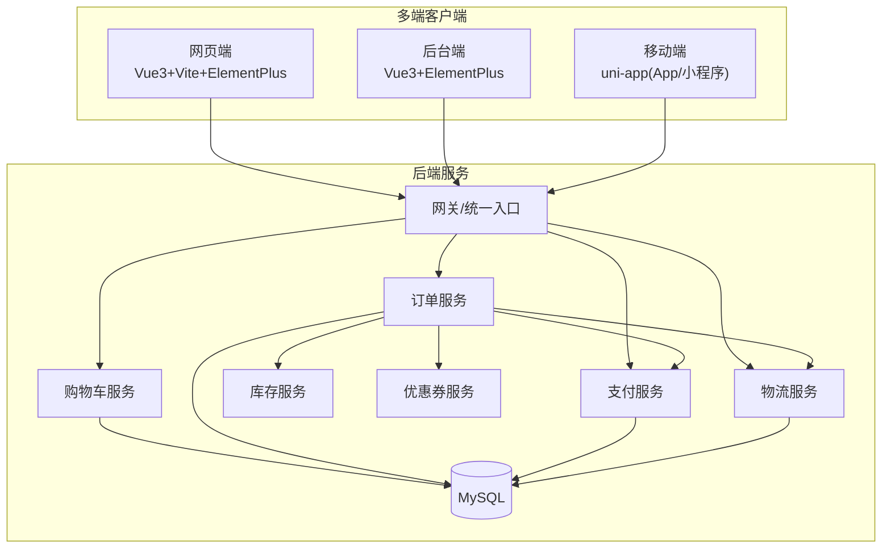
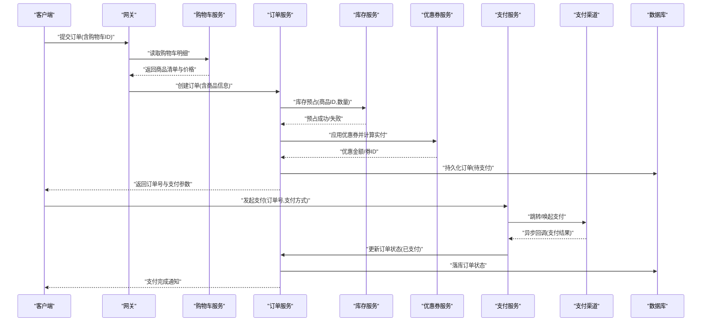
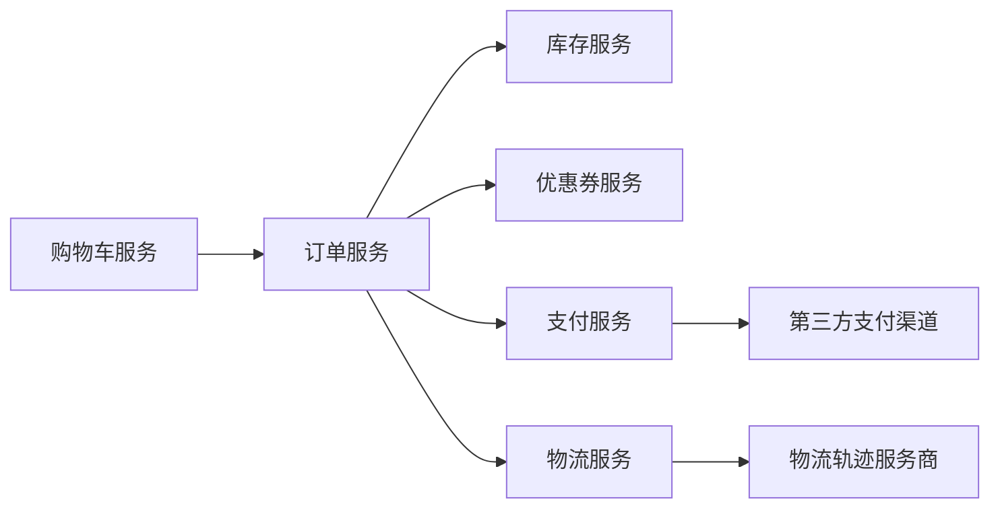
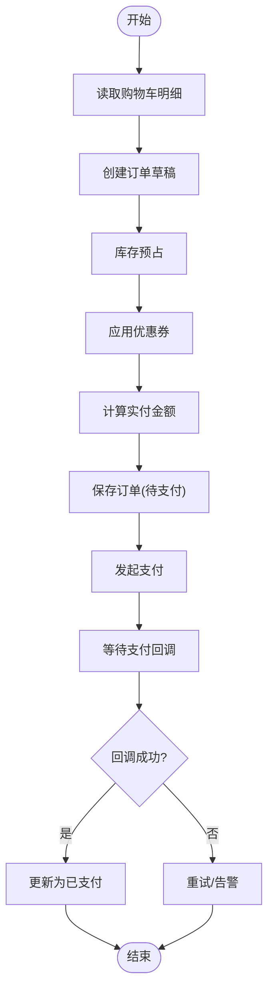

# 订单支付API

<cite>
**本文引用的文件**   
- [README.md](file://README.md)
</cite>

## 目录
1. [简介](#简介)
2. [项目结构](#项目结构)
3. [核心组件](#核心组件)
4. [架构总览](#架构总览)
5. [详细接口设计](#详细接口设计)
6. [依赖分析](#依赖分析)
7. [性能考虑](#性能考虑)
8. [故障排查指南](#故障排查指南)
9. [结论](#结论)
10. [附录](#附录)

## 简介
本文件面向“京东风格电商平台课程作业”的订单与支付域，提供一套完整的订单支付API接口文档。内容覆盖：
- 购物车管理：商品添加、数量修改、批量操作、购物车同步
- 订单创建：提交订单、价格计算、优惠券使用、库存预占
- 订单状态管理：查询、跟踪、取消、修改
- 支付集成：支付方式选择、发起支付、回调处理、退款
- 物流跟踪：物流公司选择、运单号管理、配送状态查询
- 业务流程示例、异常处理机制与事务一致性保证方案

说明：当前仓库为课程作业骨架，尚未包含后端实现代码；本文档基于技术栈（Spring Boot + MyBatis + MySQL）与通用电商实践进行系统化设计，便于后续落地开发。

章节来源
- [README.md:1-35](file://README.md#L1-L35)

## 项目结构
当前仓库为多端工程聚合根，后端采用 Spring Boot + MyBatis + MySQL，前端包括网页端、后台端与移动端。各端独立工程后续接入此仓库。

图表来源
- [README.md:18-24](file://README.md#L18-L24)

章节来源
- [README.md:1-35](file://README.md#L1-35)

## 核心组件
- 购物车服务：负责用户购物车项的增删改查、批量操作与跨端同步
- 订单服务：负责订单生命周期、价格计算、券核销、库存预占与释放、状态流转
- 支付服务：对接第三方支付渠道，处理支付发起、结果回调、对账与退款
- 库存服务：维护可售库存、预占与扣减、回滚
- 优惠券服务：校验券规则、计算优惠金额、记录核销
- 物流服务：管理承运商、运单号、轨迹与签收状态

章节来源
- [README.md:18-24](file://README.md#L18-L24)

## 架构总览
以下序列图展示“下单到支付完成”的关键调用链，体现跨服务协作与最终一致性策略。

图表来源
- [README.md:18-24](file://README.md#L18-L24)

## 详细接口设计

### 一、购物车管理接口
- 功能范围
  - 添加商品至购物车
  - 修改商品数量
  - 批量操作（批量删除、批量勾选、批量合并）
  - 购物车同步（跨端/跨会话）
- 典型请求/响应要点
  - 添加：需携带商品ID、规格ID、数量、来源端标识
  - 修改：需携带购物车项ID或唯一键、新数量
  - 批量：支持数组型操作指令
  - 同步：支持设备指纹/用户ID映射
- 幂等与一致性
  - 以“用户ID+商品ID+规格ID+来源端”作为幂等键
  - 高并发下通过乐观锁或分布式锁避免重复叠加
- 错误码建议
  - 商品不存在/下架
  - 库存不足
  - 数量越界
  - 同步冲突

章节来源
- [README.md:18-24](file://README.md#L18-L24)

### 二、订单创建流程接口
- 功能范围
  - 订单提交：从购物车生成订单草稿
  - 价格计算：基础价、运费、促销、优惠券、会员折扣
  - 优惠券使用：校验、锁定、核销
  - 库存预占：下单即预占，超时释放
- 关键步骤
  - 校验收货地址与配送范围
  - 冻结可用额度（如需要）
  - 写入订单主表与明细表
  - 返回支付参数
- 事务边界
  - 本地事务：订单主从表写入
  - 分布式补偿：库存预占失败则回滚订单草稿
- 错误码建议
  - 地址不可达
  - 优惠券不可用
  - 库存不足
  - 价格不一致

章节来源
- [README.md:18-24](file://README.md#L18-L24)

### 三、订单状态管理接口
- 功能范围
  - 订单查询：按订单号、用户ID、时间范围、状态筛选
  - 状态跟踪：获取状态机流转历史
  - 取消订单：未发货可取消，触发库存释放与券退回
  - 订单修改：仅允许在特定状态下修改收货信息、发票信息等
- 状态机要点
  - 待支付 → 已支付 → 配货中 → 已发货 → 已签收 → 已完成
  - 任意阶段可进入“已取消/已关闭”终态
- 并发控制
  - 状态变更使用版本号或CAS保证一致性
- 错误码建议
  - 订单不存在
  - 状态不允许操作
  - 修改字段不合法

章节来源
- [README.md:18-24](file://README.md#L18-L24)

### 四、支付集成接口
- 功能范围
  - 支付方式选择：列出可用渠道与限额
  - 发起支付：生成支付参数/二维码/唤起链接
  - 支付结果回调：第三方异步通知，幂等处理
  - 退款处理：全额/部分退款、原路退回
- 安全与合规
  - 签名验签、重放防护、敏感信息脱敏
  - 回调必须幂等且可重试
- 错误码建议
  - 支付渠道不可用
  - 金额超限
  - 回调签名失败
  - 退款失败

章节来源
- [README.md:18-24](file://README.md#L18-L24)

### 五、物流跟踪接口
- 功能范围
  - 物流公司选择：根据地址与时效匹配承运商
  - 运单号管理：绑定/解绑、批量导入
  - 配送状态查询：拉取轨迹、解析节点
- 数据模型要点
  - 运单号唯一性、轨迹去重、时区统一
- 错误码建议
  - 承运商不可用
  - 运单号无效
  - 轨迹拉取失败

章节来源
- [README.md:18-24](file://README.md#L18-L24)

## 依赖分析
- 服务间依赖
  - 订单服务依赖库存、优惠券、支付、物流服务
  - 购物车服务独立，供订单服务消费
- 外部依赖
  - 第三方支付渠道
  - 物流轨迹服务商
- 数据依赖
  - MySQL 存储订单、购物车、支付流水、物流轨迹等

图表来源
- [README.md:18-24](file://README.md#L18-L24)

章节来源
- [README.md:18-24](file://README.md#L18-L24)

## 性能考虑
- 缓存策略
  - 购物车热点数据缓存（Redis），写扩散与失效策略
  - 商品价格与促销规则缓存，短TTL配合事件刷新
- 限流与降级
  - 下单与支付接口限流，异常通道降级
- 异步化
  - 库存预占、券核销、物流下发采用消息队列异步处理
- 数据库优化
  - 读写分离、分库分表（订单按用户ID或时间分片）
  - 索引优化与慢查询治理

[本节为通用指导，无需源码引用]

## 故障排查指南
- 常见问题定位
  - 下单失败：检查库存预占、券校验、价格计算日志
  - 支付回调丢失：核对签名、幂等键、重试次数
  - 库存超卖：确认预占与扣减顺序、并发锁粒度
- 监控指标
  - 下单成功率、支付成功率、库存预占失败率、回调延迟
- 日志规范
  - 全链路TraceId贯穿，关键节点埋点

[本节为通用指导，无需源码引用]

## 结论
本文围绕订单与支付域，给出了端到端的API设计与流程方案，结合Spring Boot + MyBatis + MySQL技术栈，明确了服务职责、接口契约、一致性与容错策略。后续可在现有仓库基础上逐步落地具体实现。

[本节为总结性内容，无需源码引用]

## 附录

### A. 业务流程示例（下单到支付）
- 步骤
  - 客户端提交订单
  - 购物车服务返回明细
  - 订单服务创建订单并预占库存
  - 优惠券服务计算优惠
  - 支付服务发起支付
  - 支付渠道回调更新订单状态
- 一致性保障
  - 本地事务保证订单落库
  - 分布式补偿保证库存与券的最终一致
  - 幂等键保证回调与重试安全

图表来源
- [README.md:18-24](file://README.md#L18-L24)

### B. 异常处理与错误码约定
- 分类
  - 业务异常：库存不足、券不可用、地址不可达
  - 系统异常：超时、网络抖动、下游不可用
  - 安全异常：签名失败、权限不足
- 处理原则
  - 明确错误码与消息
  - 幂等与重试策略
  - 兜底与降级

[本节为通用指导，无需源码引用]

### C. 事务一致性保证方案
- 本地事务
  - 订单主从表写入在同一事务内
- 分布式一致性
  - 采用可靠消息+本地消息表或Saga模式
  - 库存预占失败则回滚订单草稿
  - 支付回调幂等更新订单状态
- 补偿任务
  - 定时扫描超时未支付订单，释放库存与券

[本节为通用指导，无需源码引用]