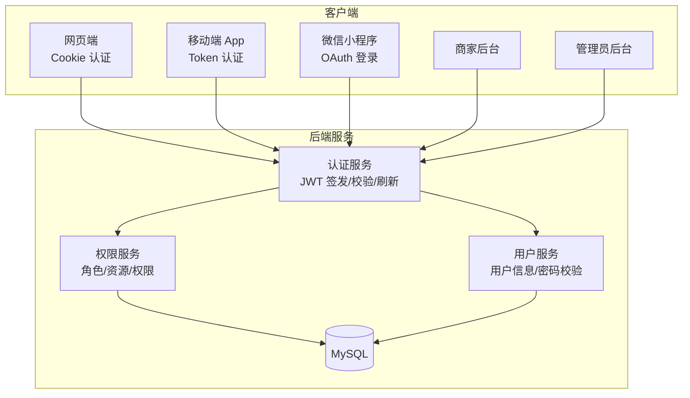
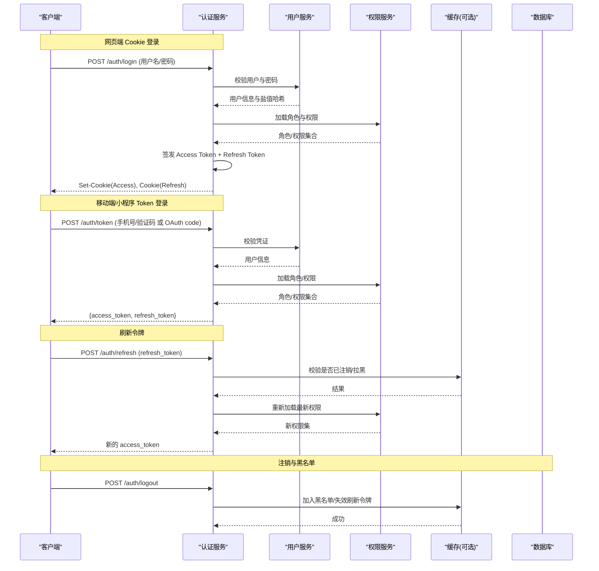
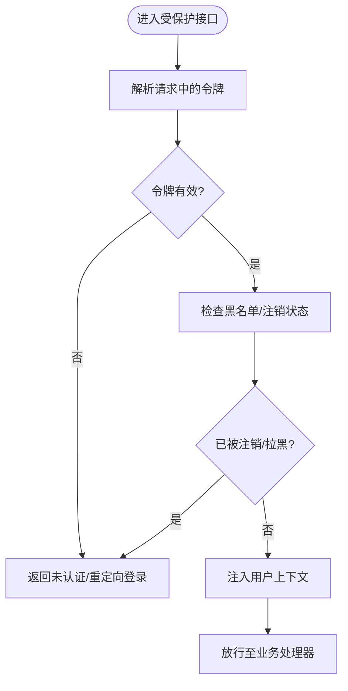
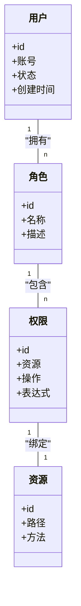
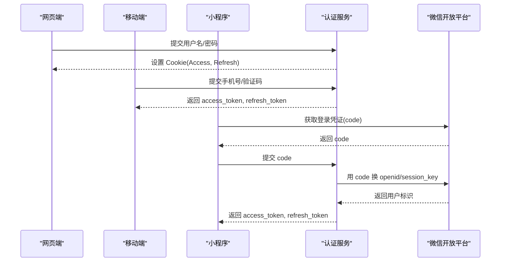
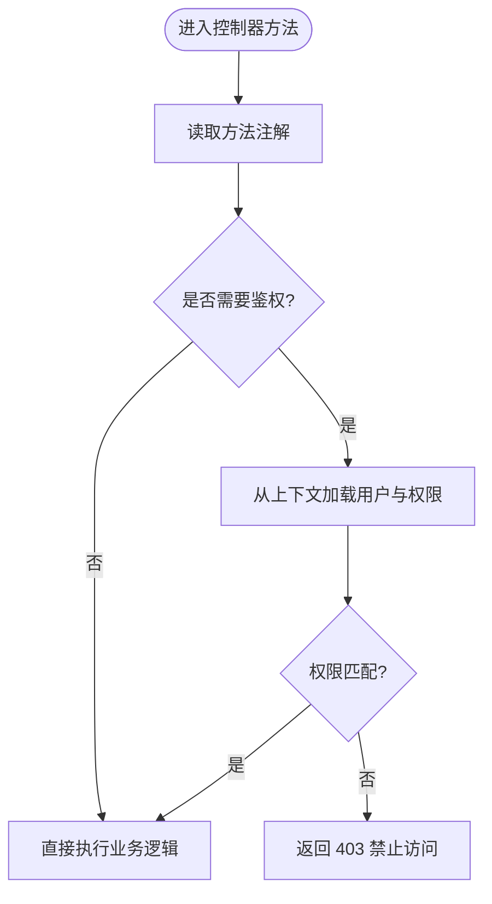
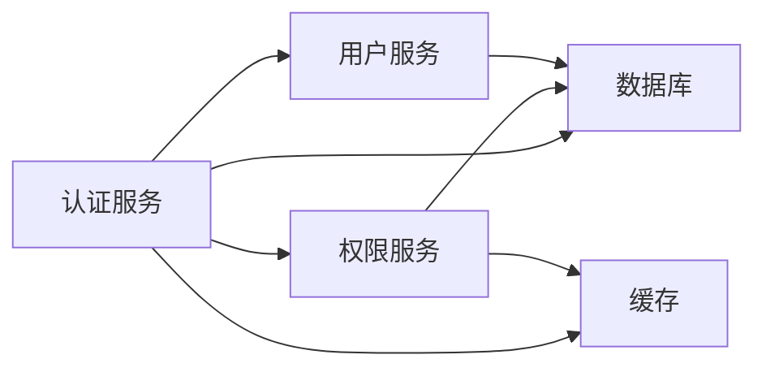

# 认证与授权

<cite>
**本文引用的文件**   
- [README.md](file://README.md)
</cite>

## 目录
1. [引言](#引言)
2. [项目结构](#项目结构)
3. [核心组件](#核心组件)
4. [架构总览](#架构总览)
5. [详细组件分析](#详细组件分析)
6. [依赖分析](#依赖分析)
7. [性能考虑](#性能考虑)
8. [故障排查指南](#故障排查指南)
9. [结论](#结论)
10. [附录](#附录)

## 引言
本文件面向多端电商平台（网页端、移动端 App、微信小程序、商家后台、管理员后台）的认证与授权机制，给出基于 JWT 的统一认证方案与角色权限体系设计。内容覆盖令牌生成、验证、刷新与过期处理；用户角色与访问控制策略；各端登录流程；接口级权限控制（注解式校验与动态权限管理）；安全最佳实践（密码加密存储、会话管理与安全防护）；以及可落地的实现要点与安全测试用例建议。

本项目为课程作业，后端技术栈为 Spring Boot + MyBatis + MySQL，前端与小程序采用 Vue 3、uni-app 等。由于当前仓库仅包含 README 与文档说明，未包含具体代码实现，本文以“设计与规范”为主，提供可直接指导工程落地的方案与流程图示。

**章节来源**
- [README.md:1-35](file://README.md#L1-L35)

## 项目结构
从 README 可知，该项目为多端电商平台的统一后端仓库，后续将接入：
- 用户网页端（Vue 3 + Vite + Element Plus）
- 后台端（Vue 3 + Element Plus）
- 移动端（uni-app，支持 App 与微信小程序）
- 商家后台与管理员后台

认证与授权作为跨端通用能力，应沉淀在后端公共模块中，通过统一的 API 网关/拦截器进行鉴权，配合数据库中的用户、角色、权限表完成细粒度控制。

[此图为概念性架构图，不直接映射到具体源码文件]

**章节来源**
- [README.md:18-24](file://README.md#L18-L24)

## 核心组件
围绕认证与授权，建议在后端构建以下核心组件：
- 认证服务（Authentication Service）
  - 负责登录校验、JWT 签发、刷新、注销、黑名单与过期处理
- 权限服务（Authorization/RBAC Service）
  - 负责角色与权限模型、资源映射、动态权限加载与缓存
- 用户服务（User Service）
  - 负责用户注册、登录凭证校验、密码加密存储、账户状态管理
- 网关/拦截器（Gateway/Interceptor）
  - 负责请求入口的 Token 解析、签名校验、上下文注入、注解式鉴权执行
- 配置中心（Security Config）
  - 集中管理密钥、算法、过期时间、白名单、跨域与安全头

上述组件通过 RESTful API 暴露给各端应用，并通过数据库持久化用户、角色、权限数据。

**章节来源**
- [README.md:18-24](file://README.md#L18-L24)

## 架构总览
下图展示多端登录与鉴权的端到端流程，涵盖 Cookie、Token、OAuth 三种模式，并体现 JWT 生命周期与刷新策略。

**图示来源**
- [README.md:18-24](file://README.md#L18-L24)

## 详细组件分析

### JWT 令牌认证（生成、验证、刷新、过期）
- 令牌结构
  - Access Token：短期有效，携带用户标识、角色与必要声明，用于接口鉴权
  - Refresh Token：长期有效，用于无感刷新 Access Token，建议服务端记录与撤销
- 生成流程
  - 登录成功后，根据用户信息与权限集签发 Access Token 与 Refresh Token
  - 网页端将 Access Token 写入 HttpOnly Cookie，Refresh Token 可独立 Cookie 或本地存储
  - 移动端/小程序返回 JSON 中的 token 字段
- 验证流程
  - 网关/拦截器解析 Token，校验签名、有效期、发行者、受众等
  - 从缓存读取黑名单/注销标记，拒绝已失效令牌
  - 将用户上下文注入请求，供业务层使用
- 刷新流程
  - 客户端在 Access Token 即将过期前调用刷新接口
  - 服务端校验 Refresh Token 有效性、是否被撤销、是否匹配原会话
  - 校验通过后签发新 Access Token，必要时更新权限集
- 过期处理
  - Access Token 过期：引导刷新或重新登录
  - Refresh Token 过期：强制重新登录
  - 注销：将 Refresh Token 加入黑名单，清除相关会话

**章节来源**
- [README.md:18-24](file://README.md#L18-L24)

### 用户角色与权限体系（RBAC）
- 角色定义
  - 普通用户：浏览商品、下单、查看订单、评价等
  - 商家：店铺管理、商品上下架、订单处理、营销工具等
  - 管理员：平台运营、用户管理、系统配置、审计日志等
- 权限模型
  - 资源（Resource）：如 /api/products、/api/orders
  - 操作（Action）：如 read、write、delete
  - 权限（Permission）：资源+操作的组合，如 products:read
  - 角色（Role）：一组权限的集合
- 访问控制策略
  - 注解式：在控制器方法上标注所需权限，由拦截器自动校验
  - 动态权限：权限变更即时生效，结合缓存与黑名单机制保证一致性
  - 最小权限原则：默认拒绝，显式授予

**图示来源**
- [README.md:18-24](file://README.md#L18-L24)

### 各端认证流程
- 网页端（Cookie 认证）
  - 登录成功后设置 HttpOnly Cookie（Access Token），Refresh Token 单独存放
  - 前端自动携带 Cookie 发起请求，后端拦截器校验
  - 刷新时调用刷新接口，服务端更新 Cookie
- 移动端（Token 认证）
  - 登录成功后返回 access_token 与 refresh_token
  - 客户端在请求头携带 Authorization: Bearer <token>
  - 过期时调用刷新接口获取新 token
- 小程序（OAuth 登录）
  - 通过微信登录码换取 openid/session_key
  - 后端校验第三方凭证，签发内部 JWT
  - 返回 token 供后续请求使用

**图示来源**
- [README.md:18-24](file://README.md#L18-L24)

### 接口级权限控制（注解式与动态管理）
- 注解式校验
  - 在控制器方法上使用自定义注解声明所需权限，如 @RequirePermission("products:read")
  - 拦截器在执行方法前解析注解，比对当前用户权限集
- 动态权限管理
  - 权限变更实时生效：刷新权限缓存、对受影响会话下发新权限集
  - 支持条件表达式（如 IP 白名单、时间段、租户隔离）
- 常见注解示例（概念）
  - @Anonymous：允许匿名访问
  - @Authenticated：需登录
  - @RequireRole("ADMIN")：需管理员角色
  - @RequirePermission("orders:write")：需指定权限

**章节来源**
- [README.md:18-24](file://README.md#L18-L24)

### 安全最佳实践
- 密码加密存储
  - 使用强哈希算法（如 BCrypt/Argon2），每次加密带随机盐
  - 禁止明文存储与弱哈希（MD5/SHA1）
- 会话管理
  - 短生命周期 Access Token + 长生命周期 Refresh Token
  - 注销时将 Refresh Token 加入黑名单，支持主动踢出
  - 并发登录限制与设备指纹绑定（可选）
- 安全防护措施
  - 全链路 HTTPS、严格 CORS 策略、安全响应头（HSTS、X-Frame-Options）
  - 输入校验与输出编码，防 XSS/SQL 注入
  - 速率限制与异常登录检测，防暴力破解
  - 敏感参数脱敏与审计日志

[本节为通用安全建议，不直接分析具体文件]

### 实现要点与参考位置
- 认证服务
  - 登录、签发、刷新、注销、黑名单管理
  - 参考路径：认证服务实现
- 权限服务
  - 角色/权限模型、动态加载、缓存策略
  - 参考路径：权限服务实现
- 用户服务
  - 密码加密、账户状态、第三方登录对接
  - 参考路径：用户服务实现
- 网关/拦截器
  - Token 解析、签名校验、上下文注入、注解式鉴权
  - 参考路径：安全配置与拦截器实现
- 数据库设计
  - 用户、角色、权限、资源、关联表
  - 参考路径：数据模型与迁移脚本

[本节为落地指引，不直接分析具体文件]

## 依赖分析
认证与授权模块与后端其他服务的依赖关系如下：
- 认证服务依赖用户服务（凭证校验）、权限服务（角色/权限）、缓存（黑名单/会话）、数据库（持久化）
- 权限服务依赖数据库与缓存（高频读取）
- 用户服务依赖数据库与可能的第三方服务（短信/邮箱/微信）

**图示来源**
- [README.md:18-24](file://README.md#L18-L24)

**章节来源**
- [README.md:18-24](file://README.md#L18-L24)

## 性能考虑
- 令牌校验尽量走内存与缓存，减少数据库压力
- 权限集缓存与懒加载，避免每次请求都查询数据库
- 批量刷新与幂等设计，防止刷新风暴
- 合理设置令牌过期时间与刷新窗口，平衡安全与体验
- 限流与熔断保护关键接口（登录、刷新、注销）

[本节为通用性能建议，不直接分析具体文件]

## 故障排查指南
- 常见问题
  - 401 未认证：检查 Token 是否存在、是否过期、签名是否一致
  - 403 禁止访问：检查用户权限是否包含所需权限
  - 刷新失败：检查 Refresh Token 是否有效、是否被注销/拉黑
  - 跨域问题：检查 CORS 配置与安全头
- 定位步骤
  - 开启调试日志，打印 Token 解析与权限匹配过程
  - 检查黑名单与缓存一致性
  - 核对数据库角色/权限配置与注解声明是否匹配
- 恢复手段
  - 清理黑名单/缓存对应键
  - 重置用户权限或临时提升权限
  - 重启服务后重试

**章节来源**
- [README.md:18-24](file://README.md#L18-L24)

## 结论
本文给出了多端电商平台的统一认证与授权设计方案，涵盖 JWT 令牌生命周期、RBAC 权限模型、各端登录流程、注解式与动态权限控制，以及安全与性能最佳实践。该方案可在 Spring Boot + MyBatis + MySQL 技术栈下快速落地，并为后续接入网页端、移动端与小程序提供一致的鉴权基础。

[本节为总结性内容，不直接分析具体文件]

## 附录

### 安全测试用例建议
- 登录与令牌
  - 正确凭证登录，返回有效 Access/Refresh Token
  - 错误凭证登录，返回未认证错误
  - Access Token 过期后刷新成功
  - Refresh Token 过期后强制重新登录
  - 注销后旧 Refresh Token 不可再用
- 权限控制
  - 无权限访问受限接口返回 403
  - 具备所需权限访问成功
  - 动态修改权限后立即生效
- 安全加固
  - 暴力破解防护（频率限制）
  - XSS/SQL 注入防护（输入校验与参数化查询）
  - 跨域与敏感头配置正确
  - 日志脱敏与审计记录完整

[本节为测试建议，不直接分析具体文件]