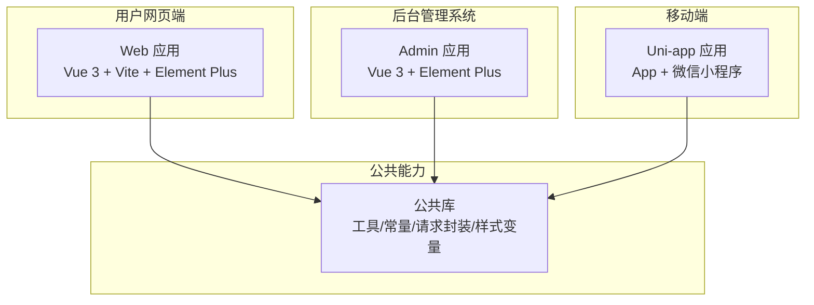
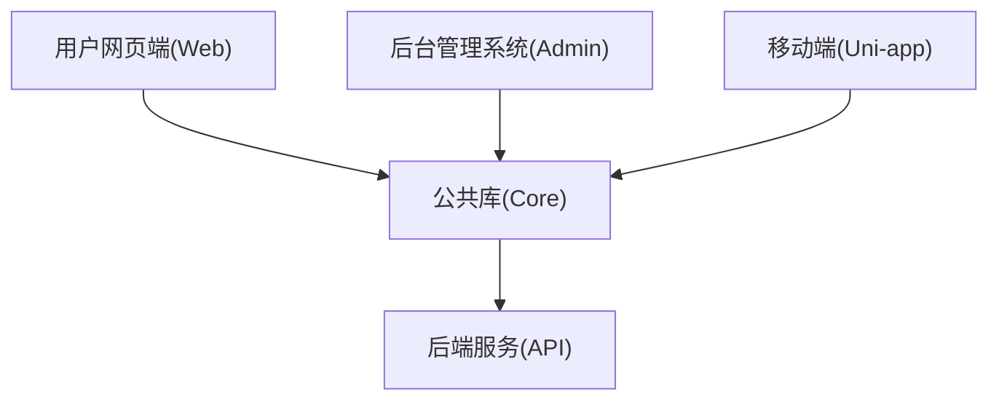
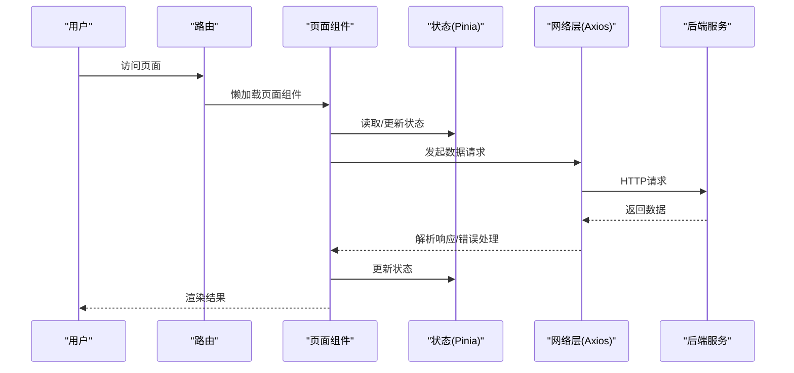
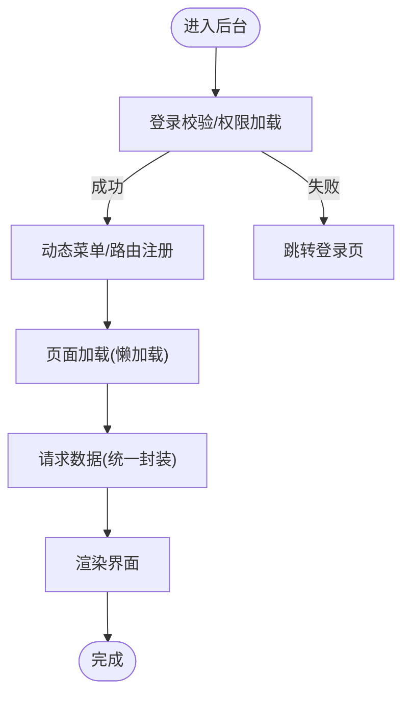
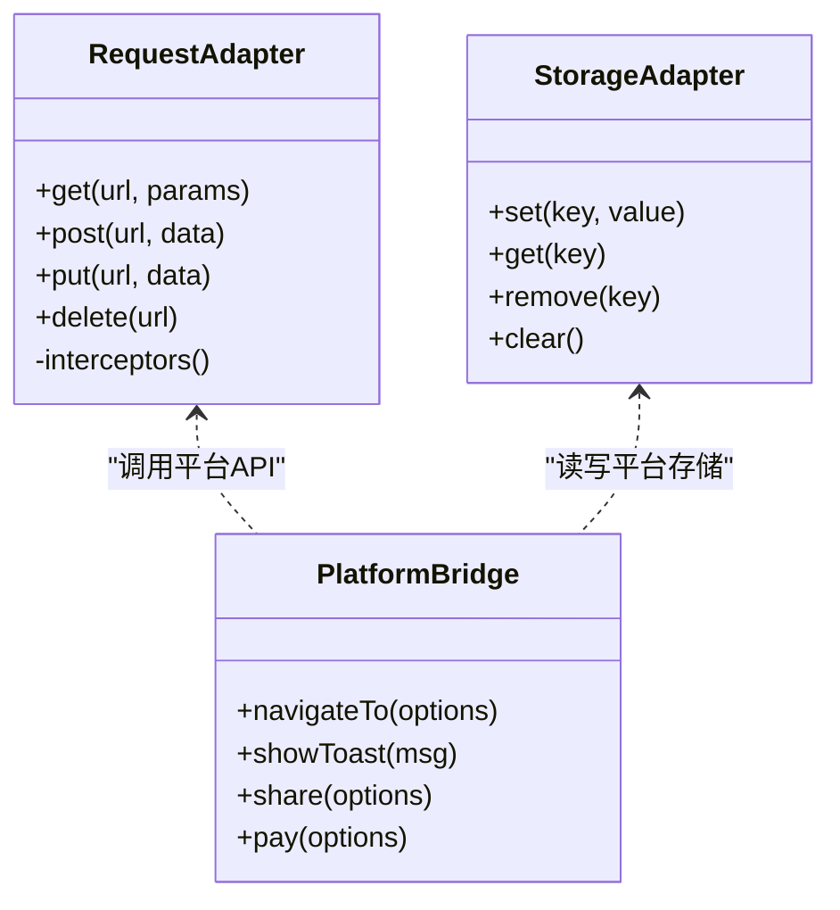
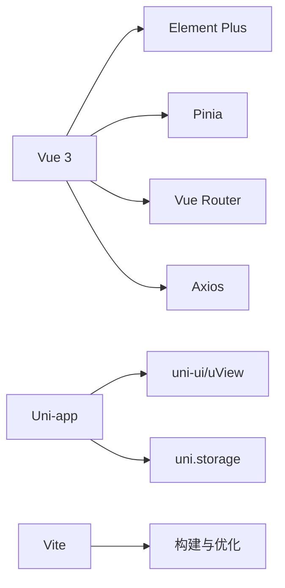

# 前端架构设计

<cite>
**本文档引用的文件**
- [README.md](file://README.md)
</cite>

## 目录
1. [引言](#引言)
2. [项目结构](#项目结构)
3. [核心组件](#核心组件)
4. [架构总览](#架构总览)
5. [详细组件分析](#详细组件分析)
6. [依赖分析](#依赖分析)
7. [性能考虑](#性能考虑)
8. [故障排查指南](#故障排查指南)
9. [结论](#结论)
10. [附录](#附录)

## 引言
本项目为“京东风格电商平台”的课程作业，目标是一套覆盖用户网页端、App、小程序、商家后台和管理员后台的多端电商平台。根据项目说明，前端技术栈如下：
- 用户网页端：Vue 3 + Vite + Element Plus
- 后台端：Vue 3 + Element Plus
- 移动端：uni-app（App + 微信小程序）

本架构设计文档围绕上述技术栈，给出多端统一的前端工程化与组件化策略，包括项目组织、状态管理、跨平台复用、构建优化、UI定制与二次封装规范，以及性能优化与打包策略。

## 项目结构
考虑到多端并行的特点，建议采用“按端拆分、公共能力下沉”的目录组织方式：
- 用户网页端（Web）：独立Vite工程，面向浏览器环境，使用Vue 3 + Vite + Element Plus
- 后台管理系统（Admin）：独立Vite工程，面向浏览器环境，使用Vue 3 + Element Plus
- 移动端（Uni-app）：独立工程，同时编译到App与微信小程序，通过条件编译与平台API适配实现双端兼容
- 公共库（可选）：将通用工具函数、业务常量、请求封装、样式变量等抽离为内部包，供各端引用

[此图为概念性结构示意，不直接映射具体源码文件]

## 核心组件
- 路由与导航
  - Web/Admin：基于Vue Router进行页面级路由与权限控制
  - Uni-app：基于pages.json与原生tabBar或自定义导航
- 状态管理
  - Web/Admin：Pinia作为全局状态容器，结合持久化插件实现关键状态本地缓存
  - Uni-app：Pinia或Vuex（推荐Pinia），结合uni.storage做轻量持久化
- 网络请求
  - 统一封装Axios实例，提供拦截器处理鉴权、错误码、重试与超时
  - 针对小程序端使用uni.request或wx.request时，提供适配器层屏蔽差异
- UI组件体系
  - 基于Element Plus进行主题定制与二次封装，沉淀业务基础组件
  - 在Uni-app侧使用uView或uni-ui，并通过抽象层对齐交互语义
- 国际化与无障碍
  - i18n支持中英文切换；可逐步引入无障碍增强
- 日志与监控
  - 前端埋点、错误上报、性能指标采集（首屏时间、接口耗时等）

**章节来源**
- [README.md:19-23](file://README.md#L19-L23)

## 架构总览
整体采用“多端并行 + 公共能力下沉”的架构模式：
- 多端并行：Web、Admin、Uni-app各自独立工程，保证发布节奏与稳定性
- 公共能力下沉：将通用逻辑抽取为内部包，减少重复代码，提升一致性
- 统一规范：统一的代码规范、提交规范、分支策略与协作流程

[此图为概念性结构示意，不直接映射具体源码文件]

## 详细组件分析

### 用户网页端（Web）
- 技术栈：Vue 3 + Vite + Element Plus
- 工程化要点：
  - 使用Vite进行开发与构建，开启按需加载与分包
  - 路由懒加载、组件异步加载、图片懒加载
  - 环境变量区分开发/测试/生产
- 组件化原则：
  - 原子组件（按钮、输入框等）由Element Plus提供
  - 复合组件（搜索栏、分页、表格扩展）基于Element Plus二次封装
  - 页面组件按功能域划分，保持单一职责
- 状态管理：
  - Pinia模块按领域划分（用户、商品、订单、购物车等）
  - 关键状态持久化至localStorage/sessionStorage
- 网络层：
  - Axios实例统一配置baseURL、超时、重试、错误提示
  - 请求/响应拦截器注入token、刷新token、统一错误处理

[此图为概念性流程图，不直接映射具体源码文件]

### 后台管理系统（Admin）
- 技术栈：Vue 3 + Element Plus
- 工程化要点：
  - 与Web端类似，但更强调权限控制、菜单动态生成、操作审计
- 组件化原则：
  - 表单、表格、弹窗等高频场景统一封装
  - 权限指令与组件（如v-permission）控制展示与操作
- 状态管理：
  - 用户信息、权限树、菜单、系统配置集中管理
- 网络层：
  - 与Web端保持一致的请求封装，便于统一维护

[此图为概念性流程图，不直接映射具体源码文件]

### 移动端（Uni-app）
- 技术栈：uni-app（App + 微信小程序）
- 跨平台适配策略：
  - 条件编译：使用 #ifdef MP-WEIXIN / #ifdef APP-PLUS 等平台宏隔离差异
  - API适配层：对导航、存储、支付、分享等能力进行统一封装
  - 样式适配：使用rpx与媒体查询，确保不同屏幕尺寸一致体验
- 组件化原则：
  - 基础组件优先使用uni-ui/uView，复杂业务组件自研
  - 页面按模块划分，避免单文件过大
- 状态管理：
  - Pinia/Vuex + uni.storage持久化
- 网络层：
  - 统一封装request方法，自动处理token、错误码、重试与降级

[此图为概念性类图，不直接映射具体源码文件]

## 依赖分析
- 前端框架与UI库
  - Vue 3：组合式API、响应式、生命周期
  - Element Plus：企业级组件库，按需引入减少体积
  - Uni-app生态：uni-ui/uView、平台API
- 构建与工程化
  - Vite：快速冷启动、按需热更新、插件生态
  - TypeScript（可选）：类型安全与更好的IDE体验
- 状态与网络
  - Pinia：轻量状态管理
  - Axios：HTTP客户端
- 其他
  - 国际化、图表、富文本、加密等按需引入

[此图为概念性依赖图，不直接映射具体源码文件]

## 性能考虑
- 构建与打包优化
  - 启用Vite按需加载与Tree Shaking
  - 资源压缩（图片、字体、CSS、JS）
  - 分包与预加载策略，合理设置chunk大小
- 运行时优化
  - 路由懒加载、组件异步加载
  - 列表虚拟滚动、图片懒加载与占位
  - 防抖节流、事件去重
- 缓存机制
  - 静态资源CDN与版本化
  - 接口数据缓存（短期）与离线能力（弱网降级）
  - 本地存储分级（session/local/storage）
- 监控与度量
  - 首屏时间、白屏时间、长任务统计
  - 接口成功率、慢请求占比、错误率

[本节为通用指导，不直接分析具体文件]

## 故障排查指南
- 常见问题定位
  - 构建失败：检查Node版本、依赖冲突、别名路径
  - 运行时错误：查看控制台与错误上报，定位组件/接口问题
  - 跨端差异：使用条件编译与平台API适配层隔离差异
- 调试技巧
  - 开发环境开启Source Map
  - 使用浏览器开发者工具与Vue Devtools
  - 小程序端使用微信开发者工具的调试面板
- 回滚与灰度
  - 发布前进行自动化测试与冒烟验证
  - 灰度发布与快速回滚策略

[本节为通用指导，不直接分析具体文件]

## 结论
本项目采用多端并行与公共能力下沉的架构模式，以Vue 3 + Vite + Element Plus为核心，结合Pinia与Axios构建稳定高效的前端体系。通过组件化、工程化与性能优化策略，保障用户体验与交付效率。后续可在TypeScript、微前端、可视化监控等方面持续演进。

[本节为总结性内容，不直接分析具体文件]

## 附录
- 协作规范与分支策略
  - main为稳定分支，develop为日常集成分支
  - feature/<模块>-<简述>分支开发，PR合并
- 团队共享配置
  - .qoder/skills/.qoder/rules/.qoder/mcps用于团队协作与规则约束

**章节来源**
- [README.md:25-31](file://README.md#L25-L31)
- [README.md:12-16](file://README.md#L12-L16)