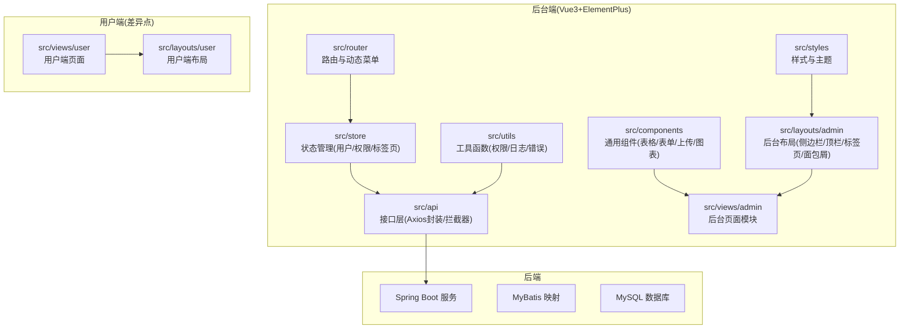
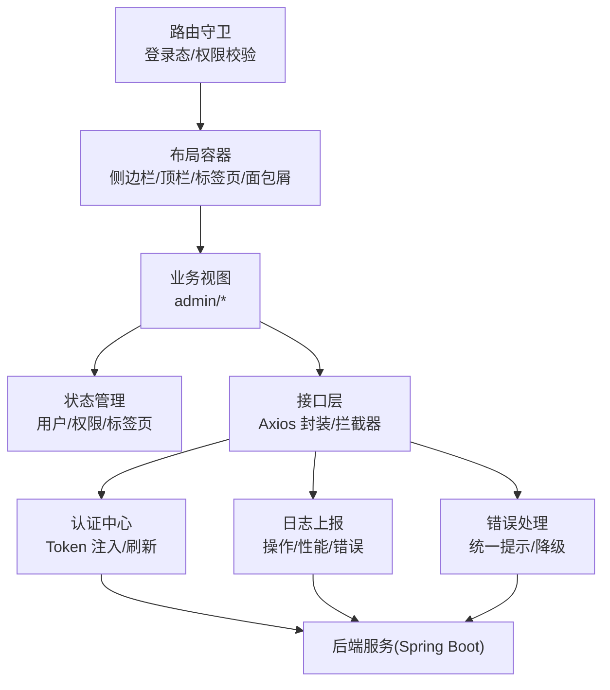
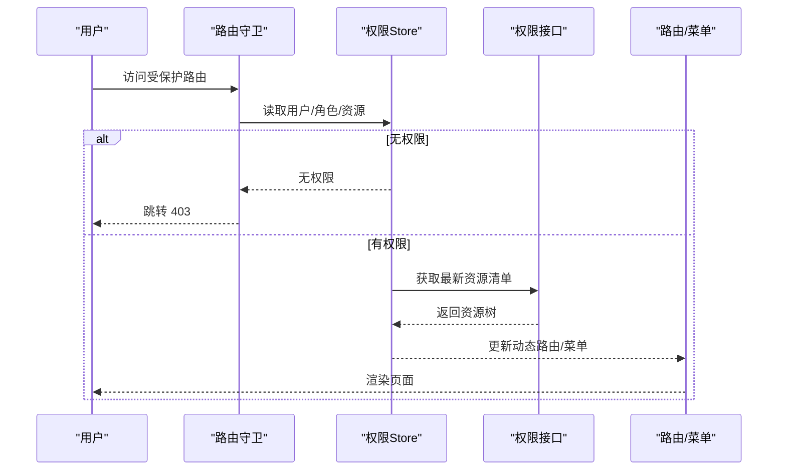
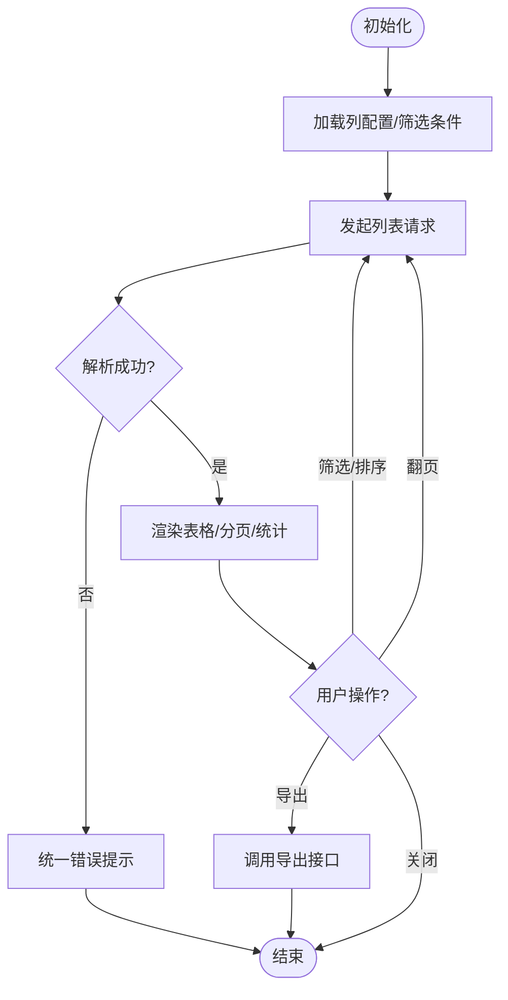
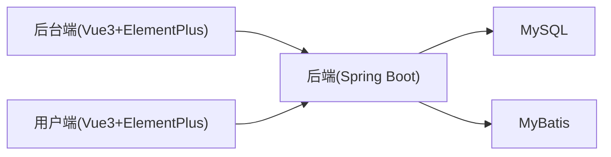

# 后台管理系统架构设计

<cite>
**本文引用的文件**   
- [README.md](file://README.md)
</cite>

## 目录
1. [引言](#引言)
2. [项目结构](#项目结构)
3. [核心组件](#核心组件)
4. [架构总览](#架构总览)
5. [详细组件分析](#详细组件分析)
6. [依赖分析](#依赖分析)
7. [性能考虑](#性能考虑)
8. [故障排查指南](#故障排查指南)
9. [结论](#结论)
10. [附录](#附录)

## 引言
本设计文档面向基于 Vue 3 + Element Plus 的后台管理系统前端，目标是提供一套可复用、可扩展、易维护的架构方案。结合仓库中“技术栈”与“协作规范”信息，本文从项目结构特点（与用户端差异化）、权限控制体系（菜单/按钮/数据权限）、通用表格与表单封装、文件上传与图表展示、多标签页与面包屑导航、操作日志与异常处理等方面给出完整的设计说明与实践建议，帮助团队快速落地并统一开发体验。

## 项目结构
本项目为多端电商平台的组成部分之一，后端采用 Spring Boot + MyBatis + MySQL；用户网页端与后台端均采用 Vue 3 + Element Plus，移动端使用 uni-app。仓库当前仅包含 README 与共享配置说明，各端工程后续接入。因此，本文在保持与仓库一致的前提下，提出后台端的前端工程结构与组织方式建议，确保与用户端形成清晰边界与差异化能力。

图示来源
- [README.md:18-23](file://README.md#L18-L23)

章节来源
- [README.md:18-23](file://README.md#L18-L23)

## 核心组件
围绕后台高频场景，建议将以下通用能力沉淀为独立模块或组件，以提升复用性与一致性：
- 权限控制
  - 菜单权限：根据角色/资源动态生成路由与侧边栏
  - 按钮权限：指令或高阶组件控制可见/禁用
  - 数据权限：按租户/部门/范围过滤列表与详情
- 数据表格
  - 统一分页、筛选、排序、列配置、导出、批量操作
- 表单
  - 统一校验规则、动态字段、联动、提交防抖与重试
- 文件上传
  - 分片/断点续传、预览、压缩、进度与失败重试
- 图表
  - 统一主题、响应式、懒加载、缓存与降级
- 多标签页与面包屑
  - 标签页增删、刷新、持久化；面包屑与路由同步
- 日志与异常
  - 操作日志上报、全局错误捕获、友好提示与埋点

章节来源
- [README.md:18-23](file://README.md#L18-L23)

## 架构总览
后台端整体遵循“布局-路由-状态-接口-组件”的分层思路，通过 Axios 拦截器统一鉴权与错误处理，通过 store 集中管理用户、权限与标签页状态，通过通用组件提升页面开发效率。

图示来源
- [README.md:18-23](file://README.md#L18-L23)

## 详细组件分析

### 权限控制体系
- 菜单权限
  - 实现要点：登录后拉取用户角色与资源清单，构建白名单路由表；侧边栏根据当前用户权限渲染；未授权路由重定向至 403。
  - 与用户端差异：用户端通常无需复杂角色/资源模型，后台端需支持细粒度资源与层级菜单。
- 按钮权限
  - 实现要点：自定义指令 v-permission 或高阶组件包裹，依据资源标识控制显示/禁用；对危险操作增加二次确认。
- 数据权限
  - 实现要点：请求前根据用户上下文注入查询条件（如 tenant_id、dept_id）；列表接口返回时进行二次过滤；详情页做行级权限校验。

图示来源
- [README.md:18-23](file://README.md#L18-L23)

章节来源
- [README.md:18-23](file://README.md#L18-L23)

### 数据表格通用封装
- 能力清单
  - 分页、搜索、排序、列显隐、固定列、虚拟滚动、批量选择、导出、空态与骨架屏
- 设计要点
  - 以 props 暴露基础能力，插槽扩展自定义列与操作区；内部统一封装请求参数与结果解析；对外暴露 refresh、export、reset 等方法
- 与用户端差异
  - 用户端表格更偏展示与轻量交互；后台端强调高并发、大数据量与复杂筛选

图示来源
- [README.md:18-23](file://README.md#L18-L23)

章节来源
- [README.md:18-23](file://README.md#L18-L23)

### 表单通用封装
- 能力清单
  - 动态字段、联动、异步校验、分组折叠、步骤条、提交防抖与重试、撤销/恢复
- 设计要点
  - 以 JSON Schema 驱动表单结构；内置常用校验器；支持局部更新与批量提交；对长表单提供自动保存草稿
- 与用户端差异
  - 用户端表单偏简单注册/下单流程；后台端表单复杂度高、容错要求强

章节来源
- [README.md:18-23](file://README.md#L18-L23)

### 文件上传
- 能力清单
  - 拖拽、分片、断点续传、预览、压缩、转码、进度与失败重试、批量上传
- 设计要点
  - 统一上传策略（直传/中转）；大文件走分片与 MD5 秒传；图片自动压缩与水印；失败任务队列与可视化重试
- 与用户端差异
  - 用户端多为头像/商品图；后台端涉及报表、批量导入导出等大批量场景

章节来源
- [README.md:18-23](file://README.md#L18-L23)

### 图表展示
- 能力清单
  - 主题切换、响应式、懒加载、数据缓存、导出图片、错误降级
- 设计要点
  - 统一图表容器与尺寸适配；按需引入图表库；大数据集采用采样/聚合；离线/弱网降级为静态占位
- 与用户端差异
  - 用户端图表偏营销看板；后台端强调精确性、可交互与可导出

章节来源
- [README.md:18-23](file://README.md#L18-L23)

### 多标签页与面包屑导航
- 多标签页
  - 新增/关闭/刷新/右键菜单；去重与最大数量限制；本地持久化；跨路由保留状态
- 面包屑
  - 与路由元信息绑定；支持手动设置与自动生成；点击跳转与层级展开
- 与用户端差异
  - 用户端通常为单页应用；后台端需要多标签并行工作流

章节来源
- [README.md:18-23](file://README.md#L18-L23)

### 操作日志与异常处理
- 操作日志
  - 关键操作埋点（谁、何时、何地、做了什么、结果）；异步上报；敏感信息脱敏；与审计系统对接
- 异常处理
  - 全局错误捕获（网络/语法/业务）；统一错误码映射；友好提示与重试；错误上报与告警
- 与用户端差异
  - 用户端侧重用户体验；后台端侧重可追溯与可观测

章节来源
- [README.md:18-23](file://README.md#L18-L23)

## 依赖分析
- 前端技术栈
  - Vue 3 + Element Plus（后台端与用户端共用）
- 后端技术栈
  - Spring Boot + MyBatis + MySQL
- 协作规范
  - main 稳定分支、develop 日常集成；feature 分支命名；PR 合并

图示来源
- [README.md:18-23](file://README.md#L18-L23)

章节来源
- [README.md:18-23](file://README.md#L18-L23)

## 性能考虑
- 路由与组件懒加载，首屏体积优化
- 列表虚拟滚动与分页预取
- 图表按需加载与数据缓存
- 上传分片与并发控制
- 全局错误与日志上报的节流与批处理
- 静态资源 CDN 与缓存策略

[本节为通用指导，不直接分析具体文件]

## 故障排查指南
- 常见问题定位
  - 权限问题：检查路由守卫、资源清单与按钮权限指令
  - 列表异常：核对分页参数、筛选条件与后端返回结构
  - 上传失败：查看分片/续传状态、网络与重试队列
  - 图表空白：检查数据源、主题与降级逻辑
- 日志与监控
  - 开启调试模式，查看浏览器控制台与网络面板
  - 上报错误堆栈与上下文，便于复现与修复

[本节为通用指导，不直接分析具体文件]

## 结论
本设计在仓库既定的技术栈与协作规范基础上，给出了后台管理系统前端的系统化架构方案。通过清晰的工程分层、完善的权限体系、通用组件沉淀以及统一的日志与异常处理，可有效提升后台端开发效率与稳定性，并与用户端形成明确的能力边界与差异化体验。

[本节为总结性内容，不直接分析具体文件]

## 附录
- 术语
  - 菜单权限：控制路由与侧边栏可见性
  - 按钮权限：控制操作按钮的显示与可用状态
  - 数据权限：控制数据访问范围与行级可见性
- 参考
  - 仓库 README 中的技术栈与协作规范

[本节为补充说明，不直接分析具体文件]