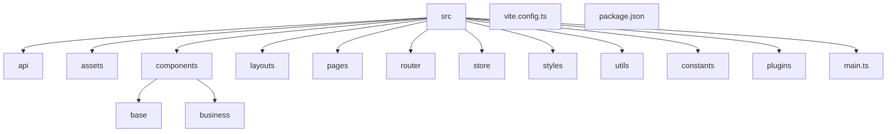
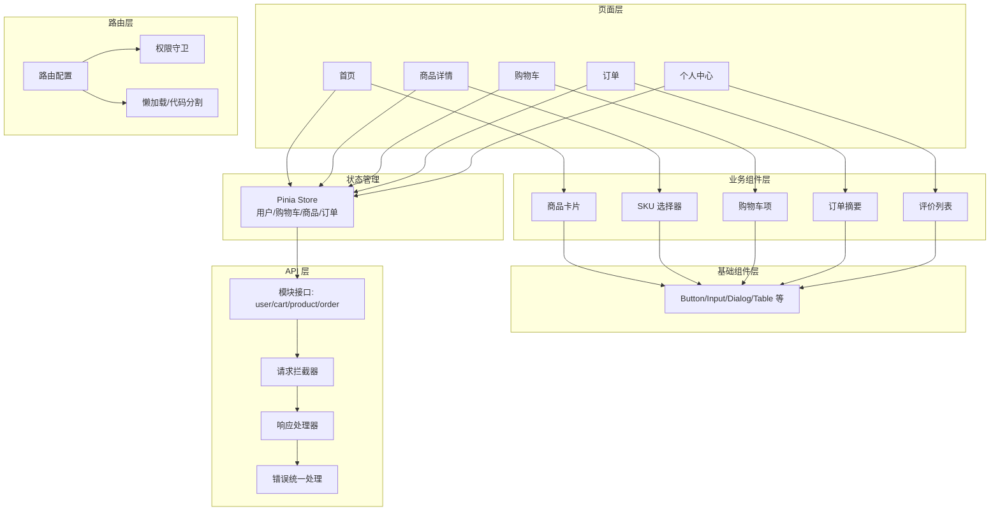
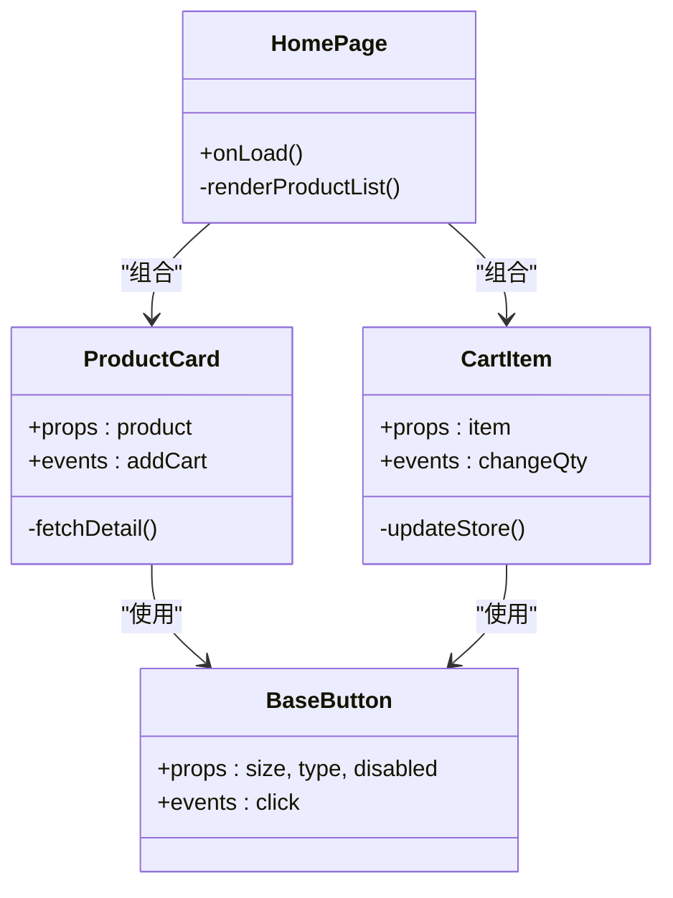
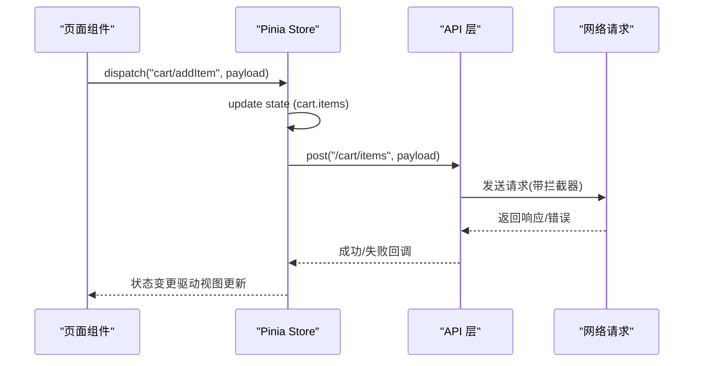
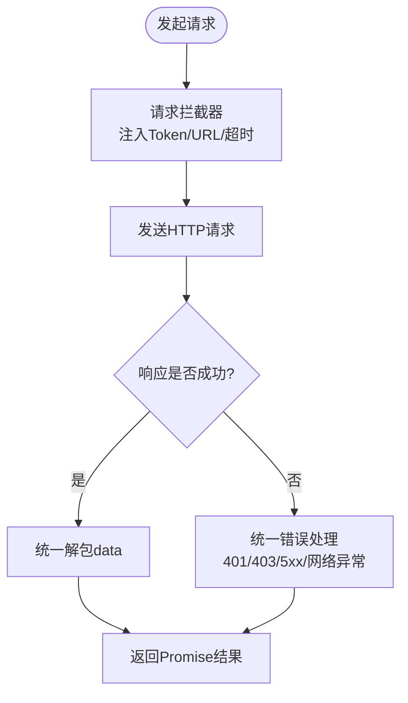
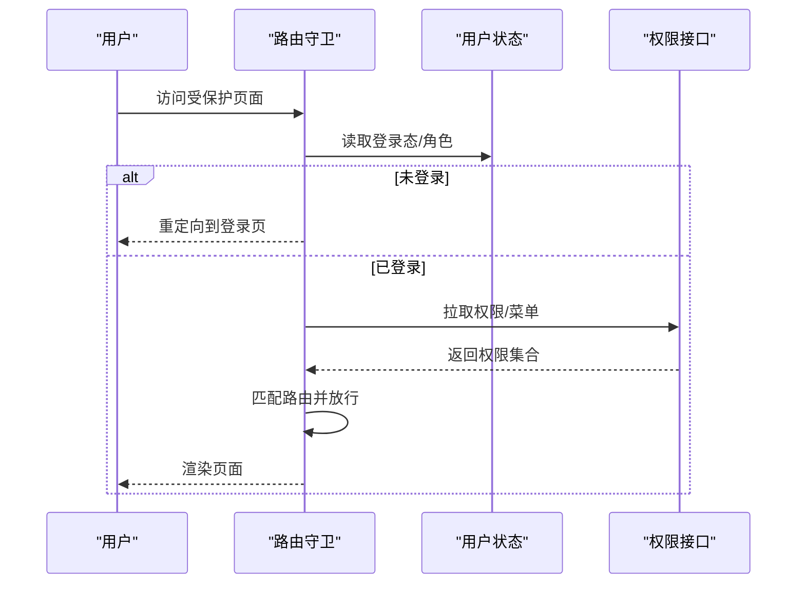
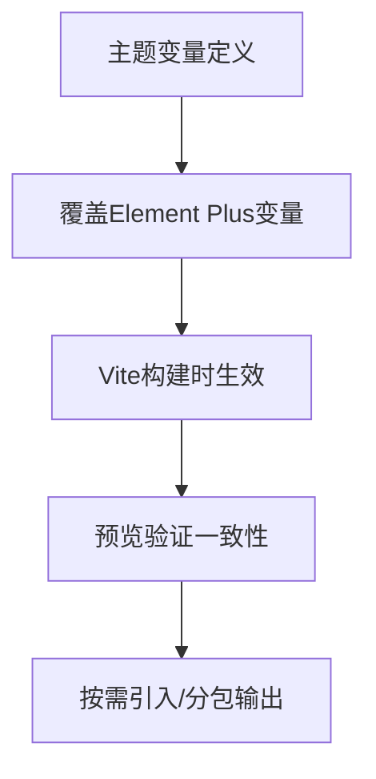
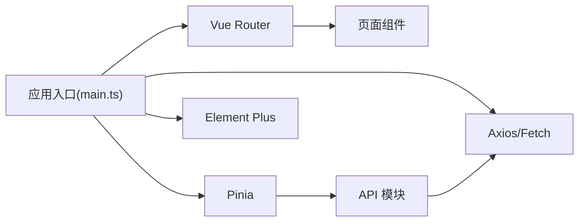

# 用户网页端架构设计

<cite>
**本文引用的文件**   
- [README.md](file://README.md)
</cite>

## 目录
1. [引言](#引言)
2. [项目结构](#项目结构)
3. [核心组件](#核心组件)
4. [架构总览](#架构总览)
5. [详细组件分析](#详细组件分析)
6. [依赖分析](#依赖分析)
7. [性能考虑](#性能考虑)
8. [故障排查指南](#故障排查指南)
9. [结论](#结论)
10. [附录](#附录)

## 引言
本设计文档面向“用户网页端”前端工程，技术栈为 Vue 3 + Vite + Element Plus。目标是给出清晰的前端架构方案与落地规范，覆盖：
- 项目结构与目录划分（src、组件、页面、路由等）
- 组件化分层原则（基础组件、业务组件、页面组件）
- 状态管理策略（Pinia/Vuex 使用场景与数据流）
- API 封装层（请求拦截、响应处理、错误统一处理）
- 路由权限控制与页面级代码分割
- Element Plus 主题定制与 UI 二次封装规范

说明：当前仓库仅包含 README 与共享配置说明，尚未接入用户网页端独立工程。因此，本节提供基于主流实践与团队技术栈的推荐架构方案，便于后续快速落地。

章节来源
- [README.md:18-23](file://README.md#L18-L23)

## 项目结构
推荐的用户网页端工程目录组织如下（以 src 为核心）：
- src/api：按模块划分的接口定义与调用封装
- src/assets：静态资源（图片、字体、样式变量等）
- src/components：可复用组件
  - base：基础通用组件（按钮、输入框、弹窗等）
  - business：业务组件（商品卡片、购物车项、订单摘要等）
- src/layouts：布局组件（主布局、空布局、登录布局等）
- src/pages：页面级组件（首页、商品详情、购物车、订单、个人中心等）
- src/router：路由配置与守卫
- src/store：全局状态（Pinia store 或 Vuex modules）
- src/styles：全局样式与主题变量
- src/utils：工具函数（日期、校验、格式化等）
- src/constants：常量与枚举
- src/plugins：第三方插件注册（Element Plus、图标库等）
- src/main.ts：应用入口
- vite.config.ts：Vite 构建配置
- package.json：依赖与脚本

[此图为概念性结构示意，不直接映射具体源码文件]

## 核心组件
- 基础组件（base）
  - 职责：无业务语义、高内聚低耦合、纯展示与交互能力
  - 示例：自定义 Button、Input、Dialog、Table 扩展等
  - 规范：Props/Events 明确、类型约束严格、无障碍支持、可主题化
- 业务组件（business）
  - 职责：承载特定业务领域逻辑，可组合基础组件
  - 示例：商品卡片、SKU 选择器、购物车行、评价列表
  - 规范：对外暴露最小 API；内部可访问 store 或调用 api 模块
- 页面组件（pages）
  - 职责：聚合业务组件与布局，负责页面级数据获取与编排
  - 示例：首页、商品详情页、购物车页、订单确认页、个人中心
  - 规范：尽量薄，避免复杂逻辑下沉到模板中

章节来源
- [README.md:18-23](file://README.md#L18-L23)

## 架构总览
整体采用“页面 -> 业务组件 -> 基础组件”的分层模式，配合 Pinia 进行跨层级状态管理，API 层统一封装请求与错误处理，路由层实现权限控制与按需加载。

[此图为概念性架构图，不直接映射具体源码文件]

## 详细组件分析

### 组件层次与关系
- 基础组件
  - 特点：无外部副作用、纯函数式思维、强类型 Props/Emits
  - 建议：通过 CSS 变量与 Element Plus 主题系统实现外观定制
- 业务组件
  - 特点：具备领域语义，可组合多个基础组件
  - 建议：内部可订阅 store 或调用 api，但对外保持最小接口
- 页面组件
  - 特点：编排业务组件、发起数据请求、组装视图
  - 建议：尽量薄，复杂逻辑上提至 store 或 composable

[此图为概念类图，不直接映射具体源码文件]

### 状态管理策略（Pinia/Vuex）
- 选型建议
  - 优先使用 Pinia（Vue 3 官方推荐），轻量、TypeScript 友好、模块化
  - 若团队已有 Vuex 资产，可渐进迁移
- 模块划分
  - user：登录态、用户信息、权限
  - cart：购物车条目、数量、选中状态
  - product：商品缓存、搜索历史、筛选条件
  - order：下单流程临时数据、地址簿
- 数据流设计
  - 页面组件触发 action -> store 更新 state -> 组件自动响应
  - 异步操作在 store 的 action 中完成，返回 Promise 供页面 await
  - 持久化：对关键状态（如用户态、购物车）做本地存储

[此图为概念时序图，不直接映射具体源码文件]

### API 接口封装层
- 分层职责
  - 请求拦截器：注入 Token、请求去重、超时设置、基础 URL
  - 响应处理器：统一解包 data、处理分页/列表格式
  - 错误统一处理：网络异常、业务码非零、鉴权失效跳转
- 模块组织
  - 按业务域拆分：user.ts、cart.ts、product.ts、order.ts
  - 每个模块导出方法，内部调用统一的 http 客户端
- 错误处理
  - 区分系统错误与业务错误
  - 对 401/403 做鉴权引导，对 5xx 提示重试或降级

[此图为概念流程图，不直接映射具体源码文件]

### 路由权限控制与页面级代码分割
- 路由组织
  - 静态路由：登录、注册、公共页面
  - 动态路由：根据用户角色/权限生成
- 权限控制
  - 全局前置守卫：校验登录态、权限白名单
  - 菜单与路由联动：后端返回菜单树，前端生成路由表
- 代码分割
  - 使用 import() 实现页面级懒加载
  - 结合 Vite 的 chunk 优化，减少首屏体积

[此图为概念时序图，不直接映射具体源码文件]

### Element Plus 主题定制与 UI 二次封装规范
- 主题定制
  - 通过 CSS 变量覆盖默认主题色、字号、圆角、阴影等
  - 结合 Vite 的 CSS 预处理与按需引入，减小打包体积
- 二次封装
  - 基础组件封装：统一尺寸、文案、禁用态、图标、无障碍属性
  - 业务组件封装：内置常用交互（如 SKU 选择、批量操作）
  - 表单封装：统一校验规则、错误提示、提交防抖
- 规范
  - 命名：kebab-case 文件名，PascalCase 组件名
  - 类型：TS 严格模式，Props/Emits 完整声明
  - 样式：BEM 或 CSS Modules，避免全局污染

[此图为概念流程图，不直接映射具体源码文件]

## 依赖分析
- 运行时依赖
  - Vue 3：框架核心
  - Element Plus：UI 组件库
  - Pinia：状态管理（推荐）
  - Vue Router：路由与导航
  - Axios/Fetch：网络请求
- 开发期依赖
  - Vite：构建与开发服务器
  - TypeScript：类型安全
  - ESLint/Prettier：代码规范
  - Vitest/Jest：单元测试
- 依赖关系概览

[此图为概念依赖图，不直接映射具体源码文件]

## 性能考虑
- 首屏优化
  - 路由懒加载、组件按需引入、Tree-shaking
  - 静态资源压缩与 CDN 部署
- 运行期优化
  - 虚拟列表长列表渲染
  - 图片懒加载与 WebP 格式
  - 请求合并与缓存（相同参数去重）
- 构建优化
  - Vite 预构建与分包策略
  - 开启 gzip/brotli 压缩
  - 分析包体积（rollup-plugin-visualizer）

[本节为通用指导，无需源码引用]

## 故障排查指南
- 常见问题定位
  - 网络请求失败：检查拦截器、Token 注入、CORS、超时配置
  - 权限问题：核对路由守卫与权限接口返回
  - 状态不同步：检查 store action 与组件订阅是否正确
  - 样式冲突：检查全局样式覆盖顺序与命名空间
- 调试建议
  - 使用浏览器开发者工具 Network/Performance/Layers
  - 打开 Vite 的 sourcemap 与调试日志
  - 对关键路径编写单测与集成测试

[本节为通用指导，无需源码引用]

## 结论
本方案围绕 Vue 3 + Vite + Element Plus 技术栈，给出了用户网页端的分层架构、组件化规范、状态管理与 API 封装策略、路由权限与代码分割方案，以及主题定制与二次封装规范。该方案具备良好的可扩展性与可维护性，适合多端电商平台的用户网页端落地实施。

[本节为总结性内容，无需源码引用]

## 附录
- 分支与协作规范参考
  - main 稳定分支、develop 集成分支
  - feature/<模块>-<简述> 功能分支
  - 提交信息格式：type(scope): subject
  - 合并需通过 Pull Request

章节来源
- [README.md:25-31](file://README.md#L25-L31)