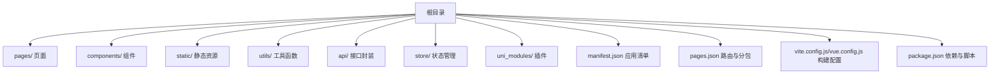
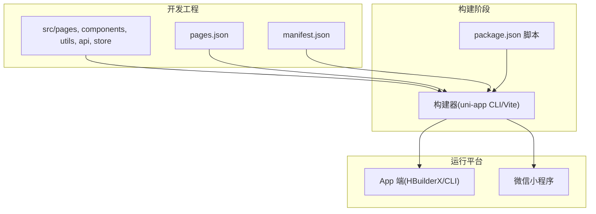
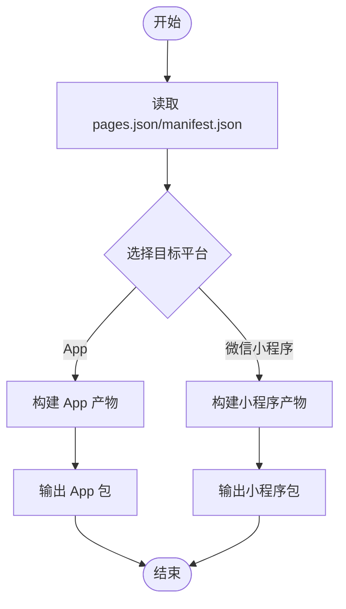
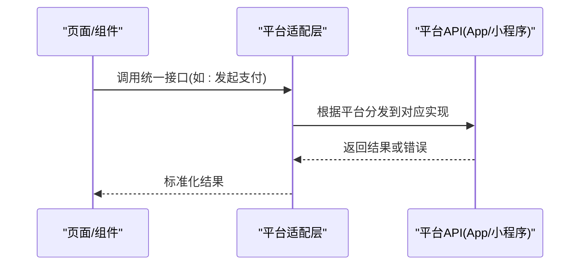
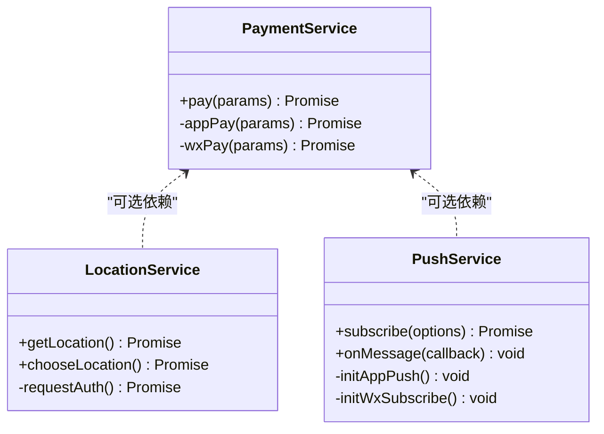
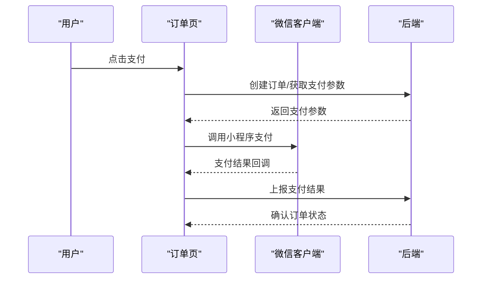
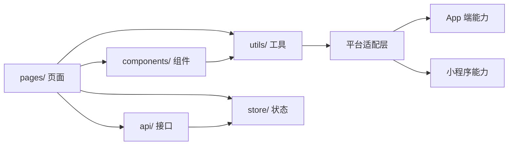

# 移动端uni-app架构设计

<cite>
**本文引用的文件**   
- [README.md](file://README.md)
</cite>

## 目录
1. [引言](#引言)
2. [项目结构](#项目结构)
3. [核心组件](#核心组件)
4. [架构总览](#架构总览)
5. [详细组件分析](#详细组件分析)
6. [依赖分析](#依赖分析)
7. [性能考虑](#性能考虑)
8. [故障排查指南](#故障排查指南)
9. [结论](#结论)
10. [附录](#附录)

## 引言
本仓库为“京东风格电商平台课程作业”的聚合仓库，技术栈包含后端、网页端、后台与移动端。其中移动端采用 uni-app（App + 微信小程序）跨平台方案。当前仓库仅包含顶层说明文档与协作规范，尚未接入具体前端工程代码。本文基于现有信息，给出面向 uni-app 移动端的整体架构设计与落地建议，涵盖目录结构、编译配置、跨平台适配策略、移动端能力实现、小程序特有功能、性能优化与调试测试实践等，便于后续接入工程时快速对齐团队规范与最佳实践。

## 项目结构
根据仓库 README 的技术栈说明，移动端使用 uni-app 同时支持 App 与微信小程序两个目标平台。由于当前仓库未包含前端源码，以下给出推荐的 uni-app 标准工程结构与职责划分，供后续接入时参考：

- pages/：页面目录，按业务模块组织子目录
- components/：可复用组件库
- static/：静态资源（图片、字体、第三方脚本等）
- utils/：工具函数与通用逻辑封装
- api/：网络请求封装与接口定义
- store/：状态管理（如 Vuex/Pinia）
- uni_modules/：uni-app 插件生态
- manifest.json：应用清单与多端差异化配置入口
- pages.json：路由、窗口样式、分包与 tabBar 配置
- vite.config.js / vue.config.js：构建配置（取决于使用的构建器）
- package.json：依赖与脚本命令

[本节为概念性结构说明，不直接分析具体源文件]

## 核心组件
在 uni-app 移动端工程中，通常将以下模块作为核心支撑：

- 应用清单与路由配置
  - manifest.json：用于声明应用名称、图标、权限、渠道包、各端特有字段等
  - pages.json：用于定义页面路由、导航栏样式、tabBar、分包与预加载策略
- 网络层与数据持久化
  - api/：统一封装请求、拦截器、错误处理、重试与缓存策略
  - store/：全局状态（用户信息、购物车、订单等）
- 平台适配与条件编译
  - 通过条件编译与平台检测，隔离 App 与小程序差异 API
- 工具与公共能力
  - utils/：日期、格式化、加密、埋点、日志等
  - components/：业务无关的可复用 UI 与交互组件

**章节来源**
- [README.md:18-24](file://README.md#L18-L24)

## 架构总览
下图展示 uni-app 移动端在多端环境下的总体架构关系，包括构建产物、运行时平台与关键配置文件的作用域。

**图表来源**
- [README.md:18-24](file://README.md#L18-L24)

**章节来源**
- [README.md:18-24](file://README.md#L18-L24)

## 详细组件分析

### 目录结构与编译配置
- 目录组织
  - 以业务维度拆分 pages/ 子目录，配合分包策略降低首屏体积
  - 将平台差异代码下沉到 utils/platform.ts 或条件编译块中，保持页面与组件纯净
- 构建与打包
  - 使用 uni-app CLI 或 Vite 构建，分别输出 App 与小程序产物
  - 通过环境变量区分不同环境的接口地址、域名白名单与调试开关
- 多端差异化配置
  - manifest.json 中按平台设置权限、启动页、渠道标识、SDK 参数等
  - pages.json 中配置 tabBar、导航栏、分包与预取策略

[本节为概念性流程说明，不直接分析具体源文件]

### 跨平台适配策略
- 条件编译
  - 使用条件编译语法隔离平台特定实现，避免运行时判断污染主流程
- 平台检测
  - 在需要动态分支的场景，提供统一的平台检测工具方法，集中维护平台枚举与兼容逻辑
- 兼容性处理
  - 对低版本 API 进行降级处理；对不支持的能力提供空实现或提示
  - 针对 App 与小程序的差异 API（如支付、扫码、定位、消息推送），封装统一抽象层

[本节为概念性序列图，不直接分析具体源文件]

### 移动端特有功能实现
- 扫码支付
  - 在 App 端可使用原生扫码与支付 SDK；在小程序端使用小程序支付流程
  - 建议在 api/ 下封装支付服务，对外暴露统一方法，内部按平台分支实现
- 消息推送
  - App 端集成厂商通道或第三方推送 SDK；小程序端使用订阅消息与模板消息
  - 通过条件编译与平台检测，屏蔽底层差异，向上提供一致的订阅与回调接口
- 地理位置
  - 使用 uni.getLocation、uni.chooseLocation 等 API，注意权限申请与授权引导
  - 对 iOS/Android 与小程序的授权弹窗差异进行统一处理

[本节为概念类图，不直接分析具体源文件]

### 小程序特有功能实现
- 订阅消息
  - 在用户触发行为后请求授权，成功后保存授权态并监听回调
- 分享转发
  - 使用 onShareAppMessage 与自定义分享按钮，携带追踪参数
- 支付流程
  - 先获取下单参数，再调用小程序支付 API，最后处理成功与失败回调

[本节为概念性序列图，不直接分析具体源文件]

## 依赖分析
当前仓库未包含前端源码，无法生成精确的依赖关系图。以下为概念性依赖示意，指导后续接入时的模块边界与耦合控制：

[本节为概念性依赖图，不直接分析具体源文件]

## 性能考虑
- 图片懒加载
  - 使用懒加载指令或 IntersectionObserver 实现按需加载，减少首屏压力
- 分包加载
  - 在 pages.json 中合理拆分分包，将低频页面放入分包，缩短主包体积
- 内存管理
  - 及时释放定时器、事件监听与大数据对象引用；避免长列表重复渲染
- 网络与缓存
  - 合理使用本地缓存与离线策略；对热点数据进行预取与去重
- 构建优化
  - 开启压缩与 Tree Shaking；按需引入第三方库；静态资源 CDN 加速

[本节为通用性能建议，不直接分析具体源文件]

## 故障排查指南
- 常见问题定位
  - 条件编译失效：检查条件编译注释是否被构建器识别
  - 平台 API 不可用：确认目标平台与权限配置是否正确
  - 分包异常：核对 pages.json 的分包路径与入口文件
- 调试手段
  - App 端：HBuilderX 真机调试与远程调试
  - 小程序：开发者工具控制台与 Network 面板
- 日志与埋点
  - 统一日志级别与过滤规则；敏感信息脱敏；埋点覆盖关键转化路径

[本节为通用排障建议，不直接分析具体源文件]

## 结论
本项目在技术栈层面明确采用 uni-app 作为移动端跨平台方案，支持 App 与微信小程序双端。当前仓库尚未接入前端源码，本文提供了标准化的目录结构、构建与多端适配策略、移动端能力实现思路、小程序专属功能方案以及性能优化与调试测试实践。后续接入工程时，建议严格遵循上述规范，确保多端一致性与可维护性。

[本节为总结性内容，不直接分析具体源文件]

## 附录
- 相关文档
  - 电商项目团队分工与公共配置方案.docx
  - 京东风格电商平台项目启动指导书_修订版.docx
- 协作规范要点
  - 分支策略、提交信息与合并流程

**章节来源**
- [README.md:5-9](file://README.md#L5-L9)
- [README.md:25-31](file://README.md#L25-L31)