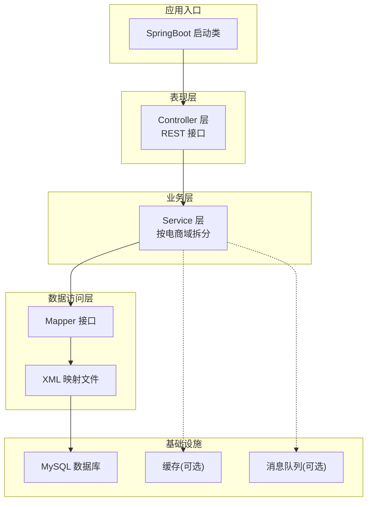
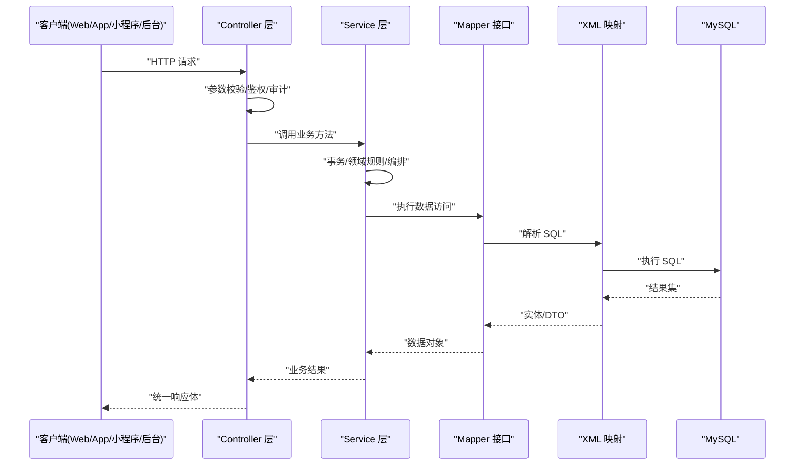
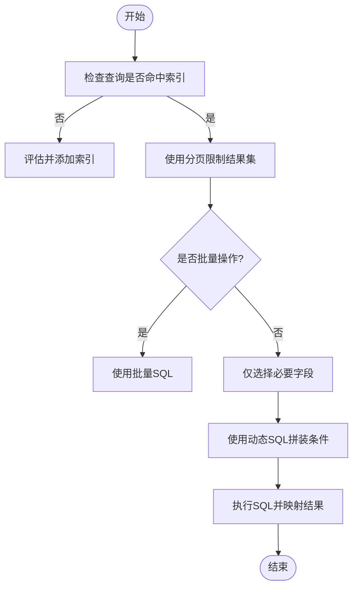
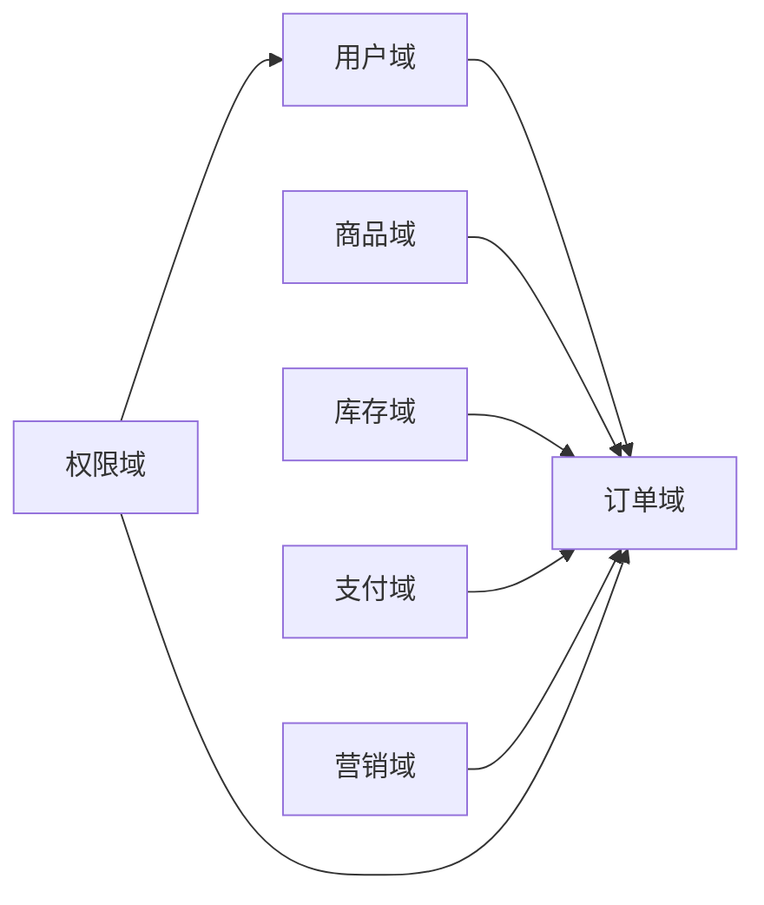
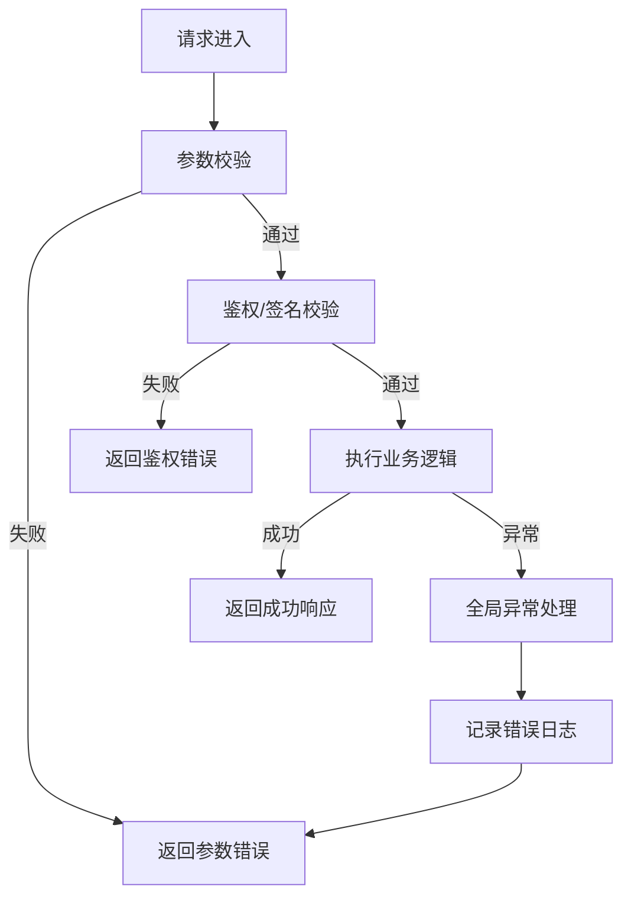
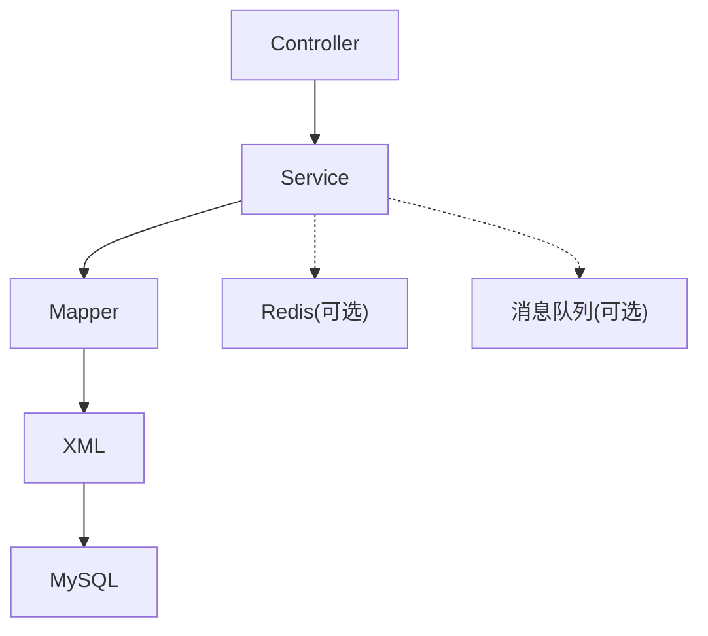

# 后端架构设计

<cite>
**本文引用的文件**   
- [README.md](file://README.md)
</cite>

## 目录
1. [引言](#引言)
2. [项目结构](#项目结构)
3. [核心组件](#核心组件)
4. [架构总览](#架构总览)
5. [详细组件分析](#详细组件分析)
6. [依赖分析](#依赖分析)
7. [性能考虑](#性能考虑)
8. [故障排查指南](#故障排查指南)
9. [结论](#结论)
10. [附录](#附录)

## 引言
本项目为“京东风格电商平台”课程作业，目标是构建一套覆盖用户网页端、App、小程序、商家后台和管理员后台的多端电商后端。技术栈明确为 Spring Boot + MyBatis + MySQL。当前仓库为协作与规范说明的根仓库，各端工程后续接入。本设计文档基于该目标与技术栈，给出分层架构、数据访问、业务域拆分、横切关注点以及性能优化策略的系统化方案，便于团队在后续编码阶段统一落地。

## 项目结构
结合技术栈与多端接入背景，建议采用按职责分层的标准 Spring Boot 工程结构，并预留多端入口（Web/管理后台/开放接口）的扩展空间。推荐目录组织如下：
- src/main/java/com/jd/platform
  - controller: 对外 HTTP 接口层（面向 Web/App/小程序/后台）
  - service: 业务逻辑层（按电商域拆分子包）
  - dao/mapper: 数据访问层（MyBatis Mapper 接口）
  - config: 配置类（数据库、缓存、异步、安全等）
  - common: 公共模型、工具、常量、枚举
  - exception: 全局异常处理与错误码
  - interceptor/filter: 拦截器/过滤器（鉴权、限流、审计）
  - job/scheduler: 定时任务
- src/main/resources
  - application.yml: 主配置
  - mapper/*.xml: MyBatis XML 映射文件
  - static/i18n: 国际化资源
- src/test: 单元测试与集成测试



[此图为概念性结构示意，不直接映射具体源码文件]

**章节来源**
- [README.md:18-24](file://README.md#L18-L24)

## 核心组件
- Controller 层
  - 职责：接收请求、参数校验、调用 Service、封装响应体。
  - 要点：保持薄控制器，不包含业务逻辑；统一返回结构与错误码；对跨端差异通过路由或版本前缀区分。
- Service 层
  - 职责：编排业务流程、事务边界、领域规则、调用外部服务。
  - 要点：按电商域划分子包（如订单、商品、库存、支付、营销、用户、权限等），避免循环依赖；对外暴露稳定接口。
- DAO/Mapper 层
  - 职责：数据持久化操作，封装 SQL 细节。
  - 要点：使用 MyBatis Mapper 接口与 XML 分离；复杂查询使用 XML，简单 CRUD 可使用注解；提供分页与条件构造能力。
- 配置与横切
  - 全局异常处理、日志记录、参数校验、安全认证、限流熔断、监控埋点等以 AOP/Filter/Interceptor 形式实现。

**章节来源**
- [README.md:18-24](file://README.md#L18-L24)

## 架构总览
下图展示从请求进入到数据落库的整体流程，体现分层职责与关键横切点。



[此图为概念性流程示意，不直接映射具体源码文件]

## 详细组件分析

### 分层架构与交互模式
- 请求进入
  - Controller 负责入参校验、上下文装配、调用 Service，并将结果包装为统一响应。
- 业务编排
  - Service 定义事务边界，组合多个 Mapper 调用，必要时引入缓存、消息、外部服务。
- 数据访问
  - Mapper 接口声明方法，XML 中维护 SQL；复杂查询可拆分为多个语句并通过 ResultMap 组装。
- 横切关注点
  - 全局异常处理器捕获未处理异常，转换为统一错误码与提示；日志通过 AOP 记录请求链路；参数校验使用 Bean Validation。

```mermaid
classDiagram
class Controller {
"+接收HTTP请求"
"+参数校验"
"+调用Service"
"+统一响应"
}
class Service {
"+业务编排"
"+事务控制"
"+领域规则"
"+调用Mapper"
}
class Mapper {
"+数据访问接口"
"+SQL映射"
}
class XML {
"+SQL定义"
"+ResultMap"
}
class DB {
"+MySQL"
}
Controller --> Service : "调用"
Service --> Mapper : "调用"
Mapper --> XML : "引用"
XML --> DB : "执行"
```

[此图为概念性类关系示意，不直接映射具体源码文件]

**章节来源**
- [README.md:18-24](file://README.md#L18-L24)

### MyBatis 数据访问层设计
- Mapper 接口设计
  - 每个聚合根或核心表对应一个 Mapper 接口，方法命名遵循语义化原则（selectXxx、insertXxx、updateXxx、deleteXxx）。
  - 复杂查询方法使用 @Param 传递条件对象，或使用 DTO/VO 作为入参与出参。
- XML 映射文件组织
  - 按模块/表分组存放，例如 mapper/order.xml、mapper/product.xml。
  - 将重复片段抽取为 <sql id="...">，通过 <include refid="..."/> 引用，提升可读性与复用性。
  - 动态 SQL 使用 <if>/<choose>/<foreach> 等标签，避免拼接字符串。
- SQL 优化策略
  - 索引先行：根据查询条件与排序字段建立合适索引，避免全表扫描。
  - 分页查询：使用 LIMIT 或数据库原生分页，避免一次性拉取大量数据。
  - 批量操作：合并多次插入/更新为批量语句，减少网络往返。
  - 读写分离与连接池：合理配置连接池大小与超时，配合慢查询日志定位瓶颈。
  - 结果集映射：使用 ResultMap 精确映射字段，避免 SELECT *。



[此图为概念性算法流程示意，不直接映射具体源码文件]

**章节来源**
- [README.md:18-24](file://README.md#L18-L24)

### 业务逻辑层模块化设计（电商域）
- 域划分建议
  - 用户域：注册登录、个人信息、收货地址、会员等级。
  - 商品域：类目、品牌、SKU/SPU、价格、上下架。
  - 库存域：库存扣减、回滚、盘点。
  - 订单域：下单、改价、发货、签收、售后。
  - 支付域：支付渠道对接、回调、对账。
  - 营销域：优惠券、满减、秒杀、积分。
  - 权限域：角色、菜单、数据权限。
- 依赖管理
  - 上层依赖下层，禁止反向依赖；同层之间通过接口或事件解耦。
  - 跨域调用优先使用领域服务接口，而非直接访问其他域的 Mapper。
  - 引入事件总线或消息队列进行最终一致性场景（如下单后扣库存、发送通知）。



[此图为概念性领域关系示意，不直接映射具体源码文件]

**章节来源**
- [README.md:18-24](file://README.md#L18-L24)

### 横切关注点实现方案
- 全局异常处理
  - 使用统一异常类型与错误码；@RestControllerAdvice 捕获异常并返回统一响应。
  - 区分业务异常与系统异常，记录不同级别日志。
- 日志记录
  - 使用结构化日志（包含 traceId、userId、请求路径、耗时等）。
  - 关键业务节点打点，便于追踪与告警。
- 参数校验
  - 使用 Bean Validation（@Valid/@NotNull/@Size 等）在 Controller 入参处校验。
  - 自定义校验注解用于业务特定规则（如手机号格式、金额范围）。
- 安全与鉴权
  - 基于 Token/JWT 的身份认证；RBAC 权限模型控制接口访问。
  - 敏感接口增加签名校验与防重放机制。
- 限流与熔断
  - 接口级限流（令牌桶/滑动窗口）；关键下游服务熔断降级。



[此图为概念性流程示意，不直接映射具体源码文件]

**章节来源**
- [README.md:18-24](file://README.md#L18-L24)

## 依赖分析
- 内部依赖
  - Controller 依赖 Service；Service 依赖 Mapper；Mapper 依赖 XML 与数据库驱动。
  - 横切组件（异常、日志、校验、安全）以 AOP/Filter/Interceptor 形式注入到请求链路。
- 外部依赖
  - MySQL 驱动、连接池（如 HikariCP）、MyBatis 及其扩展（分页插件可选）。
  - 可选：Redis 缓存、消息队列（RabbitMQ/Kafka）、分布式锁、监控（Prometheus/Grafana）。



[此图为概念性依赖示意，不直接映射具体源码文件]

**章节来源**
- [README.md:18-24](file://README.md#L18-L24)

## 性能考虑
- 数据库连接池
  - 合理设置最大连接数、最小空闲连接、连接超时与获取超时，避免连接泄漏。
  - 开启慢查询日志，定期分析并优化热点 SQL。
- 缓存策略
  - 读多写少数据（如商品详情、类目树）使用 Redis 缓存，注意缓存穿透/击穿/雪崩防护。
  - 热点键加随机过期时间，局部失效采用延迟双删或订阅 binlog 同步。
- 异步处理
  - 非关键路径（如发送短信、生成报表、积分发放）使用线程池或消息队列异步化。
  - 保证幂等与重试补偿，避免消息丢失与重复消费。
- 查询优化
  - 合理使用索引、覆盖索引、联合索引；避免函数与隐式类型转换导致索引失效。
  - 大字段与明细数据按需加载，列表页只返回必要字段。
- 并发与限流
  - 热点接口启用令牌桶/漏桶限流；关键服务做熔断降级与舱壁隔离。
- 监控与可观测性
  - 接入指标采集（QPS、RT、错误率、慢查询）与链路追踪，快速定位瓶颈。

[本节为通用性能指导，不直接分析具体文件]

## 故障排查指南
- 常见问题定位
  - 接口报错：查看全局异常日志与错误码，确认是否为参数校验失败或业务异常。
  - 数据库问题：检查连接池状态、慢查询日志、死锁信息；核对索引与 SQL 执行计划。
  - 缓存问题：确认缓存命中率、Key 过期策略、缓存一致性方案。
  - 异步问题：核对消费者消费情况、重试次数、幂等键与补偿任务。
- 排障步骤建议
  - 通过 traceId 串联日志，定位请求全链路。
  - 复现问题并抓取关键时间点日志与指标。
  - 逐步缩小范围：先验证接口与参数，再检查业务逻辑，最后落到 SQL 与数据。

[本节为通用排障指导，不直接分析具体文件]

## 结论
本设计围绕 Spring Boot + MyBatis + MySQL 技术栈，明确了分层架构、数据访问、业务域拆分与横切关注点的实现思路，并给出了性能优化与故障排查建议。后续在各端工程接入时，应严格遵循本设计，确保代码风格、接口契约与质量基线一致，保障平台可扩展与高可用。

[本节为总结性内容，不直接分析具体文件]

## 附录
- 分支与协作
  - main 为稳定分支，develop 为日常集成分支；功能分支命名 feature/<模块>-<简述>；提交信息遵循 type(scope): subject；合并需通过 Pull Request。
- 共享配置
  - .qoder 目录存放团队共享 skills、rules 与 MCP 使用说明，便于统一开发体验与规范。

**章节来源**
- [README.md:25-35](file://README.md#L25-L35)