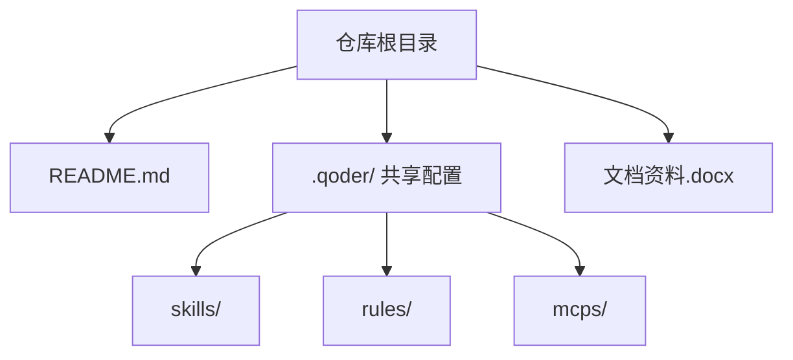
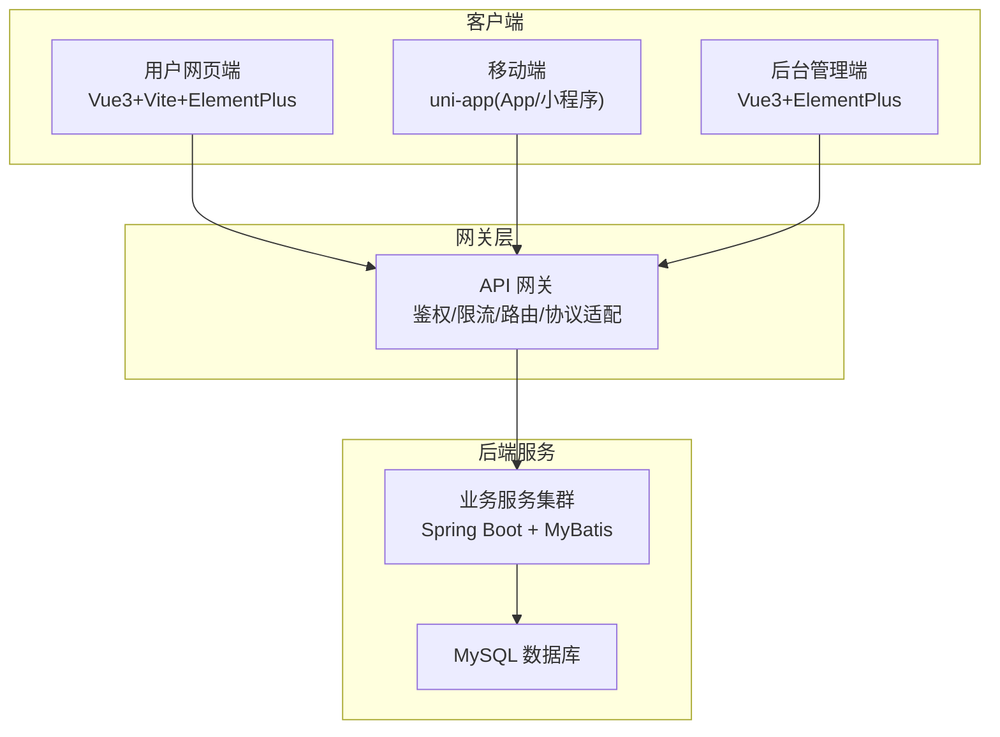
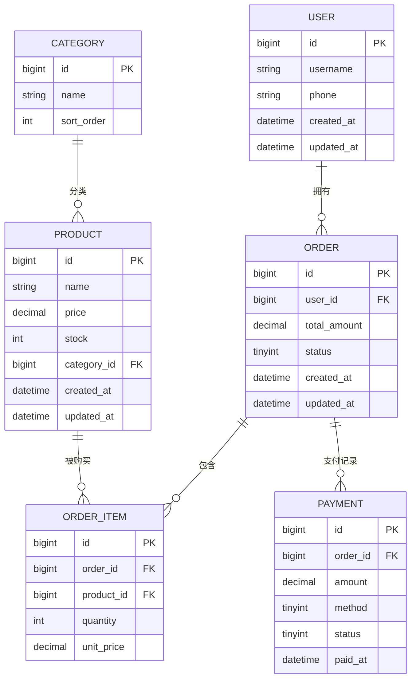
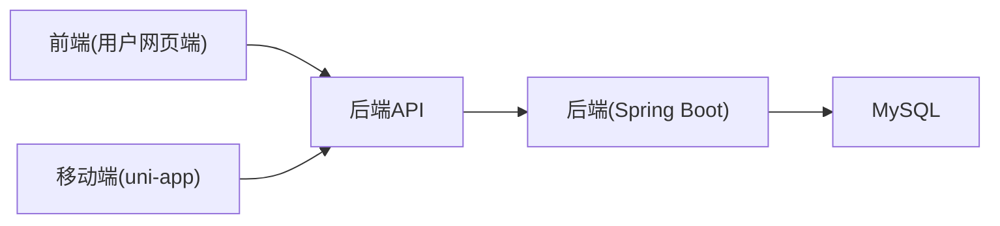
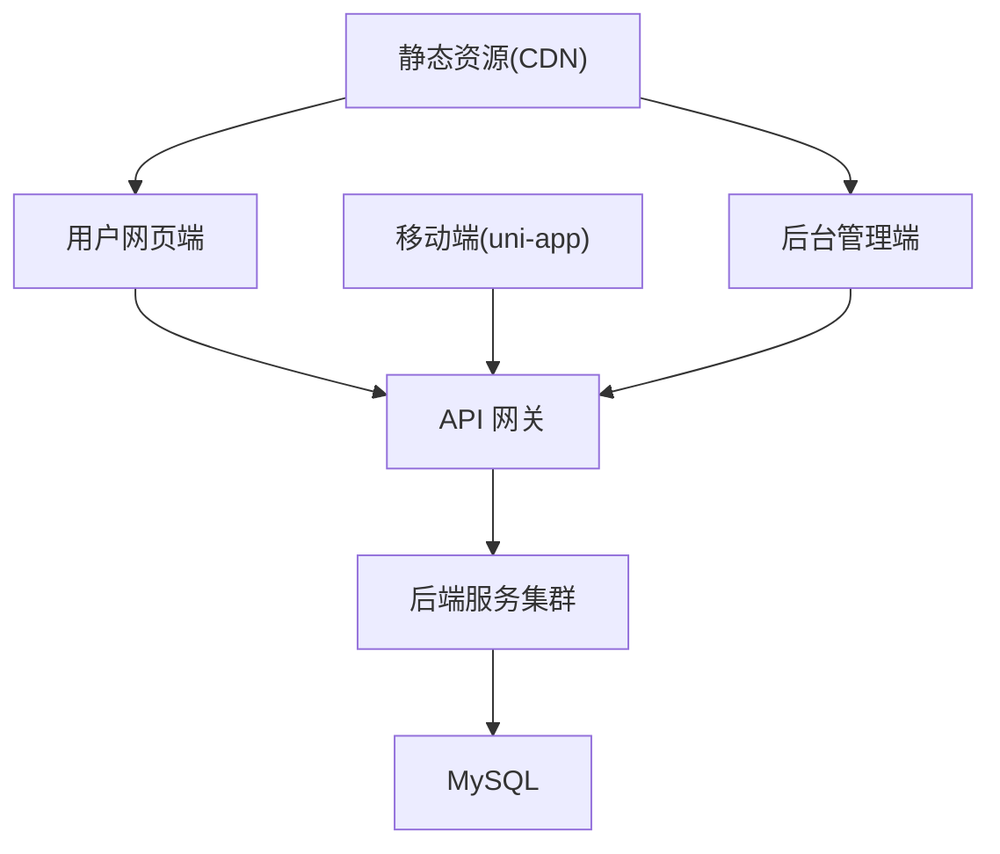

# 技术架构设计

<cite>
**本文引用的文件**   
- [README.md](file://README.md)
</cite>

## 目录
1. [引言](#引言)
2. [项目结构](#项目结构)
3. [核心组件](#核心组件)
4. [架构总览](#架构总览)
5. [详细组件分析](#详细组件分析)
6. [依赖分析](#依赖分析)
7. [性能考虑](#性能考虑)
8. [故障排查指南](#故障排查指南)
9. [结论](#结论)
10. [附录](#附录)

## 引言
本项目为“京东风格电商平台”课程作业，目标是构建一套覆盖用户网页端、App、小程序、商家后台与管理员后台的多端电商系统。仓库当前作为统一入口与规范说明，各端工程后续接入并独立启动。后端采用 Spring Boot + MyBatis + MySQL；前端用户网页端采用 Vue 3 + Vite + Element Plus；后台端采用 Vue 3 + Element Plus；移动端采用 uni-app（支持 App 与微信小程序）。

本技术架构设计文档基于仓库现有信息，结合行业通用实践，给出前后端分离的整体架构模式、多端统一架构理念、API 网关与接口规范建议、模块化划分原则、数据库设计原则与核心实体关系、技术栈选择与版本兼容性考量、部署拓扑与组件交互图、安全架构、性能优化策略与扩展性设计等。

[无直接源码文件引用]

## 项目结构
仓库目前包含项目说明与共享配置约定：
- README.md：项目目标、文档链接、共享配置位置、技术栈、协作规范与快速开始提示
- .qoder/：团队共享配置（skills、rules、MCP 使用说明）
- 文档资料：项目启动指导书与团队分工方案（docx）

图表来源
- [README.md:1-35](file://README.md#L1-L35)

章节来源
- [README.md:1-35](file://README.md#L1-L35)

## 核心组件
根据仓库说明，系统由以下核心组件构成：
- 后端服务：Spring Boot + MyBatis + MySQL
- 用户网页端：Vue 3 + Vite + Element Plus
- 后台管理端：Vue 3 + Element Plus
- 移动端：uni-app（App + 微信小程序）
- 共享配置：Qoder 的 skills/rules/mcps

这些组件通过前后端分离与多端统一 API 的方式协同工作，形成统一的业务服务能力对外提供。

章节来源
- [README.md:18-24](file://README.md#L18-L24)

## 架构总览
整体采用前后端分离与多端统一的服务化架构：
- 多端客户端（Web、App、小程序、后台）通过统一 API 访问后端服务
- 后端以领域模块组织能力，数据持久化使用 MySQL
- 通过 API 网关进行鉴权、限流、路由与协议适配（建议）
- 前端按端拆分工程，复用公共 UI 与业务组件库（建议）

图表来源
- [README.md:18-24](file://README.md#L18-L24)

## 详细组件分析

### 后端服务（Spring Boot + MyBatis + MySQL）
- 职责边界
  - 提供 RESTful API，承载用户、商品、订单、支付、库存、营销等业务能力
  - 通过 MyBatis 与 MySQL 交互，遵循分层架构（Controller/Service/Mapper）
- 模块化划分建议
  - 按业务域拆分为 user、product、order、payment、inventory、marketing 等模块
  - 每个模块内再分 controller/service/mapper/entity/dto 等子包
- 接口规范建议
  - 统一响应体结构（code/message/data），分页参数与返回格式一致
  - 资源命名采用复数名词，HTTP 动词表达操作语义
  - 版本号通过 URL 前缀或 Header 控制（如 /api/v1/...）
- 错误处理与幂等
  - 全局异常处理器统一错误码与消息
  - 关键写接口引入幂等键或唯一约束，避免重复提交
- 事务与一致性
  - 跨表更新使用声明式事务，必要时引入本地补偿或分布式事务方案（视规模演进）

章节来源
- [README.md:18-24](file://README.md#L18-L24)

### 用户网页端（Vue 3 + Vite + Element Plus）
- 职责边界
  - 面向消费者的购物流程：浏览、搜索、下单、支付、评价、售后
  - 与后端 API 交互，渲染页面与状态管理
- 工程组织建议
  - 路由按页面划分，状态管理集中管理用户态与购物车等
  - 组件按功能域拆分，公共 UI 使用 Element Plus
- 性能优化建议
  - 路由懒加载、图片懒加载、CDN 静态资源、Gzip/Brotli 压缩
  - 首屏优化：SSR/预渲染（可选）、骨架屏

章节来源
- [README.md:18-24](file://README.md#L18-L24)

### 后台管理端（Vue 3 + Element Plus）
- 职责边界
  - 运营与管理员使用的管理界面：商品管理、订单管理、用户管理、报表统计
- 权限与安全
  - 基于角色的访问控制（RBAC），菜单与按钮级权限
  - 敏感操作二次确认与审计日志
- 体验优化
  - 表格虚拟滚动、批量操作、导出、搜索过滤

章节来源
- [README.md:18-24](file://README.md#L18-L24)

### 移动端（uni-app，App + 微信小程序）
- 职责边界
  - 移动场景下的购物流程，兼顾 App 与小程序生态
- 平台差异处理
  - 条件编译与平台 API 封装，统一业务逻辑
- 性能与体验
  - 分包加载、图片压缩、网络请求重试与降级

章节来源
- [README.md:18-24](file://README.md#L18-L24)

### API 网关与多端统一
- 设计理念
  - 统一入口、统一鉴权、统一限流、统一日志与监控
  - 协议适配（HTTP/HTTPS、WebSocket 等）、灰度发布与流量治理
- 接口规范
  - 统一响应结构、错误码体系、分页与排序约定
  - 版本管理与向后兼容策略
- 安全策略
  - 签名校验、防重放、IP 白名单、WAF 防护

章节来源
- [README.md:18-24](file://README.md#L18-L24)

### 数据库设计与核心实体
- 设计原则
  - 规范化与反规范化平衡，热点字段冗余提升查询性能
  - 主键采用自增或雪花 ID，外键在应用层维护
  - 索引设计围绕高频查询与排序字段
- 核心实体关系（概念模型）
  - 用户（User）与订单（Order）为一对多
  - 订单（Order）与订单项（OrderItem）为一对多
  - 商品（Product）与分类（Category）为多对一
  - 商品（Product）与库存（Inventory）一对一或一对多（多仓）
  - 支付（Payment）与订单（Order）一对一或一对多（多次支付）

图表来源
- [README.md:18-24](file://README.md#L18-L24)

## 依赖分析
- 技术栈依赖
  - 后端：Spring Boot、MyBatis、MySQL
  - 前端：Vue 3、Vite、Element Plus
  - 移动端：uni-app（App/小程序）
- 组件耦合
  - 客户端与后端通过 API 解耦，变更前端不影响后端
  - 后端内部按模块解耦，减少跨模块强依赖
- 外部依赖
  - 第三方登录、短信、支付、对象存储、搜索引擎等（按需引入）

图表来源
- [README.md:18-24](file://README.md#L18-L24)

章节来源
- [README.md:18-24](file://README.md#L18-L24)

## 性能考虑
- 服务端
  - 连接池与线程池调优，SQL 慢查询优化与索引完善
  - 缓存策略：Redis 缓存热点数据（商品详情、首页推荐、库存快照）
  - 异步化：订单创建、通知发送、报表生成等异步处理
- 前端
  - 资源压缩与缓存、CDN 加速、按需加载
  - 列表虚拟化、分页与增量加载
- 移动端
  - 分包与预下载、弱网重试与降级、图片自适应与懒加载

[本节为通用性能建议，不直接分析具体文件]

## 故障排查指南
- 常见问题定位
  - 接口超时：检查网关限流、后端线程池、数据库慢查询
  - 鉴权失败：核对 Token 有效期、签名算法、时间同步
  - 数据不一致：核对事务边界、幂等键、补偿任务
- 日志与监控
  - 全链路追踪（TraceId）、结构化日志、指标采集（QPS、延迟、错误率）
  - 告警阈值与自动恢复策略

[本节为通用排障建议，不直接分析具体文件]

## 结论
本项目采用前后端分离与多端统一的服务化架构，后端以 Spring Boot + MyBatis + MySQL 为核心，前端与移动端分别采用 Vue 3 与 uni-app 生态。通过 API 网关统一入口与治理，结合模块化与标准化接口规范，可实现高内聚低耦合的系统结构。建议在后续工程中逐步落地缓存、异步、监控与可观测性，持续提升系统的稳定性与可扩展性。

[本节为总结性内容，不直接分析具体文件]

## 附录

### 技术栈选择与版本兼容性
- 后端
  - Spring Boot：成熟生态、快速开发、云原生友好
  - MyBatis：灵活 SQL 控制，适合复杂查询与性能优化
  - MySQL：广泛使用、稳定可靠、社区资源丰富
- 前端
  - Vue 3：组合式 API、更好的 TypeScript 支持与性能
  - Vite：更快的构建与热更新
  - Element Plus：丰富的企业级组件
- 移动端
  - uni-app：一次开发多端发布，降低多端维护成本

章节来源
- [README.md:18-24](file://README.md#L18-L24)

### 协作与分支策略
- 分支模型
  - main：稳定分支
  - develop：日常集成分支
  - feature/<模块>-<简述>：功能分支
- 提交规范
  - type(scope): subject
- 合并流程
  - 通过 Pull Request 合并至 develop/main

章节来源
- [README.md:25-31](file://README.md#L25-L31)

### 部署拓扑与组件交互（建议）
- 部署拓扑
  - Nginx/网关 -> 后端服务集群 -> MySQL
  - 前端静态资源托管于 CDN
  - 移动端通过网关访问后端
- 组件交互
  - 客户端发起请求 -> 网关鉴权与限流 -> 路由到后端服务 -> 读写数据库 -> 返回结果

图表来源
- [README.md:18-24](file://README.md#L18-L24)