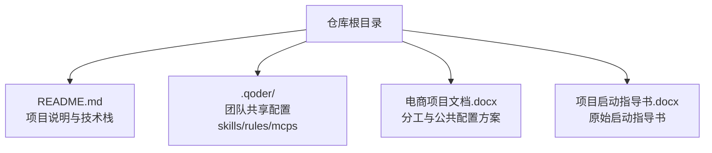
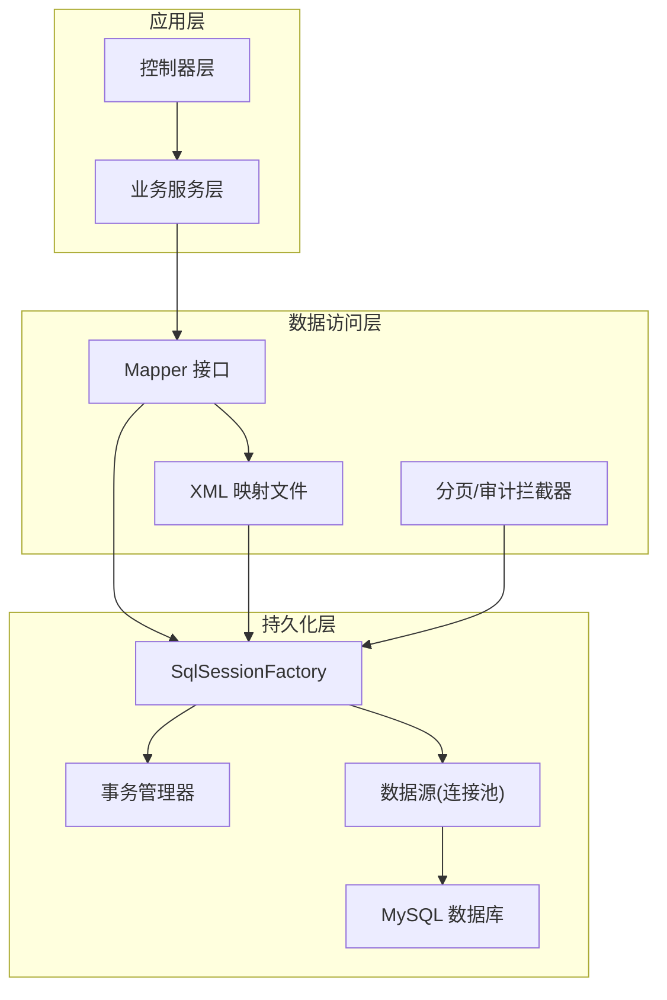
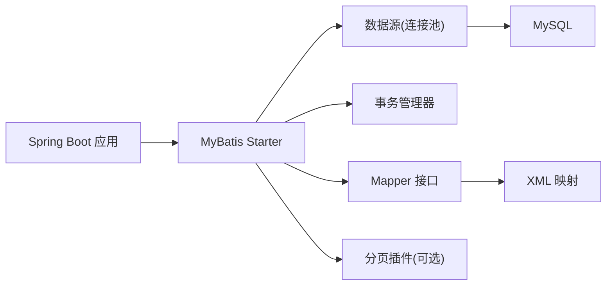

# MyBatis集成配置

<cite>
**本文引用的文件**   
- [README.md](file://README.md)
</cite>

## 目录
1. [简介](#简介)
2. [项目结构](#项目结构)
3. [核心组件](#核心组件)
4. [架构总览](#架构总览)
5. [详细组件分析](#详细组件分析)
6. [依赖分析](#依赖分析)
7. [性能考虑](#性能考虑)
8. [故障排查指南](#故障排查指南)
9. [结论](#结论)
10. [附录](#附录)

## 简介
本文件面向在 Spring Boot + MyBatis + MySQL 技术栈下，进行后端数据访问层集成的开发者。文档围绕以下目标展开：
- 说明 MyBatis 与 Spring Boot 的集成方式（数据源、事务管理器、Mapper 扫描等）
- 规范 Mapper 接口设计（命名约定、参数传递、返回值处理）
- 给出 SQL 映射文件的最佳实践（动态 SQL、结果映射、批量操作优化）
- 提供分页查询实现方案与性能优化技巧
- 完善异常处理与日志配置指南

本项目为多端电商平台课程作业，后端采用 Spring Boot + MyBatis + MySQL，前端与移动端工程后续接入此仓库。

章节来源
- [README.md:18-20](file://README.md#L18-L20)

## 项目结构
当前仓库为课程作业的顶层聚合仓库，主要包含项目说明与共享配置入口。MyBatis 相关代码尚未在此仓库中落地，实际的后端工程将在后续独立接入。因此，本节仅描述现有结构与后续集成建议的组织方式。

图表来源
- [README.md:10-16](file://README.md#L10-L16)
- [README.md:18-20](file://README.md#L18-L20)

章节来源
- [README.md:1-35](file://README.md#L1-L35)

## 核心组件
基于“Spring Boot + MyBatis + MySQL”的技术栈，典型的数据访问层由以下组件构成：
- 数据源（DataSource）：连接池与数据库连接管理
- 事务管理器（PlatformTransactionManager）：声明式事务控制
- SqlSessionFactory/SqlSessionTemplate：MyBatis 核心会话工厂与模板
- Mapper 接口与 XML 映射：DAO 抽象与 SQL 定义
- 分页插件（如 PageHelper）：拦截器实现的分页能力
- 日志与监控：SQL 日志、慢查询统计、错误追踪

由于当前仓库未包含具体实现代码，本节为通用集成要点说明，便于后续在后端工程中落地。

章节来源
- [README.md:18-20](file://README.md#L18-L20)

## 架构总览
下图展示 Spring Boot 与 MyBatis 的典型集成关系及数据流向。

图表来源
- [README.md:18-20](file://README.md#L18-L20)

## 详细组件分析

### 数据源与连接池配置
- 选择连接池：推荐 HikariCP（Spring Boot 默认），或根据需求切换至 Druid、Tomcat JDBC 等
- 关键配置项：
  - 驱动类名、URL、用户名、密码
  - 最大连接数、最小空闲连接、连接超时、空闲超时
  - 连接测试语句、是否自动提交
- 多环境配置：使用 application-{env}.yml 区分开发、测试、生产
- 安全与可观测性：敏感信息外部化、开启连接池监控指标

章节来源
- [README.md:18-20](file://README.md#L18-L20)

### 事务管理器设置
- 使用 Spring 声明式事务（@Transactional）
- 事务传播行为与隔离级别按业务场景设定
- 读写分离场景下，结合注解或切面将读方法路由到只读库
- 长事务与锁等待：避免在事务中进行远程调用或耗时计算

章节来源
- [README.md:18-20](file://README.md#L18-L20)

### SQL 映射文件组织
- 包路径与命名：按模块/领域划分包，XML 与 Mapper 接口一一对应
- 命名空间：XML 的 namespace 指向对应 Mapper 接口全限定名
- 资源加载：通过 mybatis.mapper-locations 指定扫描路径
- 别名与类型转换：统一配置 typeAliasesPackage，减少冗余类型书写

章节来源
- [README.md:18-20](file://README.md#L18-L20)

### Mapper 接口设计规范
- 方法命名约定：
  - 查询：selectXxx / getXxx / listXxx / countXxx
  - 新增：insertXxx / saveXxx
  - 更新：updateXxx / modifyXxx
  - 删除：deleteXxx / removeXxx
- 参数传递：
  - 单参：直接使用 @Param 或对象
  - 多参：使用 @Param 命名参数或 DTO 封装
  - 复杂条件：使用 QueryObject/DTO 承载过滤条件
- 返回值处理：
  - 单行：实体或 Optional
  - 列表：List/Collection
  - 计数：Long/Integer
  - 影响行数：int
- 空值与默认值：对可选字段使用 <if>/<choose> 动态拼接

章节来源
- [README.md:18-20](file://README.md#L18-L20)

### 动态 SQL 最佳实践
- 常用标签：<if>/<where>/<set>/<foreach>/<trim>/<choose>/<when>/<otherwise>
- 条件拼装：优先使用 <where> 自动处理 AND/OR 前缀
- 集合遍历：使用 <foreach> 构建 IN 列表，注意分批与长度限制
- 可读性与维护性：拆分大 SQL 为片段 <sql id="..."> 复用

章节来源
- [README.md:18-20](file://README.md#L18-L20)

### 结果映射配置
- 基础映射：resultType 用于简单类型与基本对象
- 复杂映射：resultMap 处理嵌套对象、集合、枚举、时间类型
- 关联查询：一对一/一对多使用 association/collection，谨慎 N+1 问题
- 缓存策略：合理启用二级缓存（需谨慎评估一致性）

章节来源
- [README.md:18-20](file://README.md#L18-L20)

### 批量操作优化
- 批量插入：使用 <foreach> 生成多条 INSERT；或使用 JDBC batch（JDBC_URL 支持 rewriteBatchedStatements）
- 批量更新：使用 CASE WHEN 构造批量 UPDATE
- 批量删除：IN 列表分批，避免超长 SQL
- 事务边界：批量操作置于独立事务，失败回滚可控

章节来源
- [README.md:18-20](file://README.md#L18-L20)

### 分页查询实现方案
- 推荐方案：PageHelper 拦截器
  - 引入 starter 并配置方言
  - 在查询前调用 startPage(pageNum, pageSize)
  - 返回 PageInfo 获取总数与页数据
- 替代方案：手写 LIMIT/OFFSET 或数据库特定分页语法
- 注意事项：
  - 排序字段白名单校验，防止注入
  - 大数据量深分页优化（延迟关联/游标分页）

章节来源
- [README.md:18-20](file://README.md#L18-L20)

### 异常处理与日志配置
- 异常分类：
  - 业务异常：自定义异常，携带错误码与消息
  - 数据访问异常：捕获并转换为上层友好提示
- 全局异常处理：@ControllerAdvice + @ExceptionHandler
- 日志配置：
  - 输出 SQL 与参数（DEBUG 级别）
  - 慢 SQL 告警（阈值配置）
  - 结构化日志（TraceId、用户上下文）
- 审计与追踪：记录关键操作的入参与耗时

章节来源
- [README.md:18-20](file://README.md#L18-L20)

## 依赖分析
从技术栈角度，数据访问层的依赖关系如下：

图表来源
- [README.md:18-20](file://README.md#L18-L20)

章节来源
- [README.md:18-20](file://README.md#L18-L20)

## 性能考虑
- 索引与执行计划：确保高频查询具备合适索引，定期查看 EXPLAIN
- 连接池调优：根据并发与负载调整最大连接数与超时
- 批量与批大小：合理设置批量大小，避免单次过大导致内存压力
- 分页优化：避免深分页，必要时采用游标/延迟关联
- 缓存策略：热点数据使用本地/分布式缓存，降低数据库压力
- SQL 质量：避免 SELECT *，减少函数包裹列，合理使用覆盖索引

[本节为通用性能建议，不直接分析具体文件]

## 故障排查指南
- 常见问题定位：
  - 连接失败：检查 URL、账号密码、网络与防火墙
  - 事务不回滚：确认 @Transactional 生效范围与方法可见性
  - 分页无效：确认分页插件已启用且未被手动关闭
  - 慢查询：开启慢 SQL 日志，定位缺失索引或低效 SQL
- 诊断手段：
  - 开启 MyBatis SQL 日志（DEBUG）
  - 连接池监控指标（活跃连接、等待队列）
  - 数据库侧慢查询日志与性能视图
- 恢复策略：
  - 快速降级：关闭非核心查询、限流与熔断
  - 回滚与补偿：对批量操作提供幂等与重试机制

[本节为通用排障建议，不直接分析具体文件]

## 结论
本项目采用 Spring Boot + MyBatis + MySQL 的技术组合，具备良好的扩展性与生态支持。建议在后续后端工程接入时，遵循本文的配置与规范，建立统一的 Mapper 设计与 SQL 规范，配合分页与日志体系，保障系统稳定性与可维护性。

[本节为总结性内容，不直接分析具体文件]

## 附录
- 协作分支与提交规范：参考 README 中的协作规范
- 共享配置：位于 .qoder/ 目录，包含 skills、rules、MCP 使用说明

章节来源
- [README.md:25-31](file://README.md#L25-L31)
- [README.md:10-16](file://README.md#L10-L16)