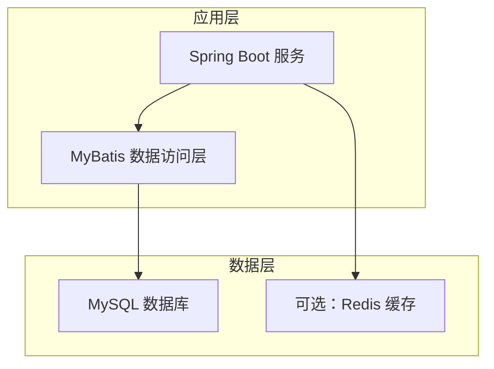
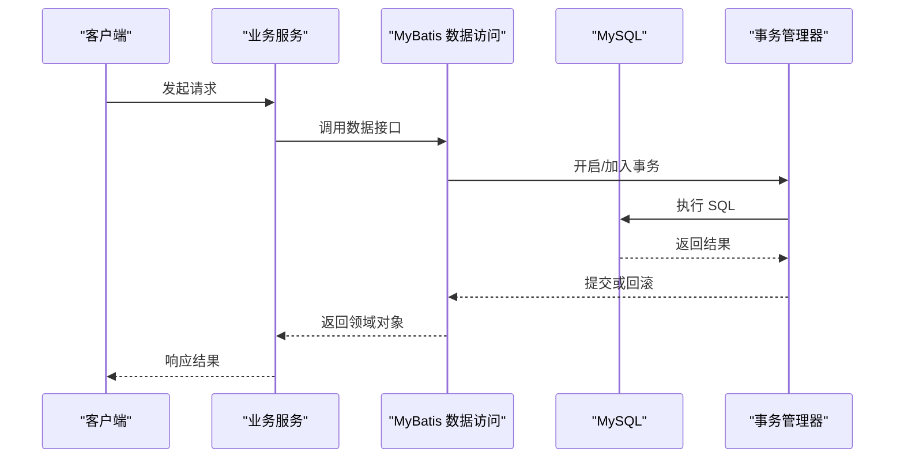
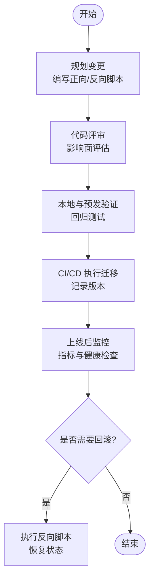
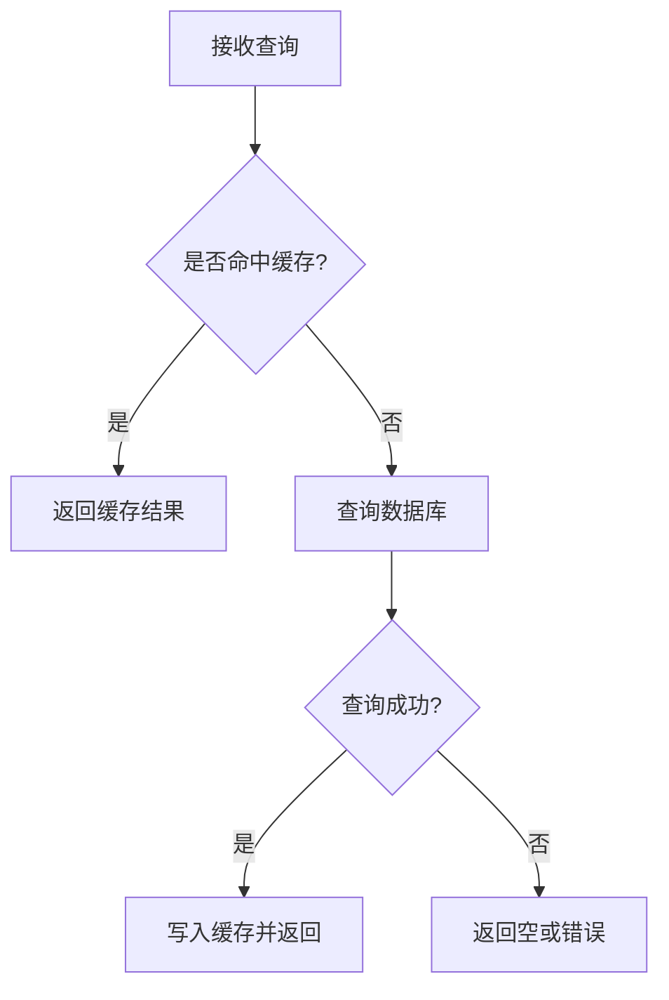
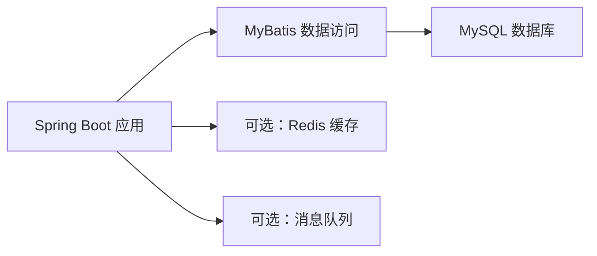

# 数据库概述

<cite>
**本文引用的文件**   
- [README.md](file://README.md)
</cite>

## 目录
1. [简介](#简介)
2. [项目结构](#项目结构)
3. [核心组件](#核心组件)
4. [架构总览](#架构总览)
5. [详细组件分析](#详细组件分析)
6. [依赖分析](#依赖分析)
7. [性能考虑](#性能考虑)
8. [故障排查指南](#故障排查指南)
9. [结论](#结论)
10. [附录](#附录)

## 简介
本概述面向基于 Spring Boot + MyBatis + MySQL 的多端电商平台，聚焦 MySQL 数据库的整体设计原则与落地规范。内容覆盖命名约定、字符集配置、存储引擎选择、版本管理与迁移策略、性能优化（索引、查询、缓存）、安全配置（权限与加密）、以及监控与维护最佳实践。文档同时给出可操作的流程与检查清单，便于团队在工程化实践中统一标准、降低风险并提升稳定性与可维护性。

## 项目结构
当前仓库为课程作业主仓库，后端技术栈明确包含 MySQL。数据库相关的设计与规范将在后续各端独立工程中逐步接入与完善。现阶段以通用电商场景为基础，制定统一的数据库设计规范与治理策略，确保多端一致性与可扩展性。

[本节为概念性说明，未直接分析具体源码文件]

## 核心组件
- 数据持久化：通过 MyBatis 进行 SQL 映射与结果集映射，强调 SQL 可读性与可审计性。
- 连接与事务：由 Spring 管理连接池与事务边界，保证一致性并避免长事务。
- 数据模型：围绕用户、商品、订单、支付、库存等电商核心域建模，遵循范式与反范式平衡原则。
- 变更管理：采用脚本化版本控制与工具化迁移，确保环境一致与回滚能力。

**章节来源**
- [README.md:18-23](file://README.md#L18-L23)

## 架构总览
下图展示从应用到数据库的调用路径与关键职责划分，突出数据访问与事务边界。

[本节为概念性流程图，未直接映射具体源码文件]

## 详细组件分析

### 命名约定与基础规范
- 库名与表名
  - 使用小写英文与下划线分隔，避免保留字；库名体现业务域，如 user、product、order。
  - 表名体现实体与聚合，如 user_info、order_main、order_item。
- 字段命名
  - 小写下划线，语义清晰；布尔用 is_ 前缀；时间戳统一为 created_at、updated_at。
  - 外键逻辑字段以 _id 结尾，物理外键不建议强制约束，保持水平扩展能力。
- 主键与唯一键
  - 主键优先自增或雪花 ID；唯一键用于业务唯一性校验，如手机号、邮箱、订单号。
- 字符集与排序规则
  - 统一使用 utf8mb4，排序规则 utf8mb4_general_ci 或 utf8mb4_0900_ai_ci（视版本）。
- 存储引擎与行格式
  - InnoDB 作为默认引擎；行格式推荐 DYNAMIC，兼顾空间与性能。
- 注释与审计
  - 表与字段需有中文注释；建议增加创建人、修改人、删除标记等审计字段。

**章节来源**
- [README.md:18-23](file://README.md#L18-L23)

### 字符集配置与存储引擎选择
- 字符集
  - 数据库、表、列、连接均使用 utf8mb4，避免表情符号与生僻字异常。
- 存储引擎
  - 交易型与高并发读写的核心表使用 InnoDB；历史归档或只读报表可考虑分区或外部数仓。
- 行格式与页大小
  - 行格式 DYNAMIC；InnoDB 页大小按部署平台默认值，必要时评估 16KB 对大行与压缩的影响。

**章节来源**
- [README.md:18-23](file://README.md#L18-L23)

### 数据库版本管理与迁移方案
- 版本化脚本
  - 所有变更以增量脚本形式管理，文件名含版本号与描述，如 V1.0.0__init.sql、V1.1.0__add_user_index.sql。
- 迁移工具
  - 推荐使用 Flyway/Liquibase 等工具，支持自动校验、回滚与跨环境一致性。
- 分支与发布
  - 结合 Git 分支策略，功能分支内完成脚本编写与本地验证；合并至 develop/main 前完成 CI 校验。
- 回滚策略
  - 每个正向脚本配套反向脚本；重大变更采用灰度与双写过渡，确保可快速回退。
- 幂等与兼容性
  - 脚本具备幂等性；DDL 变更尽量在线可执行，避免锁表与长时间阻塞。

[本节为概念性流程图，未直接映射具体源码文件]

### 性能优化基本原则
- 索引设计
  - 优先为高频过滤、排序与关联条件建立索引；复合索引遵循最左前缀原则。
  - 避免过度索引与冗余索引；定期清理未命中索引。
  - 区分唯一索引与普通索引；对高基数列建索引更有效。
- 查询优化
  - 避免 SELECT *，仅取必要字段；分页使用延迟关联或游标分页。
  - 减少子查询与函数计算，尽量利用索引；合理使用 EXPLAIN 分析执行计划。
  - 拆分复杂查询，必要时引入物化视图或汇总表。
- 缓存策略
  - 热点数据入缓存（如 Redis），设置合理过期与更新策略（Cache-Aside/Write-Through）。
  - 缓存穿透/击穿/雪崩防护：空值缓存、互斥锁、随机过期、限流降级。
  - 读写分离与分库分表：按业务域拆分，热点表垂直拆分，大表水平拆分。

[本节为概念性流程图，未直接映射具体源码文件]

### 安全配置指南
- 用户与权限
  - 最小权限原则：按应用与服务账号隔离，禁止使用 root 直连。
  - 网络白名单与端口限制；生产环境禁用远程登录。
  - 敏感操作审计：开启日志与慢查询日志，定期审查。
- 数据加密
  - 传输加密：启用 TLS/SSL 连接；证书轮换与校验。
  - 静态加密：磁盘级加密或透明数据加密（TDE）；敏感字段应用层加密存储。
- 密钥管理
  - 使用密钥管理服务（KMS）或 Vault 管理密钥；避免硬编码与明文配置。
- 合规与脱敏
  - 日志脱敏；开发/测试使用脱敏数据；定期备份演练与恢复验证。

**章节来源**
- [README.md:18-23](file://README.md#L18-L23)

### 监控与维护最佳实践
- 监控指标
  - QPS/TPS、连接数、锁等待、缓冲池命中率、慢查询数量与耗时、复制延迟。
- 告警与巡检
  - 阈值告警与趋势预警；每日健康检查与容量评估。
- 备份与恢复
  - 全量+增量备份策略；定期恢复演练；异地容灾与多可用区部署。
- 容量规划
  - 按增长曲线规划磁盘与内存；冷热数据分层与归档。
- 变更治理
  - 变更窗口与灰度发布；变更前后对比与回滚预案。

**章节来源**
- [README.md:18-23](file://README.md#L18-L23)

## 依赖分析
- 应用与数据层耦合点
  - Spring Boot 负责生命周期与事务；MyBatis 负责 SQL 映射；MySQL 提供持久化。
- 外部依赖
  - 可选缓存（Redis）、消息队列（异步解耦）、搜索引擎（全文检索）等，按需引入。
- 潜在风险
  - 长事务与锁竞争；N+1 查询；索引失效；连接池耗尽；缓存不一致。

[本节为概念性依赖图，未直接映射具体源码文件]

## 性能考虑
- 连接池参数调优：根据 CPU 与 IO 能力调整最大连接数与超时。
- 事务粒度：缩小事务范围，避免跨服务长事务。
- 批量操作：批量插入/更新减少往返开销。
- 统计信息：定期收集与分析，辅助优化器选择最优计划。
- 资源隔离：读写分离与只读副本分担压力。

[本节为通用指导，无需特定文件引用]

## 故障排查指南
- 常见问题定位
  - 慢查询：导出慢日志，结合 EXPLAIN 定位缺失索引或低效 SQL。
  - 锁等待：查看锁信息与等待链，识别热点行与长事务。
  - 连接泄漏：检查连接池使用率与未关闭连接。
  - 缓存问题：核对缓存键、过期策略与一致性。
- 应急措施
  - 临时降载：限流、熔断、降级；热点数据预热与扩容。
  - 快速回滚：切换至上一稳定版本或回滚数据库变更。

**章节来源**
- [README.md:18-23](file://README.md#L18-L23)

## 结论
本概述基于项目技术栈与电商业务特征，给出了 MySQL 数据库在命名、字符集、存储引擎、版本迁移、性能优化、安全与监控维护方面的系统化规范与实践建议。建议在后续工程接入时，将上述规范纳入 CI/CD 与代码评审流程，持续度量与改进，保障系统在高并发与高可用场景下的稳定表现。

[本节为总结性内容，无需特定文件引用]

## 附录
- 术语
  - DDL/DML：数据定义语言/数据操作语言
  - TDE：透明数据加密
  - KMS：密钥管理服务
- 参考
  - 项目 README 中技术栈与协作规范，作为数据库设计与治理的基础依据。

**章节来源**
- [README.md:18-30](file://README.md#L18-L30)