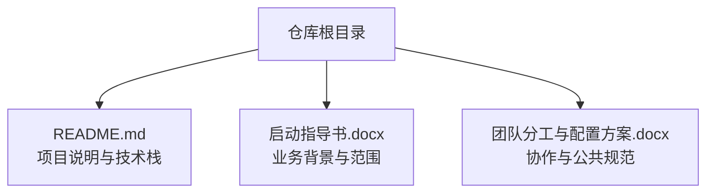
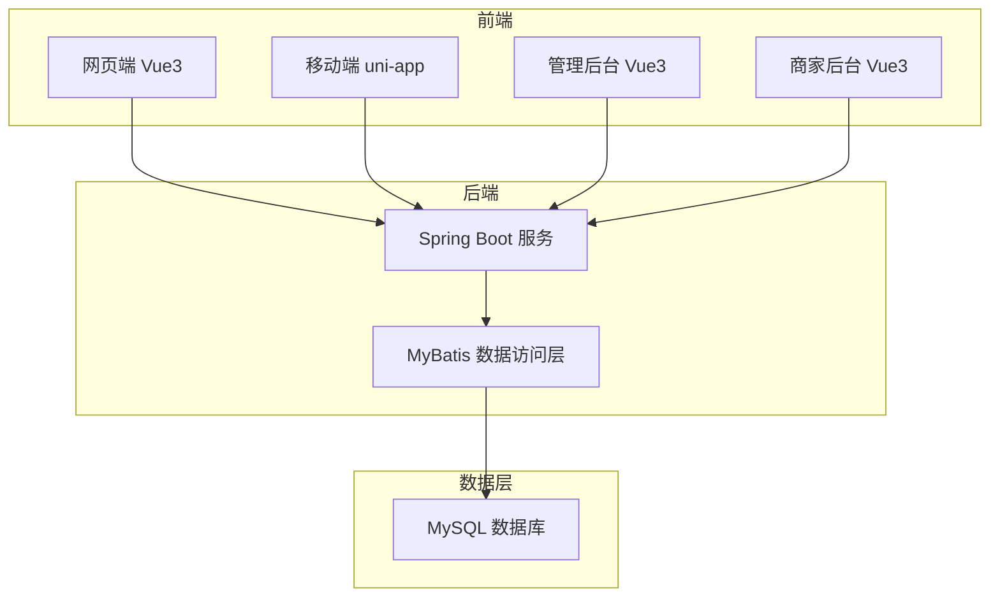
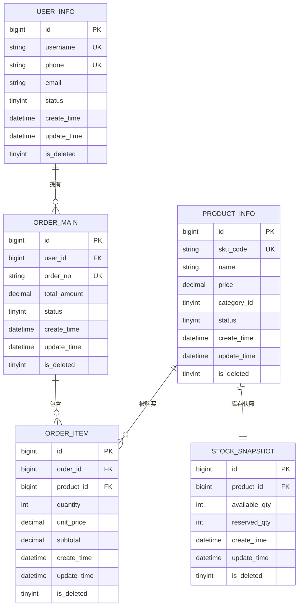
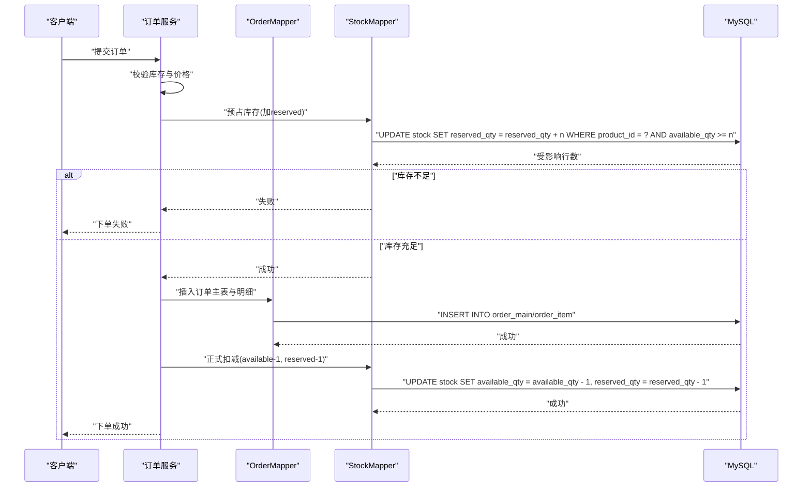
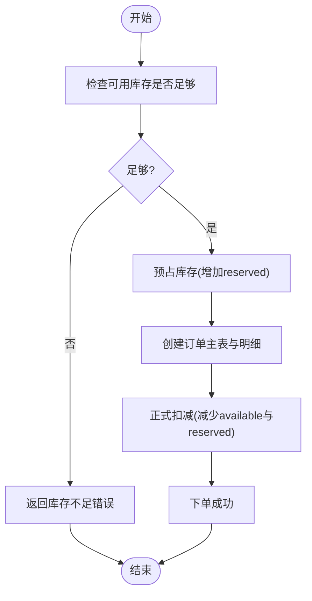
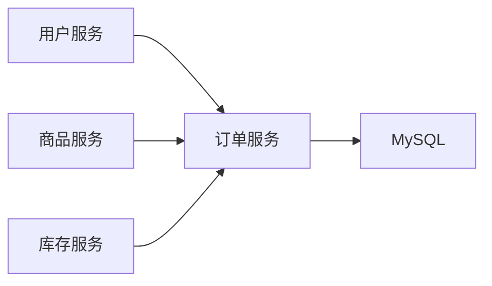

# 数据库设计

<cite>
**本文引用的文件**   
- [README.md](file://README.md)
</cite>

## 目录
1. [引言](#引言)
2. [项目结构](#项目结构)
3. [核心组件](#核心组件)
4. [架构总览](#架构总览)
5. [详细组件分析](#详细组件分析)
6. [依赖分析](#依赖分析)
7. [性能考虑](#性能考虑)
8. [故障排查指南](#故障排查指南)
9. [结论](#结论)
10. [附录](#附录)

## 引言
本数据库设计文档基于仓库中的“京东风格电商平台课程作业”说明与“后端：Spring Boot + MyBatis + MySQL”技术栈，结合电商业务通用实践，给出MySQL数据库的整体设计原则、命名约定、索引策略、性能优化建议；并围绕用户信息、商品信息、订单管理、库存管理等关键实体，提供完整的ER关系设计与表结构规范。同时，给出数据访问层MyBatis的配置和使用规范，包括Mapper接口设计、SQL映射文件组织与事务管理策略。

## 项目结构
当前仓库为课程作业根仓库，包含项目说明与技术栈信息，具体后端工程（含数据库脚本、实体模型、Mapper等）后续接入。因此，本文档以启动指导书与README为依据，输出可落地的数据库设计规范与参考实现方案，便于后续代码落地时直接对照执行。

图表来源
- [README.md:1-35](file://README.md#L1-L35)

章节来源
- [README.md:1-35](file://README.md#L1-L35)

## 核心组件
本节聚焦数据库层面的核心组件与规范，确保在后续代码落地时具备统一的设计约束与质量基线。

- 设计原则
  - 面向业务建模：以用户、商品、订单、库存为核心域，保证高内聚低耦合。
  - 规范化与反规范化平衡：基础主数据遵循第三范式，热点查询路径允许适度冗余以提升性能。
  - 可演进性：预留扩展字段与版本化能力，避免频繁DDL变更。
  - 安全与合规：敏感信息脱敏存储，审计字段完备。

- 命名约定
  - 库名：小写英文，使用下划线分隔，如 jd_shop。
  - 表名：小写英文，使用下划线分隔，语义清晰，如 user_info、product_info、order_main、stock_snapshot。
  - 字段名：小写英文，使用下划线分隔，避免保留字，如 create_time、update_time、is_deleted。
  - 索引名：idx_表名_字段组合，唯一索引 uk_表名_字段组合。
  - 视图/存储过程：v_前缀、sp_前缀（如有）。

- 字符集与排序规则
  - 默认字符集：utf8mb4。
  - 默认排序规则：utf8mb4_general_ci（或 utf8mb4_unicode_ci，视团队偏好统一）。

- 数据类型选择
  - 主键：自增BIGINT或雪花ID BIGINT（推荐雪花ID用于分布式场景）。
  - 金额：DECIMAL(10,2) 或 DECIMAL(12,2)，禁止使用浮点类型。
  - 时间：DATETIME或TIMESTAMP，统一时区策略。
  - 布尔：TINYINT(1)。
  - 文本：VARCHAR/NVARCHAR，大文本使用TEXT。
  - 状态/枚举：TINYINT，配合字典表或注释说明。

- 通用字段
  - id：主键。
  - create_time：创建时间。
  - update_time：更新时间。
  - is_deleted：逻辑删除标志（0未删除，1已删除）。
  - remark：备注。

- 索引策略
  - 主键索引：所有表必须定义主键。
  - 唯一索引：业务唯一键（如手机号、用户名、SKU编码）建立唯一索引。
  - 普通索引：高频查询条件列建索引，避免过度索引。
  - 联合索引：遵循最左前缀原则，将区分度高且常共用的列放前面。
  - 覆盖索引：对热点查询尽量构建覆盖索引以减少回表。
  - 外键：应用层维护关联关系，禁用物理外键以保证可扩展性与分库分表兼容。

- 分区与归档
  - 日志类大表按时间分区（如按月），历史数据定期归档。
  - 冷热数据分离：订单明细可按时间归档至历史库。

- 备份与恢复
  - 全量+增量备份策略，定期演练恢复流程。
  - 重要DDL变更前进行快照备份。

章节来源
- [README.md:18-23](file://README.md#L18-L23)

## 架构总览
整体采用分层架构：前端多端（网页、App、小程序、商家后台、管理员后台）通过API调用后端服务，后端基于Spring Boot + MyBatis访问MySQL。数据库层遵循上述规范，保障数据一致性与高性能。

图表来源
- [README.md:18-23](file://README.md#L18-L23)

## 详细组件分析

### 数据模型与ER关系
以下ER图涵盖用户、商品、订单、库存四大核心域，体现主外键关联与数据完整性约束。

图表来源
- [README.md:18-23](file://README.md#L18-L23)

#### 表结构与字段说明
- 用户信息表 user_info
  - 用途：存储平台用户基本信息与状态。
  - 关键字段：id、username、phone、email、status、create_time、update_time、is_deleted。
  - 约束：主键、唯一索引（用户名、手机号）、逻辑删除。
  - 注意：密码不入库，采用加密令牌或外部鉴权服务。

- 商品信息表 product_info
  - 用途：商品主数据，含价格、分类、状态等。
  - 关键字段：id、sku_code、name、price、category_id、status、create_time、update_time、is_deleted。
  - 约束：主键、唯一索引（SKU编码）、逻辑删除。
  - 注意：价格使用DECIMAL，避免精度丢失。

- 订单主表 order_main
  - 用途：订单头信息，记录总金额、状态、下单用户等。
  - 关键字段：id、user_id、order_no、total_amount、status、create_time、update_time、is_deleted。
  - 约束：主键、唯一索引（订单号）、逻辑删除。
  - 注意：订单号全局唯一，建议使用雪花算法生成。

- 订单明细表 order_item
  - 用途：订单中每个商品的购买明细。
  - 关键字段：id、order_id、product_id、quantity、unit_price、subtotal、create_time、update_time、is_deleted。
  - 约束：主键、逻辑删除。
  - 注意：unit_price与subtotal需与下单时刻快照一致，避免后续价格变动影响历史订单。

- 库存快照表 stock_snapshot
  - 用途：商品可用库存与预留库存的快照，支撑下单扣减与超卖防护。
  - 关键字段：id、product_id、available_qty、reserved_qty、create_time、update_time、is_deleted。
  - 约束：主键、逻辑删除。
  - 注意：库存操作需原子化，结合事务与乐观锁/版本号控制。

章节来源
- [README.md:18-23](file://README.md#L18-L23)

### 数据访问层：MyBatis配置与使用规范
- 工程组织
  - Mapper接口：按模块划分包，如 com.jdshop.mapper.user、com.jdshop.mapper.product、com.jdshop.mapper.order、com.jdshop.mapper.stock。
  - SQL映射文件：resources/mapper/{module}/*.xml，与接口一一对应。
  - 实体类：resources/entity/{module}/*.java，与表结构保持一致。

- 连接与事务
  - 数据源：使用Spring Boot DataSource配置，读写分离与连接池参数按需调整。
  - 事务：Service层使用@Transactional标注，明确传播行为与隔离级别；跨多个Mapper的方法统一事务边界。
  - 重试与幂等：对写操作增加幂等键（如订单号），防止重复提交。

- 分页与查询
  - 分页：使用PageHelper或MyBatis拦截器，避免在SQL中使用LIMIT偏移过大。
  - 动态SQL：合理使用<if>/<foreach>等标签，减少硬编码拼接。
  - 结果映射：使用resultMap处理复杂对象与嵌套查询，避免N+1问题。

- 审计与软删除
  - 自动填充：使用MyBatis拦截器或框架能力自动填充create_time/update_time/is_deleted。
  - 软删除：查询默认追加is_deleted=0条件，更新时仅标记删除。

- 缓存策略
  - 一级缓存：谨慎使用，避免长事务导致脏读。
  - 二级缓存：仅在只读热点数据启用，注意失效策略。
  - 应用缓存：Redis缓存热点商品与库存，DB作为权威源。

章节来源
- [README.md:18-23](file://README.md#L18-L23)

### 关键业务流程与数据一致性

#### 下单流程（序列图）

图表来源
- [README.md:18-23](file://README.md#L18-L23)

#### 库存扣减流程（流程图）

图表来源
- [README.md:18-23](file://README.md#L18-L23)

## 依赖分析
- 技术栈依赖
  - Spring Boot：提供Web容器、依赖注入、事务管理。
  - MyBatis：ORM映射、动态SQL、插件生态。
  - MySQL：关系型数据存储，支持事务与索引。

- 模块间依赖
  - 订单服务依赖库存服务（或同服务内方法）完成库存预占与扣减。
  - 商品服务提供商品主数据与价格信息。
  - 用户服务提供用户信息与权限校验。

图表来源
- [README.md:18-23](file://README.md#L18-L23)

## 性能考虑
- 索引优化
  - 针对高频查询列建立合适索引，避免选择性低的列单独建索引。
  - 使用EXPLAIN分析慢查询，优化SQL与索引。
- 事务与锁
  - 缩短事务范围，避免长事务持有锁。
  - 库存扣减使用行级锁与条件更新，防止超卖。
- 读写分离与缓存
  - 读多写少场景启用读写分离。
  - 热点数据使用Redis缓存，设置合理过期与失效策略。
- 分库分表
  - 订单与明细等大表按用户ID或时间分片，提升写入与查询性能。
- 监控与告警
  - 监控慢查询、锁等待、连接池使用率，及时告警与扩容。

[本节为通用性能建议，无需特定文件引用]

## 故障排查指南
- 常见问题
  - 超卖：检查库存扣减是否为原子操作，是否存在并发竞争。
  - 订单不一致：核对事务边界与异常回滚路径。
  - 慢查询：定位缺失索引或SQL写法不当。
- 排查步骤
  - 查看MySQL慢查询日志与EXPLAIN计划。
  - 检查事务日志与锁等待情况。
  - 核对应用日志与链路追踪，确认异常分支。

[本节为通用排障建议，无需特定文件引用]

## 结论
本数据库设计文档基于仓库提供的技术栈与业务背景，给出了MySQL数据库的设计原则、命名与索引规范、核心实体ER关系与表结构说明，以及MyBatis数据访问层的配置与使用规范。后续在代码落地时，可直接依据本文档进行DDL脚本编写、实体与Mapper实现、事务与索引优化，确保系统具备良好的性能与可维护性。

[本节为总结性内容，无需特定文件引用]

## 附录
- 术语
  - SKU：库存保有单位，商品的最小库存单元。
  - 预占库存：下单成功后暂时锁定库存，支付完成后正式扣减。
  - 逻辑删除：通过标志位标记删除，而非物理删除。

[本节为补充说明，无需特定文件引用]