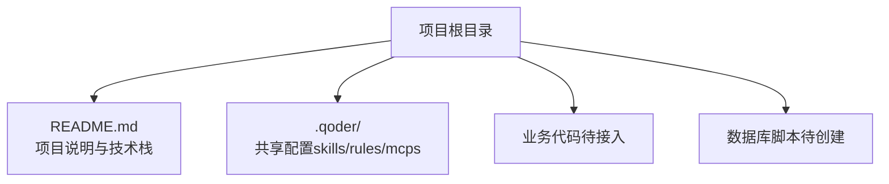
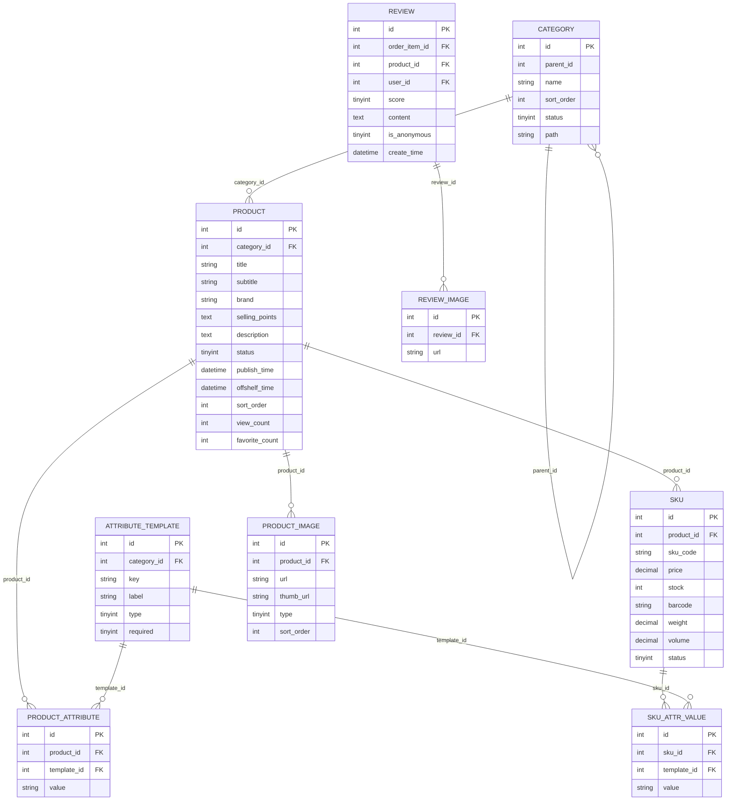
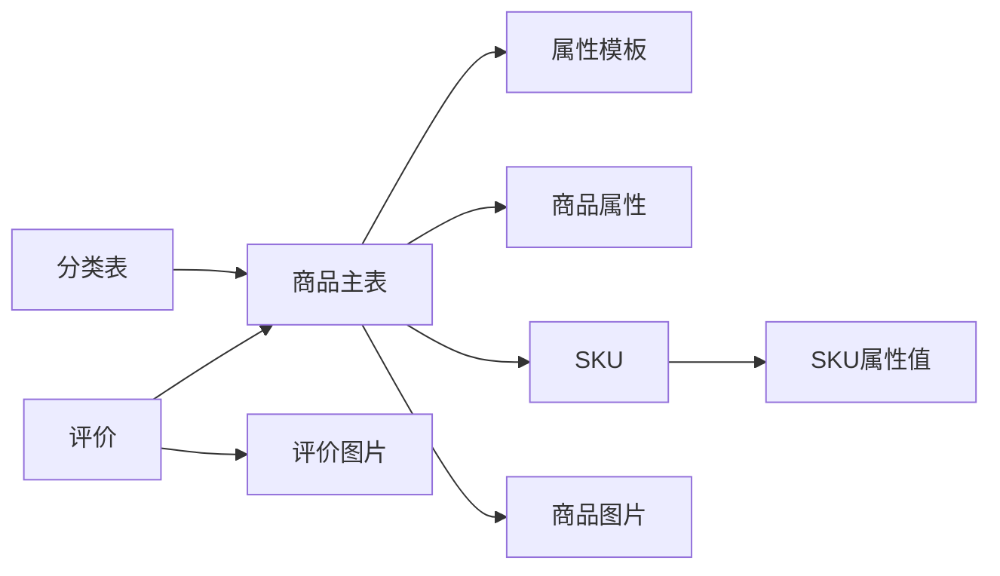

# 商品数据模型

<cite>
**本文引用的文件**   
- [README.md](file://README.md)
</cite>

## 目录
1. [简介](#简介)
2. [项目结构](#项目结构)
3. [核心组件](#核心组件)
4. [架构总览](#架构总览)
5. [详细组件分析](#详细组件分析)
6. [依赖分析](#依赖分析)
7. [性能考虑](#性能考虑)
8. [故障排查指南](#故障排查指南)
9. [结论](#结论)
10. [附录](#附录)

## 简介
本文件面向“京东风格电商平台课程作业”的商品数据模型设计，聚焦以下目标：
- 商品分类体系：一级、二级、三级分类的层级关系与扩展性。
- 商品主表结构：名称、价格、库存、状态等核心字段。
- 商品属性模型：规格参数、SKU 管理、图片管理等。
- 评价系统：评价表结构、评分机制、图片评价等数据设计。
- 搜索索引设计与性能优化策略。

本项目技术栈为后端 Spring Boot + MyBatis + MySQL，前端多端（网页、后台、移动端）后续接入。当前仓库以文档与配置为主，代码工程尚未落地，因此本文提供可落地的数据模型与索引方案，便于后续在数据库层实现。

章节来源
- [README.md:1-35](file://README.md#L1-L35)

## 项目结构
当前仓库包含项目说明与技术栈信息，实际业务代码与数据库脚本尚未提交。基于此，本文给出推荐的数据模型与索引设计方案，供后续开发直接落地到 MySQL 与 MyBatis 映射中。

图表来源
- [README.md:1-35](file://README.md#L1-L35)

章节来源
- [README.md:1-35](file://README.md#L1-L35)

## 核心组件
本节从数据维度定义商品域的核心实体与关系，覆盖分类、商品、属性/SKU、图片、评价与搜索索引。

- 分类体系
  - 分类表支持多级树形结构，通过父级 ID 自关联，至少支持一、二、三级；预留扩展至更多层级。
  - 关键字段：分类 ID、父级 ID、分类名称、排序、状态、路径/编码（可选）。
- 商品主表
  - 关键字段：商品 ID、类目 ID（建议指向叶子类目）、商品名称、副标题、品牌、卖点、描述、状态、上架时间、下架时间、排序、浏览量、收藏量等。
  - 价格与库存：为避免冗余与一致性风险，价格与库存建议下沉到 SKU 维度；主表仅保留展示用基础信息与统计指标。
- 商品属性与 SKU
  - 属性模板：按类目或品牌维护属性键值对模板，用于规范商品规格。
  - 商品属性：将具体商品的属性值与模板绑定，支持通用属性与自定义属性。
  - SKU：唯一组合由一组属性值决定，记录价格、库存、条码、重量体积等交易相关元数据。
- 商品图片
  - 主图与详情图分离，支持多图顺序与缩略图地址，便于前端渲染与 CDN 缓存。
- 评价系统
  - 订单-商品评价关联，支持评分（1-5）、文字内容、图片列表、是否匿名、商家回复等。
  - 汇总指标：好评率、平均评分、带图比例等，可定期聚合计算。
- 搜索索引
  - 采用 MySQL 全文索引或外部搜索引擎（如 Elasticsearch）进行关键词检索、过滤与排序。
  - 索引字段包括：商品名、副标题、卖点、品牌、类目路径、关键属性值等。

章节来源
- [README.md:1-35](file://README.md#L1-L35)

## 架构总览
下图展示商品数据模型的整体关系，涵盖分类、商品、属性/SKU、图片与评价的实体关系。

图表来源
- [README.md:1-35](file://README.md#L1-L35)

## 详细组件分析

### 分类体系设计
- 层级关系
  - 使用自关联 parent_id 构建多级树，默认支持一、二、三级；path 字段可存储“1/12/345”类路径，加速祖先查询与面包屑生成。
- 常用操作
  - 新增/移动：更新 parent_id 与 path，必要时重建子树 path。
  - 查询：根据 category_id 获取子分类集合；根据 path 前缀获取某分支下所有叶子节点。
- 约束与校验
  - 禁止循环引用；同一父级下分类名称唯一；删除前检查是否存在子分类或被商品引用。

章节来源
- [README.md:1-35](file://README.md#L1-L35)

### 商品主表结构
- 核心字段
  - 标识与归属：id、category_id（建议指向叶子类目）。
  - 展示信息：title、subtitle、brand、selling_points、description。
  - 状态与时间：status、publish_time、offshelf_time。
  - 排序与热度：sort_order、view_count、favorite_count。
- 设计要点
  - 价格与库存不放在主表，避免冗余与一致性问题；统一由 SKU 维度维护。
  - 状态机：草稿、已上架、已下架、审核中、已拒绝等，结合发布/下架时间控制可见性。

章节来源
- [README.md:1-35](file://README.md#L1-L35)

### 商品属性与 SKU 管理
- 属性模板
  - 按类目或品牌定义属性键值对模板，区分类型（文本、数值、枚举、颜色、尺寸等），标记必填项。
- 商品属性
  - 将商品实例与模板绑定，记录具体取值；支持重复键合并与校验。
- SKU 设计
  - 每个 SKU 对应一组属性值组合，具备独立的价格、库存、条码、重量体积等交易元数据。
  - SKU 与属性值的多对多关系通过中间表维护，确保组合唯一性与可追溯性。
- 变更影响
  - 修改模板需评估历史数据兼容；新增属性值不影响已有 SKU；删除属性值需判断是否被引用。

章节来源
- [README.md:1-35](file://README.md#L1-L35)

### 商品图片管理
- 图片类型
  - 主图、详情图、白底图、场景图等，通过 type 字段区分。
- 存储与访问
  - 保存原图 URL 与缩略图 URL，缩略图用于列表页与详情页预览，提升加载性能。
- 排序与展示
  - 通过 sort_order 控制展示顺序；支持批量上传与异步处理。

章节来源
- [README.md:1-35](file://README.md#L1-L35)

### 评价系统设计
- 评价主体
  - 评价与订单明细关联，同时记录商品与用户，支持匿名评价。
- 评分机制
  - 评分范围 1-5，支持整数或小数（视需求）；计算平均评分与好评率（≥4 分为好评）。
- 图片评价
  - 评价可附带多张图片，图片表与评价表一对多关联。
- 商家回复
  - 可在评价表增加 reply_content、reply_time 等字段，或在独立回复表中维护。

章节来源
- [README.md:1-35](file://README.md#L1-L35)

### 搜索索引设计与优化
- 索引策略
  - 轻量方案：MySQL 全文索引（ngram/InnoDB），适用于中文分词与基本检索。
  - 高性能方案：引入 Elasticsearch，建立商品索引，支持高亮、同义词、权重、聚合与复杂过滤。
- 索引字段
  - 标题、副标题、卖点、品牌、类目路径、关键属性值（如颜色、尺寸）。
- 同步机制
  - 写后异步同步：商品/属性/SKU 变更触发消息队列，消费者更新索引。
- 查询优化
  - 热点查询走缓存（Redis）；分页查询使用游标或延迟关联；避免深分页。

章节来源
- [README.md:1-35](file://README.md#L1-L35)

## 依赖分析
- 模块内聚与耦合
  - 分类与商品强耦合（category_id），但通过叶子类目约束降低歧义。
  - 商品与 SKU 一对多，SKU 与属性值多对多，形成典型电商模型。
  - 评价与商品弱耦合（product_id 冗余），便于快速统计与展示。
- 外部依赖
  - 对象存储（图片 URL）、消息队列（索引同步）、缓存（Redis）、搜索引擎（Elasticsearch，可选）。

图表来源
- [README.md:1-35](file://README.md#L1-L35)

章节来源
- [README.md:1-35](file://README.md#L1-L35)

## 性能考虑
- 数据库层面
  - 合理索引：category_id、status、publish_time、sort_order、price 等高频查询列建索引。
  - 读写分离与分库分表：商品与 SKU 量大时可按商品 ID 哈希分片。
  - 冷热分离：历史评价与详情归档。
- 应用层面
  - 缓存热点商品与类目树；SKU 库存扣减使用乐观锁或分布式锁。
  - 图片压缩与 CDN 分发；懒加载与按需生成缩略图。
- 搜索层面
  - 增量同步与批量重建；查询路由到只读副本；结果集分页与预取。

[本节为通用性能建议，无需特定文件来源]

## 故障排查指南
- 常见问题定位
  - 分类树异常：检查 parent_id 与 path 一致性，验证无环引用。
  - SKU 冲突：校验属性值组合唯一性，避免重复 SKU。
  - 评价统计偏差：核对评分范围与好评阈值，确认聚合任务执行成功。
  - 搜索不一致：核对索引同步日志与重试策略，必要时重建索引。
- 监控与告警
  - 关注慢查询、索引命中率、队列积压、ES 集群健康度。

[本节为通用排障建议，无需特定文件来源]

## 结论
本文围绕商品数据模型给出了分类、商品、属性/SKU、图片与评价的系统化设计，并提供了搜索索引与性能优化策略。该方案与项目的 Spring Boot + MyBatis + MySQL 技术栈契合，可直接指导后续数据库建模与 MyBatis 映射实现。随着各端工程接入，可按本文模型逐步落地与演进。

[本节为总结性内容，无需特定文件来源]

## 附录
- 术语
  - SKU：库存保有单位，代表商品的最小可售单元。
  - 属性模板：用于规范商品属性的键值对定义。
  - 全文索引：支持自然语言检索的索引方式。
- 参考
  - 项目 README 中的技术栈与协作规范可作为实现约束与流程依据。

章节来源
- [README.md:1-35](file://README.md#L1-L35)