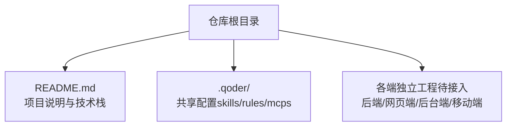
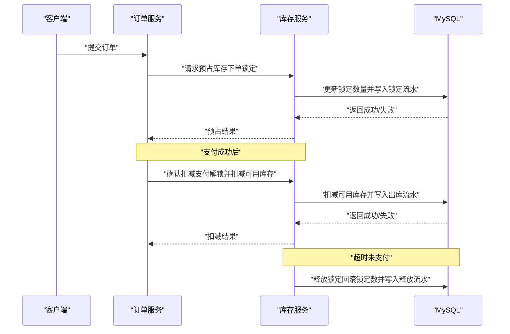
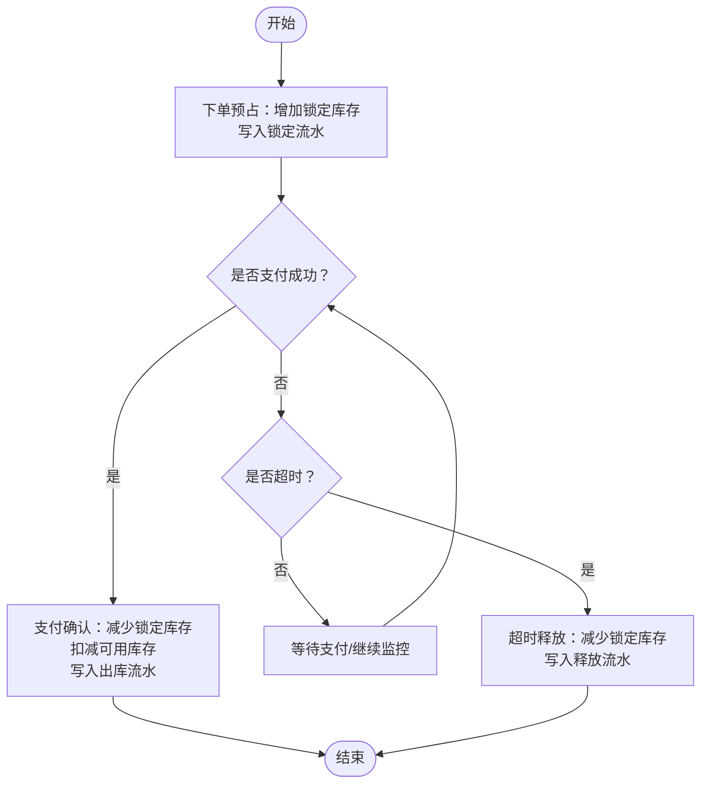
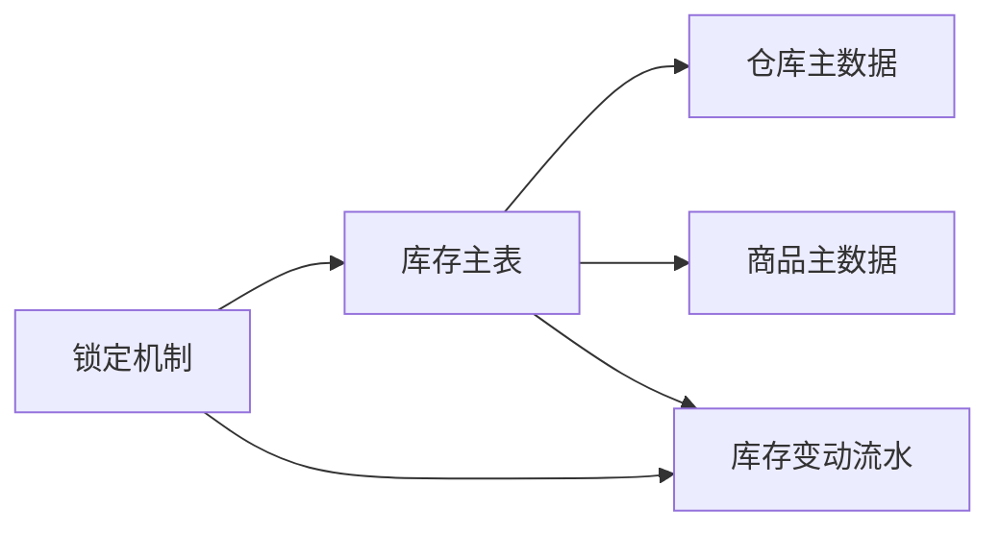

# 库存数据模型

<cite>
**本文引用的文件**   
- [README.md](file://README.md)
</cite>

## 目录
1. [简介](#简介)
2. [项目结构](#项目结构)
3. [核心组件](#核心组件)
4. [架构总览](#架构总览)
5. [详细组件分析](#详细组件分析)
6. [依赖分析](#依赖分析)
7. [性能考虑](#性能考虑)
8. [故障排查指南](#故障排查指南)
9. [结论](#结论)
10. [附录](#附录)

## 简介
本文件面向“京东风格电商平台课程作业”的库存子系统，聚焦于库存数据模型的总体设计：包括库存主表、库存变动记录（入库/出库/调整）、多仓库基础信息、以及库存锁定与并发一致性保障方案。由于当前仓库尚未包含后端代码实现，本文以技术栈说明为依据，给出可落地的数据库与流程设计建议，便于后续在 Spring Boot + MyBatis + MySQL 的技术栈中落地实施。

## 项目结构
当前仓库为课程作业聚合仓库，主要包含项目说明文档与技术栈信息，后端、前端与移动端工程后续接入。库存相关的数据模型与业务逻辑将在后端工程中实现，采用 Spring Boot + MyBatis + MySQL 进行持久化与服务编排。

**图表来源**
- [README.md:1-35](file://README.md#L1-L35)

**章节来源**
- [README.md:1-35](file://README.md#L1-L35)

## 核心组件
围绕库存领域，建议拆分为以下数据模型与业务流程支撑对象：
- 库存主表：商品维度 × 仓库维度的可用库存快照与预警阈值
- 库存变动记录：入库、出库、调整三类流水，用于审计与对账
- 多仓库管理：仓库基础信息与状态
- 库存锁定：下单锁定、支付解锁、超时释放等状态流转
- 并发控制与一致性：基于行级锁、乐观锁、幂等键与事务边界的设计要点

上述模型与流程将作为后续后端实现的参考蓝图。

**章节来源**
- [README.md:18-23](file://README.md#L18-L23)

## 架构总览
从数据与流程视角，库存子系统的关键交互如下：

该序列图展示了下单锁定、支付解锁与超时释放的核心数据流，具体实现细节见后文“详细组件分析”。

**图表来源**
- [README.md:18-23](file://README.md#L18-L23)

## 详细组件分析

### 库存主表（按商品×仓库）
- 设计目标
  - 提供“商品ID + 仓库ID”维度的可用库存快照
  - 支持安全库存预警阈值
  - 支持高并发下的快速读取与稳定写入
- 关键字段建议
  - 主键：自增或雪花ID
  - 商品ID：关联商品主数据
  - 仓库ID：关联仓库主数据
  - 可用库存：当前可售卖数量
  - 锁定库存：已下单未支付的占用量
  - 实际库存：可用库存 + 锁定库存（可选冗余字段，便于统计）
  - 预警阈值：低于此值触发补货或告警
  - 版本：乐观锁版本号，避免并发覆盖
  - 时间戳：创建/更新时间
- 索引建议
  - 唯一索引：(商品ID, 仓库ID)
  - 查询索引：(仓库ID)、(商品ID)
  - 预警扫描索引：(预警阈值, 可用库存)
- 复杂度与一致性
  - 读路径：O(1) 直接定位
  - 写路径：通过行级锁或乐观锁保证一致；结合流水表做最终一致性校验

**章节来源**
- [README.md:18-23](file://README.md#L18-L23)

### 库存变动记录（入库/出库/调整）
- 设计目标
  - 全量记录库存变化原因、方向与数量，满足审计与对账
- 关键字段建议
  - 主键：自增或雪花ID
  - 关联维度：商品ID、仓库ID、批次号（可选）
  - 变动类型：入库、出库、调整、锁定、释放等
  - 变动数量：正负表示增减
  - 单号来源：采购单/销售单/调拨单/系统调整单等
  - 操作人/系统：人工或系统自动
  - 备注：变更原因、策略标识
  - 时间戳：发生时间
- 幂等与去重
  - 引入“幂等键”（如业务单号+类型），防止重复写入
- 复杂度与一致性
  - 追加写入，O(1)
  - 与库存主表通过事务或异步补偿保持一致性

**章节来源**
- [README.md:18-23](file://README.md#L18-L23)

### 多仓库管理（仓库基础信息）
- 设计目标
  - 统一管理仓库元数据与运营状态
- 关键字段建议
  - 主键：自增或雪花ID
  - 仓库编码/名称：唯一标识与展示名
  - 地址/经纬度：仓储位置
  - 状态：启用/停用/盘点中等
  - 负责人/联系方式：运维对接
  - 时间戳：创建/更新时间
- 索引建议
  - 唯一索引：(仓库编码)
  - 查询索引：(状态)

**章节来源**
- [README.md:18-23](file://README.md#L18-L23)

### 库存锁定机制（下单锁定、支付解锁、超时释放）
- 设计目标
  - 在高并发场景下确保“可售库存不超卖”，同时兼顾用户体验与资源回收
- 关键流程
  - 下单锁定：在库存主表中增加“锁定库存”，并写入“锁定流水”
  - 支付解锁：支付成功后，将“锁定库存”转为“可用库存”或直接扣减，并写入“出库流水”
  - 超时释放：超过支付时限仍未支付，则释放“锁定库存”，并写入“释放流水”
- 数据结构建议
  - 库存主表：可用库存、锁定库存、版本
  - 锁定流水：商品ID、仓库ID、订单ID、锁定数量、锁定时间、过期时间、状态
- 并发与一致性
  - 使用行级锁或乐观锁更新库存主表
  - 锁定流水作为不可变事件源，配合定时任务或延迟队列处理超时释放
  - 幂等键避免重复释放或重复扣减

**图表来源**
- [README.md:18-23](file://README.md#L18-L23)

**章节来源**
- [README.md:18-23](file://README.md#L18-L23)

### 并发控制与数据一致性保障
- 行级锁与悲观锁
  - 针对热点商品×仓库的行，使用 SELECT ... FOR UPDATE 或等效机制，串行化更新
- 乐观锁
  - 通过版本号字段比较，失败重试，降低锁竞争
- 幂等设计
  - 所有写操作均携带幂等键（如订单ID+类型），防止重复执行导致数据不一致
- 事务边界
  - 库存主表更新与流水写入置于同一事务，保证原子性
- 补偿与对账
  - 定时任务比对库存主表与流水累计，发现差异时生成修复流水
- 缓存与读写分离
  - 读路径可使用只读副本或缓存加速，但写路径必须走主库并保证顺序

**章节来源**
- [README.md:18-23](file://README.md#L18-L23)

## 依赖分析
- 外部依赖
  - 数据库：MySQL（关系型存储、事务、锁）
  - ORM：MyBatis（SQL映射与批量操作）
  - 应用框架：Spring Boot（事务、调度、集成能力）
- 模块内依赖
  - 库存主表依赖仓库主数据与商品主数据
  - 库存变动记录依赖业务单号（订单/采购/调拨等）
  - 锁定机制依赖订单生命周期事件（创建、支付、超时）

**图表来源**
- [README.md:18-23](file://README.md#L18-L23)

**章节来源**
- [README.md:18-23](file://README.md#L18-L23)

## 性能考虑
- 热点行优化
  - 对热销商品×仓库组合，优先使用行级锁+短事务，减少锁持有时间
- 批量操作
  - 入库/调整等批处理场景，使用批量插入/更新提升吞吐
- 索引优化
  - 合理建立唯一索引与查询索引，避免全表扫描
- 异步与削峰
  - 非关键路径（如通知、报表）异步化，缩短主链路耗时
- 监控与限流
  - 对库存接口设置熔断与限流，保护数据库

[本节为通用性能建议，无需特定文件引用]

## 故障排查指南
- 常见异常
  - 超卖：检查并发锁与幂等键是否正确生效
  - 库存不一致：核对流水累计与主表快照差异，必要时触发补偿
  - 锁定未释放：检查超时任务与延迟队列是否正常消费
- 排查步骤
  - 根据订单ID追踪锁定流水与出库流水
  - 对比库存主表与流水汇总，定位差异点
  - 查看数据库锁等待与慢查询日志，评估热点行与索引有效性

**章节来源**
- [README.md:18-23](file://README.md#L18-L23)

## 结论
本文基于仓库提供的技术栈信息，给出了库存数据模型的完整设计方案，涵盖库存主表、变动流水、多仓库管理与锁定机制，并提供了并发控制与一致性保障的实践要点。后续可在 Spring Boot + MyBatis + MySQL 的工程中逐步落地，并通过流水对账与补偿机制确保长期稳定性。

[本节为总结性内容，无需特定文件引用]

## 附录
- 术语
  - 可用库存：当前可售卖的数量
  - 锁定库存：已下单但未支付的占用量
  - 实际库存：可用库存 + 锁定库存（可选冗余）
  - 预警阈值：触发补货或告警的安全线
- 扩展建议
  - 批次/效期管理：适用于食品、医药等需要批次追溯的场景
  - 多单位换算：主单位与辅单位转换规则
  - 分仓路由：按区域或库存分布智能选择发货仓库

[本节为概念性补充，无需特定文件引用]