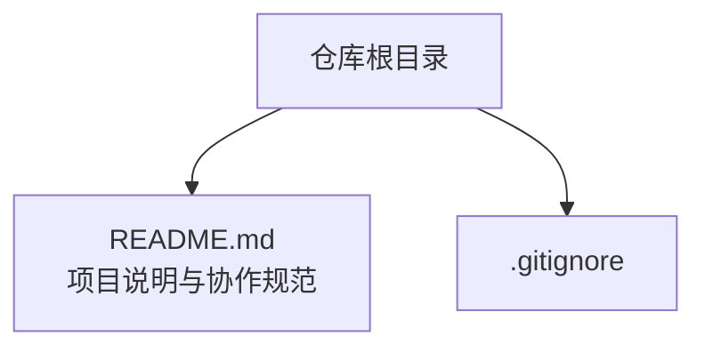
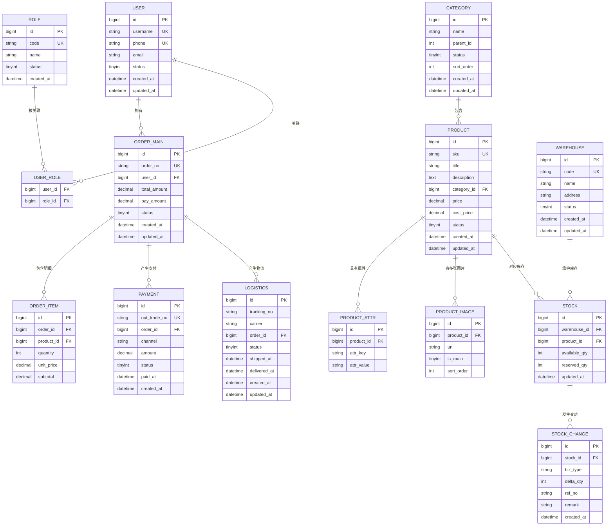
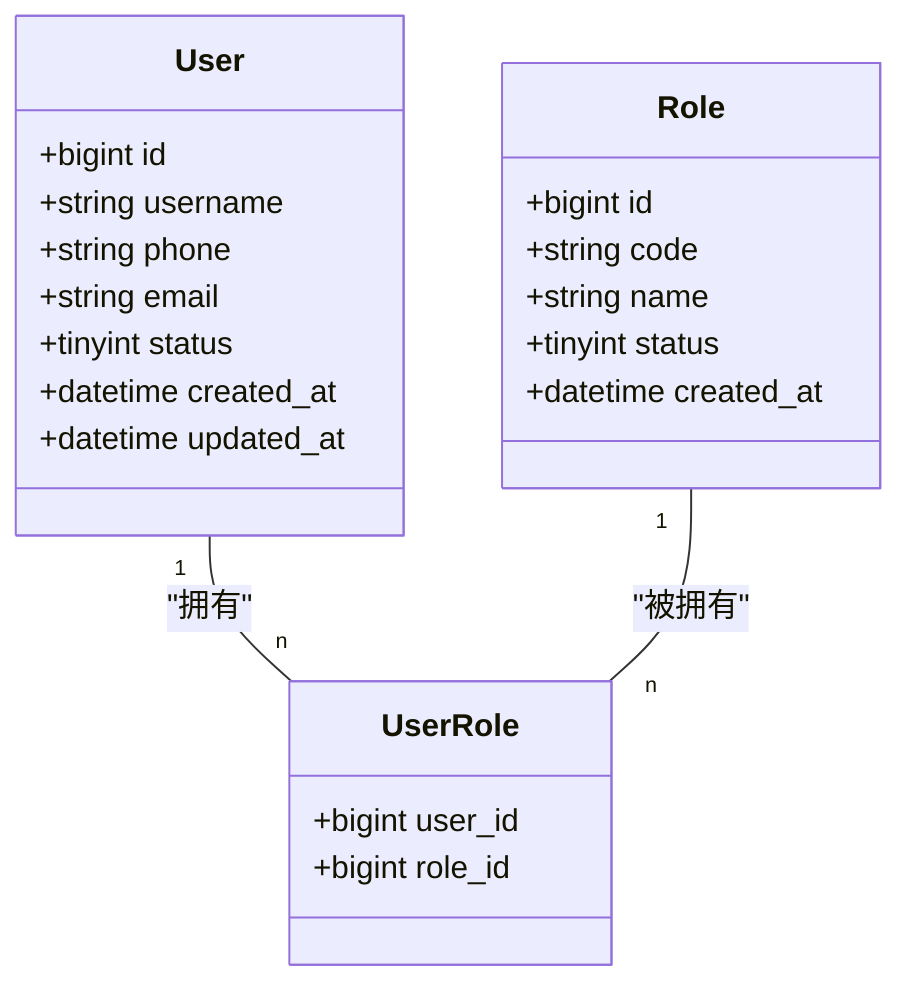
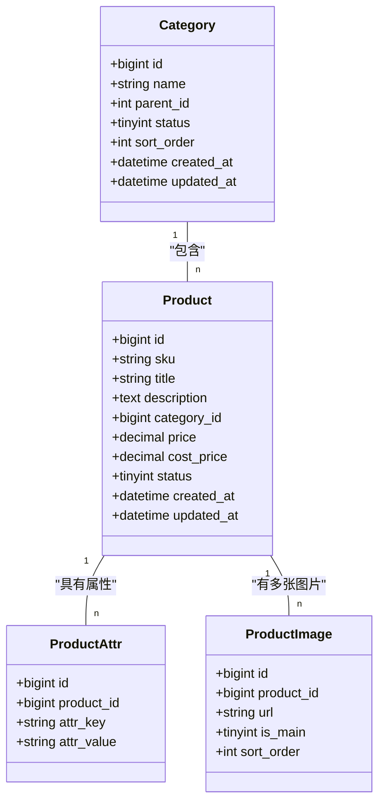
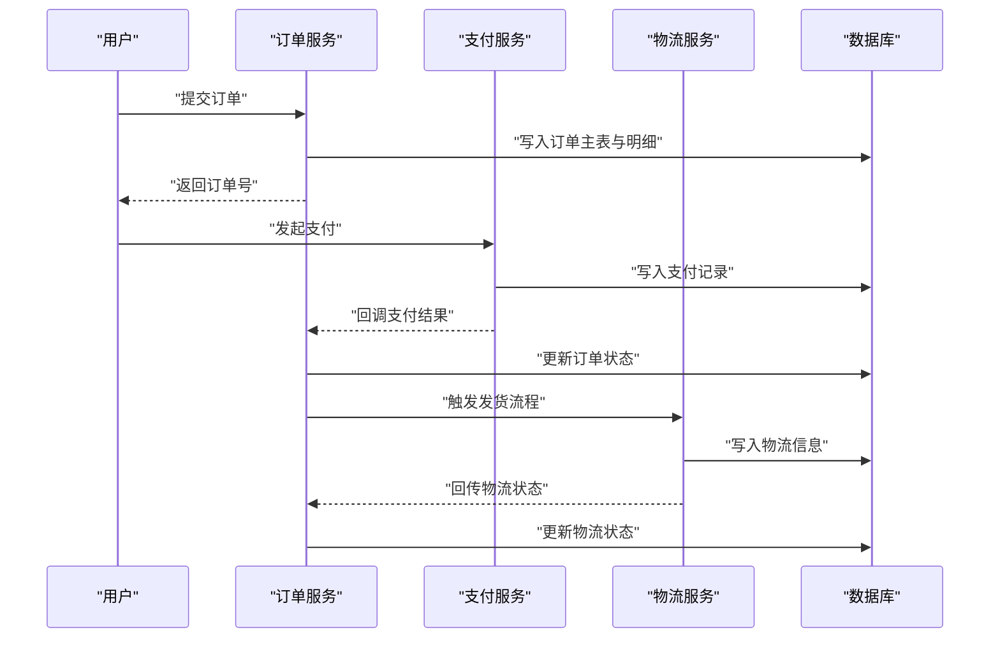
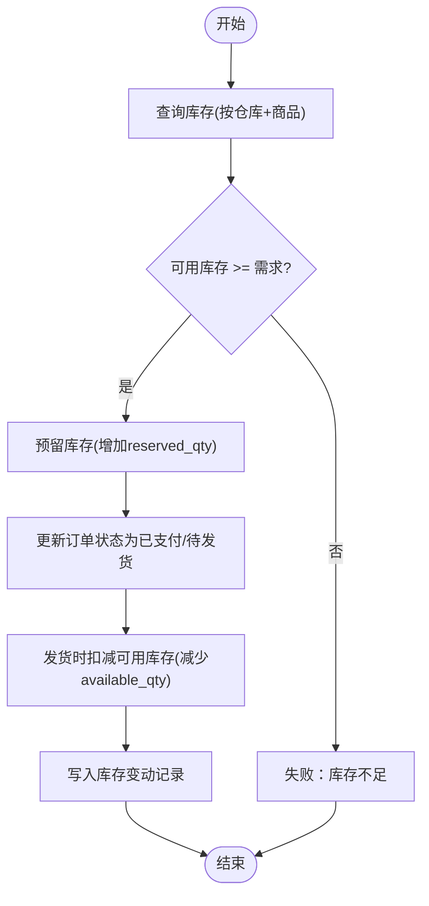
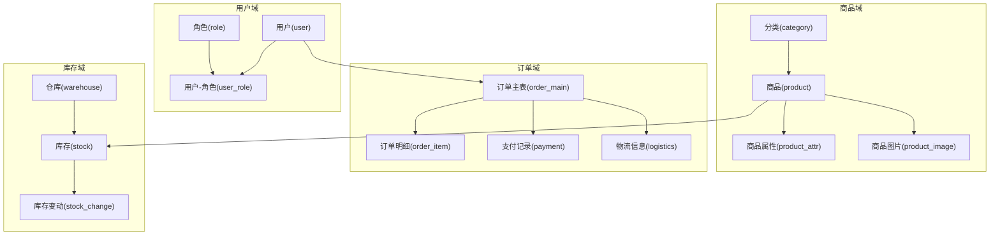

# 核心数据模型

<cite>
**本文引用的文件**   
- [README.md](file://README.md)
</cite>

## 目录
1. [简介](#简介)
2. [项目结构](#项目结构)
3. [核心组件](#核心组件)
4. [架构总览](#架构总览)
5. [详细组件分析](#详细组件分析)
6. [依赖分析](#依赖分析)
7. [性能考虑](#性能考虑)
8. [故障排查指南](#故障排查指南)
9. [结论](#结论)
10. [附录](#附录)

## 简介
本文件聚焦于“京东风格电商平台”的核心数据模型，覆盖用户、商品、订单与库存四大域的数据结构设计。目标是提供清晰的实体关系图（ER）与字段定义说明，帮助开发团队在统一规范下完成数据库设计与实现。由于当前仓库仅包含项目说明文档，未包含具体代码或数据库脚本，本文档基于通用电商领域实践给出推荐模型，并标注后续落地时需结合后端技术栈（Spring Boot + MyBatis + MySQL）进行细化与校验。

## 项目结构
当前仓库为课程作业仓库，主要包含项目说明与协作规范，尚未包含后端、前端或数据库相关源码。因此，本节不直接分析具体代码文件。

**章节来源**
- [README.md:1-35](file://README.md#L1-L35)

## 核心组件
围绕业务目标，核心数据模型分为以下四个子域：
- 用户域：用户信息、角色与权限、状态管理
- 商品域：分类、详情、属性、图片
- 订单域：订单主表、明细、支付记录、物流信息
- 库存域：库存、库存变动记录、仓库管理

各子域的实体与关系如下文所示。

## 架构总览
下图展示四大核心实体的总体关系，便于从全局把握数据流向与关联边界。

**图表来源**
- [README.md:1-35](file://README.md#L1-L35)

## 详细组件分析

### 用户域模型
- 用户表（user）
  - 关键字段：id、username、phone、email、status、created_at、updated_at
  - 设计要点：用户名与手机号唯一；status用于账号启用/禁用等状态控制；审计字段记录创建与更新时间
- 角色表（role）
  - 关键字段：id、code、name、status、created_at
  - 设计要点：code作为角色编码唯一标识，便于权限系统对接
- 用户-角色关联表（user_role）
  - 关键字段：user_id、role_id
  - 设计要点：多对多关系，支持一个用户具备多个角色

**图表来源**
- [README.md:1-35](file://README.md#L1-L35)

**章节来源**
- [README.md:1-35](file://README.md#L1-L35)

### 商品域模型
- 分类表（category）
  - 关键字段：id、name、parent_id、status、sort_order、created_at、updated_at
  - 设计要点：通过parent_id实现树形分类；sort_order用于排序
- 商品表（product）
  - 关键字段：id、sku、title、description、category_id、price、cost_price、status、created_at、updated_at
  - 设计要点：sku唯一；价格字段区分售价与成本价；status控制上下架
- 商品属性表（product_attr）
  - 关键字段：id、product_id、attr_key、attr_value
  - 设计要点：键值对扩展商品属性，灵活适配不同类目
- 商品图片表（product_image）
  - 关键字段：id、product_id、url、is_main、sort_order
  - 设计要点：is_main标记主图，sort_order控制展示顺序

**图表来源**
- [README.md:1-35](file://README.md#L1-L35)

**章节来源**
- [README.md:1-35](file://README.md#L1-L35)

### 订单域模型
- 订单主表（order_main）
  - 关键字段：id、order_no、user_id、total_amount、pay_amount、status、created_at、updated_at
  - 设计要点：order_no唯一且对外可见；金额字段保留两位小数；status涵盖待支付、已支付、已发货、已完成、已取消等
- 订单明细表（order_item）
  - 关键字段：id、order_id、product_id、quantity、unit_price、subtotal
  - 设计要点：快照化保存下单时的单价与小计，避免后续商品变更影响历史订单
- 支付记录表（payment）
  - 关键字段：id、out_trade_no、order_id、channel、amount、status、paid_at、created_at
  - 设计要点：out_trade_no唯一；channel标识支付渠道；status跟踪支付生命周期
- 物流信息表（logistics）
  - 关键字段：id、tracking_no、carrier、order_id、status、shipped_at、delivered_at、created_at、updated_at
  - 设计要点：tracking_no与carrier组合唯一；时间戳记录关键节点

**图表来源**
- [README.md:1-35](file://README.md#L1-L35)

**章节来源**
- [README.md:1-35](file://README.md#L1-L35)

### 库存域模型
- 仓库表（warehouse）
  - 关键字段：id、code、name、address、status、created_at、updated_at
  - 设计要点：code唯一，便于多仓管理与路由
- 库存表（stock）
  - 关键字段：id、warehouse_id、product_id、available_qty、reserved_qty、updated_at
  - 设计要点：可用库存与预留库存分离，支撑下单扣减与出库释放
- 库存变动记录表（stock_change）
  - 关键字段：id、stock_id、biz_type、delta_qty、ref_no、remark、created_at
  - 设计要点：biz_type标识变动类型（入库、出库、调拨、盘点等），ref_no关联业务单号，确保可追溯

**图表来源**
- [README.md:1-35](file://README.md#L1-L35)

**章节来源**
- [README.md:1-35](file://README.md#L1-L35)

## 依赖分析
- 外部依赖
  - 后端框架：Spring Boot
  - ORM：MyBatis
  - 数据库：MySQL
- 模块内依赖
  - 订单依赖用户、商品、库存、支付与物流
  - 库存依赖仓库与商品
  - 商品依赖分类
  - 用户依赖角色（通过中间表）

**图表来源**
- [README.md:1-35](file://README.md#L1-L35)

**章节来源**
- [README.md:1-35](file://README.md#L1-L35)

## 性能考虑
- 索引建议
  - 用户：username、phone、email建立唯一索引
  - 商品：sku、category_id建立索引
  - 订单：order_no、user_id、status建立索引
  - 支付：out_trade_no、order_id建立索引
  - 库存：warehouse_id、product_id建立联合索引
- 事务与一致性
  - 下单与库存预留应在同一事务中处理，避免超卖
  - 支付回调需幂等处理，防止重复入账
- 读写分离与缓存
  - 商品详情与分类适合读多写少，可引入缓存层
  - 订单与库存以写为主，注意热点行锁竞争

[本节为通用性能建议，无需特定文件引用]

## 故障排查指南
- 常见问题定位
  - 订单状态不一致：核对支付记录与订单状态更新日志
  - 库存异常：检查库存变动记录是否完整，确认预留与扣减逻辑
  - 登录失败：检查用户状态与角色关联是否正确
- 日志与追踪
  - 建议在关键路径埋点，记录业务流水号（如order_no、out_trade_no、ref_no）以便跨表追踪

[本节为通用排障建议，无需特定文件引用]

## 结论
本文基于通用电商领域实践，给出了用户、商品、订单与库存四大核心域的数据模型与关系图，并提供字段定义与关键设计要点。实际落地时应结合Spring Boot + MyBatis + MySQL的技术栈，完善约束、索引、事务与幂等策略，并在开发过程中持续迭代优化。

[本节为总结性内容，无需特定文件引用]

## 附录
- 术语说明
  - SKU：库存量单位，商品唯一标识
  - 预留库存：下单成功但尚未发货的库存占用
  - 可用库存：当前可售卖的库存数量
- 后续工作
  - 补充数据库DDL脚本
  - 完善MyBatis映射与单元测试
  - 制定数据迁移与版本管理方案

[本节为补充信息，无需特定文件引用]