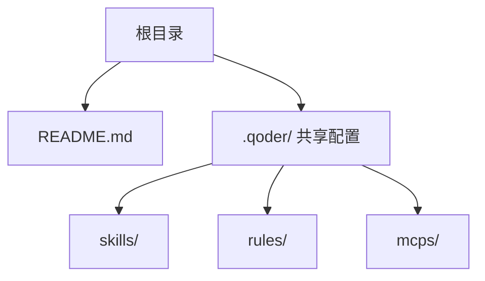
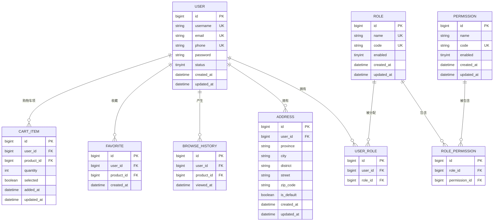

# 用户数据模型

<cite>
**本文引用的文件**   
- [README.md](file://README.md)
</cite>

## 目录
1. [简介](#简介)
2. [项目结构](#项目结构)
3. [核心组件](#核心组件)
4. [架构总览](#架构总览)
5. [详细组件分析](#详细组件分析)
6. [依赖分析](#依赖分析)
7. [性能考虑](#性能考虑)
8. [故障排查指南](#故障排查指南)
9. [结论](#结论)
10. [附录：SQL 建表语句与约束定义](#附录sql-建表语句与约束定义)

## 简介
本文件面向“京东风格电商平台课程作业”的用户域数据模型，聚焦以下目标：
- 用户基本信息字段（用户名、邮箱、手机号、密码等）
- 用户状态管理（激活、冻结等）
- 角色权限设计（普通用户、商家、管理员等）
- 用户地址管理（收货地址表、默认地址、验证规则）
- 用户行为数据（浏览历史、收藏商品、购物车）
- 提供完整的 SQL 建表语句与字段约束定义

说明：当前仓库为课程作业骨架，尚未包含后端代码与数据库脚本。因此，本文档基于通用电商实践给出可落地的数据模型设计与 SQL 定义，便于后续接入 Spring Boot + MyBatis + MySQL 技术栈。

章节来源
- [README.md:1-35](file://README.md#L1-L35)

## 项目结构
当前仓库仅包含 README 文档与共享配置目录，未包含具体业务模块或数据库脚本。后续各端工程将逐步接入此仓库。



图表来源
- [README.md:10-17](file://README.md#L10-L17)

章节来源
- [README.md:1-35](file://README.md#L1-L35)

## 核心组件
围绕用户域的数据模型由以下实体组成：
- 用户主表：存储登录凭证、基础信息与状态
- 角色与权限：RBAC 模型（角色、权限、用户-角色关联）
- 用户地址：收货地址集合与默认地址标记
- 用户行为：浏览历史、收藏、购物车

为保证扩展性与一致性，建议采用如下命名约定：
- 表名使用小写加下划线，如 user、user_role、address、browse_history、favorite、cart
- 主键统一使用 bigint 自增或雪花 ID；外键明确标注
- 时间字段使用 datetime 或 timestamp，并带默认值与更新策略

章节来源
- [README.md:18-24](file://README.md#L18-L24)

## 架构总览
下图展示用户域数据模型的核心关系：用户与角色多对多，用户与地址一对多，用户与行为记录一对多。



图表来源
- [README.md:18-24](file://README.md#L18-L24)

## 详细组件分析

### 用户主表（USER）
- 用途：承载用户身份与登录凭证、基础信息、账户状态
- 关键字段
  - 用户名、邮箱、手机号：唯一性约束，用于登录与通知
  - 密码：加密存储（BCrypt），禁止明文
  - 状态：启用/禁用/冻结等枚举
  - 审计字段：创建时间、更新时间
- 索引建议
  - 用户名、邮箱、手机号建立唯一索引
  - 状态字段可建普通索引以支持批量筛选
- 校验规则
  - 邮箱格式校验
  - 手机号长度与正则校验
  - 密码强度策略（长度、复杂度）

章节来源
- [README.md:18-24](file://README.md#L18-L24)

### 角色与权限（ROLE、PERMISSION、USER_ROLE、ROLE_PERMISSION）
- 用途：实现 RBAC 权限控制，支持细粒度资源访问控制
- 设计要点
  - 角色与权限多对多，用户与角色多对多
  - 权限编码全局唯一，便于网关与接口鉴权
  - 角色启用/禁用控制生效范围
- 典型角色
  - 普通用户、商家、管理员
- 索引建议
  - 角色编码、权限编码唯一索引
  - 用户-角色、角色-权限组合索引提升查询效率

章节来源
- [README.md:18-24](file://README.md#L18-L24)

### 用户地址（ADDRESS）
- 用途：管理用户的收货地址集合与默认地址
- 关键字段
  - 省市区街道、邮编、是否默认
  - 用户外键关联
- 约束与规则
  - 每个用户最多一个默认地址（唯一复合约束）
  - 省市区级联字典化（可选）
  - 地址完整性校验（非空、邮编格式）
- 索引建议
  - 用户ID索引
  - 默认标记索引

章节来源
- [README.md:18-24](file://README.md#L18-L24)

### 用户行为（BROWSE_HISTORY、FAVORITE、CART_ITEM）
- 浏览历史（BROWSE_HISTORY）
  - 记录用户查看商品的时序，便于推荐与召回
  - 去重策略：同一用户同商品多次浏览可合并最新时间戳
- 收藏（FAVORITE）
  - 用户与商品多对一，唯一约束避免重复收藏
- 购物车（CART_ITEM）
  - 用户-商品-数量-选中状态
  - 支持按用户维度聚合统计

章节来源
- [README.md:18-24](file://README.md#L18-L24)

## 依赖分析
- 外部依赖
  - 数据库：MySQL（DDL 与索引）
  - ORM：MyBatis（映射层）
  - 安全：Spring Security（鉴权与密码加密）
- 内部耦合
  - 用户域与订单域、商品域通过外键关联（用户ID、商品ID）
  - 权限域与网关/控制器通过权限编码进行鉴权联动


图表来源
- [README.md:18-24](file://README.md#L18-L24)

章节来源
- [README.md:18-24](file://README.md#L18-L24)

## 性能考虑
- 索引优化
  - 高频查询字段建立合适索引（用户ID、商品ID、状态、默认标记）
  - 避免过度索引导致写入放大
- 读写分离
  - 读多写少场景（浏览历史、收藏、购物车）可考虑只读副本
- 分库分表
  - 行为数据增长快，可按用户ID哈希分表或按时间归档
- 缓存策略
  - 购物车、收藏热点数据可入 Redis，降低数据库压力
- 事务边界
  - 购物车结算、下单等关键路径需保证原子性

[本节为通用性能建议，不直接分析具体文件]

## 故障排查指南
- 登录失败
  - 检查密码加密算法一致性与盐值策略
  - 核对用户状态是否为启用
- 权限异常
  - 确认用户-角色、角色-权限关联完整
  - 权限编码与接口注解一致
- 地址冲突
  - 默认地址唯一约束冲突时，先取消旧默认再设置新默认
- 行为数据丢失
  - 检查异步写入队列与重试机制
  - 核对幂等键与去重逻辑

[本节为通用排障建议，不直接分析具体文件]

## 结论
本文给出了覆盖用户主数据、角色权限、地址管理与用户行为的完整数据模型方案，并提供可直接落地的 SQL 建表语句与约束定义。该模型适配 Spring Boot + MyBatis + MySQL 技术栈，具备良好的可扩展性与可维护性，可作为后续开发的基础。

[本节为总结性内容，不直接分析具体文件]

## 附录：SQL 建表语句与约束定义
以下为可直接执行的 MySQL DDL，包含必要的索引与约束。请根据实际环境调整字符集与引擎。

```sql
-- 用户主表
CREATE TABLE `user` (
  `id` BIGINT NOT NULL AUTO_INCREMENT COMMENT '主键',
  `username` VARCHAR(64) NOT NULL COMMENT '用户名',
  `email` VARCHAR(128) DEFAULT NULL COMMENT '邮箱',
  `phone` VARCHAR(20) DEFAULT NULL COMMENT '手机号',
  `password` VARCHAR(255) NOT NULL COMMENT '密码(加密)',
  `status` TINYINT NOT NULL DEFAULT 1 COMMENT '状态: 1启用 0禁用 2冻结',
  `created_at` DATETIME NOT NULL DEFAULT CURRENT_TIMESTAMP,
  `updated_at` DATETIME NOT NULL DEFAULT CURRENT_TIMESTAMP ON UPDATE CURRENT_TIMESTAMP,
  PRIMARY KEY (`id`),
  UNIQUE KEY `uk_username` (`username`),
  UNIQUE KEY `uk_email` (`email`),
  UNIQUE KEY `uk_phone` (`phone`)
) ENGINE=InnoDB DEFAULT CHARSET=utf8mb4 COMMENT='用户主表';

-- 角色表
CREATE TABLE `role` (
  `id` BIGINT NOT NULL AUTO_INCREMENT COMMENT '主键',
  `name` VARCHAR(64) NOT NULL COMMENT '角色名称',
  `code` VARCHAR(64) NOT NULL COMMENT '角色编码',
  `enabled` TINYINT NOT NULL DEFAULT 1 COMMENT '是否启用',
  `created_at` DATETIME NOT NULL DEFAULT CURRENT_TIMESTAMP,
  `updated_at` DATETIME NOT NULL DEFAULT CURRENT_TIMESTAMP ON UPDATE CURRENT_TIMESTAMP,
  PRIMARY KEY (`id`),
  UNIQUE KEY `uk_code` (`code`)
) ENGINE=InnoDB DEFAULT CHARSET=utf8mb4 COMMENT='角色表';

-- 权限表
CREATE TABLE `permission` (
  `id` BIGINT NOT NULL AUTO_INCREMENT COMMENT '主键',
  `name` VARCHAR(128) NOT NULL COMMENT '权限名称',
  `code` VARCHAR(128) NOT NULL COMMENT '权限编码',
  `enabled` TINYINT NOT NULL DEFAULT 1 COMMENT '是否启用',
  `created_at` DATETIME NOT NULL DEFAULT CURRENT_TIMESTAMP,
  `updated_at` DATETIME NOT NULL DEFAULT CURRENT_TIMESTAMP ON UPDATE CURRENT_TIMESTAMP,
  PRIMARY KEY (`id`),
  UNIQUE KEY `uk_code` (`code`)
) ENGINE=InnoDB DEFAULT CHARSET=utf8mb4 COMMENT='权限表';

-- 用户-角色关联
CREATE TABLE `user_role` (
  `id` BIGINT NOT NULL AUTO_INCREMENT COMMENT '主键',
  `user_id` BIGINT NOT NULL COMMENT '用户ID',
  `role_id` BIGINT NOT NULL COMMENT '角色ID',
  PRIMARY KEY (`id`),
  UNIQUE KEY `uk_user_role` (`user_id`,`role_id`),
  KEY `idx_role_id` (`role_id`)
) ENGINE=InnoDB DEFAULT CHARSET=utf8mb4 COMMENT='用户-角色关联';

-- 角色-权限关联
CREATE TABLE `role_permission` (
  `id` BIGINT NOT NULL AUTO_INCREMENT COMMENT '主键',
  `role_id` BIGINT NOT NULL COMMENT '角色ID',
  `permission_id` BIGINT NOT NULL COMMENT '权限ID',
  PRIMARY KEY (`id`),
  UNIQUE KEY `uk_role_permission` (`role_id`,`permission_id`),
  KEY `idx_permission_id` (`permission_id`)
) ENGINE=InnoDB DEFAULT CHARSET=utf8mb4 COMMENT='角色-权限关联';

-- 用户地址
CREATE TABLE `address` (
  `id` BIGINT NOT NULL AUTO_INCREMENT COMMENT '主键',
  `user_id` BIGINT NOT NULL COMMENT '用户ID',
  `province` VARCHAR(64) NOT NULL COMMENT '省',
  `city` VARCHAR(64) NOT NULL COMMENT '市',
  `district` VARCHAR(64) NOT NULL COMMENT '区/县',
  `street` VARCHAR(255) NOT NULL COMMENT '详细地址',
  `zip_code` VARCHAR(10) DEFAULT NULL COMMENT '邮编',
  `is_default` TINYINT NOT NULL DEFAULT 0 COMMENT '是否默认: 1是 0否',
  `created_at` DATETIME NOT NULL DEFAULT CURRENT_TIMESTAMP,
  `updated_at` DATETIME NOT NULL DEFAULT CURRENT_TIMESTAMP ON UPDATE CURRENT_TIMESTAMP,
  PRIMARY KEY (`id`),
  KEY `idx_user_id` (`user_id`),
  CONSTRAINT `uk_default_address` UNIQUE KEY (`user_id`,`is_default`)
) ENGINE=InnoDB DEFAULT CHARSET=utf8mb4 COMMENT='用户地址';

-- 浏览历史
CREATE TABLE `browse_history` (
  `id` BIGINT NOT NULL AUTO_INCREMENT COMMENT '主键',
  `user_id` BIGINT NOT NULL COMMENT '用户ID',
  `product_id` BIGINT NOT NULL COMMENT '商品ID',
  `viewed_at` DATETIME NOT NULL DEFAULT CURRENT_TIMESTAMP COMMENT '浏览时间',
  PRIMARY KEY (`id`),
  KEY `idx_user_product` (`user_id`,`product_id`),
  KEY `idx_viewed_at` (`viewed_at`)
) ENGINE=InnoDB DEFAULT CHARSET=utf8mb4 COMMENT='浏览历史';

-- 收藏
CREATE TABLE `favorite` (
  `id` BIGINT NOT NULL AUTO_INCREMENT COMMENT '主键',
  `user_id` BIGINT NOT NULL COMMENT '用户ID',
  `product_id` BIGINT NOT NULL COMMENT '商品ID',
  `created_at` DATETIME NOT NULL DEFAULT CURRENT_TIMESTAMP,
  PRIMARY KEY (`id`),
  UNIQUE KEY `uk_user_product` (`user_id`,`product_id`)
) ENGINE=InnoDB DEFAULT CHARSET=utf8mb4 COMMENT='收藏';

-- 购物车项
CREATE TABLE `cart_item` (
  `id` BIGINT NOT NULL AUTO_INCREMENT COMMENT '主键',
  `user_id` BIGINT NOT NULL COMMENT '用户ID',
  `product_id` BIGINT NOT NULL COMMENT '商品ID',
  `quantity` INT NOT NULL DEFAULT 1 COMMENT '数量',
  `selected` TINYINT NOT NULL DEFAULT 1 COMMENT '是否选中: 1是 0否',
  `added_at` DATETIME NOT NULL DEFAULT CURRENT_TIMESTAMP,
  `updated_at` DATETIME NOT NULL DEFAULT CURRENT_TIMESTAMP ON UPDATE CURRENT_TIMESTAMP,
  PRIMARY KEY (`id`),
  UNIQUE KEY `uk_user_product_cart` (`user_id`,`product_id`),
  KEY `idx_user_selected` (`user_id`,`selected`)
) ENGINE=InnoDB DEFAULT CHARSET=utf8mb4 COMMENT='购物车项';
```

[本节为DDL定义，不直接分析具体文件]