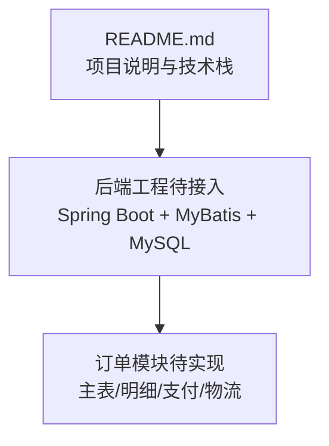
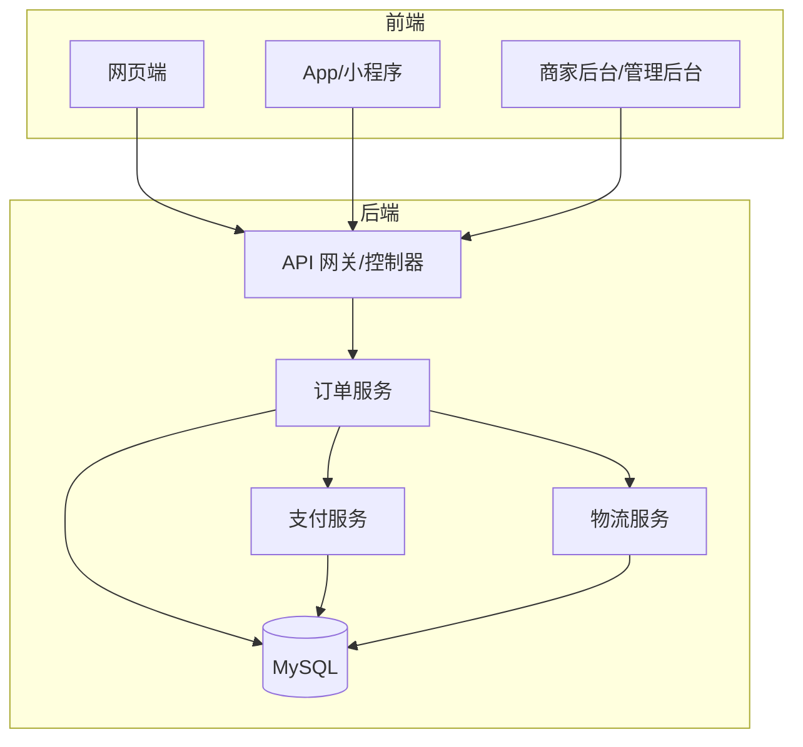
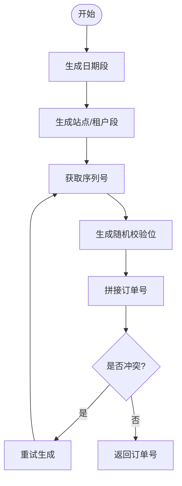
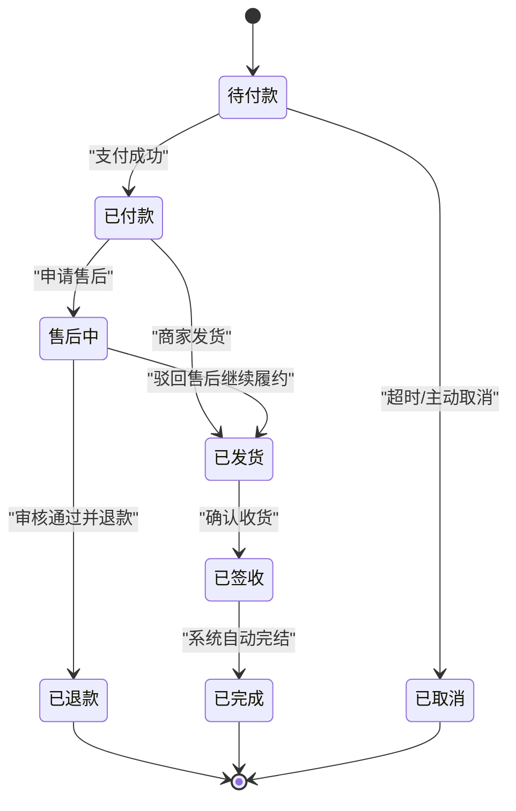
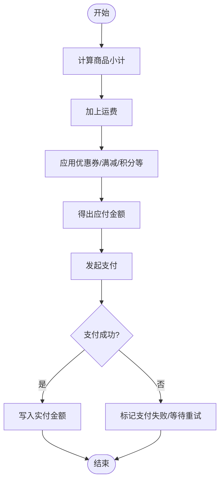
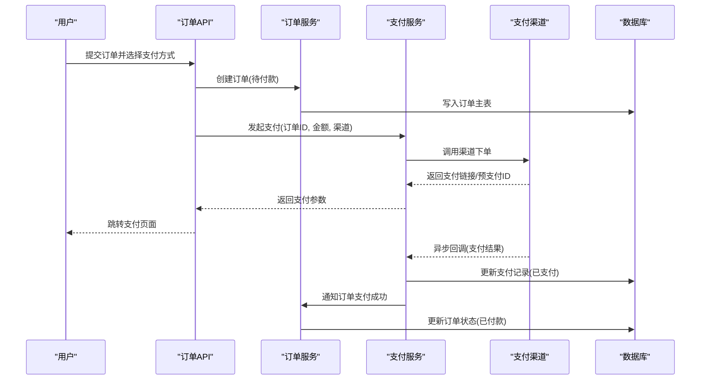
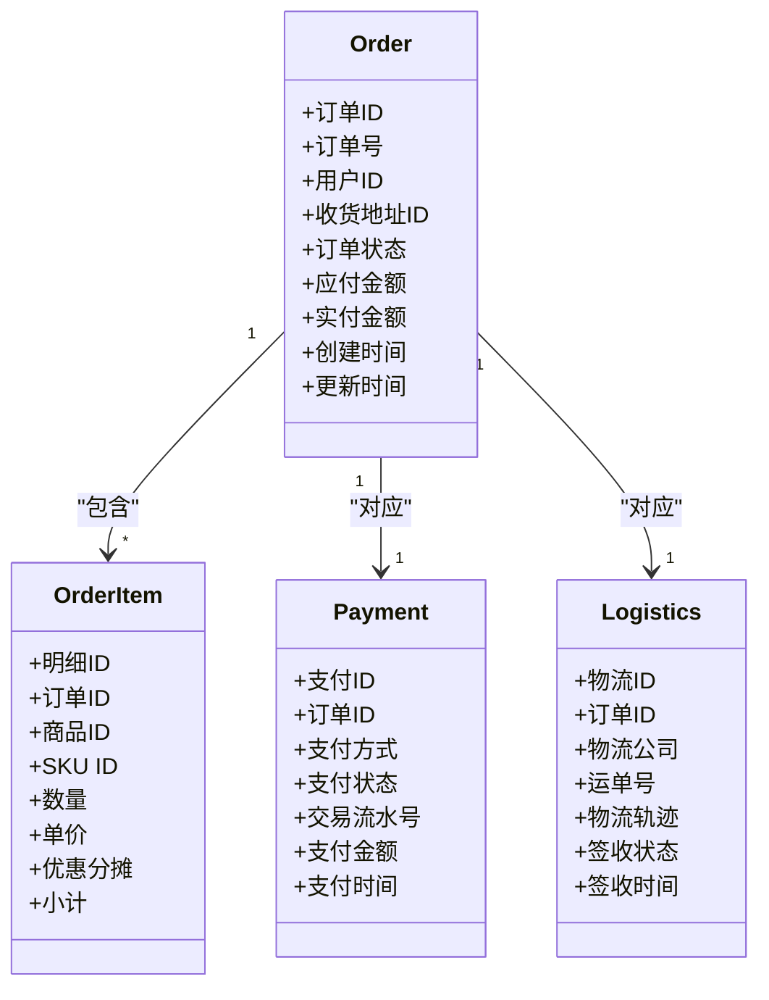
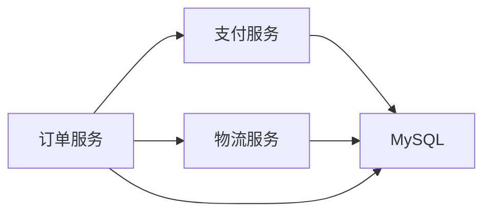

# 订单数据模型

<cite>
**本文引用的文件**   
- [README.md](file://README.md)
</cite>

## 目录
1. [引言](#引言)
2. [项目结构](#项目结构)
3. [核心组件](#核心组件)
4. [架构总览](#架构总览)
5. [详细组件分析](#详细组件分析)
6. [依赖关系分析](#依赖关系分析)
7. [性能考虑](#性能考虑)
8. [故障排查指南](#故障排查指南)
9. [结论](#结论)
10. [附录](#附录)

## 引言
本文件面向“京东风格电商平台”课程作业，聚焦订单域的数据模型与关键业务规则。由于当前仓库仅包含顶层说明文档，尚未包含后端代码或数据库脚本，因此本文基于技术栈（Spring Boot + MyBatis + MySQL）与电商通用实践，给出可落地的订单主表、订单明细、支付记录、物流信息模型设计，并补充订单号生成、状态流转、金额计算、查询优化与事务策略等建议。后续当工程落地后，可将本文与具体实现进行对照校验与完善。

## 项目结构
当前仓库为多端聚合根，后端采用 Spring Boot + MyBatis + MySQL。订单相关的数据模型与业务逻辑将在后端工程中实现，并通过数据库持久化。

图表来源
- [README.md:18-23](file://README.md#L18-L23)

章节来源
- [README.md:1-35](file://README.md#L1-L35)

## 核心组件
围绕订单域的核心数据实体包括：
- 订单主表：承载订单全局信息与状态机
- 订单明细表：承载购买商品信息、数量、单价、优惠分摊等
- 支付记录表：承载支付方式、支付状态、交易流水号、支付时间等
- 物流信息表：承载物流公司、运单号、物流轨迹、签收状态等

上述实体在数据库中通过外键关联，并在应用层通过服务编排完成下单、支付、发货、签收等流程。

章节来源
- [README.md:18-23](file://README.md#L18-L23)

## 架构总览
下图展示订单域在整体系统中的位置与交互关系。

[此图为概念性架构图，不直接映射到具体源码文件，故无图表来源]

## 详细组件分析

### 订单主表设计
- 字段要点
  - 订单号：全局唯一，推荐按“日期+序列号+随机数”组合生成，避免泄露销量与内部ID；支持分库分表时加入站点/租户标识。
  - 用户ID：下单用户标识。
  - 收货地址ID：指向收货地址表。
  - 商品总价、运费、优惠金额、应付金额、实付金额、已退金额等金额字段，统一使用整数单位（如分），避免浮点误差。
  - 订单状态：见下文状态机。
  - 支付状态：未支付、已支付、支付失败、已退款、部分退款等。
  - 创建时间、更新时间、支付时间、发货时间、签收时间、取消时间等审计字段。
  - 备注、来源渠道、设备信息等扩展字段。
- 索引建议
  - 订单号唯一索引。
  - 用户ID + 创建时间复合索引，便于用户订单列表分页。
  - 支付状态 + 更新时间索引，便于对账与超时处理。
- 约束与一致性
  - 金额字段非负且合计一致：商品总价 + 运费 - 优惠金额 = 应付金额。
  - 状态变更需幂等，防止重复提交导致状态回退。

章节来源
- [README.md:18-23](file://README.md#L18-L23)

#### 订单号生成规则
- 组成建议：日期（YYYYMMDD）+ 站点/租户码 + 自增序列（固定长度）+ 随机校验位。
- 并发控制：使用数据库序列或分布式ID生成器（如雪花算法）保证全局唯一。
- 可读性与安全：避免暴露内部自增ID；必要时隐藏中间段。
- 兼容分库分表：将站点/租户码作为路由键的一部分。

[此图为概念流程图，不直接映射到具体源码文件，故无图表来源]

#### 订单状态流转
- 典型状态：待付款、已付款、已发货、已签收、已完成、已取消、售后中、已退款。
- 流转原则：单向推进为主，允许从特定状态进入售后分支；所有状态变更需记录时间与操作人。
- 异常路径：支付失败、库存不足、风控拦截等应提供明确终止态。

[此图为概念状态图，不直接映射到具体源码文件，故无图表来源]

#### 订单金额计算
- 构成项：商品总价、运费、平台券、店铺券、满减、积分抵扣、会员折扣、税费等。
- 计算顺序：先算商品小计，再叠加运费，再依次应用各类优惠，得到应付金额；支付成功后写入实付金额。
- 精度与舍入：统一以最小货币单位为整数存储，舍入规则遵循四舍五入或银行家舍入，保持前后端一致。
- 优惠分摊：将总优惠按比例分摊至各明细行，用于售后退款时的精确结算。

[此图为概念流程图，不直接映射到具体源码文件，故无图表来源]

### 订单明细表结构
- 关键字段
  - 明细ID、订单ID（外键）、商品ID、SKU ID、商品标题快照、图片URL快照、规格属性快照。
  - 购买数量、成交单价、优惠分摊金额、税费、运费分摊、小计金额。
  - 供应商/店铺ID、是否虚拟商品、是否赠品等标志位。
  - 创建时间、更新时间。
- 设计要点
  - 价格与优惠快照：下单时固化，避免后续价格变动影响历史订单。
  - 优惠分摊：按行金额比例分摊总优惠，确保售后退款金额准确。
  - 索引：订单ID + 商品ID 复合索引，便于订单详情与售后明细查询。

章节来源
- [README.md:18-23](file://README.md#L18-L23)

### 支付记录模型
- 关键字段
  - 支付ID、订单ID（外键）、支付渠道（微信/支付宝/银行卡等）、支付方式、支付状态、交易流水号、第三方订单号、支付金额、币种、支付时间、回调时间、备注。
  - 扩展字段：支付参数摘要、风险评分、风控结果等。
- 设计要点
  - 幂等与去重：以订单ID + 支付渠道 + 交易流水号做唯一约束，防止重复入账。
  - 异步回调：接收第三方支付回调后更新状态，并触发订单服务后续流程。
  - 对账：定时任务拉取渠道账单，核对本地支付记录差异。

[此图为概念时序图，不直接映射到具体源码文件，故无图表来源]

### 物流信息模型
- 关键字段
  - 物流ID、订单ID（外键）、物流公司编码、物流公司名、运单号、发货时间、预计到达时间、签收时间、签收人、签收照片URL、拒收原因、退货物流信息。
  - 轨迹JSON：包含节点时间、地点、状态描述等数组。
  - 状态：已发货、运输中、派送中、已签收、已退回、异常。
- 设计要点
  - 轨迹增量更新：每次推送覆盖最新节点，保留完整轨迹。
  - 签收幂等：同一运单多次回调需去重。
  - 逆向物流：退货场景复用物流模型，增加逆向标识。

[此图为概念类图，不直接映射到具体源码文件，故无图表来源]

## 依赖关系分析
- 模块耦合
  - 订单服务依赖支付服务与物流服务，形成松耦合的领域边界。
  - 数据库层面通过外键与索引保障引用完整性与查询效率。
- 外部依赖
  - 第三方支付渠道、物流轨迹接口、短信/邮件通知服务等。
- 潜在循环依赖
  - 应避免订单服务与支付服务互相调用，采用事件或消息队列解耦。

[此图为概念依赖图，不直接映射到具体源码文件，故无图表来源]

## 性能考虑
- 读写分离与缓存
  - 订单详情读多写少，适合引入缓存（如Redis）缓存热点订单与明细。
  - 订单列表分页采用游标或延迟加载，减少大偏移量扫描。
- 索引与SQL
  - 针对高频查询建立复合索引，避免全表扫描。
  - 金额比较使用整数字段，避免浮点误差与隐式转换。
- 分库分表
  - 按用户ID或订单号哈希分片，提升水平扩展能力。
  - 跨分片查询尽量下推条件，避免大范围广播。
- 异步与削峰
  - 支付回调、物流轨迹推送、通知发送等采用消息队列异步处理。
- 批量与批处理
  - 对账、报表导出等离线任务采用分批处理，降低内存占用。

[本节为通用性能建议，不直接分析具体文件，故无章节来源]

## 故障排查指南
- 常见错误
  - 订单号冲突：检查序列生成与唯一约束。
  - 金额不一致：核对优惠分摊与合计校验逻辑。
  - 支付重复入账：检查幂等键与回调去重。
  - 物流轨迹丢失：检查增量更新与去重策略。
- 定位手段
  - 通过订单号快速定位主表、明细、支付、物流记录。
  - 结合审计字段（创建/更新时间）与日志追踪链路。
  - 对账任务输出差异清单，逐条复核。

[本节为通用排障建议，不直接分析具体文件，故无章节来源]

## 结论
本文基于仓库提供的技术栈信息，给出了订单主表、明细、支付、物流的数据模型设计与关键业务规则建议，涵盖订单号生成、状态流转、金额计算、查询优化与事务策略。后续可在工程落地后，将具体实现与本文对齐，持续完善索引、幂等、对账与监控指标。

[本节为总结性内容，不直接分析具体文件，故无章节来源]

## 附录
- 术语
  - SKU：库存保有单位，代表商品的最小可售单元。
  - 优惠分摊：将总优惠按明细行金额比例分配至各行，用于售后退款。
  - 幂等：同一请求多次执行不会产生额外副作用。
- 参考
  - 技术栈与协作规范参见项目说明文档。

章节来源
- [README.md:18-30](file://README.md#L18-L30)