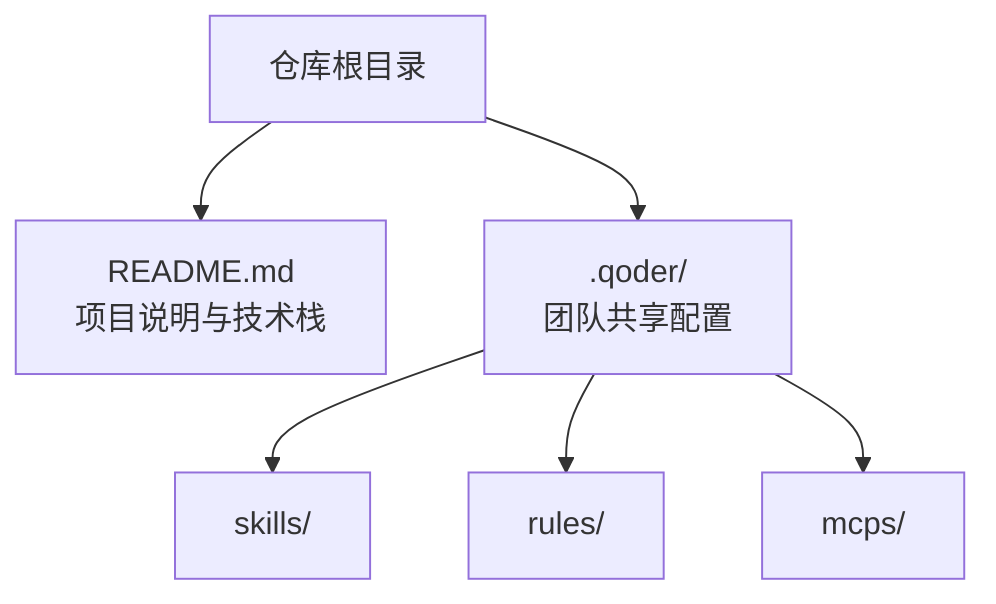
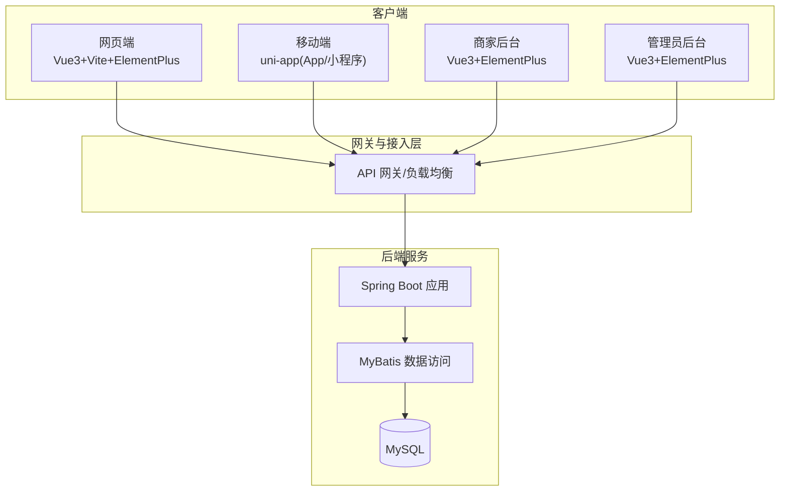
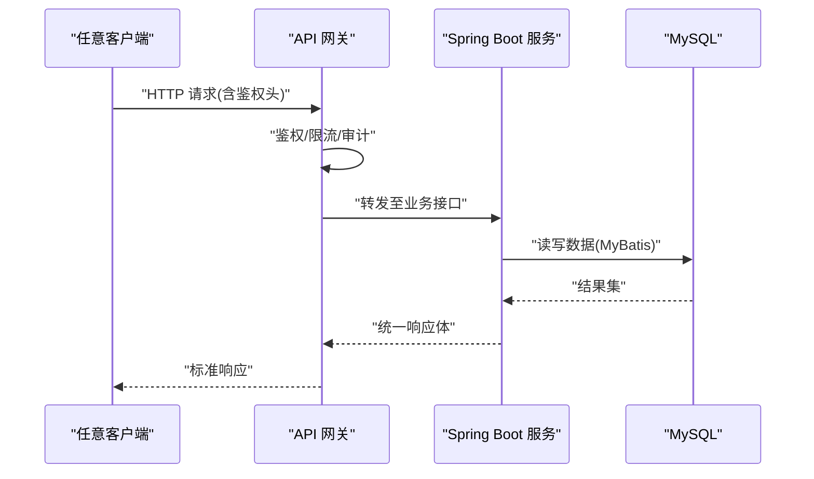
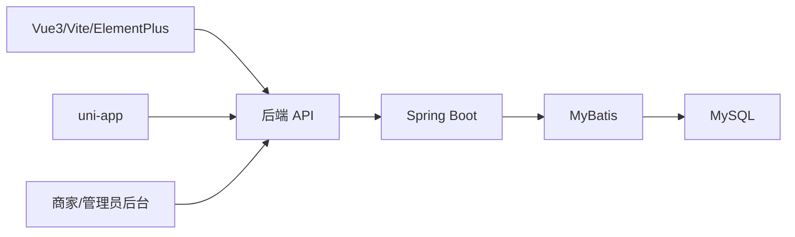

# 整体架构设计

<cite>
**本文引用的文件**   
- [README.md](file://README.md)
</cite>

## 目录
1. [引言](#引言)
2. [项目结构](#项目结构)
3. [核心组件](#核心组件)
4. [架构总览](#架构总览)
5. [详细组件分析](#详细组件分析)
6. [依赖分析](#依赖分析)
7. [性能考虑](#性能考虑)
8. [故障排查指南](#故障排查指南)
9. [结论](#结论)
10. [附录](#附录)

## 引言
本仓库为“京东风格电商平台”课程作业，目标是构建一套后端覆盖用户网页端、App、小程序、商家后台和管理员后台的多端统一电商系统。当前阶段以工程骨架与协作规范为主，各端独立工程后续接入此仓库。本文基于现有信息，给出前后端分离的架构模式说明、多端统一设计理念、API网关与接口规范建议、模块化划分策略、系统架构图与数据流说明，以及技术栈选择原因、版本兼容性与扩展性设计。

## 项目结构
- 仓库根目录包含项目说明文档与共享配置约定，采用“多端独立工程 + 统一仓库管理”的组织方式。
- 共享配置通过 .qoder 目录进行团队级 skills、rules 与 MCP 使用说明的统一管理，便于跨端一致的开发体验与质量基线。
- 技术栈在后端与前端/移动端分别定义，便于各端独立演进与发布。

图表来源
- [README.md:10-16](file://README.md#L10-L16)
- [README.md:18-23](file://README.md#L18-L23)

章节来源
- [README.md:1-35](file://README.md#L1-L35)

## 核心组件
- 后端服务：Spring Boot + MyBatis + MySQL，提供统一的业务 API，支撑多端访问。
- 用户网页端：Vue 3 + Vite + Element Plus，面向消费者浏览与下单。
- 后台端（商家/管理员）：Vue 3 + Element Plus，面向运营与平台管理。
- 移动端：uni-app 编译为 App 与微信小程序，覆盖移动场景。
- 多端统一：通过统一后端 API 与一致的鉴权、分页、错误码等契约，实现“一次开发、多端复用”。

章节来源
- [README.md:18-23](file://README.md#L18-L23)

## 架构总览
整体采用前后端分离与多端统一架构：
- 多端客户端（Web/App/小程序/商家后台/管理员后台）通过 HTTP/HTTPS 调用后端 RESTful API。
- 后端以 Spring Boot 为核心，使用 MyBatis 访问 MySQL 持久化数据。
- 建议在网关层统一处理鉴权、限流、日志、灰度与协议适配；在业务层按领域模块拆分服务或包，遵循高内聚低耦合原则。
- 数据流向：客户端 → 网关/负载均衡 → 后端服务 → 缓存/消息中间件（可选）→ 数据库。

图表来源
- [README.md:18-23](file://README.md#L18-L23)

## 详细组件分析

### 多端统一架构设计与交互方式
- 统一 API 契约：所有端共用同一套接口定义（路径、方法、参数、响应体、错误码），避免重复实现。
- 统一鉴权与会话：建议采用无状态令牌（如 JWT）配合网关校验，支持 Web Cookie、App Header、小程序自定义头等多端登录态。
- 统一错误与分页：标准化错误码、提示信息与分页字段，降低各端适配成本。
- 请求处理流程（概念示意）：客户端发起请求 → 网关鉴权/限流/审计 → 路由到具体服务 → 业务处理 → 返回统一响应。

[本节为概念性流程说明，不直接映射具体源码文件]

### API 网关设计与接口规范（建议）
- 职责：统一入口、鉴权、签名校验、限流熔断、日志审计、协议转换、灰度发布、监控埋点。
- 安全：强制 HTTPS、请求签名、防重放、敏感字段脱敏、IP 白名单。
- 接口规范：RESTful 风格、统一响应包装、分页与排序字段约定、错误码字典、幂等键（POST/PUT 可选）。
- 可观测性：TraceId 贯穿全链路，关键指标上报。

[本节为通用设计建议，不直接映射具体源码文件]

### 模块化架构与业务划分策略
- 分层：接入层（Controller）、业务层（Service）、数据访问层（Mapper/DAO）、基础设施层（配置、工具、第三方集成）。
- 分域：按电商核心域划分，如用户域、商品域、订单域、支付域、营销域、库存域、物流域、内容域等，每个域内再拆分为子模块。
- 边界：模块间通过清晰接口通信，禁止跨层调用；对外暴露稳定 API，内部实现可替换。
- 配置：公共配置集中管理，环境差异通过配置中心或环境变量注入。

[本节为通用设计建议，不直接映射具体源码文件]

### 技术栈选择与版本兼容性
- 后端：Spring Boot 生态成熟、社区活跃，结合 MyBatis 灵活高效地访问 MySQL，适合快速迭代与复杂查询。
- 前端：Vue 3 + Vite 具备高性能开发与打包能力，Element Plus 提供丰富的企业级 UI 组件。
- 移动端：uni-app 支持一次编写多端发布（App/小程序），降低多端维护成本。
- 版本兼容：明确主版本升级策略，向后兼容变更需评估影响面；依赖锁定与制品库管理确保可重现构建。

章节来源
- [README.md:18-23](file://README.md#L18-L23)

### 扩展性设计
- 水平扩展：无状态服务实例横向扩容，结合网关/负载均衡分发流量。
- 垂直拆分：随业务增长将单体按域拆分为微服务，保留统一 API 契约与网关。
- 异步与解耦：引入消息队列处理削峰填谷与最终一致性场景（如订单创建后通知库存/支付）。
- 缓存与索引：热点数据多级缓存，数据库索引与分库分表按需演进。
- 可观测与弹性：全链路追踪、指标采集、告警与自动扩缩容。

[本节为通用设计建议，不直接映射具体源码文件]

## 依赖分析
- 运行时依赖：后端依赖 Spring Boot 框架、MyBatis ORM 与 MySQL 驱动。
- 前端依赖：Vue 3 生态与 Element Plus 组件库。
- 移动端依赖：uni-app 运行时与平台插件（App/小程序）。
- 团队协作依赖：Git 分支模型与 PR 合并流程保障代码质量与稳定性。

图表来源
- [README.md:18-23](file://README.md#L18-L23)

章节来源
- [README.md:25-30](file://README.md#L25-L30)

## 性能考虑
- 连接池与线程池：合理设置数据库连接池与 Tomcat 线程池，避免资源争用。
- 缓存策略：读多写少场景优先缓存命中，注意缓存穿透/雪崩/击穿防护。
- 分页与懒加载：列表接口默认分页，前端按需加载与虚拟滚动。
- 静态资源优化：CDN 加速、压缩与缓存控制。
- 压测与容量规划：建立基准压测用例，持续评估瓶颈并优化。

[本节为通用指导，不直接映射具体源码文件]

## 故障排查指南
- 定位链路：利用 TraceId 串联网关、服务与数据库日志，快速定位问题节点。
- 常见错误：鉴权失败、参数校验异常、超时与重试风暴、数据库慢查询。
- 回滚与降级：发布前准备回滚方案，关键链路增加降级开关与兜底数据。
- 监控告警：对关键指标（QPS、延迟、错误率、资源使用）设置阈值告警。

[本节为通用指导，不直接映射具体源码文件]

## 结论
本项目采用前后端分离与多端统一架构，以 Spring Boot + MyBatis + MySQL 作为后端基础，结合 Vue 3 与 uni-app 覆盖 Web、App 与小程序等多端场景。通过统一 API 契约、网关治理与模块化设计，可在保证交付效率的同时具备良好的扩展性与可维护性。后续在各端工程接入后，可进一步细化服务边界、完善网关策略与可观测体系。

## 附录
- 协作规范要点：main 稳定分支、develop 日常分支、feature 分支命名、PR 合并流程。
- 共享配置：.qoder/skills、.qoder/rules、.qoder/mcps 用于统一团队技能、规则与 MCP 使用说明。

章节来源
- [README.md:25-30](file://README.md#L25-L30)
- [README.md:10-16](file://README.md#L10-L16)