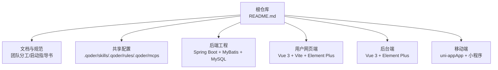
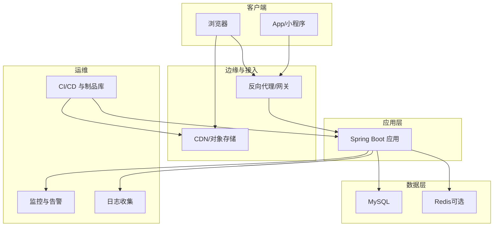
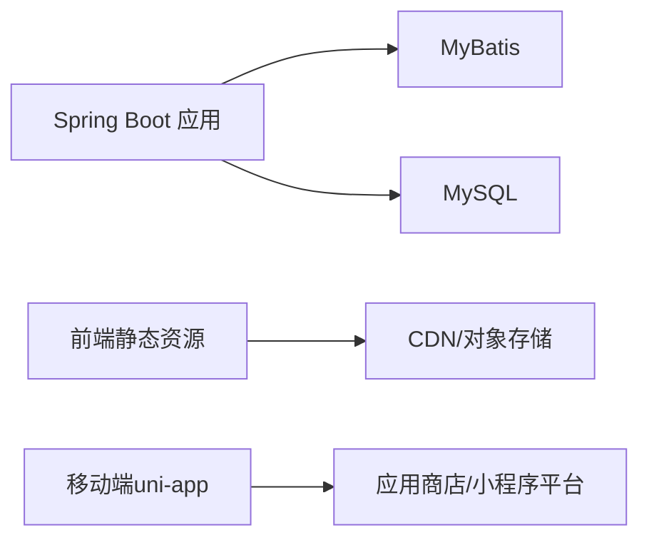

# 部署运维

<cite>
**本文引用的文件**   
- [README.md](file://README.md)
</cite>

## 目录
1. [简介](#简介)
2. [项目结构](#项目结构)
3. [核心组件](#核心组件)
4. [架构总览](#架构总览)
5. [详细组件分析](#详细组件分析)
6. [依赖分析](#依赖分析)
7. [性能考虑](#性能考虑)
8. [故障排查指南](#故障排查指南)
9. [结论](#结论)
10. [附录](#附录)

## 简介
本指南面向生产环境，提供京东风格电商平台的部署与运维方案。基于仓库信息可知，后端采用 Spring Boot + MyBatis + MySQL，前端网页端与后台端采用 Vue 3 + Vite/Element Plus，移动端采用 uni-app（App + 微信小程序）。各端工程后续接入此仓库，具体启动方式由各端负责人补充。因此，本文在“打包发布、容器化、监控日志、备份迁移、安全加固”等章节给出通用且可落地的最佳实践，并结合技术栈进行适配说明。

## 项目结构
当前仓库为课程作业聚合入口，包含：
- 项目文档与协作规范说明
- 共享配置目录 .qoder（skills/rules/mcps）
- 多端工程待接入的约定

**图表来源**
- [README.md:1-35](file://README.md#L1-L35)

**章节来源**
- [README.md:1-35](file://README.md#L1-L35)

## 核心组件
- 后端服务：Spring Boot 应用，使用 MyBatis 访问 MySQL 数据库
- 前端静态资源：网页端与后台端构建产物通过 CDN 或对象存储分发
- 移动端：uni-app 构建为 App 包与微信小程序代码包
- 基础设施：域名与 SSL、反向代理、负载均衡、对象存储、消息队列（可选）、缓存（可选）

**章节来源**
- [README.md:18-24](file://README.md#L18-L24)

## 架构总览
生产环境典型分层如下：
- 客户端：浏览器、App、小程序
- 边缘层：CDN 加速静态资源
- 网关/反向代理：HTTPS 终止、路由转发、限流熔断
- 应用层：Spring Boot 微服务/单体
- 数据层：MySQL（主从/高可用）、Redis（可选）
- 运维层：监控告警、日志收集、制品库、CI/CD

[本节为概念性架构图，不直接映射到具体源码文件]

## 详细组件分析

### 服务器与基础设施准备
- 操作系统与内核：推荐主流 Linux 发行版 LTS，开启 TCP 优化参数
- 运行时：JDK 17（与 Spring Boot 版本匹配），Node.js 18+（前端构建）
- 中间件：MySQL 8.x（建议开启二进制日志与 GTID），Redis 7.x（可选）
- 网络与安全：开放 80/443，关闭不必要端口；启用防火墙与最小权限原则
- 域名与 DNS：A/CNAME 记录指向网关/负载均衡；配置 SPF/DKIM/DMARC（邮件场景）
- SSL 证书：申请并续期自动化（ACME/Let's Encrypt），强制 HTTPS 与 HSTS

**章节来源**
- [README.md:18-24](file://README.md#L18-L24)

### 域名与 SSL 证书配置
- 域名解析：将业务域名解析至网关 IP 或云厂商 LB
- 证书管理：集中化管理证书，按环境隔离；自动续期策略
- 反向代理：统一 TLS 卸载，配置强加密套件与 HTTP/2
- 安全头：HSTS、X-Frame-Options、CSP、Referrer-Policy 等

[本节为通用实践，不直接分析具体文件]

### 后端 Spring Boot 应用部署（JAR）
- 构建产物：Maven/Gradle 构建生成 JAR，包含依赖与配置文件
- 运行参数：通过环境变量注入敏感配置（数据库、密钥、第三方服务）
- 进程管理：systemd 或容器进程管理器，设置重启策略与资源限制
- 健康检查：暴露 /actuator/health，供探针与健康检查使用
- 灰度发布：蓝绿/金丝雀策略，结合网关流量切换

**章节来源**
- [README.md:18-20](file://README.md#L18-L20)

### 前端静态资源 CDN 部署
- 构建产物：Vite 构建输出静态资源（HTML/CSS/JS/图片）
- 命名策略：文件名哈希化，配合 CDN 缓存与回源控制
- 回源规则：API 请求走内网网关，静态资源走 CDN
- 缓存策略：长缓存 + 版本号变更触发刷新；预加载关键资源

**章节来源**
- [README.md:21-22](file://README.md#L21-L22)

### 移动端发布流程（uni-app）
- App 发布：构建签名包，提交应用商店；灰度与热更新策略
- 小程序发布：上传代码包，审核通过后发布；版本管理与回滚
- 渠道差异化：不同平台（iOS/Android/微信）独立配置与签名

**章节来源**
- [README.md:23](file://README.md#L23)

### 数据库备份策略与迁移方案
- 备份策略：全量 + 增量（binlog），异地容灾；定期演练恢复
- 迁移方案：DDL 变更脚本化，前后兼容；双写/影子库过渡（复杂场景）
- 一致性保障：事务边界清晰，跨库操作尽量本地化或通过事件补偿
- 容量规划：分库分表与冷热分离，索引与慢查询治理

[本节为通用实践，不直接分析具体文件]

### 监控与日志收集
- 指标采集：JVM、系统、业务指标；Prometheus/Grafana 可视化
- 链路追踪：分布式 ID 贯穿调用链，定位瓶颈
- 日志收集：结构化 JSON 日志，集中存储（ELK/云日志）
- 告警策略：阈值 + 复合规则，分级通知（短信/电话/IM）

[本节为通用实践，不直接分析具体文件]

### 常见故障排查方法
- 启动失败：检查端口占用、依赖服务连通性、配置文件注入
- 性能问题：CPU/内存/IO 热点，慢 SQL 与锁等待，GC 抖动
- 连接异常：数据库连接池耗尽、网络抖动、DNS 解析失败
- 前端错误：CDN 缓存未刷新、跨域、静态资源 404

[本节为通用实践，不直接分析具体文件]

### 性能优化建议
- 后端：连接池调优、SQL 优化、缓存命中、异步化
- 前端：资源压缩、懒加载、HTTP/2、CDN 预热
- 数据库：索引设计、读写分离、归档历史数据
- 网络：TCP 参数、TLS 会话复用、GZIP/Brotli

[本节为通用实践，不直接分析具体文件]

### 容器化部署（Docker + Kubernetes）
- Docker 镜像：多阶段构建，精简基础镜像，非 root 运行
- K8s 编排：Deployment/Service/Ingress/ConfigMap/Secret/HPA
- 配置管理：外部化配置，滚动更新与回滚策略
- 存储与网络：持久卷、内部 Service 通信、Ingress 路由

[本节为通用实践，不直接分析具体文件]

### 灾难恢复与安全加固
- 灾难恢复：RPO/RTO 目标明确，定期演练；多可用区部署
- 安全加固：最小权限、密钥管理、漏洞扫描、WAF/IPS
- 合规审计：访问审计、数据脱敏、传输加密

[本节为通用实践，不直接分析具体文件]

## 依赖分析
- 后端依赖：Spring Boot 生态、MyBatis、MySQL 驱动
- 前端依赖：Vue 3、Vite、Element Plus
- 移动端依赖：uni-app 及平台插件
- 基础设施依赖：反向代理、CDN、对象存储、监控与日志平台

**图表来源**
- [README.md:18-24](file://README.md#L18-L24)

**章节来源**
- [README.md:18-24](file://README.md#L18-L24)

## 性能考虑
- 容量评估：压测模型与峰值 QPS/并发连接数
- 弹性伸缩：HPA 基于 CPU/内存/自定义指标
- 缓存策略：多级缓存（浏览器/CDN/应用/数据库）
- 资源隔离：命名空间/配额/资源类限制

[本节为通用实践，不直接分析具体文件]

## 故障排查指南
- 快速定位：查看健康检查、最近变更记录、依赖服务状态
- 日志分析：过滤时间窗口与错误码，关联链路 ID
- 指标回溯：对比基线，识别突增/突降
- 回滚策略：一键回滚到上一稳定版本

[本节为通用实践，不直接分析具体文件]

## 结论
本指南围绕后端、前端、移动端与基础设施，给出了生产环境的部署与运维要点。结合仓库中技术栈信息，建议在现有仓库基础上逐步补齐各端工程的构建与发布脚本、容器化与编排配置、监控与日志接入，形成端到端的交付流水线与稳定性保障体系。

## 附录
- 分支与合并规范：main 稳定分支，develop 集成分支；PR 合并
- 提交规范：type(scope): subject
- 共享配置：.qoder/skills/.qoder/rules/.qoder/mcps

**章节来源**
- [README.md:25-31](file://README.md#L25-L31)
- [README.md:10-17](file://README.md#L10-L17)