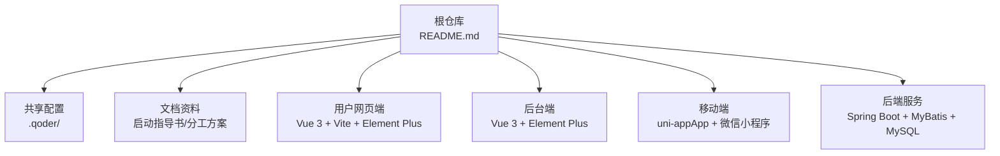
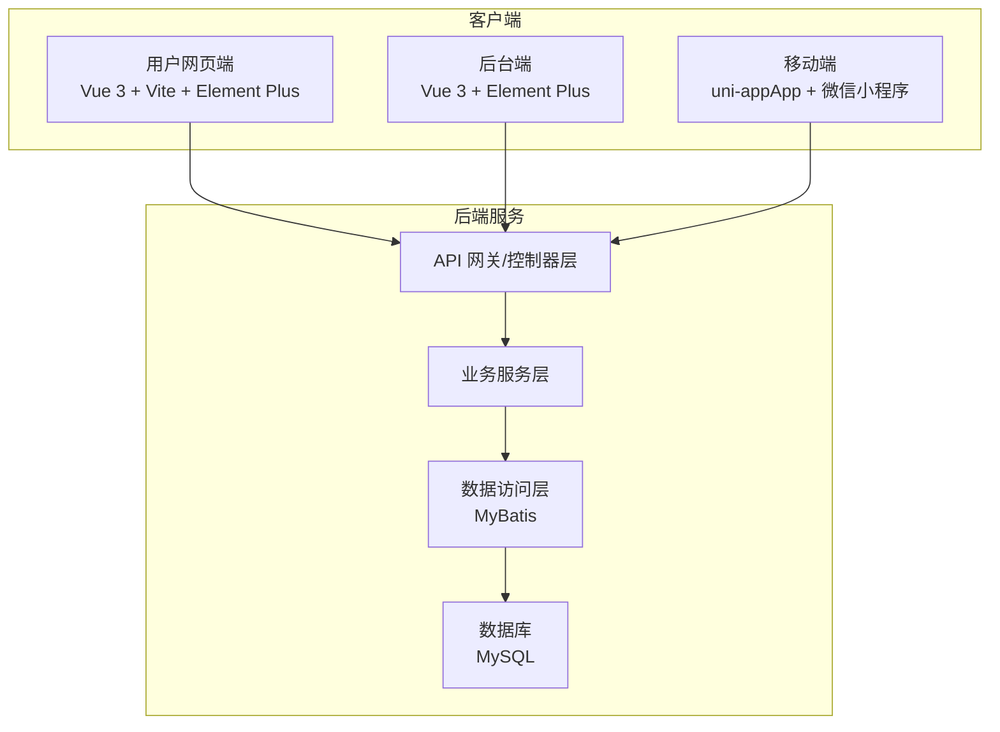
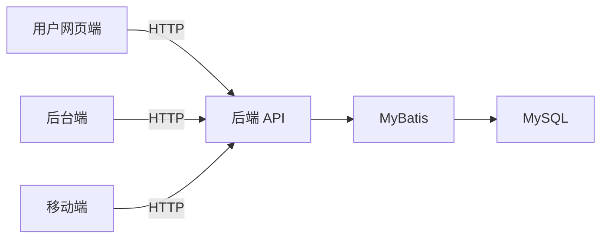

# 项目概述

<cite>
**本文引用的文件**   
- [README.md](file://README.md)
</cite>

## 目录
1. [简介](#简介)
2. [项目结构](#项目结构)
3. [核心组件](#核心组件)
4. [架构总览](#架构总览)
5. [详细组件分析](#详细组件分析)
6. [依赖分析](#依赖分析)
7. [性能考虑](#性能考虑)
8. [故障排查指南](#故障排查指南)
9. [结论](#结论)
10. [附录](#附录)

## 简介
本项目为课程作业，目标是构建一套“京东风格”的多端电商平台。平台覆盖用户网页端、App、小程序、商家后台和管理员后台，采用前后端分离的架构设计理念，后端以 Spring Boot 为核心，前端与移动端分别基于 Vue 3 与 uni-app 技术栈实现。项目强调团队协作规范与共享配置管理，便于多端工程统一接入与持续集成。

该项目的教育意义在于：
- 通过真实业务场景理解电商系统的关键能力（商品、订单、支付、库存、权限等）；
- 实践前后端分离与多端开发模式，掌握跨端复用与差异化适配；
- 在团队分工、分支策略、提交规范等方面形成工程化协作习惯。

实际应用场景示例：
- 用户在网页端浏览商品、下单、查看订单；
- 移动用户通过 App 或微信小程序完成相同流程；
- 商家在后台进行商品上架、订单处理与数据看板；
- 管理员进行全局配置、审计与运营管控。

**章节来源**
- [README.md:1-35](file://README.md#L1-L35)

## 项目结构
当前仓库作为多端工程的聚合入口，包含项目说明文档与共享配置约定。各端工程后续独立接入此仓库，具体启动方式由各端负责人补充。

**图示来源**
- [README.md:10-24](file://README.md#L10-L24)

**章节来源**
- [README.md:10-35](file://README.md#L10-L35)

## 核心组件
围绕多端与前后端分离的设计，项目由以下核心组件构成：
- 后端服务：提供统一的 API 接口，支撑多端访问，使用 Spring Boot + MyBatis + MySQL。
- 用户网页端：面向消费者的 Web 应用，使用 Vue 3 + Vite + Element Plus。
- 后台端：面向商家与管理员的 Web 管理界面，使用 Vue 3 + Element Plus。
- 移动端：面向消费者的 App 与微信小程序，使用 uni-app 实现跨端复用。
- 共享配置：通过 .qoder 目录集中管理团队 skills、rules 与 MCP 使用说明，保障多端一致的开发体验。

这些组件共同构成“多端接入同一后端”的体系，既保证业务一致性，又兼顾不同终端的体验差异。

**章节来源**
- [README.md:10-24](file://README.md#L10-L24)

## 架构总览
下图展示了多端应用与后端服务的交互关系，体现前后端分离与多端复用的设计思想。

**图示来源**
- [README.md:18-24](file://README.md#L18-L24)

## 详细组件分析

### 后端服务（Spring Boot + MyBatis + MySQL）
- 职责：对外暴露 RESTful API，承载商品、订单、支付、库存、权限等核心业务能力；通过 MyBatis 与 MySQL 交互。
- 设计要点：
  - 分层清晰：控制器层接收请求，服务层封装业务逻辑，数据访问层负责持久化。
  - 多端兼容：统一接口契约，支持网页端、移动端与后台端调用。
  - 可扩展性：按模块划分服务，便于后续微服务演进。
- 适用场景：高并发访问、复杂事务与数据一致性要求较高的电商核心链路。

**章节来源**
- [README.md:18-21](file://README.md#L18-L21)

### 用户网页端（Vue 3 + Vite + Element Plus）
- 职责：面向消费者的商品展示、购物车、下单、订单查询等页面。
- 设计要点：
  - 组件化与路由组织，结合 Element Plus 快速构建 UI。
  - 与后端 API 解耦，通过 HTTP 客户端调用统一接口。
- 价值：提升用户体验与可维护性，利于 SEO 与首屏加载优化。

**章节来源**
- [README.md:21-22](file://README.md#L21-L22)

### 后台端（Vue 3 + Element Plus）
- 职责：商家与管理员的商品管理、订单处理、数据统计与系统配置。
- 设计要点：
  - 权限控制与角色隔离，确保操作安全。
  - 表单与表格的高频交互，借助 Element Plus 提升效率。
- 价值：提高运营效率与数据可视化能力。

**章节来源**
- [README.md:22](file://README.md#L22)

### 移动端（uni-app，App + 微信小程序）
- 职责：覆盖 App 与微信小程序的统一移动端体验。
- 设计要点：
  - 一次开发，多端发布，减少重复代码与维护成本。
  - 针对小程序生态做适配与优化。
- 价值：扩大触达面，提升用户获取与转化效率。

**章节来源**
- [README.md:23](file://README.md#L23)

### 共享配置与协作规范（.qoder 与 Git 分支策略）
- 共享配置：
  - .qoder/skills：团队共享技能与模板。
  - .qoder/rules：编码规范与质量门禁。
  - .qoder/mcps：MCP 使用说明，统一工具链。
- 协作规范：
  - main 稳定分支，develop 日常集成分支。
  - feature/<模块>-<简述> 功能分支命名。
  - 提交信息遵循 type(scope): subject 格式。
  - 合并需通过 Pull Request 评审。

这些规范有助于在多端并行开发中保持代码质量与交付节奏。

**章节来源**
- [README.md:10-17](file://README.md#L10-L17)
- [README.md:25-31](file://README.md#L25-L31)

## 依赖分析
从技术栈角度，项目依赖关系如下：
- 后端依赖 Spring Boot 框架与 MyBatis ORM，底层数据存储为 MySQL。
- 前端与移动端均依赖各自生态的 UI 与构建工具，并通过 HTTP 与后端交互。
- 共享配置与协作规范贯穿所有端，降低沟通与集成成本。

**图示来源**
- [README.md:18-24](file://README.md#L18-L24)

**章节来源**
- [README.md:18-24](file://README.md#L18-L24)

## 性能考虑
- 后端：合理分页与索引优化，缓存热点数据，异步处理耗时任务。
- 前端：按需加载与资源压缩，图片懒加载与 CDN 加速。
- 移动端：包体瘦身与条件编译，减少不必要渲染。
- 网络：接口幂等与重试策略，错误降级与超时控制。

[本节为通用建议，不直接分析具体文件]

## 故障排查指南
- 分支与合并问题：确认是否从 develop 切出 feature 分支，PR 是否通过评审。
- 提交信息不规范：检查是否符合 type(scope): subject 格式。
- 共享配置缺失：核对 .qoder 目录下的 skills、rules、mcps 是否齐全。
- 多端启动失败：根据 README 提示，联系各端负责人获取具体启动方式。

**章节来源**
- [README.md:25-35](file://README.md#L25-L35)

## 结论
本项目以“多端一体化、前后端分离”为核心目标，通过统一的后端 API 与多端前端/移动端工程，构建了完整的电商业务闭环。借助共享配置与协作规范，项目在工程化与团队协作方面具备良好基础，适合教学与实践场景，也为后续扩展至生产环境提供了清晰的演进路径。

[本节为总结性内容，不直接分析具体文件]

## 附录
- 术语说明：
  - 多端：指同时支持网页端、App、小程序等多种终端形态。
  - 前后端分离：前端与后端通过 API 解耦，独立开发与部署。
  - uni-app：一套代码多端发布的跨端框架。
- 参考文档：
  - 项目启动指导书与团队分工方案详见仓库内文档。

[本节为概念性说明，不直接分析具体文件]