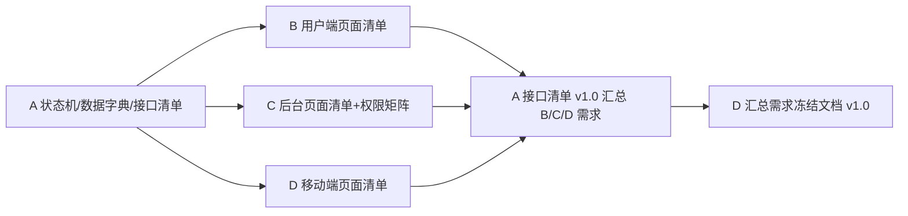

# 第一阶段（需求冻结）工作区

> 周期 3 天 ｜ 依据《电商项目四人工分与第一阶段任务书》第三章
> 完成标志：✅ 已完成——状态机枚举全员签字确认；接口清单发布 v1.0；各端页面清单覆盖完整业务链路；需求冻结文档 v1.0 全员签字（2026-08-12）。

## 目录结构与成员工作区

```
docs/phase1/
├── README.md                 ← 本文件（第一阶段总览）
├── member-a/                 ← 成员A（后端核心）工作区 ★ 状态/数据/接口
│   ├── README.md             ← A 的工作看板与任务索引
│   ├── tasks/                ← A 的 6 个细任务文档（T1-T6）
│   └── deliverables/         ← A 的交付物落位目录
├── member-b/                 ← 成员B（用户网页端）工作区（待 B 启动）
├── member-c/                 ← 成员C（后台端）工作区（待 C 启动）
└── member-d/                 ← 成员D（App/小程序+测试/文档）工作区（待 D 启动）
```

## 成员工作区一览

| 成员 | 角色 | 第一阶段产出物 | 工作区状态 |
|------|------|----------------|------------|
| A | 后端核心 | 状态机枚举表、数据字典、接口清单 v1.0、JWT 方案、错误码分段表、需求冻结 A 部分定稿 | ✅ 6/6 已完成 |
| B | 用户网页端 | 用户端页面清单（13 页）、接口需求清单（4 项增补） | ✅ 2/2 已完成 |
| C | 后台端 | 后台页面清单（13 页）、权限矩阵、接口需求清单 | ✅ 2/2 已完成 |
| D | App/小程序+测试/文档 | 移动端页面清单、测试基线、汇总《需求冻结文档 v1.0》 | ✅ 3/3 已完成 |

## 各成员依赖关系（联调顺序）



- **Day 1**：A 发布状态机枚举草案 → 全员当天确认签字
- **Day 2**：A 输出数据字典 + 接口清单 v0.9；B/C 提交接口需求
- **Day 3**：接口清单 v1.0 定稿 → D 汇总《需求冻结文档 v1.0》→ 全员签字

## 协作约定

1. 每位成员的交付物写入各自 `member-x/deliverables/` 目录，任务过程写入 `member-x/tasks/`。
2. 提交信息格式：`docs(phase1): <说明>`；分支：`feature/phase1-<模块>`（从 `develop` 切出）。
3. 所有文档使用 Markdown，表格优先；状态、字段、接口等契约性内容必须与 `.qoder/rules/` 一致。
4. 每完成一个任务，在对应任务文档勾选状态并把看板（member-a/README.md）同步更新。
