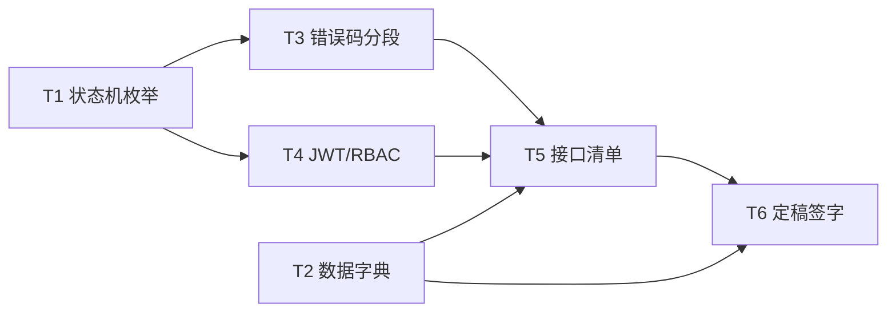

# 成员 A（后端核心）工作区

> 角色：后端核心 ｜ 第一阶段职责：定状态、数据、接口
> 依据：《电商项目四人工分与第一阶段任务书》4.1 节

## 任务看板（6 个细任务）

| # | 任务 | 计划 | 产出物（deliverables/） | 状态 |
|---|------|------|--------------------------|------|
| T1 | 状态机枚举表（4 类状态机 + 流转规则，全员签字版） | Day 1 | `01-状态机枚举表.md` | 🟦 v0.9 草案待签字 |
| T2 | 数据字典 v1.0（核心 13 张表字段清单） | Day 2 | `02-数据字典v1.0.md` | ✅ 已完成 |
| T3 | 错误码分段表（7 段 + 公共错误码） | Day 2 | `03-错误码分段表.md` | ⬜ 未开始 |
| T4 | JWT 鉴权与 RBAC 权限方案 | Day 2 | `04-JWT鉴权与RBAC方案.md` | ⬜ 未开始 |
| T5 | 接口清单 v1.0（汇总 B/C/D 接口需求） | Day 2-3 | `05-接口清单v1.0.md` | ⬜ 未开始 |
| T6 | 需求冻结 A 部分定稿、全员签字、交接 | Day 3 | `06-需求冻结A部分定稿.md` | ⬜ 未开始 |

图例：⬜ 未开始 ｜ 🟦 进行中 ｜ ✅ 已完成

## 执行顺序与依赖



- **T1 必须 Day 1 完成**：状态机是 B/C/D 页面清单的前置输入，当天需全员签字。
- **T2/T3/T4 可并行**（Day 2），都是契约性文档，互不依赖。
- **T5 依赖 B/C/D 的接口需求清单**（Day 2 提交）与 T1/T3/T4 的定稿结果。
- **T6 依赖全部前序任务**，与 D 协作汇总。

## 目录结构

```
docs/phase1/member-a/
├── README.md              ← 本文件（工作看板）
├── tasks/                 ← 6 个细任务文档（每个任务的步骤与验收标准）
│   ├── T1-状态机枚举表.md
│   ├── T2-数据字典v1.0.md
│   ├── T3-错误码分段表.md
│   ├── T4-JWT鉴权与RBAC方案.md
│   ├── T5-接口清单v1.0.md
│   └── T6-需求冻结定稿与签字.md
└── deliverables/          ← 交付物落位（完成任务后文档写入此处）
```

## 我的专属配置（区分于团队共享）

团队共享配置在 `.qoder/skills/`、`.qoder/rules/`、`.qoder/mcps/`，所有成员通用。
我的专属配置在 `.qoder/members/member-a/`，只有我使用：

| 类型 | 文件 | 用途 | 对应任务 |
|------|------|------|----------|
| skill | `skills/state-machine-spec.md` | 生成/审查状态机枚举表 | T1 |
| skill | `skills/db-dict-generator.md` | 生成/审查数据字典 | T2 |
| skill | `skills/api-inventory.md` | 生成/审查接口清单 | T5 |
| rule | `rules/backend-layering.md` | 后端包结构与分层规范 | T4 及后续阶段 |
| rule | `rules/jwt-rbac.md` | JWT 鉴权与 RBAC 实现约束 | T4 及后续阶段 |
| mcp | `mcps/backend-mcp-guide.md` | genui 画状态机图、browser-use 验证接口 | T1/T5 |

使用方式：做每个任务前，先读取对应 task 文档 → 再读取关联 skill/rule → 按步骤产出交付物。

## 每日站会检查点

- **Day 1 结束**：T1 状态机草案已发出，B/C/D 签字确认（签字记录写入 T1 交付物末尾）。
- **Day 2 结束**：T2/T3/T4 完成；收到 B/C/D 接口需求清单；T5 出 v0.9。
- **Day 3 结束**：T5 发布 v1.0；T6 完成交接；全部交付物合入 `docs/phase1/member-a/deliverables/`。
