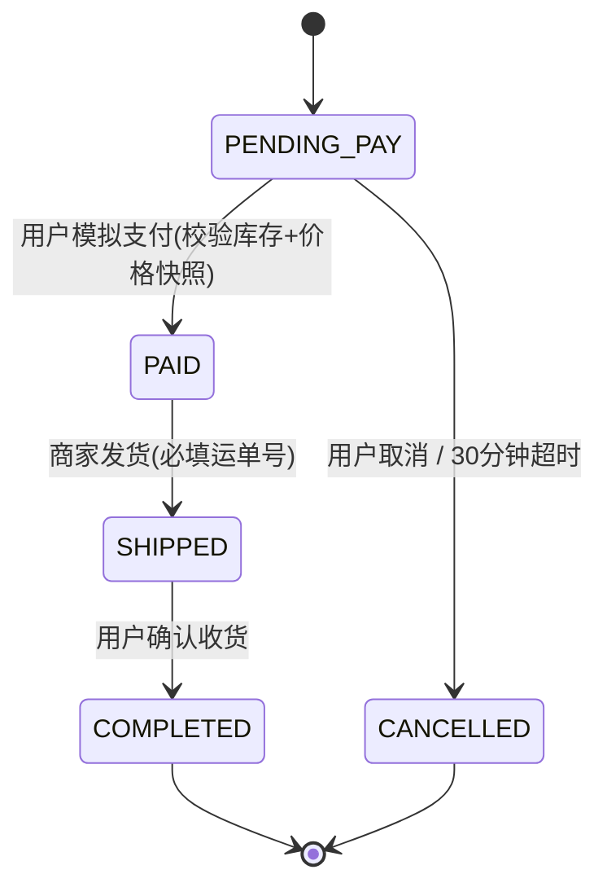
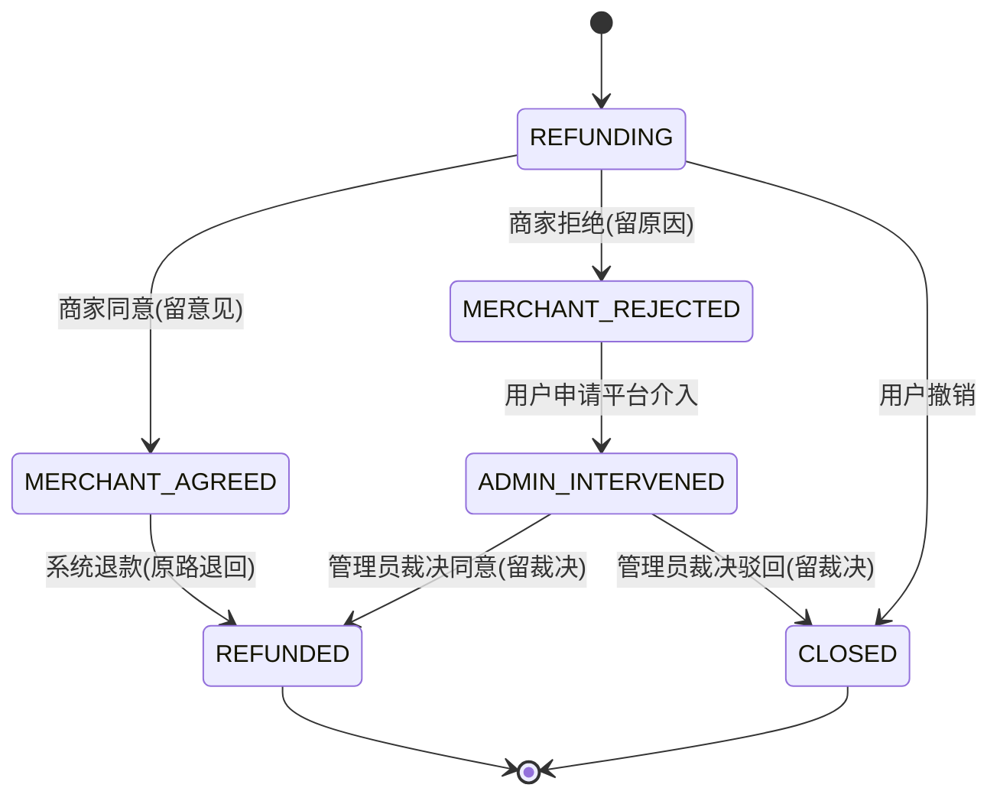
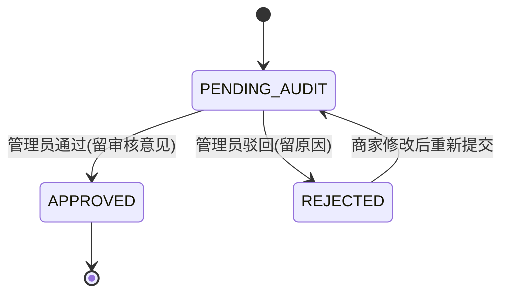
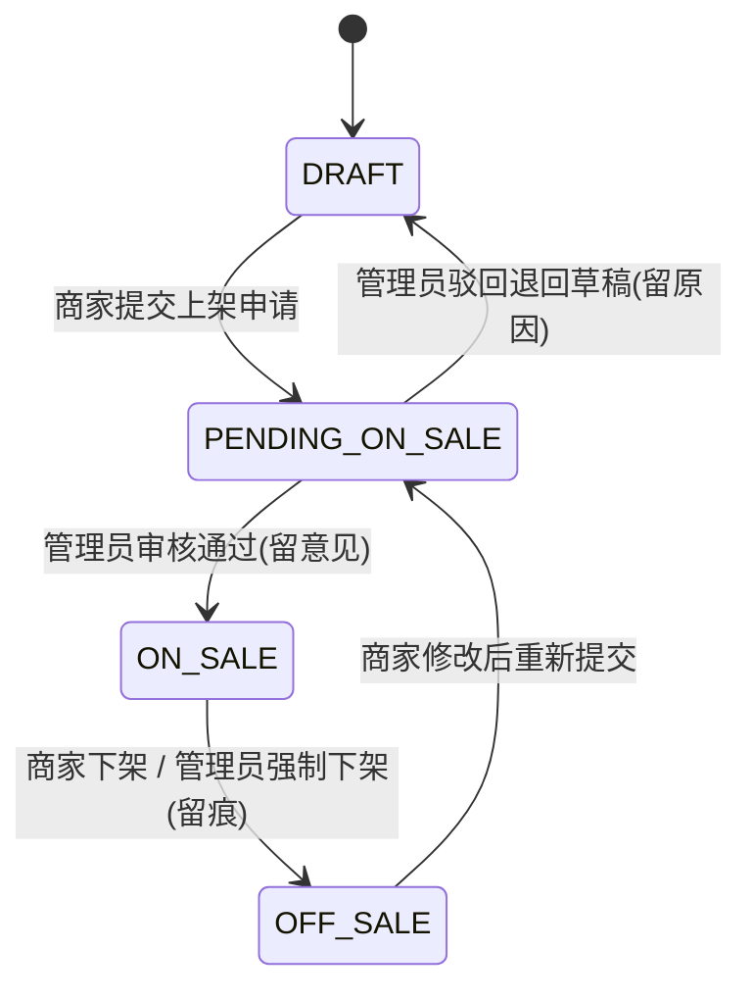

# 01 状态机枚举表（全员签字版）

> 版本：v0.9（草案，待 B/C/D 签字后升 v1.0）
> 作者：成员 A（后端核心）｜ 日期：2026-08-12
> 依据：《京东风格电商平台项目启动指导书》第 4 节 + 《电商项目四人工分与第一阶段任务书》4.1 + `.qoder/rules/state-machine.md`
> 本次已同步修订 rules 中两处差异，见第 5 节「差异记录与决策」。

## 0. 总览

| 业务对象 | 状态数 | 终态 | 状态定义方 | 用途 |
|---|---|---|---|---|
| 订单 Order | 5 | COMPLETED / CANCELLED | 后端 | 订单全生命周期 |
| 售后单 Refund | 6 | REFUNDED / CLOSED | 后端 | 退款售后全流程 |
| 商家入驻 Merchant | 3 | APPROVED（无终态，可持续经营） | 后端 | 入驻审核 |
| 商品 Product | 4 | 无（可反复上下架） | 后端 | 商品发布与展示 |

**全局约束（所有状态机共同遵守）**

1. 状态值由后端枚举统一定义，前端只读展示，禁止前端自行发明状态名。
2. 禁止使用数字状态码，全部使用枚举字符串（如 `PENDING_PAY`）。
3. 任何非法流转由后端拒绝，统一返回错误码 `1001`。
4. 每个流转必须有显式业务方法（如 `payOrder`、`shipOrder`、`agreeRefund`），禁止通用 `updateStatus`。
5. 每次状态变更必须更新 `updated_at`；敏感变更（退款裁决、商家审核、商品上架审核）必须写 `audit_log`。

---

## 1. 订单状态机（Order）

### 1.1 状态集合表

| 状态值 | 中文名 | 说明 |
|---|---|---|
| PENDING_PAY | 待支付 | 订单已创建，等待用户支付 |
| PAID | 已支付待发货 | 用户支付成功，等待商家发货 |
| SHIPPED | 已发货待收货 | 商家已发货并填写运单号 |
| COMPLETED | 已完成 | 用户已确认收货，订单闭环（终态） |
| CANCELLED | 已取消 | 用户取消或支付超时自动取消（终态） |

### 1.2 合法流转清单

| 流转 | 触发方 | 触发动作 | 附加条件（后端校验） | 校验失败处理 |
|---|---|---|---|---|
| PENDING_PAY → PAID | 用户 | 模拟支付 | 库存充足；价格快照与当前价格一致；订单未超时 | 返回 1001，订单保持 PENDING_PAY |
| PENDING_PAY → CANCELLED | 用户 | 主动取消订单 | 仅 PENDING_PAY 可取消 | 其他状态返回 1001 |
| PENDING_PAY → CANCELLED | 系统 | 支付超时自动取消 | 创建后 30 分钟未支付（时长可配置） | - |
| PAID → SHIPPED | 商家 | 发货并填写运单号 | 运单号必填且非空；记录发货时间 | 无运单号返回 1001 |
| SHIPPED → COMPLETED | 用户 | 确认收货 | 订单处于 SHIPPED | 状态不符返回 1001 |

### 1.3 禁止流转清单

| 禁止流转 | 原因 |
|---|---|
| PENDING_PAY → SHIPPED / COMPLETED | 未支付不可发货、不可完成 |
| PAID → CANCELLED | 已支付订单不可直接取消，退款必须走售后单 |
| PAID → PENDING_PAY | 支付不可回退 |
| SHIPPED → PAID / PENDING_PAY | 已发货不可回退 |
| COMPLETED → 任何状态 | 已完成是终态，退款走售后单 |
| CANCELLED → 任何状态 | 已取消是终态 |
| 任何状态 → PENDING_PAY | 订单创建不可逆 |

### 1.4 业务规则

1. 仅待支付（PENDING_PAY）订单可取消。
2. 模拟支付：后端校验库存与价格快照通过后方可转 PAID。
3. 发货必须有运单号并持久化到订单。
4. 订单 COMPLETED 后闭环，售后诉求必须通过售后单流程。
5. 支付超时默认 30 分钟自动取消（可配置关闭，演示时可设短时长）。

### 1.5 流转图

---

## 2. 售后单状态机（Refund）

### 2.1 状态集合表

| 状态值 | 中文名 | 说明 |
|---|---|---|
| REFUNDING | 退款中 | 用户已提交退款申请，等待商家处理 |
| MERCHANT_AGREED | 商家同意 | 商家同意退款，等待系统执行退款 |
| MERCHANT_REJECTED | 商家拒绝 | 商家拒绝退款，用户可申请平台介入 |
| ADMIN_INTERVENED | 平台介入 | 平台介入处理买卖争议 |
| REFUNDED | 已退款 | 退款成功（终态） |
| CLOSED | 已关闭 | 用户撤销或平台裁决驳回（终态） |

### 2.2 合法流转清单

| 流转 | 触发方 | 触发动作 | 附加条件（后端校验） | 校验失败处理 |
|---|---|---|---|---|
| REFUNDING → MERCHANT_AGREED | 商家 | 同意退款 | 退款金额 ≤ 订单实付金额；持久化 merchant_reply | 金额超限返回 1001 |
| REFUNDING → MERCHANT_REJECTED | 商家 | 拒绝退款 | 必须填写拒绝原因（merchant_reply） | 未填原因返回 1001 |
| REFUNDING → CLOSED | 用户 | 撤销退款申请 | 商家尚未处理（仍处 REFUNDING） | 商家已处理返回 1001 |
| MERCHANT_AGREED → REFUNDED | 系统 | 模拟退款（原路退回） | 退款成功回执；记录退款流水；累计订单已退款金额 | 退款失败保持 MERCHANT_AGREED，可重试 |
| MERCHANT_REJECTED → ADMIN_INTERVENED | 用户 | 申请平台介入 | 商家已拒绝 | 状态不符返回 1001 |
| ADMIN_INTERVENED → REFUNDED | 管理员 | 裁决同意退款 | 持久化 admin_result（裁决意见）；执行退款 | 未填裁决意见返回 1001 |
| ADMIN_INTERVENED → CLOSED | 管理员 | 裁决驳回退款 | 持久化 admin_result（裁决意见） | 未填裁决意见返回 1001 |

### 2.3 禁止流转清单

| 禁止流转 | 原因 |
|---|---|
| REFUNDED → 任何状态 | 已退款是终态 |
| CLOSED → 任何状态 | 已关闭是终态 |
| MERCHANT_AGREED → CLOSED / MERCHANT_REJECTED | 商家已同意不可反悔 |
| MERCHANT_REJECTED → MERCHANT_AGREED | 商家拒绝后不可改同意，用户可申请平台介入 |
| ADMIN_INTERVENED → MERCHANT_AGREED / MERCHANT_REJECTED | 平台介入后商家无权再处理 |
| REFUNDING → ADMIN_INTERVENED | 必须先经商家处理，不可直接平台介入 |
| REFUNDING → REFUNDED | 商家未同意不可直接退款 |

### 2.4 业务规则

1. 发起条件：订单状态 ∈ {PAID, SHIPPED, COMPLETED}。
2. 同一订单存在进行中售后单（非终态）时，不可重复发起新售后单。
3. 订单已全额退款后，不可再发起新售后单。
4. merchant_reply（商家回复）与 admin_result（管理员裁决）必须持久化，审计留痕。
5. 终态 REFUNDED / CLOSED 不可再流转。

### 2.5 流转图

---

## 3. 商家入驻状态机（Merchant Onboarding）

### 3.1 状态集合表

| 状态值 | 中文名 | 说明 |
|---|---|---|
| PENDING_AUDIT | 待审核 | 商家已提交入驻资料，等待管理员审核 |
| APPROVED | 已通过 | 审核通过，可发布商品、处理订单 |
| REJECTED | 已驳回 | 审核驳回，可修改资料后重新提交 |

### 3.2 合法流转清单

| 流转 | 触发方 | 触发动作 | 附加条件（后端校验） | 校验失败处理 |
|---|---|---|---|---|
| PENDING_AUDIT → APPROVED | 管理员 | 审核通过 | 必须填写审核意见（audit_reason） | 未填意见返回 1001 |
| PENDING_AUDIT → REJECTED | 管理员 | 审核驳回 | 必须填写驳回原因（audit_reason） | 未填原因返回 1001 |
| REJECTED → PENDING_AUDIT | 商家 | 修改资料后重新提交 | 同一用户仅在被驳回后可重提，不产生新记录 | 状态不符返回 1001 |

### 3.3 禁止流转清单

| 禁止流转 | 原因 |
|---|---|
| APPROVED → PENDING_AUDIT / REJECTED | 已通过不可回退审核 |
| REJECTED → APPROVED | 驳回不可直接通过，必须重新提交 |
| 任何状态 → 删除入驻记录 | 入驻记录必须保留审计 |

### 3.4 业务规则

1. 同一用户只能有一条入驻申请记录；驳回后可修改重提。
2. 管理员审核必须留痕（audit_reason），并写 audit_log。
3. 仅 APPROVED 商家可发布商品、处理订单。
4. 商家店铺信息在 APPROVED 后可编辑，但关键变更（店铺名等）如需重新审核，按接口契约另行约定（T5 接口清单中注明）。

### 3.5 流转图

---

## 4. 商品状态机（Product）

### 4.1 状态集合表

| 状态值 | 中文名 | 说明 |
|---|---|---|
| DRAFT | 草稿 | 商家保存未提交审核 |
| PENDING_ON_SALE | 待上架 | 商家已提交上架申请，等待管理员审核 |
| ON_SALE | 已上架 | 审核通过，用户端可见 |
| OFF_SALE | 已下架 | 商家主动下架或管理员强制下架 |

### 4.2 合法流转清单

| 流转 | 触发方 | 触发动作 | 附加条件（后端校验） | 校验失败处理 |
|---|---|---|---|---|
| DRAFT → PENDING_ON_SALE | 商家 | 提交上架申请 | 必填字段完整：标题、价格、库存、主图、类目 | 字段缺失返回 1001 |
| PENDING_ON_SALE → ON_SALE | 管理员 | 审核通过 | 必须填写审核意见（audit_reason） | 未填意见返回 1001 |
| PENDING_ON_SALE → DRAFT | 管理员 | 审核驳回退回草稿 | 必须填写驳回原因（audit_reason） | 未填原因返回 1001 |
| ON_SALE → OFF_SALE | 商家 | 主动下架 | 无 | - |
| ON_SALE → OFF_SALE | 管理员 | 巡检强制下架（违规） | 必须填写下架原因并写 audit_log | 未填原因返回 1001 |
| OFF_SALE → PENDING_ON_SALE | 商家 | 修改后重新提交上架申请 | 重新走审核流程 | - |

### 4.3 禁止流转清单

| 禁止流转 | 原因 |
|---|---|
| DRAFT → ON_SALE / OFF_SALE | 草稿必须经审核上架 |
| ON_SALE → DRAFT | 已上架不可直接回草稿 |
| PENDING_ON_SALE → OFF_SALE | 未上架不存在下架 |
| OFF_SALE → ON_SALE | 重新上架必须重新提交审核 |
| OFF_SALE → DRAFT | 下架商品不可直接回草稿 |

### 4.4 业务规则

1. 仅 ON_SALE 商品在用户网页端 / App / 小程序可见。
2. 重新上架一律重新提交审核（统一规则，含商家主动下架后重上）。
3. 商品状态变更不影响历史订单（订单保存 title_snapshot / price_snapshot 快照）。
4. 管理员强制下架必须写 audit_log 留痕。

### 4.5 流转图

---

## 5. 差异记录与决策

本次对照《启动指导书》第 4 节与《四人工分与第一阶段任务书》4.1 逐条核对 `.qoder/rules/state-machine.md`，发现两处差异并已修订 rules：

| # | 差异点 | rules 原文 | 指导书/任务书 | 决策 | 影响 |
|---|---|---|---|---|---|
| 1 | 商品状态 | `PENDING_AUDIT - 待审核（可选）` | 「草稿 → 待上架 → 已上架 / 已下架」4 态固定 | 统一为 `PENDING_ON_SALE 待上架`，审核制，取消"可选" | rules 已修订；B/C/D 页面清单按 4 态设计 |
| 2 | 商家入驻重提 | 流转清单未列 `REJECTED → PENDING_AUDIT` | 指导书未明说；rules 文字"only once per user until rejected"暗示可重提 | 补齐为合法流转 | rules 已修订；商家驳回后可修改重提 |

订单 5 态、售后 6 态、商家入驻 3 态经三处文档核对完全一致，无差异。

## 6. 后端实现约束（引用 rules Implementation Rules）

1. 后端必须校验每一次状态流转，非法流转统一返回错误码 `1001`。
2. 使用显式业务方法（`payOrder` / `shipOrder` / `confirmReceipt` / `agreeRefund` / `refuseRefund` / `auditMerchant` / `auditProduct` 等），禁止通用 `updateStatus`。
3. 状态变更必须更新 `updated_at`。
4. 敏感状态变更（退款裁决、商家审核、商品上架审核、管理员强制下架）必须写 `audit_log`。

## 7. 全员签字区

| 成员 | 角色 | 签字 | 日期 | 意见 |
|---|---|---|---|---|
| A | 后端核心（发起人） | 已确认 | 2026-08-12 | 无异议 |
| B | 用户网页端 | 待签 | - | - |
| C | 商家后台 + 管理员后台 | 待签 | - | - |
| D | App / 小程序 + 测试 | 待签 | - | - |

> 签字方式：在本文件 GitHub 上以 PR 评论或线下签字后由 A 汇总填写。三人签字齐全后，本文件升版 v1.0。

## 8. 验收自查

- [x] 订单 5 态、售后 6 态、商家入驻 3 态、商品 4 态与 rules/state-machine.md 完全一致（rules 已同步修订）
- [x] 每条合法流转标注触发方（用户/商家/管理员/系统）与触发动作
- [x] 禁止流转明确列出（含原因）
- [x] 业务规则覆盖：退款留痕（merchant_reply / admin_result）、审核原因（audit_reason）、快照、审计日志
- [ ] B/C/D 三人签字齐全（姓名 + 日期）——签字后升 v1.0
- [x] 无前端自创状态名、无数字状态码
