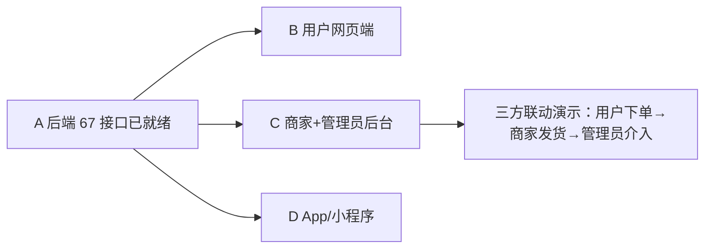

# 第四阶段（各端开发）工作区

> 周期：待定 ｜ 依据：《电商项目四人工分与第一阶段任务书》+ T5 接口清单 v1.0
> 前置：✅ 第三阶段（数据库与后端）已完成（2026-08-15，67 接口 + `mvn compile` 通过）
> 完成标志：四个前端工程按契约开发完成，主要页面流程可跑通（里程碑 M4）

## 目录结构与成员工作区

```
docs/phase4/
├── README.md                 ← 本文件（第四阶段总览）
├── member-b/                 ← 成员B（用户网页端）工作区（✅ 已完成 + W6 补充）
├── member-c/                 ← 成员C（商家后台+管理员后台）工作区 ★（✅ 已完成）
└── member-d/                 ← 成员D（App/小程序）工作区（✅ 已完成 + X6 补充）
```

## 成员工作区一览

| 成员 | 角色 | 第四阶段产出物 | 契约依据（T5 v1.0） | 工作区状态 |
|------|------|----------------|----------------------|------------|
| B | 用户网页端 | Vue 3 + Vite + Element Plus 工程，完整购买闭环（W-01~W-05）+ 契约核对 W-06 | P-001~008 / U-001~025 | ✅ 已完成（2026-08-15 W1~W5；2026-08-29 W6 契约对齐补充） |
| C | 商家后台+管理员后台 | Vue 3 + Element Plus 共用工程（按角色分菜单），后台治理闭环 | M-001~015 / A-001~019 | ✅ 已完成（2026-08-15 C1~C6） |
| D | App/小程序 | uni-app 工程，页面复用与端差异适配（X-01~X-05）+ 契约核对与修复 X-06 | P/U 组为主 | ✅ 已完成（2026-08-15 X1~X5；2026-08-29 X6 契约对齐补充） |

> 2026-08-29 契约对齐补充轮：B 产出 `member-b/deliverables/W-06-接口契约核对表.md`、D 产出 `member-d/deliverables/X-06-接口契约核对表.md`（33 接口逐条 ✅⚠️🔴）；D 修复 6 处契约运行时代码（U-003/U-008 裸数组解包×4、U-012 错误分支重映射、U-002 newPassword 字段）；B/D 修正 api 注释漂移并整理契约偏差清单（建议 A 升版 T5 v1.1）。全员真实联调待 M3（MySQL 8 部署）。

## 各成员依赖关系



- B/C/D 按 T5 编号对接接口，无需再向 A 追问接口细节（第一阶段验收标准）。
- 联调按版本号对接：后端接口以 `docs/phase1/member-a/deliverables/05-接口清单v1.0.md` 为准。

## 协作约定

1. 每位成员的工程代码放入仓库对应目录（如 `admin-web/`、`user-web/`、`mobile-app/`），过程文档写入各自 `member-x/` 工作区。
2. 提交信息格式：`feat(scope): <说明>` 或 `docs(phase4): <说明>`；分支：`feature/phase4-<模块>`（从 `develop` 切出）。
3. 所有页面必须遵守：`.qoder/rules/state-machine.md`（状态只读）、`api-contract.md`（统一返回）、`code-style.md`；组件选用参照 `.qoder/skills/frontend-component-guide.md`。
4. 每完成一个任务，在对应任务文档勾选状态并同步更新进度文件四件套。
