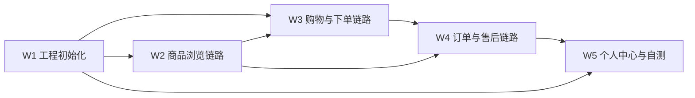

# 成员 B（用户网页端）第四阶段工作区

> 角色：用户网页端 ｜ 第四阶段职责：按 T5 契约完成用户端完整购买闭环
> 依据：《电商项目四人工分与第一阶段任务书》4.2 节 + T5 接口清单 v1.0（P-001~008 / U-001~025，共 33 接口）
> 周期：预计 5 天（2026-08-15 ~ 2026-08-20）

## 任务看板（5 个细任务）

| # | 任务 | 计划 | 产出物（deliverables/） | 状态 |
|---|------|------|--------------------------|------|
| W1 | 工程初始化：Vite + Vue 3 + Element Plus + Router/Pinia/Axios + 登录注册 + 路由守卫 | Day 1 | `W-01-工程初始化.md`（登录/注册页 + 公共请求层 + 路由骨架） | ⬜ 未开始 |
| W2 | 商品浏览链路：首页 / 搜索列表 / 商品详情 / 评价列表（P-003~P-006） | Day 1-2 | `W-02-商品浏览链路.md` | ⬜ 未开始 |
| W3 | 购物与下单链路：购物车 / 结算 / 提交订单 / 模拟支付（U-008~U-016） | Day 2-3 | `W-03-购物与下单链路.md` | ⬜ 未开始 |
| W4 | 订单与售后链路：订单中心 / 订单详情 / 售后中心 / 评价（U-013~U-021/U-024） | Day 3-4 | `W-04-订单与售后链路.md` | ⬜ 未开始 |
| W5 | 个人中心链路 + 全链路自测：个人资料 / 地址 / 通知（U-001~U-007/U-022~U-025）+ 空状态与错误提示 | Day 4-5 | `W-05-个人中心与自测.md` | ⬜ 未开始 |

图例：⬜ 未开始 ｜ 🟦 进行中 ｜ ✅ 已完成　**B 第四阶段 0/5**

## 执行顺序与依赖



- **W1 必须 Day 1 完成**：登录/鉴权是所有用户组接口（U-001~U-025）的前置，token 存取与路由守卫先定死。
- **W2 可先行**：公共组接口（P-001~P-008）无需登录，是端到端链路的第一环。
- **W3 依赖 W1 的购物车接口封装 + W2 的商品数据**：下单主链路（校验库存/价格快照/拆单）是 P0 验收项。
- **W4 依赖 W3 的订单产生**：支付 → 发货（商家端）→ 收货 → 评价/售后的按钮显隐完全由 T1 状态机驱动。
- **W5 收尾**：地址管理支撑 W3 结算；通知承载全链路状态变化；空状态/错误提示覆盖 P1 验收项。

## 契约输入（来自 A，只读，不自创）

| 契约 | 文件 | 对我方的约束 |
|------|------|--------------|
| 状态机 | `../member-a/deliverables/01-状态机枚举表.md` | 订单 5 态 / 售后 6 态，按钮显隐只读后端状态 |
| 错误码 | `../member-a/deliverables/03-错误码分段表.md` | 只按 `code` 展示 `message`；1002 跳登录；2001~2004 注册/登录特殊文案 |
| 接口清单 | `../member-a/deliverables/05-接口清单v1.0.md` | P-001~008 + U-001~025 共 33 接口，统一返回 `{code,message,data,total}`，分页 `page/pageSize/list/total` |
| 后端实现 | `backend/`（A 已完成 67 接口） | 联调对象；M3 里程碑待 MySQL 8 环境 |
| 团队规则 | `.qoder/rules/api-contract.md`、`code-style.md` | 强制遵守 |

## 页面清单（13 页，来自 B-01 v1.0）

| 编号 | 页面 | 路由 | 对应任务 |
|---|---|---|---|
| B-P01 | 首页 | `/` | W2 |
| B-P02 | 搜索/列表页 | `/search` | W2 |
| B-P03 | 商品详情 | `/product/:id` | W2 |
| B-P04 | 登录/注册 | `/login` | W1 |
| B-P05 | 购物车 | `/cart` | W3 |
| B-P06 | 结算页 | `/checkout` | W3 |
| B-P07 | 订单中心 | `/orders` | W4 |
| B-P08 | 订单详情 | `/orders/:id` | W4 |
| B-P09 | 售后中心 | `/refunds` | W4 |
| B-P10 | 评价 | `/orders/:id/review` | W4 |
| B-P11 | 个人中心 | `/profile` | W5 |
| B-P12 | 地址管理 | `/addresses` | W5 |
| B-P13 | 消息通知 | `/notifications` | W5 |

## 目录结构

```
docs/phase4/member-b/
├── README.md              ← 本文件（第四阶段工作看板）
├── tasks/                 ← 第四阶段任务书（W1-W5 步骤与验收标准）
│   └── W1-W5-用户网页端任务书.md
└── deliverables/          ← 交付物落位（每任务完成一个文档记录实现要点与截图路径）
```

用户端工程代码按启动指导书约定，后续接入仓库独立工程目录（如 `frontend-user/`），本工作区只存文档。

## 我的专属配置（区分于团队共享）

团队共享配置在 `.qoder/skills/`、`.qoder/rules/`、`.qoder/mcps/`，所有成员通用。
我的专属配置在 `.qoder/members/member-b/`，只有我使用：

| 类型 | 文件 | 用途 | 对应任务 |
|------|------|------|----------|
| skill | `skills/vue-page-spec.md` | 按 B-01 页面清单生成/审查用户端页面 | W2-W5 |
| skill | `skills/api-integration.md` | 按 T5 契约对接接口（封装请求/错误码处理/分页） | W1-W5 |
| rule | `rules/frontend-structure.md` | 用户端工程目录结构与分层规范 | W1 及后续 |
| mcp | `mcps/browser-mcp-guide.md` | browser-use 端到端验证页面交互 | W2-W5 |

使用方式：做每个任务前，先读取 tasks 任务书对应章节 → 再读取关联 skill/rule → 按步骤产出交付物。

## 每日站会检查点

- **Day 1 结束**：W1 完成（登录/注册可跑通，token 存取 + 路由守卫就绪）；W2 首页/搜索/详情页骨架出齐。
- **Day 2 结束**：W2 完成（商品浏览链路全通）；W3 购物车完成、结算页进行中。
- **Day 3 结束**：W3 完成（下单 + 模拟支付跑通，订单状态 PENDING_PAY → PAID）；W4 订单中心进行中。
- **Day 4 结束**：W4 完成（订单全状态按钮显隐 + 售后全流程 + 评价）；W5 进行中。
- **Day 5 结束**：W5 完成（个人中心/地址/通知收尾）；13 页全链路自测通过；空状态与错误提示覆盖（P1）；与 A 联调记录归档。
