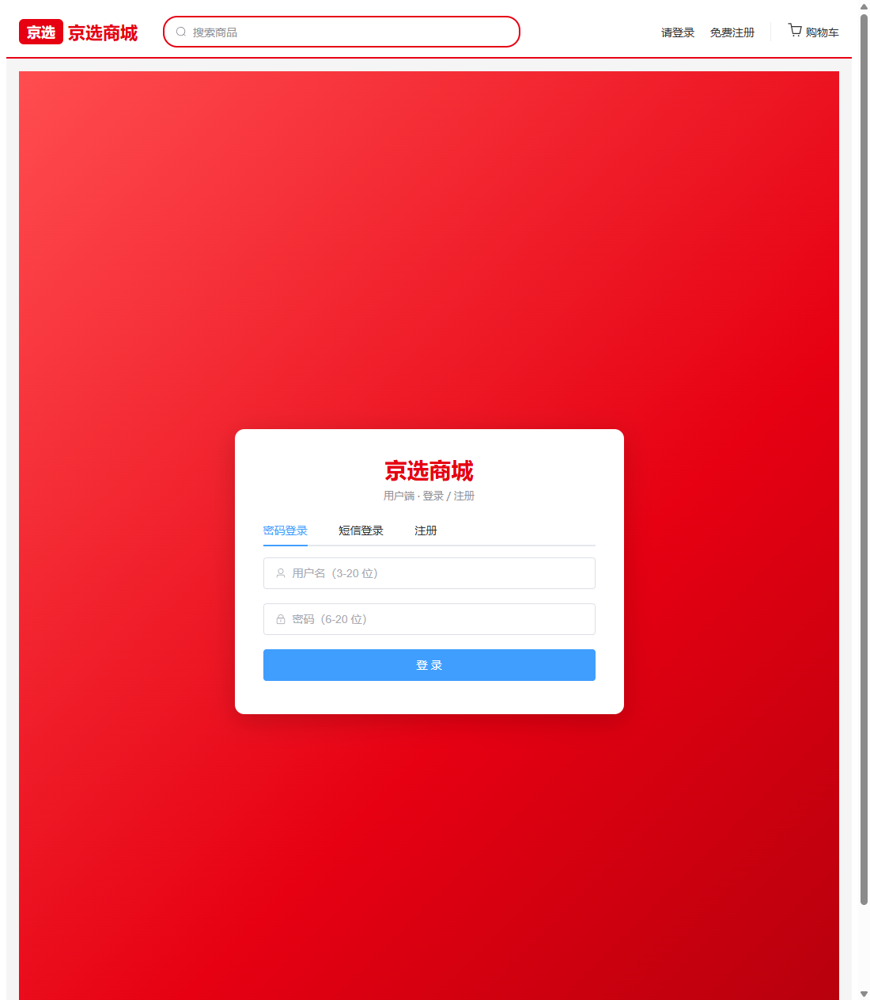
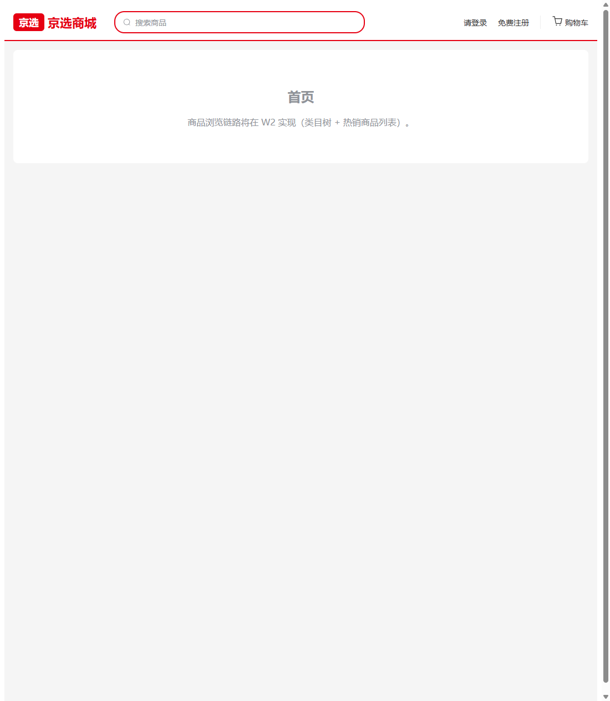

# W-01 工程初始化与登录注册

> 版本：v1.0 ｜ 作者：成员 B（用户网页端）｜ 日期：2026-08-15 ｜ 状态：✅ 已完成
> 依据：`docs/phase4/member-b/tasks/W1-W5-用户网页端任务书.md` W1 章节 + T5 接口清单（P-001/P-002/P-007/P-008）+ T3 错误码分段表 + `.qoder/rules/api-contract.md` + `.qoder/members/member-b/rules/frontend-structure.md`
> 范围：`frontend-user/` 工程初始化、登录/注册页、token 存取与路由守卫、13 页路由骨架。

## 0. 结论摘要

- ✅ Vite 6 + Vue 3 工程 `frontend-user/` 可运行：`npm install`（97 包）、`npm run build` 通过（1697 模块 / 4.81s）、dev server http://localhost:5173/ 正常。
- ✅ 登录页三 Tab（密码登录 / 短信登录 / 注册）接通 P-002/P-007/P-008/P-001，表单校验与特殊错误文案就绪。
- ✅ Pinia user store + localStorage 持久化；Axios 拦截器统一注入 `Authorization: Bearer <token>`、统一解包 `{code,message,data,total}`、`1002` 全局跳登录。
- ✅ 13 页路由表 + `beforeEach` 守卫：未登录访问 `/cart` → `/login?redirect=/cart`（浏览器实测通过）。
- ⏳ 登录成功后的 token 发放链路依赖后端联调（M3 MySQL 8 环境部署后验证 P-002 真实返回）。

## 1. 工程结构

```
frontend-user/
├── package.json            # vue 3.5 + vite 6 + element-plus 2.9 + router 4.5 + pinia 3 + axios 1.7
├── vite.config.js          # @ 别名→src；port 5173；proxy /api → http://localhost:8080
├── index.html
└── src/
    ├── main.js             # 挂载 Element Plus + Pinia + Router
    ├── App.vue             # 顶部导航（logo/搜索入口/登录态/购物车/消息）+ router-view
    ├── api/
    │   ├── request.js      # Axios 实例：baseURL /api、token 注入、统一解包、1002 跳登录、silent 机制
    │   └── auth.js         # register(P-001) / login(P-002) / sendSmsCode(P-007) / smsLogin(P-008) / getProfile / updateProfile
    ├── stores/
    │   └── user.js         # Pinia：token/userInfo 持久化（localStorage key: token / userInfo）、setLogin/logout
    ├── router/
    │   └── index.js        # 13 页路由 + beforeEach 守卫（未登录→/login 带回跳；已登录访问 /login→/）
    ├── utils/
    │   ├── status-map.js   # T1 状态映射（ORDER_STATUS_MAP 五态 / REFUND_STATUS_MAP 六态 / ORDER_TABS）
    │   └── format.js       # 金额/日期格式化
    ├── components/
    │   └── EmptyState.vue  # 空状态组件（P1 验收项，W2-W5 复用）
    └── views/              # 13 页
        ├── Login.vue       # 三 Tab 登录注册页（W1 实现，304 行）
        ├── Home.vue / Search.vue / ProductDetail.vue   # 占位（W2）
        ├── Cart.vue / Checkout.vue                     # 占位（W3）
        ├── OrderList.vue / OrderDetail.vue / RefundCenter.vue / Review.vue  # 占位（W4）
        └── Profile.vue / AddressList.vue / Notifications.vue                # 占位（W5）
```

13 页路由与任务书 B-01 页面清单一一对应（含 `meta.requiresAuth` 登录控制），W2-W5 各页为占位视图（`EmptyState` 空状态组件），不空白、不报错。

## 2. 登录流程截图

### 2.1 密码登录（默认 Tab）


表单校验：用户名 3-20 位、密码 6-20 位；空提交实测提示"请输入用户名/请输入密码"。
提交调 `POST /api/users/login`（P-002，silent 模式），成功 `userStore.setLogin({token,userInfo})` 后跳转 `redirect` 或首页；`2003`→"用户名或密码错误"、`2004`→"账号已被禁用"（T3 特殊文案）。

### 2.2 短信登录



"获取验证码"调 `POST /api/users/sms-code`（P-007）后 60 秒倒计时防重复；页面提示演示环境固定码 `123456`（D-02 方案）。提交调 `POST /api/users/login/sms`（P-008）。

### 2.3 注册


注册调 `POST /api/users/register`（P-001，silent 模式）：用户名 3-20 / 密码 6-20 / 二次确认一致 / 手机号 `1[3-9]\d{9}`；`2001`→"用户名已存在"、`2002`→"手机号已注册"；成功后切回密码登录 Tab 并回填用户名。

### 2.4 首页与顶部导航



顶部导航：logo（回首页）、搜索入口、登录态展示（用户名 + 退出）/ 未登录入口、购物车、消息。登录态来自 Pinia（localStorage 持久化），刷新不丢。

## 3. 关键技术要点

### 3.1 Axios 封装（request.js）

| 项 | 实现 |
|---|---|
| baseURL | `/api`（vite 代理 → `http://localhost:8080`） |
| 请求拦截器 | 从 localStorage 读 token 注入 `Authorization: Bearer <token>` |
| 响应解包 | HTTP 200 按 `{code,message,data,total}` 解包，`code===200` 返回 `res.data` |
| 1002 处理 | 清 token/userInfo 并 `location.href='/login'`（全局兜底） |
| 业务错误 | `ElMessage.error(message)`；`config.silent=true` 时不弹全局 toast，仅 reject 附 `err.code`（登录/注册页按 code 分支做表单级特殊文案，如 2003/2004/2001/2002） |

### 3.2 token 与路由守卫

- Pinia user store：`token`/`userInfo` 双写 localStorage（key：`token`、`userInfo`），getter `isLoggedIn/username/role/shopId`；`logout()` 清空并回登录页。
- 守卫：目标页 `meta.requiresAuth` 且未登录 → `/login?redirect=<原路径>`；已登录访问 `/login` → `/`。浏览器实测：访问 `http://localhost:5173/cart` → `http://localhost:5173/login?redirect=/cart` ✅。
- 刷新不丢登录态：store 初始化即从 localStorage 恢复（刷新页面实测导航栏登录态保留 ✅）。

### 3.3 契约对接记录

| 接口 | 路径 | 入参 | 成功返回 | 页面分支 |
|---|---|---|---|---|
| P-001 | POST /api/users/register | username/password/phone | data.userId | 注册 Tab（2001/2002 特殊文案） |
| P-002 | POST /api/users/login | username/password | data.token + data.userInfo{id,username,role,shopId} | 密码登录 Tab（2003/2004 特殊文案） |
| P-007 | POST /api/users/sms-code | phone | — | 短信 Tab 获取验证码（60s 倒计时） |
| P-008 | POST /api/users/login/sms | phone/smsCode | 同 P-002 | 短信登录 Tab |

## 4. 验收自测

| 验收项 | 方式 | 结果 |
|---|---|---|
| `npm run build` 通过 | 构建产物 dist/ 生成，1697 模块 4.81s | ✅ |
| 两个登录方式均可拿到 token 进入首页 | 前端逻辑已接通 P-002/P-008；真实 token 待 M3 后端联调（MySQL 未部署） | ⏳ 前端就绪 |
| 刷新页面登录态不丢 | localStorage 持久化 + store 初始化恢复（实测导航栏登录态保留） | ✅ |
| 未登录访问 /cart 被拦截跳登录 | browser-use 实测 URL 重定向 | ✅ |
| 登录页三 Tab 渲染与切换 | browser-use 实测（snapshot + 截图） | ✅ |
| 表单校验（空提交/格式） | browser-use 实测提示"请输入用户名/请输入密码" | ✅ |

## 5. 遗留与后续

- M3 后端联调（MySQL 8 部署后）：真实调用 P-001/P-002/P-007/P-008 验证 token 发放与 2001~2004 文案；联调记录按 W5 归档要求执行。
- W2 起：Home/Search/ProductDetail 接通 P-003~P-006；占位视图逐步替换为真实实现。
