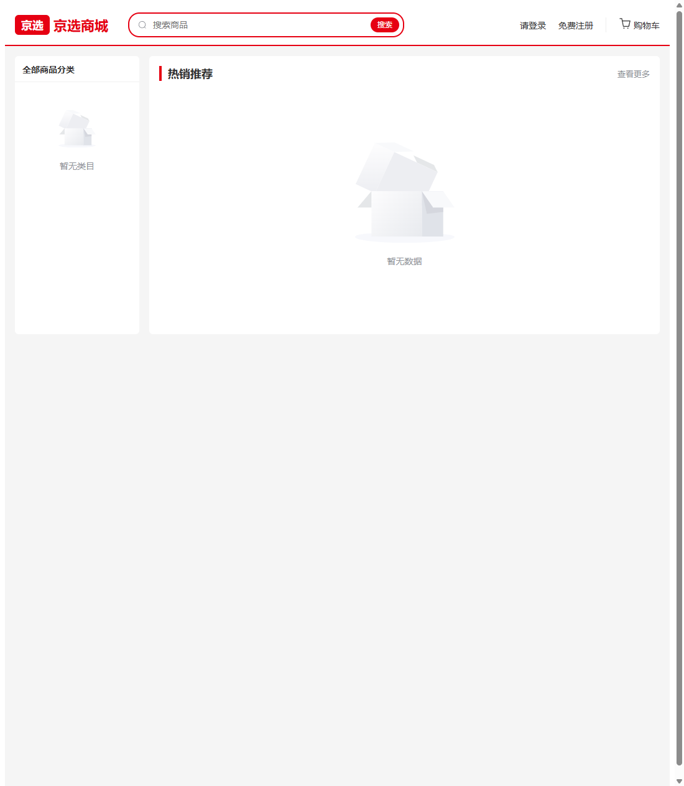
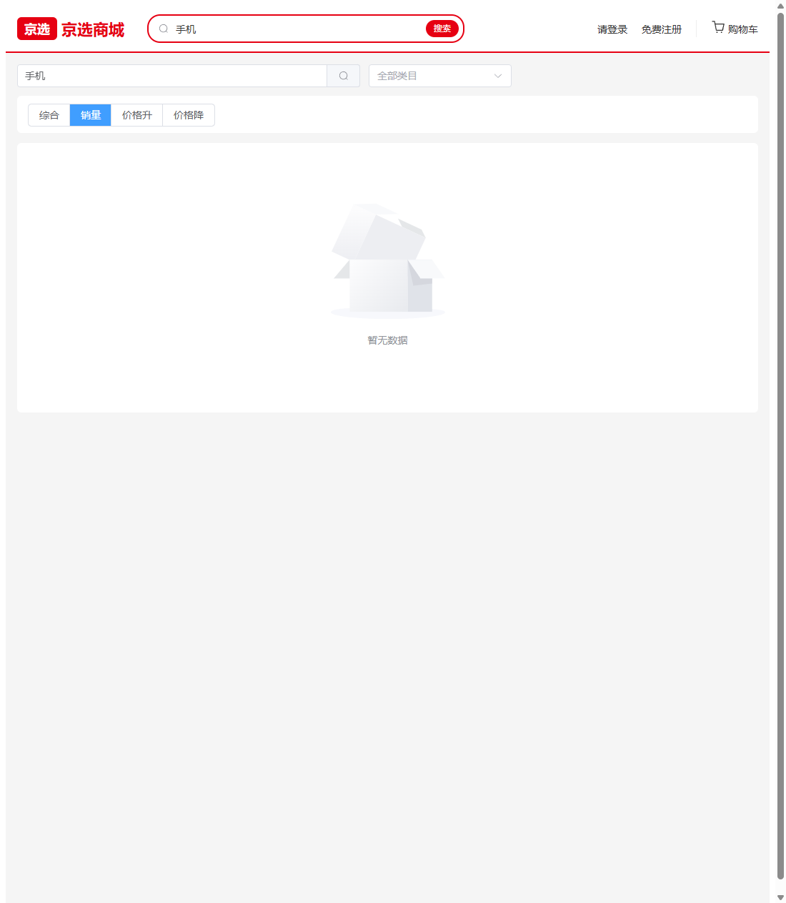
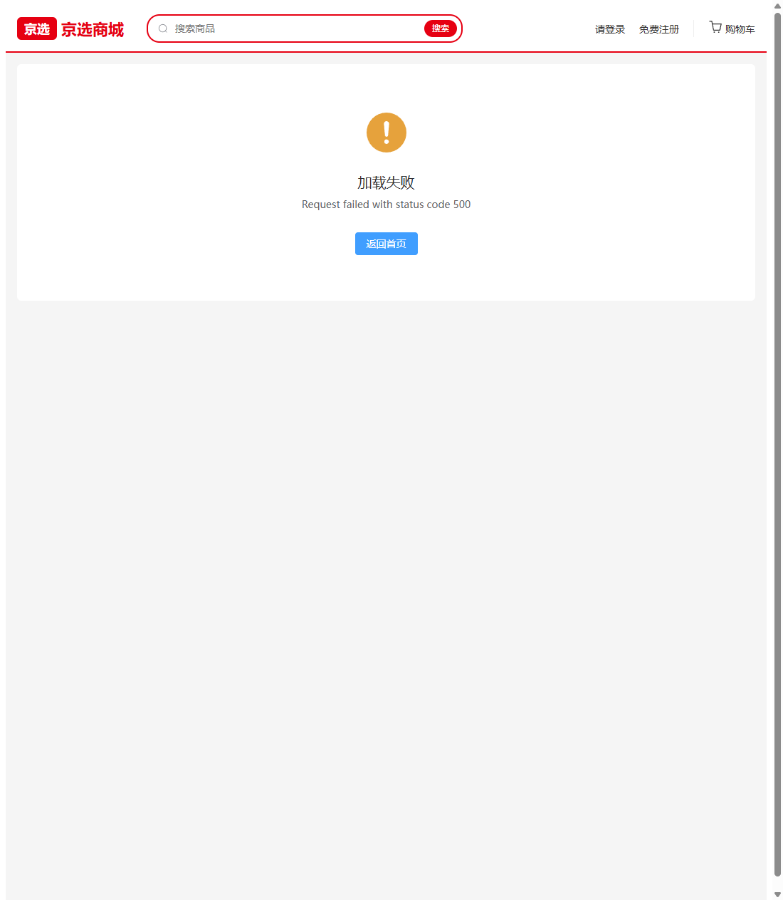

# W-02 商品浏览链路

> 版本：v1.0 ｜ 作者：成员 B（用户网页端）｜ 日期：2026-08-15 ｜ 状态：✅ 已完成
> 依据：`docs/phase4/member-b/tasks/W1-W5-用户网页端任务书.md` W2 章节 + T5 接口清单（P-003~P-006）+ T3 错误码（3001/3002）+ `.qoder/rules/api-contract.md`
> 范围：首页 / 搜索列表 / 商品详情 / 评价列表四页接通 P-003~P-006，完成「浏览→搜索→详情」链路。

## 0. 结论摘要

- ✅ 首页：类目树（P-003 两级）+ 轮播 + 热销推荐列表（P-004 默认综合排序）。
- ✅ 搜索页：keyword + categoryId 筛选、sort 四选项（综合/销量/价格升/价格降）、分页；URL query 同步（浏览器实测 `?keyword=手机&sort=sales`）。
- ✅ 商品详情：主图轮播（images 多图）+ 详情富文本 + 库存/销量/店铺 + 加购按钮（登录后可见，接通 U-009）+ 评价列表（P-006，userName 后端已脱敏）。
- ✅ 3001/3002 错误分支文案就绪；公开接口全部 silent 模式不弹全局 toast。
- ✅ `npm run build` 通过（1704 模块）；browser-use 实测 首页→搜索→详情 全链路渲染。
- ⏳ 真实数据渲染待 M3 后端联调（MySQL 8 环境部署后验证列表/详情/评价数据与 3001/3002 分支）。

## 1. 页面截图

### 1.1 首页（类目树 + 热销推荐）

左侧两级类目树（顶级 + 子类目，点击跳 `/search?categoryId=`）；右侧轮播（取前 5 张主图）+ 热销推荐 8 宫格（ProductCard 卡片）。后端未部署时类目/商品展示空状态，不空白。

### 1.2 搜索/列表页（关键词 + 排序）

关键词输入 + 类目下拉筛选 + sort 四选项 radio + 分页；顶部搜索框输入"手机"跳入后自动回填并同步 URL。

### 1.3 商品详情（错误兜底态）

后端未部署时的兜底分支（3001「商品不存在」/3002「商品已下架」分支联调后可见）；正常态为 左轮播 + 右信息区（价格/库存/销量/店铺 + 加购）+ 详情富文本 + 评价列表。

## 2. 实现要点

### 2.1 新增/修改文件

| 文件 | 说明 |
|---|---|
| `src/api/product.js` | P-003 getCategories / P-004 getProducts / P-005 getProductDetail / P-006 getProductReviews |
| `src/api/cart.js` | U-009 addCartItem（详情页加购用；U-008/010/011 留 W3） |
| `src/components/ProductCard.vue` | 商品卡片（首页/搜索共用）：主图/标题两行截断/价格红+划线价/已售 |
| `src/views/Home.vue` | 类目树 + 轮播 + 热销推荐（替换 W1 占位） |
| `src/views/Search.vue` | 关键词/类目/sort/分页 + URL query 同步（替换 W1 占位） |
| `src/views/ProductDetail.vue` | 轮播/信息区/加购/详情/评价（替换 W1 占位） |
| `src/App.vue` | 顶部搜索框升级为真实输入框（回车/按钮跳 `/search?keyword=`） |
| `src/api/request.js` | 修复：网络层错误分支补 silent 判断（此前 500 会无视 silent 弹 toast） |
| `src/utils/format.js` | 修正：金额单位为元（DECIMAL 12,2），删除误导性分换算函数，新增 formatPrice |

### 2.2 契约对接记录

| 接口 | 路径 | 入参 | 成功返回 | 页面 |
|---|---|---|---|---|
| P-003 | GET /api/categories | - | data.list（含 parentId，0 为顶级） | 首页类目树 / 搜索页筛选下拉 |
| P-004 | GET /api/products | page/pageSize/categoryId/keyword/merchantId/sort | data.list + data.total（仅 ON_SALE） | 首页热销 / 搜索列表 |
| P-005 | GET /api/products/{id} | - | 详情字段（images 多图、detail 富文本、merchantName） | 详情页 |
| P-006 | GET /api/products/{id}/reviews | page/pageSize | data.list + data.total（userName 已脱敏） | 详情页评价区 |
| U-009 | POST /api/cart/items | {productId, quantity 1-999} | data.id | 详情页加购按钮（登录后可见） |

### 2.3 关键交互

- **类目树组装**：P-003 返回平铺列表，前端按 `parentId===0` 提取顶级并挂载子类目（两级结构）。
- **URL 同步**：搜索页筛选条件（keyword/categoryId/sort/page）实时同步到 URL query，刷新/分享不丢状态；从首页类目入口跳入带 `categoryId`。
- **加购按钮**：`v-if="userStore.isLoggedIn"` 登录后显示「加入购物车」（loading 防重复提交）；未登录显示「登录后加入购物车」跳 `/login?redirect=/product/:id`。
- **错误分支**：3001→「商品不存在」、3002→「商品已下架」、其他→「加载失败」，均带「返回首页」按钮；公开接口 silent 模式静默加载，失败展示空状态。
- **分页约定**：一律 `page/pageSize`，取 `data.list` + `data.total`；搜索页每页 8，评价每页 5。

## 3. 验收自测

| 验收项 | 方式 | 结果 |
|---|---|---|
| 匿名用户 首页→搜索→详情 全流程可访问 | browser-use 实测三页渲染 | ✅（真实数据待 M3） |
| sort 切换正确传参 | 实测点击「销量」→ URL `?sort=sales` 且 radio 选中 | ✅ |
| 顶部搜索带关键词跳转 | 实测输入"手机"→ `/search?keyword=手机` 回填 | ✅ |
| 下架商品不可见 + 详情有提示 | 3002 分支代码就绪；真实触发待 M3 联调 | ⏳ |
| 空状态不空白 | 后端未部署时类目/商品/评价均显示空状态 | ✅ |
| `npm run build` 通过 | 1704 模块构建成功 | ✅ |

## 4. 遗留与后续

- M3 联调：真实数据渲染、3001/3002 分支实测、加购真实调用。
- W3 起：Cart.vue 接通 U-008~U-011（api/cart.js 补齐 list/update/delete），结算与下单链路。
