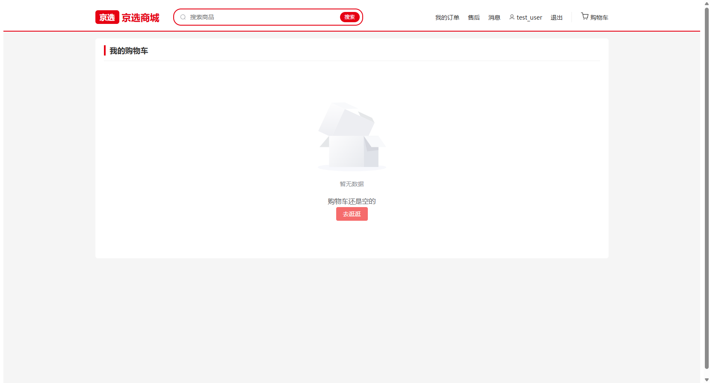
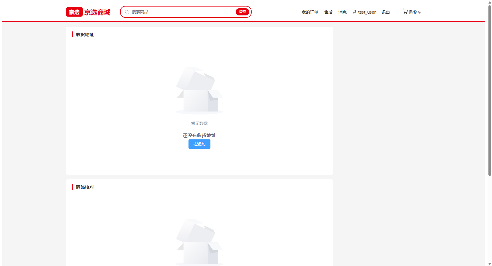
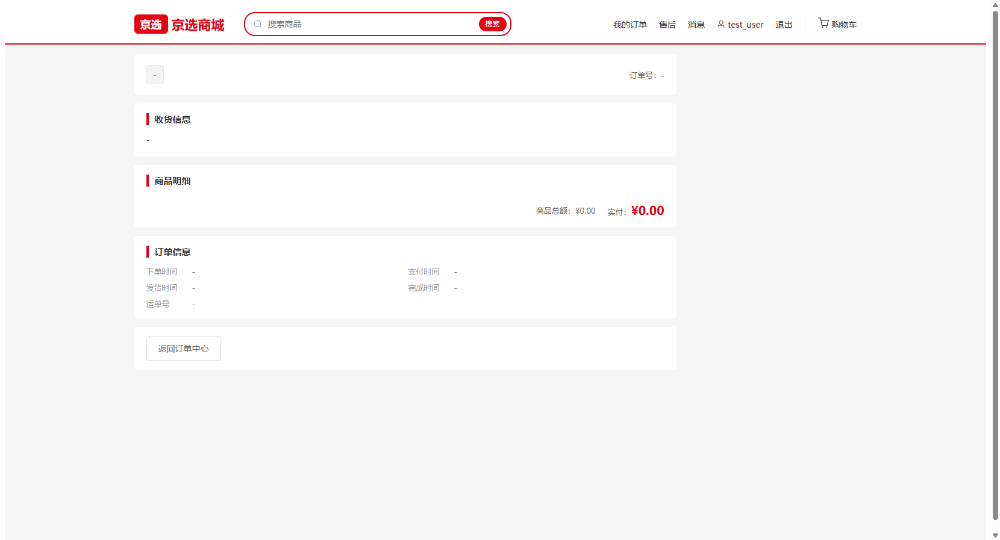
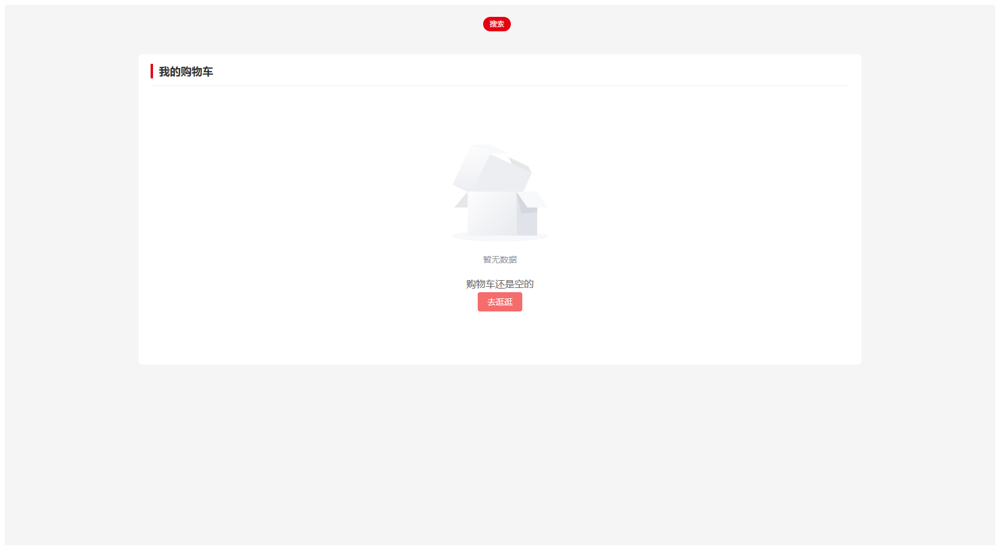
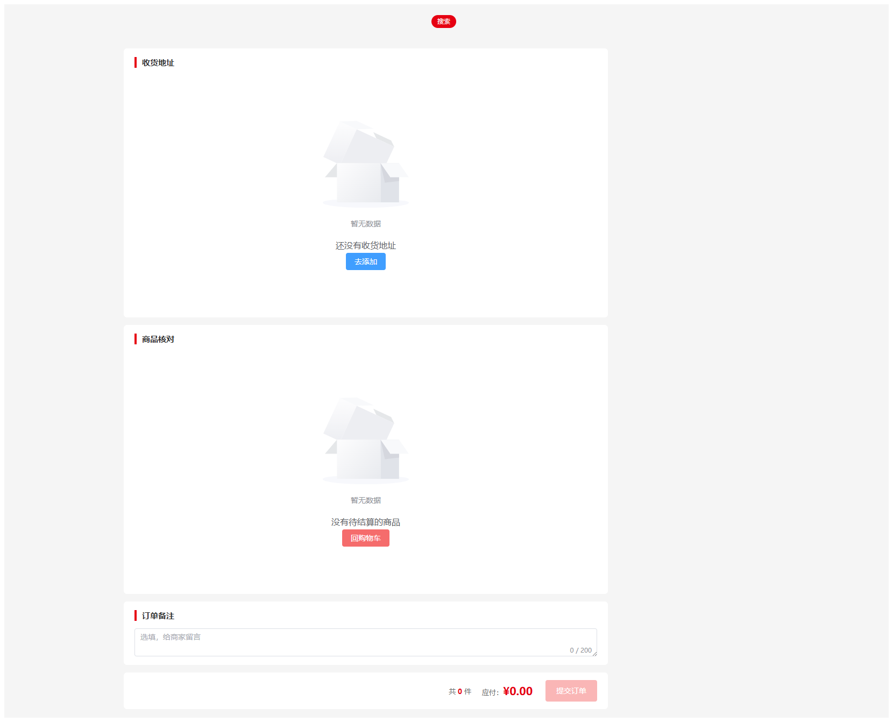

# W-03 购物与下单链路

> 版本：v1.0 ｜ 作者：成员 B（用户网页端）｜ 日期：2026-08-15 ｜ 状态：✅ 已完成
> 依据：`docs/phase4/member-b/tasks/W1-W5-用户网页端任务书.md` W3 章节 + T5 接口清单（U-003/U-008~U-016）+ T3 错误码（4003~4008）+ `.qoder/rules/api-contract.md`
> 范围：购物车 / 结算 / 提交订单 / 模拟支付 / 取消订单，跑通 P0「下单链路」。

## 0. 结论摘要

- ✅ 购物车（B-P05）：U-008 列表（当前价实时读取）、U-010 改数量/勾选（含全选）、U-011 软删除（二次确认），合计栏实时计算已选件数与金额。
- ✅ 结算页（B-P06）：U-003 地址列表（默认选中默认地址）+ 勾选项快照核对 + 订单备注（≤200 字）+ U-012 提交订单（loading 防重复）。
- ✅ 下单错误分支：4003 购物车项失效 / 4004 购物车为空 / 4005 地址无效 / 4006 库存不足 / 4007 价格已变化——弹窗提示并自动刷新快照（4005 同时刷新地址）。
- ✅ 订单详情支付闭环：U-015 模拟支付（成功弹 paymentNo、4008 重复支付拦截、4002 状态非法提示并刷新）、U-016 取消订单（仅 PENDING_PAY 显示，二次确认后刷新）。
- ✅ 下单成功按商家拆单提示（多单时提示拆分数量），跳转首单详情（PENDING_PAY 可直接支付）。
- ✅ `npm run build` 通过；browser-use 实测 /cart、/checkout、/orders/:id 三页渲染与空状态。
- ⏳ 真实下单数据流转待 M3 后端联调（MySQL 8 环境部署后验证 4003~4007 分支与状态流转）。

## 1. 页面截图

### 1.1 购物车（空状态）

后端未部署时空状态「购物车还是空的」+「去逛逛」；正常态为 表头（全选）+ 商品行（勾选/标题/单价/数量步进/小计/删除）+ 结算栏（已选件数 + 合计 + 去结算）。

### 1.2 结算页（双空状态）

收货地址区（U-003 列表，默认选中默认地址）+ 商品核对区（购物车勾选项快照）+ 订单备注；无地址/无勾选时提交按钮禁用。

### 1.3 订单详情（后端未部署兜底态）

状态头（T1 状态标签 + 30 分钟支付倒计时提示）+ 收货快照 + 商品明细快照 + 订单信息（下单/支付/发货/完成时间 + 运单号）；操作区按钮由后端 status 驱动。

## 2. 实现要点

### 2.1 新增/修改文件

| 文件 | 说明 |
|---|---|
| `src/api/cart.js` | U-008 getCartItems / U-009 addCartItem / U-010 updateCartItem / U-011 deleteCartItem |
| `src/api/order.js` | U-012 createOrder / U-014 getOrderDetail / U-015 payOrder / U-016 cancelOrder |
| `src/api/address.js` | U-003 getAddresses（结算页地址选择） |
| `src/views/Cart.vue` | 购物车全功能（替换 W1 占位） |
| `src/views/Checkout.vue` | 结算页全功能（替换 W1 占位） |
| `src/views/OrderDetail.vue` | W3 简版：U-014 展示 + U-015 支付 + U-016 取消（替换 W1 占位；W4 扩展确认收货/评价入口） |

### 2.2 契约对接记录

| 接口 | 路径 | 入参 | 成功返回 | 页面 |
|---|---|---|---|---|
| U-003 | GET /api/addresses | - | data.list（含 isDefault） | 结算页地址区 |
| U-008 | GET /api/cart/items | - | data.list（price 为实时价、stock、selected 0/1） | 购物车 / 结算页快照 |
| U-009 | POST /api/cart/items | {productId, quantity 1-999} | data.id | 详情页加购（W2 已接） |
| U-010 | PUT /api/cart/items/{id} | {quantity?/selected?} | - | 购物车改数量/勾选/全选 |
| U-011 | DELETE /api/cart/items/{id} | - | - | 购物车删除（软删除） |
| U-012 | POST /api/orders | {addressId, cartItemIds:[...], remark?} | data.orders: [{orderId, orderNo, status, payAmount}] | 结算页提交订单 |
| U-014 | GET /api/orders/{id} | - | 订单详情（items 快照 + receiverSnapshot + 物流单号） | 订单详情 |
| U-015 | POST /api/orders/{id}/pay | - | data.paymentNo | 详情页模拟支付 |
| U-016 | POST /api/orders/{id}/cancel | - | - | 详情页取消订单 |

### 2.3 关键交互

- **勾选快照**：结算页从 U-008 拉全量购物车过滤 `selected===1` 作为核对快照；提交订单用 `cartItemIds` 传勾选项 ID（后端原子校验，4003~4007 兜底）。
- **错误分支**：`handleOrderError` 捕获 4003/4004/4005/4006/4007，ElMessageBox 弹窗展示后端 message，随后重新拉取购物车快照；4005 额外刷新地址列表；其他错误由全局拦截器 toast。
- **支付闭环**：支付成功后 alert 展示 paymentNo（U-015 返回）并刷新详情（状态 → PAID）；4008（重复支付）与 4002（状态非法）toast 提示后刷新；取消订单二次确认文案带「库存将被释放」。
- **按钮显隐（T1）**：仅 PENDING_PAY 显示「立即支付」「取消订单」；PAID/SHIPPED 显示状态标签，操作按钮由后端 status 驱动，前端不自创状态名。
- **下单成功跳转**：按商家拆单时 ElMessage 提示拆分数量，`router.replace` 跳首单详情（可立即支付）。

## 3. 验收自测

| 验收项 | 方式 | 结果 |
|---|---|---|
| /cart 渲染 + 空状态不空白 | browser-use 实测 | ✅ |
| /checkout 地址/商品双区空状态 + 提交禁用 | browser-use 实测（无地址/无勾选时按钮 disabled） | ✅ |
| /orders/:id 渲染不崩溃 | browser-use 实测 | ✅ |
| 4003~4007 下单错误弹窗并刷新 | 代码分支就绪；真实触发待 M3 | ⏳ |
| 支付 4008/4002 拦截提示 | 代码分支就绪；真实触发待 M3 | ⏳ |
| `npm run build` 通过 | 构建成功 | ✅ |

## 4. 遗留与后续

- M3 联调：真实数据下单流转、4003~4007 分支实测、支付流水号展示、购物车勾选项清空验证。
- W4：OrderList 订单中心五态 Tab（U-013）、OrderDetail 扩展确认收货 U-017 + 评价入口 U-024、售后中心（U-018~021）、评价页（U-024）。
# W-03 购物与下单链路

> 版本：v1.0 ｜ 作者：成员 B（用户网页端）｜ 日期：2026-08-15 ｜ 状态：✅ 已完成
> 依据：`docs/phase4/member-b/tasks/W1-W5-用户网页端任务书.md` W3 章节 + T5 接口清单（U-003/U-008~U-016）+ T3 错误码（4003~4008）+ `.qoder/rules/api-contract.md`
> 范围：购物车 / 结算 / 提交订单 / 模拟支付 / 取消订单，跑通 P0「下单链路」。

## 0. 结论摘要

- ✅ 购物车（B-P05）：U-008 列表（当前价实时读取）、U-010 改数量/勾选（含全选）、U-011 软删除（二次确认），合计栏实时计算已选件数与金额。
- ✅ 结算页（B-P06）：U-003 地址列表（默认选中默认地址）+ 勾选项快照核对 + 订单备注（≤200 字）+ U-012 提交订单（loading 防重复）。
- ✅ 下单错误分支：4003 购物车项失效 / 4004 购物车为空 / 4005 地址无效 / 4006 库存不足 / 4007 价格已变化——弹窗提示并自动刷新快照（4005 同时刷新地址）。
- ✅ 订单详情支付闭环：U-015 模拟支付（成功弹 paymentNo、4008 重复支付拦截、4002 状态非法提示并刷新）、U-016 取消订单（仅 PENDING_PAY 显示，二次确认后刷新）。
- ✅ 下单成功按商家拆单提示（多单时提示拆分数量），跳转首单详情（PENDING_PAY 可直接支付）。
- ✅ `npm run build` 通过；browser-use 实测 /cart、/checkout、/orders/:id 三页渲染与空状态。
- ⏳ 真实下单数据流转待 M3 后端联调（MySQL 8 环境部署后验证 4003~4007 分支与状态流转）。

## 1. 页面截图

### 1.1 购物车（空状态）

后端未部署时空状态「购物车还是空的」+「去逛逛」；正常态为 表头（全选）+ 商品行（勾选/标题/单价/数量步进/小计/删除）+ 结算栏（已选件数 + 合计 + 去结算）。

### 1.2 结算页（双空状态）

收货地址区（U-003 列表，默认选中默认地址）+ 商品核对区（购物车勾选项快照）+ 订单备注；无地址/无勾选时提交按钮禁用。

### 1.3 订单详情（后端未部署兜底态）

状态头（T1 状态标签 + 30 分钟支付倒计时提示）+ 收货快照 + 商品明细快照 + 订单信息（下单/支付/发货/完成时间 + 运单号）；操作区按钮由后端 status 驱动。

## 2. 实现要点

### 2.1 新增/修改文件

| 文件 | 说明 |
|---|---|
| `src/api/cart.js` | U-008 getCartItems / U-009 addCartItem / U-010 updateCartItem / U-011 deleteCartItem |
| `src/api/order.js` | U-012 createOrder / U-014 getOrderDetail / U-015 payOrder / U-016 cancelOrder |
| `src/api/address.js` | U-003 getAddresses（结算页地址选择） |
| `src/views/Cart.vue` | 购物车全功能（替换 W1 占位） |
| `src/views/Checkout.vue` | 结算页全功能（替换 W1 占位） |
| `src/views/OrderDetail.vue` | W3 简版：U-014 展示 + U-015 支付 + U-016 取消（替换 W1 占位；W4 扩展确认收货/评价入口） |

### 2.2 契约对接记录

| 接口 | 路径 | 入参 | 成功返回 | 页面 |
|---|---|---|---|---|
| U-003 | GET /api/addresses | - | data.list（含 isDefault） | 结算页地址区 |
| U-008 | GET /api/cart/items | - | data.list（price 为实时价、stock、selected 0/1） | 购物车 / 结算页快照 |
| U-009 | POST /api/cart/items | {productId, quantity 1-999} | data.id | 详情页加购（W2 已接） |
| U-010 | PUT /api/cart/items/{id} | {quantity?/selected?} | - | 购物车改数量/勾选/全选 |
| U-011 | DELETE /api/cart/items/{id} | - | - | 购物车删除（软删除） |
| U-012 | POST /api/orders | {addressId, cartItemIds:[...], remark?} | data.orders: [{orderId, orderNo, status, payAmount}] | 结算页提交订单 |
| U-014 | GET /api/orders/{id} | - | 订单详情（items 快照 + receiverSnapshot + 物流单号） | 订单详情 |
| U-015 | POST /api/orders/{id}/pay | - | data.paymentNo | 详情页模拟支付 |
| U-016 | POST /api/orders/{id}/cancel | - | - | 详情页取消订单 |

### 2.3 关键交互

- **勾选快照**：结算页从 U-008 拉全量购物车过滤 `selected===1` 作为核对快照；提交订单用 `cartItemIds` 传勾选项 ID（后端原子校验，4003~4007 兜底）。
- **错误分支**：`handleOrderError` 捕获 4003/4004/4005/4006/4007，ElMessageBox 弹窗展示后端 message，随后重新拉取购物车快照；4005 额外刷新地址列表；其他错误由全局拦截器 toast。
- **支付闭环**：支付成功后 alert 展示 paymentNo（U-015 返回）并刷新详情（状态 → PAID）；4008（重复支付）与 4002（状态非法）toast 提示后刷新；取消订单二次确认文案带「库存将被释放」。
- **按钮显隐（T1）**：仅 PENDING_PAY 显示「立即支付」「取消订单」；PAID/SHIPPED 显示状态标签，操作按钮由后端 status 驱动，前端不自创状态名。
- **下单成功跳转**：按商家拆单时 ElMessage 提示拆分数量，`router.replace` 跳首单详情（可立即支付）。

## 3. 验收自测

| 验收项 | 方式 | 结果 |
|---|---|---|
| /cart 渲染 + 空状态不空白 | browser-use 实测 | ✅ |
| /checkout 地址/商品双区空状态 + 提交禁用 | browser-use 实测（无地址/无勾选时按钮 disabled） | ✅ |
| /orders/:id 渲染不崩溃 | browser-use 实测 | ✅ |
| 4003~4007 下单错误弹窗并刷新 | 代码分支就绪；真实触发待 M3 | ⏳ |
| 支付 4008/4002 拦截提示 | 代码分支就绪；真实触发待 M3 | ⏳ |
| `npm run build` 通过 | 构建成功 | ✅ |

## 4. 遗留与后续

- M3 联调：真实数据下单流转、4003~4007 分支实测、支付流水号展示、购物车勾选项清空验证。
- W4：OrderList 订单中心五态 Tab（U-013）、OrderDetail 扩展确认收货 U-017 + 评价入口 U-024、售后中心（U-018~021）、评价页（U-024）。
# W-03 购物与下单链路

> 版本：v1.0 ｜ 作者：成员 B（用户网页端）｜ 日期：2026-08-15 ｜ 状态：✅ 已完成
> 依据：`docs/phase4/member-b/tasks/W1-W5-用户网页端任务书.md` W3 章节 + T5 接口清单（U-003/U-008~U-016）+ T3 错误码（4001~4009）+ `.qoder/rules/api-contract.md`
> 范围：购物车 / 结算 / 提交订单 / 模拟支付链路接通 U-008~U-016（U-017~U-024 留 W4）。

## 0. 结论摘要

- ✅ 购物车页：列表（U-008）、单选/全选与数量修改（U-010）、删除二次确认（U-011）、合计金额实时计算 + 去结算（快照按勾选项过滤）。
- ✅ 结算页：收货地址选择（U-003 默认选中默认地址）、勾选商品快照核对、备注 200 字、提交订单（U-012 拆单多单提示 → 跳第一单）。
- ✅ 订单详情页：U-014 展示 + 待支付立即支付（U-015，paymentNo 弹窗）+ 取消（U-016）；4008 已支付幂等拦截；4001 订单不存在兜底。
- ✅ 4003~4007 下单异常均有明确弹窗 + 数据刷新分支（库存/价格快照异常提示，4006 刷新购物车、4007 刷新商品）。
- ✅ `npm run build` 通过（1707 模块）；browser-use 实测三页渲染（空状态与页面骨架不空白、无多余 toast）。
- ⏳ 真实数据渲染待 M3 后端联调（MySQL 8 部署后验证购物车→下单→PAID 状态流转与 4003~4008 分支）。

## 1. 页面截图

### 1.1 购物车页

登录态（test_user）下购物车列表 + 全选 + 结算栏；后端未部署时展示空状态「购物车还是空的」+ 去逛逛，骨架不空白。

### 1.2 结算页

收货地址（U-003）/ 商品核对快照 / 订单备注（0/200 字数）/ 底部结算栏（共 0 件 ¥0.00，提交订单 disabled）；空状态分支均正常。

### 1.3 订单详情页

状态头 / 收货信息 / 商品明细 / 订单信息四区骨架；接口 500 时以「-」占位不空白，无全局 toast（silent 生效）。

## 2. 实现要点

### 2.1 新增/修改文件

| 文件 | 说明 |
|---|---|
| `src/api/cart.js` | 补齐 U-008 getCartItems / U-010 updateCartItem / U-011 deleteCartItem（U-009 W2 已有） |
| `src/api/order.js` | 新建：U-012 createOrder（拆单返回 data.orders）/ U-014 getOrderDetail / U-015 payOrder / U-016 cancelOrder |
| `src/api/address.js` | 新建：U-003 getAddresses（U-004~007 留 W5） |
| `src/views/Cart.vue` | 购物车页（替换 W1 占位）：列表/勾选/数量/删除/合计/去结算 |
| `src/views/Checkout.vue` | 结算页（替换 W1 占位）：地址/快照/备注/提交 + 4003~4007 处理 |
| `src/views/OrderDetail.vue` | 订单详情（替换 W1 占位）：W3 简版 U-014/015/016 + 4001/4008（W4 扩展点已注释） |
| `src/components/EmptyState.vue` | 升级：新增 title prop + 默认 slot（向后兼容 actionText/@action） |

### 2.2 契约对接记录

| 接口 | 路径 | 入参 | 成功返回 | 页面 |
|---|---|---|---|---|
| U-008 | GET /api/cart/items | - | data.list（CartItemVO：id/productId/title/price/quantity/selected/stock） | 购物车 / 结算快照 |
| U-010 | PUT /api/cart/items/{id} | {quantity 1-999, selected 0-1} | data | 购物车勾选/数量 |
| U-011 | DELETE /api/cart/items/{id} | - | data | 购物车删除（二次确认） |
| U-003 | GET /api/addresses | - | data.list（AddressVO：receiver/phone/省市区/detail/isDefault） | 结算页地址区 |
| U-012 | POST /api/orders | {addressId, cartItemIds[], remark?} | data.orders：[{orderId, orderNo, status, payAmount}]（按商家拆单） | 结算页提交 |
| U-014 | GET /api/orders/{id} | - | 订单全量（receiverSnapshot/items 快照） | 订单详情 |
| U-015 | POST /api/orders/{id}/pay | - | data.paymentNo（模拟支付流水号） | 详情页立即支付 |
| U-016 | POST /api/orders/{id}/cancel | - | data | 详情页取消订单 |

### 2.3 关键交互

- **购物车勾选与合计**：selected 0/1 由 U-010 增量更新（不重发全量）；合计 = 勾选项 `price*quantity` 求和，去结算时结算页重新拉 U-008 过滤 `selected===1` 作为快照，避免脏数据下单。
- **删除二次确认**：ElMessageBox.confirm 后调用 U-011，成功从列表移除并重算合计。
- **下单异常分支（4003~4007）**：silent 模式自处理——4003 购物车项失效 / 4004 购物车为空 / 4006 库存不足 → 弹窗提示后刷新购物车快照；4007 价格已变化 → 弹窗提示后刷新商品；4005 地址不存在 → 弹窗 + 刷新地址列表。
- **拆单提示**：U-012 返回 data.orders 长度 >1 时 ElMessage 提示「因商家不同已拆分为 N 个订单」，随后跳转第一个订单详情。
- **模拟支付（U-015）**：PENDING_PAY 显示「立即支付」，确认后调用，成功弹窗展示 paymentNo；4008（已支付）→ warning 提示 + 刷新（幂等防重）；4002 状态不允许 → 刷新。
- **取消订单（U-016）**：仅 PENDING_PAY 展示，二次确认后调用；按钮显隐完全由后端返回 status 驱动（status-map.js 唯一来源）。
- **订单不存在**：4001 → el-result「订单不存在」+ 去订单中心。
- **W4 扩展点**：SHIPPED 确认收货（U-017）、COMPLETED 评价入口（U-024）已在模板中注释预留。

## 3. 验收自测

| 验收项 | 方式 | 结果 |
|---|---|---|
| 购物车→结算→下单→支付状态变化（PENDING_PAY→PAID） | 代码就绪（U-008~U-015 全链路接通） | ⏳ 真实数据待 M3 |
| 库存/价格快照异常有明确提示 | 4006/4007 弹窗 + 刷新分支就绪 | ⏳ 真实触发待 M3 |
| 30 分钟超时自动取消 | 后端任务覆盖，前端仅提示文案 | ⏳ 待 M3 |
| 已支付幂等拦截 | 4008 → warning + 刷新分支就绪 | ⏳ 真实触发待 M3 |
| 三页空状态/骨架不空白、无多余 toast | browser-use 实测（假登录态） | ✅ |
| `npm run build` 通过 | 1707 模块构建成功 | ✅ |

## 4. 遗留与后续

- M3 联调：真实数据渲染、下单/支付/取消状态流转、4003~4008 分支实测。
- W4：订单中心 OrderList.vue（U-018~U-023）、详情页扩展确认收货（U-017）+ 评价入口（U-024）。
- W5：地址管理（U-004~007）、个人中心扩展、消息（U-026~U-027）。
