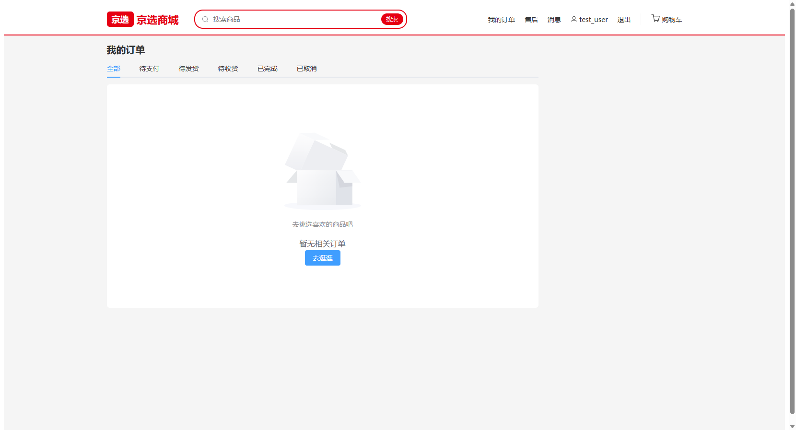
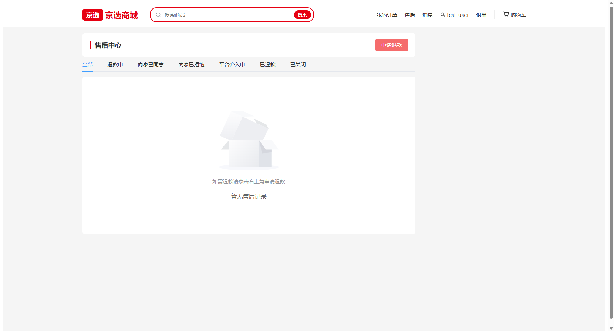
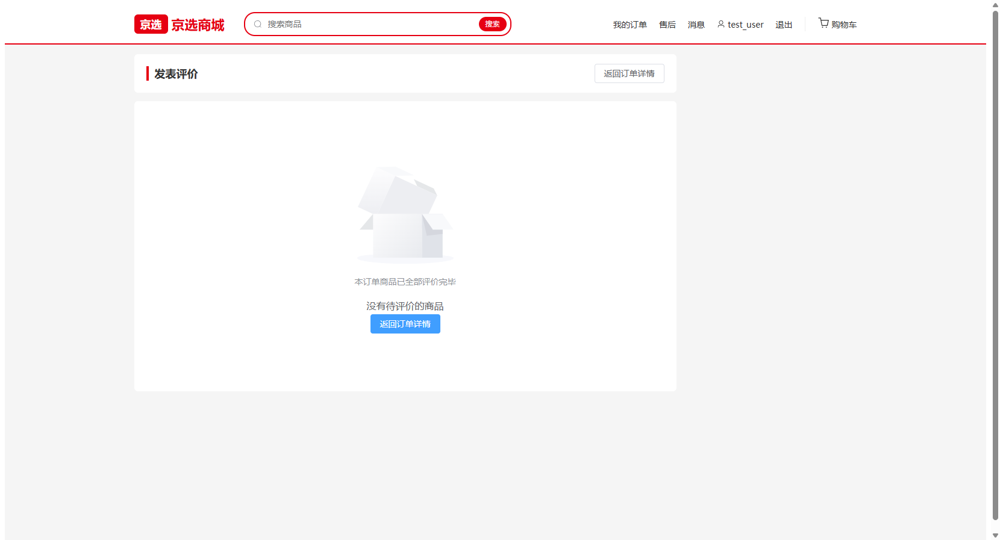

# W-04 订单与售后链路

> 版本：v1.0 ｜ 作者：成员 B（用户网页端）｜ 日期：2026-08-15 ｜ 状态：✅ 已完成
> 依据：`docs/phase4/member-b/tasks/W1-W5-用户网页端任务书.md` W4 章节 + T5 接口清单（U-013/U-017/U-018~U-021/U-024）+ T1 状态机枚举表 + T3 错误码（4001~4003/5001~5006）+ `.qoder/rules/api-contract.md`
> 范围：订单中心 / 订单详情扩展 / 售后中心 / 评价页，跑通 P0「履约链路」与「退款链路」用户侧。

## 0. 结论摘要

- ✅ 订单中心（B-P07）：状态 Tab（全部 + T1 五态）+ U-013 列表（firstItemImage 缩略、itemsCount、payAmount）+ 分页 + 空状态。
- ✅ 订单详情（B-P08）扩展：SHIPPED → 确认收货（U-017，二次确认 + 4002 提示）；COMPLETED → 明细行「评价」入口（未评价才显示，已评价显示星级）；PAID/SHIPPED/COMPLETED → 「申请退款」入口（带 orderId 跳售后中心）。
- ✅ 售后中心（B-P09）：U-019 列表（六态 Tab 筛选 + 分页）+ 发起退款弹窗（U-018：可退款订单下拉（PAID/SHIPPED/COMPLETED，来自 U-013 过滤）+ 原因 + 金额，5002/5003/5004/5006 提示）+ 撤销 U-020（仅 REFUNDING）+ 申请介入 U-021（仅 MERCHANT_REJECTED）+ merchantReply/adminResult 持久化展示。
- ✅ 评价页（B-P10）：U-014 拉取未评价明细（reviewedAt 为空）+ 明细选择（query itemId 预选）+ 1-5 星 + ≤200 字 + U-024 提交（4001/4002/4003 提示刷新）；全部评价完空状态引导返回。
- ✅ 按钮显隐完全由后端返回 status 驱动（status-map.js 唯一来源，REFUND_TABS 新增）；`npm run build` 通过；browser-use 实测 /orders、/refunds（含申请退款弹窗）、/orders/:id/review 三页。
- ⏳ 真实状态流转（支付→发货→收货→评价、退款→撤销/介入→商家回复/平台裁决）待 M3 后端联调。

## 1. 页面截图

### 1.1 订单中心（六 Tab + 空状态）

状态 Tab：全部 / 待支付 / 待发货 / 待收货 / 已完成 / 已取消（T1 五态）；列表卡片含 firstItemImage 缩略、订单号、状态标签、实付金额、明细数、下单时间，点击进详情。

### 1.2 售后中心（七 Tab + 申请退款）

状态 Tab：全部 + 退款六态（REFUNDING/MERCHANT_AGREED/MERCHANT_REJECTED/ADMIN_INTERVENED/REFUNDED/CLOSED）；退款单卡片含退款单号、关联订单、金额、原因、申请时间、商家回复/平台裁决留痕；右上角「申请退款」弹窗（订单下拉 + 原因 + 金额）。

### 1.3 评价页（无待评价明细兜底态）

后端未部署时展示「没有待评价的商品」空状态；正常态为 明细选择列表（query itemId 预选）+ 星级评分（很差~超赞）+ 评价内容（≤200 字）+ 提交评价。

## 2. 实现要点

### 2.1 新增/修改文件

| 文件 | 说明 |
|---|---|
| `src/api/order.js` | 补齐 U-013 listOrders / U-017 confirmReceipt / U-024 createReview |
| `src/api/refund.js` | 新建：U-018 createRefund / U-019 getRefunds / U-020 cancelRefund / U-021 interveneRefund |
| `src/views/OrderList.vue` | 订单中心（替换 W1 占位）：六 Tab + U-013 列表 + 分页 |
| `src/views/OrderDetail.vue` | 扩展：SHIPPED 确认收货 U-017、COMPLETED 明细行评价入口、申请退款入口（跳 /refunds?orderId=） |
| `src/views/RefundCenter.vue` | 售后中心（替换 W1 占位）：六态列表 + 发起退款弹窗 + 撤销/介入 |
| `src/views/Review.vue` | 评价页（替换 W1 占位）：明细选择 + 星级 + 文字 + U-024 提交 |
| `src/utils/status-map.js` | 新增 REFUND_TABS（退款六态 Tab） |
| `src/components/EmptyState.vue` | prop 统一改名 `desc` → `description`（5 个视图同步） |

### 2.2 契约对接记录

| 接口 | 路径 | 入参 | 成功返回 | 页面 |
|---|---|---|---|---|
| U-013 | GET /api/orders | page/pageSize/status?（T1 状态值，空=全部） | data.list + data.total（firstItemImage 缩略） | 订单中心 |
| U-017 | POST /api/orders/{id}/confirm | - | - | 详情页确认收货 |
| U-018 | POST /api/refunds | {orderId, reason, refundAmount} | data: {refundId, status: REFUNDING} | 售后中心发起退款 |
| U-019 | GET /api/refunds | page/pageSize/status?（六态） | data.list + data.total（merchantReply/adminResult 留痕） | 售后中心列表 |
| U-020 | POST /api/refunds/{id}/cancel | - | - | 撤销退款（仅 REFUNDING） |
| U-021 | POST /api/refunds/{id}/intervene | - | - | 申请介入（仅 MERCHANT_REJECTED） |
| U-024 | POST /api/orders/{id}/review | {orderItemId, rating 1-5, comment ≤200} | - | 评价页发表评价 |

### 2.3 关键交互

- **订单状态按钮（T1）**：PENDING_PAY 支付/取消；SHIPPED 确认收货；COMPLETED 明细行评价入口（`reviewedAt` 为空才显示，已评价显示 disabled 星级）；PAID/SHIPPED/COMPLETED 申请退款入口。前端只读后端 status 驱动显隐。
- **可退款订单**：发起退款弹窗订单下拉从 U-013 拉全量（pageSize=100）过滤 PAID/SHIPPED/COMPLETED；从订单详情「申请退款」跳入带 `?orderId=` 自动预选并弹窗。
- **退款错误分支（T3）**：5002 状态不允许 / 5003 重复申请 / 5004 金额非法 / 5005 状态不允许 / 5006 原因必填 → silent 模式按码 ElMessage 提示；撤销/介入失败（5001/5005）提示并刷新列表。
- **留痕展示**：merchantReply（商家回复）与 adminResult（平台裁决）非空时在卡片中持久化展示。
- **评价提交**：成功后重新拉 U-014 刷新未评价明细并自动切换下一件；全部评价完提示「已全部评价完毕」。
- **空状态（P1）**：订单中心/售后中心/评价页三处均无数据不空白、有引导按钮。

## 3. 验收自测

| 验收项 | 方式 | 结果 |
|---|---|---|
| 订单中心六 Tab + 列表渲染 + 空状态 | browser-use 实测 | ✅ |
| 售后中心七 Tab + 空状态 + 申请退款弹窗（订单下拉/原因/金额/提交禁用） | browser-use 实测 | ✅ |
| 评价页空状态（无待评价明细） | browser-use 实测 | ✅ |
| 订单五态按钮显隐与 T1 一致 | 代码按 status 驱动（status-map 唯一来源）；真实流转待 M3 | ⏳ |
| 退款全流程用户侧可操作（发起→撤销/介入→查看留痕） | 代码就绪；真实触发待 M3 | ⏳ |
| `npm run build` 通过 | 构建成功 | ✅ |

## 4. 遗留与后续

- M3 联调：真实订单/退款状态流转、5001~5006 分支实测、评价成功后明细状态刷新。
- W5：个人中心（U-001/U-002）、地址管理（U-004~U-007）、消息通知（U-022/U-023/U-025）、13 页全链路自测与空状态收口。
