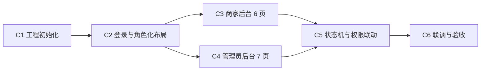

# 成员 C（后台端）第四阶段工作区

> 角色：商家后台 + 管理员后台 ｜ 第四阶段职责：按 T5 契约开发后台治理闭环
> 依据：《电商项目四人工分与第一阶段任务书》4.3 节 + T5 接口清单 v1.0（M/A 组 34 接口）
> 工程形态：商家 + 管理员**共用一个 Vue 3 工程**，按角色分菜单与路由（见分工方案 3.1 节）

## 任务看板（6 个细任务）

| # | 任务 | 计划 | 产出物 | 状态 |
|---|------|------|--------|------|
| C1 | 工程初始化（Vite + Vue3 + Element Plus + 路由/状态/请求基建） | Day 1 | `admin-web/` 工程骨架 | ⬜ 未开始 |
| C2 | 登录与角色化布局（登录页、路由守卫、动态菜单、Token 拦截） | Day 1 | `admin-web/src/` 基建 | ⬜ 未开始 |
| C3 | 商家后台 6 页（仪表盘/商品/库存/订单/售后/店铺） | Day 2-3 | M-001~M-015 全部页面 | ⬜ 未开始 |
| C4 | 管理员后台 7 页（审核/类目/巡检/商家/用户/争议/日志统计） | Day 3-4 | A-001~A-019 全部页面 | ⬜ 未开始 |
| C5 | 状态机与权限联动（按钮显隐、越权提示、三方协作链路自测） | Day 4 | 交互验收清单 | ⬜ 未开始 |
| C6 | 联调与验收（与 A 后端联调、空状态处理、进度与实验记录归档） | Day 5 | 联调记录 + 演示脚本 | ⬜ 未开始 |

图例：⬜ 未开始 ｜ 🟦 进行中 ｜ ✅ 已完成　**C 第四阶段 0/6**

## 执行顺序与依赖



- **C1/C2 必须 Day 1 完成**：登录与路由守卫是后续所有页面的前置基建。
- **C3/C4 可并行**，均依赖 C2 的布局与请求封装，契约分别是 T5 的 M 组与 A 组。
- **C5 依赖 C3/C4 全部页面**：重点验证"用户→商家→管理员"三方在订单/售后上的操作边界（第一阶段验收标准）。
- **C6 依赖 A 的 MySQL 环境就绪**（里程碑 M3），本地可先用 seed.sql + 后端起服联调。

## 目录结构

```
docs/phase4/member-c/
├── README.md              ← 本文件（工作看板）
├── tasks/                 ← 6 个细任务文档（每个任务的步骤与验收标准）
│   ├── C1-工程初始化.md
│   ├── C2-登录与角色化布局.md
│   ├── C3-商家后台页面.md
│   ├── C4-管理员后台页面.md
│   ├── C5-状态机与权限联动.md
│   └── C6-联调与验收.md
└── deliverables/          ← 交付物落位（页面清单核对、交互验收清单、联调记录等）
```

工程代码落位 `admin-web/`（商家 + 管理员共用工程，按角色分菜单），工作过程文档写入本工作区。

## 我的专属配置（区分于团队共享）

团队共享配置在 `.qoder/skills/`、`.qoder/rules/`、`.qoder/mcps/`，所有成员通用。
我的专属配置在 `.qoder/members/member-c/`，只有我使用：

| 类型 | 文件 | 用途 | 对应任务 |
|------|------|------|----------|
| skill | `skills/admin-page-dev.md` | 后台页面开发步骤（列表/表单/审核流页模板） | C3/C4 |
| skill | `skills/backend-contract-check.md` | 按 T5 编号核对页面↔接口↔字段映射 | C3/C4/C6 |
| rule | `rules/admin-frontend.md` | 后台工程结构、状态按钮显隐、越权提示规范 | C2/C5 |
| mcp | `mcps/browser-use-guide.md` | browser-use 逐页验证交互、genui 原型参考 | C5/C6 |

使用方式：做每个任务前，先读取对应 task 文档 → 再读取关联 skill/rule → 按步骤产出交付物。

## 输入（来自 A 与我自己第一阶段交付物，按需读取）

- `docs/phase1/member-a/deliverables/05-接口清单v1.0.md`（M-001~015 / A-001~019 契约）
- `docs/phase1/member-a/deliverables/01-状态机枚举表.md`（状态只读，按钮显隐依据）
- `docs/phase1/member-a/deliverables/03-错误码分段表.md`（1002/1003/6xxx/7xxx 提示文案依据）
- `docs/phase1/member-c/deliverables/C-01-后台页面清单.md`（6+7 页蓝图）
- `docs/phase1/member-c/deliverables/C-02-权限矩阵.md`（角色 × 功能 × 数据范围）
- `backend/sql/20260812_001_schema.sql` + `002_seed.sql`（本地起库数据）

## 每日检查点

- **Day 1 结束**：`admin-web/` 可启动；merchant001/admin001 可登录进入各自菜单。
- **Day 2-3 结束**：商家后台 6 页可操作（商品发布→提交审核、发货、同意/拒绝退款）。
- **Day 3-4 结束**：管理员后台 7 页可操作（入驻审核、上架审核、巡检下架、退款裁决）。
- **Day 5 结束**：C5 三方链路自测通过；C6 联调记录归档；进度文件四件套已同步提交推送。
