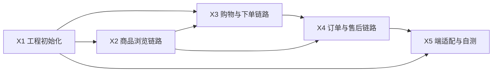

# 成员 D（App/小程序 + 测试/文档/公共配置）第四阶段工作区

> 角色：App/小程序 + 测试/文档/公共配置 ｜ 第四阶段职责：按 T5 契约完成 uni-app 移动端（App + 微信小程序一套代码），并履行测试基线、联调统筹与文档维护职能
> 依据：《电商项目四人工分与第一阶段任务书》4.4 节 + T5 接口清单 v1.0（P-001~008 / U-001~025，共 33 接口）+ D-01 移动端页面清单（9 页）
> 周期：预计 5 天（2026-08-15 ~ 2026-08-20）

## 任务看板（5 个细任务 + 1 补充轮）

| # | 任务 | 计划 | 产出物（deliverables/） | 状态 |
|---|------|------|--------------------------|------|
| X1 | 工程初始化：uni-app CLI（Vue3+Vite）+ 请求层 + 登录/注册 + token 存储 + tabBar 骨架 | Day 1 | `X-01-工程初始化.md` | ✅ 已完成 2026-08-15 |
| X2 | 商品浏览链路：首页 / 分类页 / 商品详情 / 评价列表（P-003~P-006） | Day 1-2 | `X-02-商品浏览链路.md` | ✅ 已完成 2026-08-15 |
| X3 | 购物与下单链路：购物车 / 结算下单 / 模拟支付（U-003/U-008~U-016） | Day 2-3 | `X-03-购物与下单链路.md` | ✅ 已完成 2026-08-15 |
| X4 | 订单与售后链路：订单列表/详情 / 售后中心 / 消息（U-013~U-025） | Day 3-4 | `X-04-订单与售后链路.md` | ✅ 已完成 2026-08-15 |
| X5 | 我的/地址 + 端差异适配 + 全链路自测与联调记录（含测试基线复核） | Day 4-5 | `X-05-端适配与自测.md` | ✅ 已完成 2026-08-15 |
| X6 | 契约核对与功能修复（不依赖 M3）：33 接口核对表 + 6 处运行时修复 + 注释对齐 | 补充轮 | `X-06-接口契约核对表.md` | ✅ 已完成 2026-08-29 |

图例：⬜ 未开始 ｜ 🟦 进行中 ｜ ✅ 已完成　**D 第四阶段 5/5（X1~X5）+ X6 契约对齐补充（2026-08-29）**

> X6 要点：修复 6 处契约运行时代码——U-003/U-008 后端返回裸数组（T5 文档误写 `{list,total}`）导致 cart/address/checkout 列表恒空，已改 `data \|\| []`（4 处）；U-012 下单错误分支按后端实际码重映射（4004→返回购物车、4005→刷新、[3001,3002,4003,4006,4007]→刷新）；U-002 改密字段 `password`→`newPassword` 与后端 DTO 对齐。另修正 api 注释 4 处（cart/order/address/user）；`build:h5` 与 `build:mp-weixin` 复核通过。真实 token 联调、全链路闭环与联调归档仍待 M3。

## 执行顺序与依赖



- **X1 必须 Day 1 完成**：登录/鉴权是所有用户组接口（U-001~U-025）的前置；uni-app 请求封装与 token 存取（localStorage）先定死。
- **X2 可先行**：公共组接口（P-003~P-006）无需登录，是移动端浏览闭环的第一环。
- **X3 依赖 X1 的接口封装 + X2 的商品数据**：下单主链路（库存校验/价格快照/按商家拆单）是 P0 验收项。
- **X4 依赖 X3 的订单产生**：支付 → 发货（商家端）→ 收货 → 评价/售后的按钮显隐完全由 T1 状态机驱动，与网页端同一套规则。
- **X5 收尾**：地址管理支撑 X3 结算；端差异适配层（安全区、登录方式）；D 兼任测试职能，X5 同时产出移动端全链路自测记录与联调记录，为第五阶段联调验收打底。

## 契约输入（来自 A，只读，不自创）

| 契约 | 文件 | 对我方的约束 |
|------|------|--------------|
| 状态机 | `../../phase1/member-a/deliverables/01-状态机枚举表.md` | 订单 5 态 / 售后 6 态，按钮显隐只读后端状态 |
| 错误码 | `../../phase1/member-a/deliverables/03-错误码分段表.md` | 只按 `code` 展示 `message`；1002 跳登录；2001~2005 登录/注册特殊文案 |
| 接口清单 | `../../phase1/member-a/deliverables/05-接口清单v1.0.md` | P-001~008 + U-001~025 共 33 接口，统一返回 `{code,message,data,total}`，分页 `page/pageSize/list/total` |
| 后端实现 | `backend/`（A 已完成 67 接口） | 联调对象；`http://localhost:8080`；M3 里程碑待 MySQL 8 环境 |
| 团队规则 | `.qoder/rules/api-contract.md`、`state-machine.md`、`code-style.md` | 强制遵守；状态只读、按钮显隐依赖后端状态 |

## 页面清单（9 页，来自 D-01 v1.0）

| 编号 | 页面 | uni-app 页面路径 | 对应任务 |
|---|---|---|---|
| D-P01 | 首页 | `pages/index/index` | X2 |
| D-P02 | 分类页 | `pages/category/category` | X2 |
| D-P03 | 商品详情 | `pages/product/detail` | X2 |
| D-P04 | 购物车 | `pages/cart/cart` | X3 |
| D-P05 | 订单页 | `pages/order/list` + `pages/order/detail` | X4 |
| D-P06 | 消息页 | `pages/notice/list` | X4 |
| D-P07 | 我的 | `pages/mine/index` | X5 |
| D-P08 | 售后页 | `pages/refund/list` + `pages/refund/apply` | X4 |
| D-P09 | 登录/注册 | `pages/login/login` | X1 |
| （补充） | 地址管理 | `pages/address/list` + `pages/address/edit` | X5 |
| （补充） | 结算页 | `pages/checkout/checkout` | X3 |

> D-P01~D-P09 为 D-01 v1.0 定稿页面；结算与地址页为下单链路必备页面（对应 U-003/U-012），在 D-01「与网页端共用同一套 API」约定内，作为页面清单的必要补充。

## 移动端端差异适配层（D-01 第 2 节）

1. 短信验证码登录为移动端主推方式（P-007/P-008，demo 固定码 123456，60 秒倒计时）。
2. 分页沿用 `page/pageSize`（max 100），不做瀑布流特殊接口（D-01 决议）。
3. 消息推送本阶段用轮询 U-022；推送能力留待评估，不做差异化。
4. 端差异只保留在适配层（`utils/platform.js`：安全区、tabBar 徽标、H5/小程序条件编译），页面逻辑共享。

## 目录结构

```
docs/phase4/member-d/
├── README.md              ← 本文件（第四阶段工作看板）
├── tasks/                 ← 第四阶段任务书（X1-X5 步骤与验收标准）
│   └── X1-X5-移动端开发任务书.md
└── deliverables/          ← 交付物落位（每任务一个文档，记录实现要点与截图路径）
```

移动端工程代码按启动指导书约定放入仓库 `mobile-app/` 目录（uni-app CLI 工程，Vue 3 + Vite），本工作区只存文档。

## 我的专属配置（区分于团队共享）

团队共享配置在 `.qoder/skills/`、`.qoder/rules/`、`.qoder/mcps/`，所有成员通用（由我作为公共配置负责人统一维护）。
我的专属配置在 `.qoder/members/member-d/`，只有我使用：

| 类型 | 文件 | 用途 | 对应任务 |
|------|------|------|----------|
| skill | `skills/uni-app-page-spec.md` | 按 D-01 页面清单生成/审查 uni-app 页面（含条件编译规范） | X2-X5 |
| skill | `skills/mobile-api-integration.md` | 按 T5 契约封装请求层、处理错误码与分页 | X1-X5 |
| skill | `skills/test-baseline.md` | 按 T1 状态机与 D-02 生成测试用例/演示脚本/AI 交互记录 | X5 及第五阶段 |
| rule | `rules/mobile-structure.md` | uni-app 工程目录结构与端差异适配规范 | X1 及后续 |
| rule | `rules/testing-baseline.md` | 测试基线约束：固定账号/演示路径/验收检查单 | X5 及第五阶段 |
| mcp | `mcps/member-d-mcp-guide.md` | genui 出移动端 UI 原型、browser-use 验证 H5 端交互 | X2-X5 |

使用方式：做每个任务前，先读取 tasks 任务书对应章节 → 再读取关联 skill/rule → 按步骤产出交付物。

## 每日站会检查点

- **Day 1 结束**：X1 完成（uni-app 工程可运行，登录/注册可跑通，token 存取 + 请求拦截器就绪）；X2 首页/分类页骨架出齐。
- **Day 2 结束**：X2 完成（商品浏览链路全通）；X3 购物车完成、结算页进行中。
- **Day 3 结束**：X3 完成（下单 + 模拟支付跑通，订单状态 PENDING_PAY → PAID）；X4 订单列表进行中。
- **Day 4 结束**：X4 完成（订单全状态按钮显隐 + 售后全流程 + 消息）；X5 进行中。
- **Day 5 结束**：X5 完成（我的/地址收尾）；9+2 页全链路自测通过；空状态与错误提示覆盖（P1）；H5 端可浏览器验证、小程序端构建通过；联调记录归档；进度四件套同步更新。

## 我兼任的职能（D = App/小程序 + 测试/文档/公共配置）

1. **测试基线**：D-02 方案（5 账号 + 演示数据）为全团队测试口径；第四阶段维护移动端测试用例，第五阶段牵头全端回归。
2. **公共配置**：`.qoder/` 共享配置由我统一维护，他人变更需经我评审后落地（分工方案第七章）。
3. **联调统筹**：维护联调记录模板（接口版本号、对接成员、结论），A 每完成核心接口标注版本号，B/C/D 按版本号对接。
4. **AI 交互记录**：维护作业评分「交互过程 30 分」的记录格式（每轮提问/AI 回复/思考判断），为实验报告第七部分备料。
