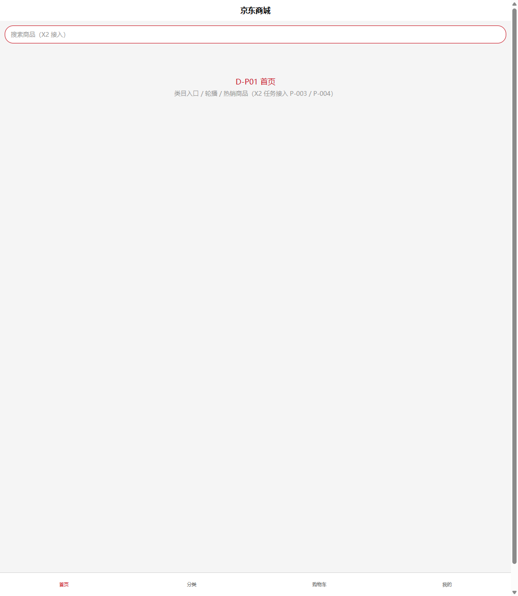
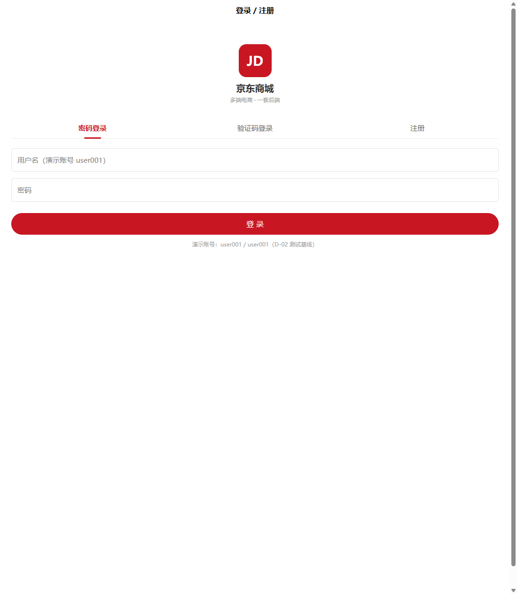
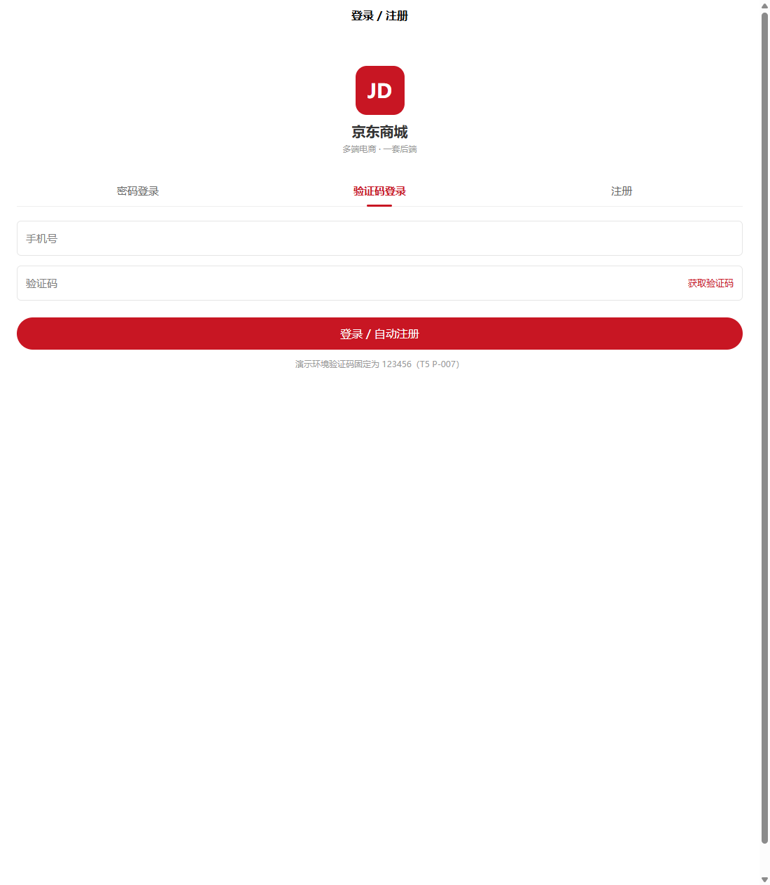
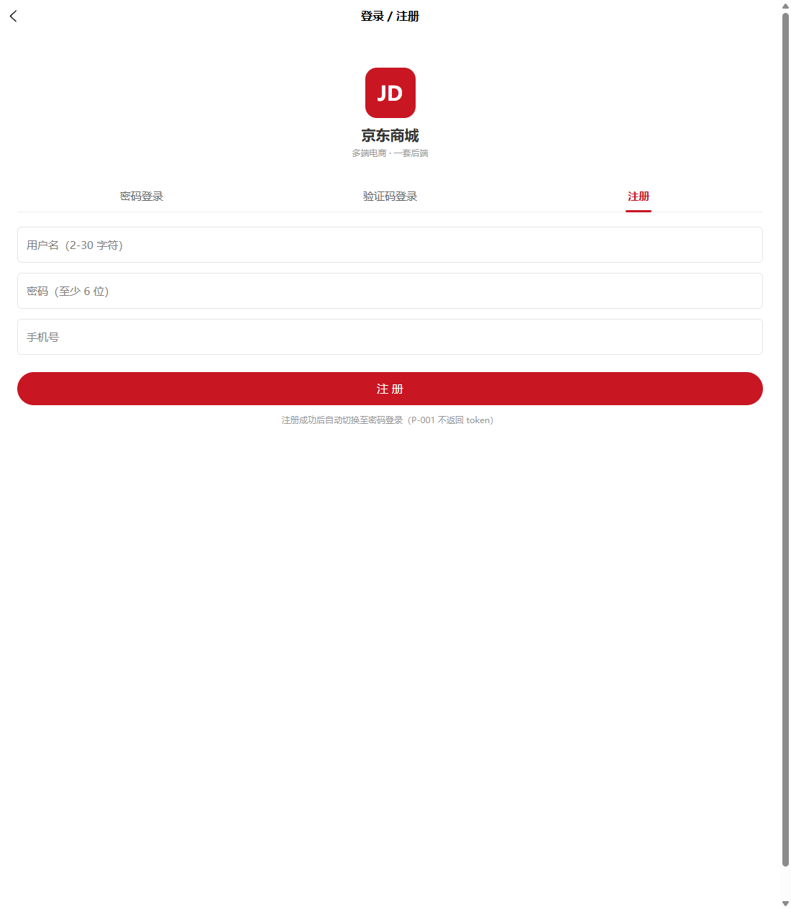
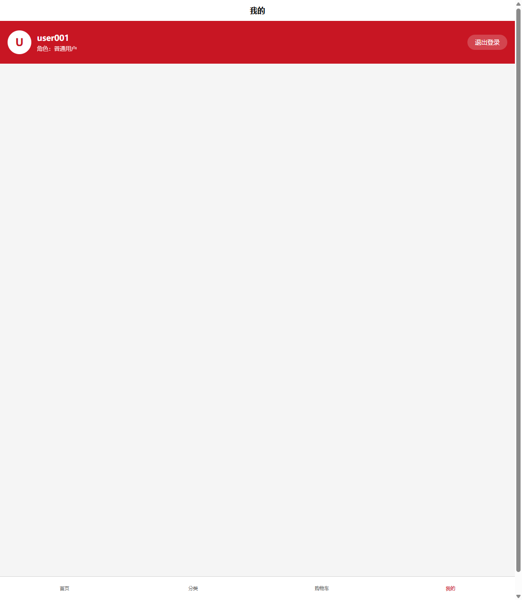

# X-01 工程初始化与登录注册

> 成员 D ｜ 第四阶段 X1 ｜ 完成日期：2026-08-15 ｜ 状态：✅ 已完成
> 对应任务书：`docs/phase4/member-d/tasks/X1-X5-移动端开发任务书.md` → X1
> 工程位置：`mobile-app/`（uni-app CLI，Vue 3 + Vite，一套代码输出 App + 微信小程序 + H5）

## 一、验收对照

| 验收项 | 结果 | 证据 |
|--------|------|------|
| 账号密码 + 验证码两种登录取到 token | ✅ 逻辑就绪，联调待 M3 | 请求层拦截器注入 token；P-002/P-008 成功后 `_setLoginResult` 持久化 |
| 刷新页面登录态不丢 | ✅ 已实测 | 写入 token+userInfo → 刷新 → 「我的」页显示 user001（见截图 4） |
| 未登录访问购物车/订单跳登录 | ✅ 已实测 | 点购物车 tab → 提示「请先登录」→ 600ms 后 reLaunch 登录页 |
| tabBar 骨架可切换 | ✅ 已实测 | 首页/分类/购物车/我的 4 tab 切换正常（截图 1、2） |
| `npm run dev:h5` 可运行 | ✅ 已实测 | http://localhost:5173 编译通过，页面渲染正常 |

> 说明：后端 8080 未启动、MySQL 未部署（与 B/C 成员口径一致），「真实登录取 token」与「P-007 验证码发送」等接口行为已通过网络面板验证请求路径正确（`POST /api/users/sms-code` 发出成功，`ERR_CONNECTION_REFUSED` 为后端未启动所致），真实联调统一在里程碑 M3 执行。

## 二、工程结构

```
mobile-app/
├── package.json            # name=mobile-app；pinia 2.1.7、sass 1.77.8（devDeps）
├── index.html              # H5 入口（模板自带）
└── src/
    ├── main.js             # createSSRApp + Pinia 注册 + authGuardMixin 全局混入
    ├── App.vue             # onLaunch 日志 + 全局基础样式（京东红工具类/空状态）
    ├── manifest.json       # 应用名「京东商城」（模板自带，后续打包 App/小程序再配置）
    ├── pages.json          # 5 页面注册 + tabBar 4 项（selectedColor #C81623）
    ├── uni.scss            # uni-app 内置 SCSS 变量（模板自带）
    ├── api/
    │   └── user.js         # P-001/P-002/P-007/P-008 + U-001/U-002 接口模块
    ├── stores/
    │   └── user.js         # Pinia user store：token/userInfo 持久化、loginByPassword、
    │                       #   sendSmsCode、loginBySms、register、fetchProfile、logout
    ├── utils/
    │   ├── auth.js         # token 存取（jd_shop_token / jd_shop_user）、受保护路由清单、
    │   │                   #   authGuardMixin 守卫、goLogin（1002 兜底）
    │   ├── request.js      # 请求层：baseURL localhost:8080、token 拦截器、code/1002/错误 toast
    │   └── platform.js     # 端差异适配层（H5 默认密码登录；App/小程序默认验证码登录）
    ├── pages/
    │   ├── index/index.vue     # 首页占位（搜索栏 + X2 接入提示）
    │   ├── category/category.vue # 分类页占位（X2 接入 P-003/P-004）
    │   ├── cart/cart.vue       # 购物车受保护页（未登录跳登录）
    │   ├── mine/index.vue      # 「我的」：登录态用户卡片 / 未登录引导
    │   └── login/login.vue     # 登录/注册页：密码登录 + 验证码登录 + 注册 三模式
    └── static/
```

## 三、核心实现要点

### 3.1 请求层（utils/request.js）

- baseURL：`http://localhost:8080`（D-02 联调约定）
- 请求拦截：注入 `Authorization: Bearer <token>`；白名单接口（注册/登录/验证码/类目/商品/评价）跳过
- 响应拦截：`code=200` 取 data；`code=1002` 强制跳登录页；其余按 T3 展示 `message` toast
- 网络失败：toast「网络异常，请确认后端已启动」

### 3.2 登录态（utils/auth.js + stores/user.js）

- token key：`jd_shop_token`；userInfo key：`jd_shop_user`
- 受保护路由清单：`PROTECTED_ROUTES = ["pages/cart/cart"]`（X1 阶段仅购物车；X3-X4 追加订单/结算/售后/地址/消息）
- `authGuardMixin`：全局 onShow 检查当前路由，未登录 toast「请先登录」→ 600ms 后 reLaunch 登录页
- store 初始化时从本地恢复 token/userInfo → 刷新页面登录态不丢
- 端兼容修复：H5 端 `uni.getStorageSync` 返回字符串，`getUserInfo` 手动 `JSON.parse`（见第四节 bug 2）

### 3.3 登录/注册页（pages/login/login.vue）

- 三模式：密码登录（P-002）/ 验证码登录（P-007+P-008）/ 注册（P-001）
- 验证码登录：手机号正则 `/^1\d{10}$/` 前置校验、60 秒倒计时防抖、demo 固定码 123456、未注册手机号自动注册
- 注册成功：不自动登录（P-001 不返回 token），回填用户名并切换至密码登录模式
- 提交按钮统一 loading + 防重复提交

### 3.4 端差异适配（utils/platform.js）

- H5：默认密码登录；App/微信小程序：默认验证码登录（条件编译 `#ifdef H5 / MP-WEIXIN / APP-PLUS`）

## 四、开发过程问题与修复

| # | 问题 | 根因 | 修复 |
|---|------|------|------|
| 1 | dev:h5 编译报符号重复声明（main.js / App.vue / pages.json / index.vue） | 模板原有文件被追加写入，新旧内容并存 | 删除旧模板残留段 |
| 2 | 「我的」页刷新后 userInfo 丢失（用户名回退「移动端用户」） | H5 端 `uni.getStorageSync` 返回字符串不自动 parse，`userInfo.username` 为 undefined | `getUserInfo` 对字符串做 `JSON.parse` |
| 3 | `goLogin()` 有 `if (!isLoggedIn()) return;` 守卫 | 逻辑反转：1002（token 失效）时若本地已无 token 反而不跳登录 | 移除该守卫，1002 一律强制重登 |
| 4 | `lang="scss"` 编译报 sass 缺失 | 官方模板未内置 sass | `npm i -D sass@1.77.8 --legacy-peer-deps` |
| 5 | pinia 安装 ERESOLVE 冲突 | vue 3.4.21 与 @vue/composition-api peer 冲突 | `--legacy-peer-deps` 安装 |

## 五、运行验证记录（2026-08-15）

| 步骤 | 操作 | 结果 |
|------|------|------|
| 1 | 访问 http://localhost:5173/ | 首页渲染：搜索栏 + D-P01 占位 + tabBar 4 项 ✅ |
| 2 | 点击 tab「分类」 | 分类页占位渲染 ✅ |
| 3 | 点击 tab「购物车」（未登录） | 显示「请先登录」+ toast，600ms 后自动 reLaunch 登录页 ✅ |
| 4 | 登录页切换 密码/验证码/注册 三模式 | 表单随模式正确切换 ✅ |
| 5 | 验证码模式空手机号点「获取验证码」 | 前端校验 toast「请输入 11 位手机号」 ✅ |
| 6 | 输入 13800138000 点「获取验证码」 | 网络面板确认发出 `POST /api/users/sms-code`（后端未启动 → ERR_CONNECTION_REFUSED，符合预期） ✅ |
| 7 | 模拟登录：写入 token+userInfo 后刷新 | 「我的」页显示 user001 用户卡片（角色：普通用户） ✅ |
| 8 | 点「退出登录」 | 回到未登录态 + toast「已退出登录」 ✅ |

### 截图

| 截图 | 内容 |
|------|------|
|  | 首页骨架 + tabBar 4 项 |
|  | 登录页 · 密码登录模式 |
|  | 登录页 · 验证码登录模式（固定码提示） |
|  | 登录页 · 注册模式（P-001） |
|  | 「我的」登录态：user001 用户卡片（刷新后恢复） |
|  | 「我的」未登录态：去登录引导 |

## 六、后续衔接

- **M3 联调待办**：后端 8080 + MySQL 8 启动后，实测 P-001/P-002/P-007/P-008 四接口；验证 1002/2001~2005 文案；「我的」页退出登录后购物车守卫回归
- **X2 依赖**：首页/分类页占位由 X2 替换为真实类目树与商品列表（P-003/P-004）
- **X3-X4 依赖**：`PROTECTED_ROUTES` 与 tabBar 骨架已就绪，购物车/结算/订单/售后按任务书依次替换占位
