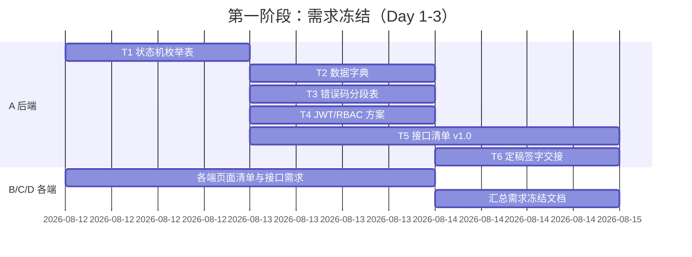

# 项目进度与里程碑

> 本文件记录项目整体的阶段进度与里程碑达成情况。
> 关联：[项目状态总览](../../PROJECT_STATUS.md) ｜ [成员完成状态](member-status.md) ｜ [待实现进度](backlog.md)

## 状态图例

- ⬜ 未开始 ｜ 🟦 进行中 ｜ ✅ 已完成 ｜ 🚫 阻塞

## 五阶段总览

| 阶段 | 名称 | 目标 | 负责人 | 计划周期 | 状态 | 完成度 |
|---|---|---|---|---|---|---|
| 1 | 需求冻结 | 各端需求梳理并冻结，全员签字 | A 统筹，全员参与 | Day 1-3 | 🟦 | 0% |
| 2 | 接口契约定稿 | 后端与各端对接口/数据字典/错误码签字 | A 主导 | 待定 | ⬜ | 0% |
| 3 | 数据库与后端 | 建库建表、后端接口开发完成 | A | 待定 | ⬜ | 0% |
| 4 | 各端开发 | 四个前端工程按契约开发完成 | B/C/D | 待定 | ⬜ | 0% |
| 5 | 联调验收 | 联调、测试、文档补全与答辩材料 | 全员（D 牵头测试） | 待定 | ⬜ | 0% |

## 里程碑

| 里程碑 | 所属阶段 | 判定标准 | 计划达成 | 实际达成 | 状态 |
|---|---|---|---|---|---|
| M1 需求冻结签字 | 阶段 1 | 需求冻结定稿文档获全员签字 | Day 3 | - | ⬜ |
| M2 接口契约签字 | 阶段 2 | 接口清单/数据字典/错误码获全员签字 | 待定 | - | ⬜ |
| M3 后端可联调 | 阶段 3 | 接口可被 Postman 正常调用 | 待定 | - | ⬜ |
| M4 各端功能完成 | 阶段 4 | 四个前端主要页面流程可跑通 | 待定 | - | ⬜ |
| M5 验收通过 | 阶段 5 | 满足作业评分标准，答辩材料齐备 | 待定 | - | ⬜ |

## 时间线（第一阶段细化）

## 更新约定

1. **谁更新**：阶段负责人更新所属阶段；A 更新里程碑与时间线。
2. **何时更新**：阶段开始/结束时更新状态；里程碑达成当天记录实际日期。
3. **必须同步**：更新后同步修改根目录 `PROJECT_STATUS.md` 的「阶段里程碑」。
4. **提交**：进度变更随任务交付物一起提交到 `develop`。
