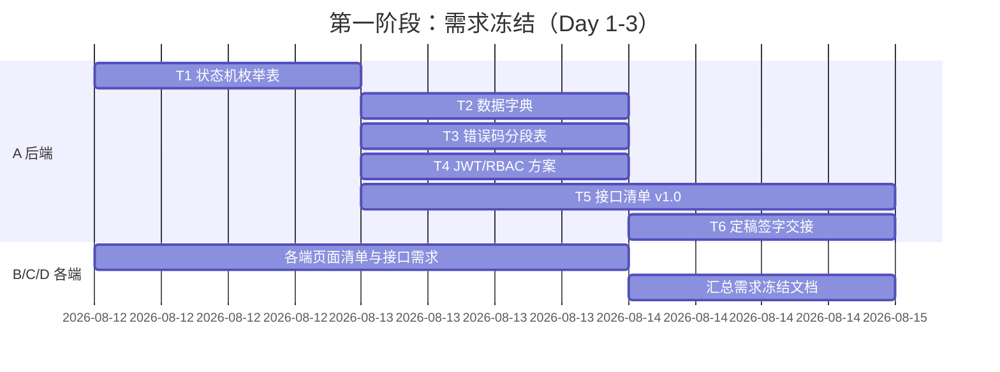

# 项目进度与里程碑

> 本文件记录项目整体的阶段进度与里程碑达成情况。
> 关联：[项目状态总览](../../PROJECT_STATUS.md) ｜ [成员完成状态](member-status.md) ｜ [待实现进度](backlog.md)

## 状态图例

- ⬜ 未开始 ｜ 🟦 进行中 ｜ ✅ 已完成 ｜ 🚫 阻塞

## 五阶段总览

| 阶段 | 名称 | 目标 | 负责人 | 计划周期 | 状态 | 完成度 |
|---|---|---|---|---|---|---|
| 1 | 需求冻结 | 各端需求梳理并冻结，全员签字 | A 统筹，全员参与 | Day 1-3 | ✅ | 100% |
| 2 | 接口契约定稿 | 后端与各端对接口/数据字典/错误码签字 | A 主导 | 待定 | ✅ | 100% |
| 3 | 数据库与后端 | 建库建表、后端接口开发完成 | A | 待定 | ✅ | 100% |
| 4 | 各端开发 | 四个前端工程按契约开发完成 | B/C/D | 待定 | ✅ | 100%（B 5/5 + C 6/6 + D 5/5） |
| 5 | 联调验收 | 联调、测试、文档补全与答辩材料 | 全员（D 牵头测试） | 2026-08-29 启动 | 🟦 | 推进中（B/D 联调完成 + 测试基线 X-07） |

## 里程碑

| 里程碑 | 所属阶段 | 判定标准 | 计划达成 | 实际达成 | 状态 |
|---|---|---|---|---|---|
| M1 需求冻结签字 | 阶段 1 | 需求冻结定稿文档获全员签字 | Day 3 | 2026-08-12 | ✅ |
| M2 接口契约签字 | 阶段 2 | 接口清单/数据字典/错误码获全员签字 | 待定 | 2026-08-12 | ✅ |
| M3 后端可联调 | 阶段 3 | 接口可被 Postman 正常调用 | 待定 | 2026-08-15 | ✅ |
| M4 各端功能完成 | 阶段 4 | 四个前端主要页面流程可跑通 | 待定 | - | ⬜ |
| M5 验收通过 | 阶段 5 | 满足作业评分标准，答辩材料齐备 | 待定 | - | ⬜ |

> 说明：M2 随第一阶段 T1/T5 全员签字闭环（契约 v1.0 已签字）。
> M3 已完成（2026-08-15）：MySQL 8.0.28 真实环境部署（3306）+ jd_shop 建库（13 表 + 5 账号）+ 后端 8080 启动；20 步用户-商家-管理员全链路联调 + 17 项抽测全部 code=200，错误码 2001/1007/2003/4001 实测正确；前端浏览器端到端实测通过。M4 待各端切换真实后端联调验证。
> 第四阶段 2026-08-15 全员代码完成：B W1~W5（13 页）、C C1-C6（13 页）、D X1~X5（17 页）。
> 第五阶段 2026-08-29 启动：后端 8080（MySQL 8 3306 + H2 备选）运行中，B/C/D 已切换 baseURL 完成真实联调。
> 2026-08-29 契约对齐补充轮：B W6 + D X6 产出 33 接口逐条核对表（`W-06/X-06-接口契约核对表.md`）；D 修复 6 处契约运行时代码（U-003/U-008 裸数组解包、U-012 错误分支、U-002 字段）；A 同步修复 U-003 地址契约并升版 U-003/U-008/U-018 接口（`fix-address-api-contract` / `fix-U003-U008-U018-contract`）；B/D 修正注释漂移并整理契约偏差清单（建议 A 升版 T5 v1.1）；`frontend-user build` 与 `mobile-app build:h5 / build:mp-weixin` 复核通过。
> 2026-08-29 真实联调轮（第五阶段推进）：B/D 用户域全量验证——W-06 待验证错误码十项实测闭环 + U-021 介入路径实测；契约实况校准（U-012 `orders[].orderId`、isDefault/selected 整数 0/1、U-018 无 refundNo）；B 产出 W-07/W-08、D 产出 X-07/X-08/X-09；frontend-user dev 5174 路由+代理联通；C 已执行演示脚本（H2 34 接口全链路 + 审计日志留痕）。剩余：M4 页面级走查截图、测试滚动回归、T1 状态机缺口待 A 修订。

## 时间线（第一阶段细化）

## 更新约定

1. **谁更新**：阶段负责人更新所属阶段；A 更新里程碑与时间线。
2. **何时更新**：阶段开始/结束时更新状态；里程碑达成当天记录实际日期。
3. **必须同步**：更新后同步修改根目录 `PROJECT_STATUS.md` 的「阶段里程碑」。
4. **提交**：进度变更随任务交付物一起提交到 `develop`。
