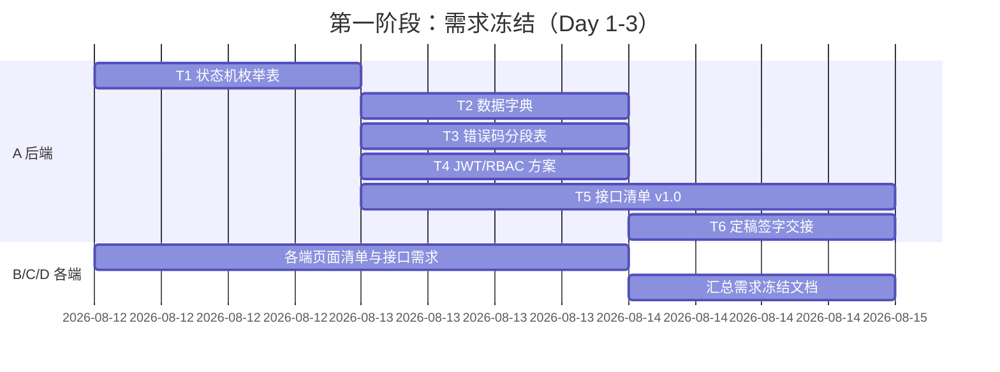

# 项目进度与里程碑

> 本文件记录项目整体的阶段进度与里程碑达成情况。
> 关联：[项目状态总览](../../PROJECT_STATUS.md) ｜ [成员完成状态](member-status.md) ｜ [待实现进度](backlog.md)

## 状态图例

- ⬜ 未开始 ｜ 🟦 进行中 ｜ ✅ 已完成 ｜ 🚫 阻塞

## 五阶段总览

| 阶段 | 名称 | 目标 | 负责人 | 计划周期 | 状态 | 完成度 |
|---|---|---|---|---|---|---|
| 1 | 需求冻结 | 各端需求梳理并冻结，全员签字 | A 统筹，全员参与 | Day 1-3 | ✅ | 100% |
| 2 | 接口契约定稿 | 后端与各端对接口/数据字典/错误码签字 | A 主导 | 待定 | ✅ | 100% |
| 3 | 数据库与后端 | 建库建表、后端接口开发完成 | A | 待定 | ✅ | 100% |
| 4 | 各端开发 | 四个前端工程按契约开发完成 | B/C/D | 待定 | ✅ | 100%（B 5/5 + C 6/6 + D 5/5） |
| 5 | 联调验收 | 联调、测试、文档补全与答辩材料 | 全员（D 牵头测试） | 2026-08-29 推进 | 🟦 | 进行中（B/C/D 三方真实联调完成并归档；A 状态机缺口已修复回归 21/21、T5 升版 v1.1；C 端店铺重提 M-002b 接入闭环 + 后端 audit_reason 置空修复（MySQL 真实环境 9 步 E2E 实测全通过）；U-024 高缺陷与 B/C/D 中低缺陷收尾；T1 3.2 语义完善闭环（M-002b 可选请求体 v1.2 + C 端表单联动 + 16 步 E2E 全绿）+ T5 v1.2；剩 M4 走查补截图 + 全端回归 + 答辩材料） |

## 里程碑

| 里程碑 | 所属阶段 | 判定标准 | 计划达成 | 实际达成 | 状态 |
|---|---|---|---|---|---|
| M1 需求冻结签字 | 阶段 1 | 需求冻结定稿文档获全员签字 | Day 3 | 2026-08-12 | ✅ |
| M2 接口契约签字 | 阶段 2 | 接口清单/数据字典/错误码获全员签字 | 待定 | 2026-08-12 | ✅ |
| M3 后端可联调 | 阶段 3 | 接口可被 Postman 正常调用 | 待定 | 2026-08-15 | ✅ |
| M4 各端功能完成 | 阶段 4 | 四个前端主要页面流程可跑通 | 待定 | 2026-08-15 | ✅ |
| M5 验收通过 | 阶段 5 | 满足作业评分标准，答辩材料齐备 | 待定 | - | ⬜ |

> 说明：M2 随第一阶段 T1/T5 全员签字闭环（契约 v1.0 已签字）。
> M3 已完成（2026-08-15）：MySQL 8.0.28 真实环境部署（3306）+ jd_shop 建库（13 表 + 5 账号）+ 后端 8080 启动；20 步用户-商家-管理员全链路联调 + 17 项抽测全部 code=200，错误码 2001/1007/2003/4001 实测正确；前端浏览器端到端实测通过。M4 已达成（2026-08-15）：四端代码全部完成 + browser-use 实测主要页面流程跑通；2026-08-29 B/C/D 均完成真实后端联调闭环。
> 第四阶段 2026-08-15 全员代码完成：B W1~W5（13 页）、C C1-C6（13 页）、D X1~X5（17 页）。
> 第五阶段 2026-08-29 推进：MySQL 8（D:\mysql-8.0.28-winx64 3306）+ H2 备选环境均可用，后端 8080 运行中；B/C/D 均已切换 baseURL 完成真实联调。
> 2026-08-29 契约对齐补充轮：B W6 + D X6 产出 33 接口逐条核对表（`W-06/X-06-接口契约核对表.md`）；D 修复 6 处契约运行时代码（U-003/U-008 裸数组解包、U-012 错误分支、U-002 字段）；A 同步从后端修复 U-003 地址信封、U-008 购物车信封、U-018 refundNo（`fbe7b71` / `772ddec`）；B/D 修正注释漂移并整理契约偏差清单（建议 A 升版 T5 v1.1）；`frontend-user build` 与 `mobile-app build:h5 / build:mp-weixin` 复核通过。
> 2026-08-29 M3 真实联调轮：C 完成 H2 备选环境 34 接口全链路连通、四条链路流转、审计日志留痕、2 个状态机缺口反馈 A；D 完成 25 步接口级全链路闭环 + H5 页面级 5 页实测 + 发现并修复 H2 中文乱码配置缺陷（application-h2.yml 加 encoding: UTF-8）+ 测试基线复核与 45 条用例清单 + 自测脚本备料（X-07/X-08/X-09）；B 完成前端 5 处双兼容适配（U-003/U-008 解包×4 + U-018 refundNo||refundId）并复核 A 的契约修复（W-07 §8）。早期会话另产出测试基线 46 用例、回归记录、演示脚本（X-07/08/09 过程记录版，保留归档）。
> 2026-08-29 修复收尾轮：A 修复 2 个状态机重提缺口（M-002 店铺 REJECTED→PENDING_AUDIT + M-006 商品 OFF_SALE→PENDING_ON_SALE，状态机重提回归脚本 21/21 PASS）并升版 T5 v1.1（U-002/U-004/U-010/U-012/P-008/U-024 契约校准）；A/D 完成 U-024 评价高缺陷（reviewed 后端字段 + mobile-app 评价/地址回显，回归 18/18 PASS）；B 完成中低缺陷批量修复（幽灵码/购物车徽标/静默兜底/silent 透传，build 通过）；C 完成构建复核与 dev 端口统一 5174。剩：M4 页面级走查截图、D 牵头全端回归（按 X-08 用例清单）、答辩材料。
> 2026-08-29 缺口补全轮：C 端 admin-web 接入 M-002b（merchant.js 封装 + Shop.vue REJECTED “重新提交审核”按钮）；A 修复 resubmitShop auditReason 置空失效（updateById NOT_NULL 跳过 null → LambdaUpdateWrapper 显式置空）；MySQL 真实环境 merchant002 店铺2 全链路 9 步 E2E 实测通过（1001 拦截 ×2、reject/resubmit 200、状态与驳回原因回位、终态无数据污染）。
> 2026-08-29 T1 3.2 语义完善轮（A/C）：M-002b 支持可选请求体 v1.2（ShopResubmitDTO 全可选字段，携带的字段先更新再重提，空 body/{} 向后兼容，3004 类目校验 + 审计 remark 区分“修改资料后重新提交/重新提交”）；C 端 Shop.vue REJECTED 改“修改资料并重新提交”按钮 → 预填表单 → handleSave 分流（resubmit 带资料走 M-002b / edit 走 M-002）；T5 升版 v1.2；双端构建通过；MySQL 真实环境 16 步 E2E 全绿（PENDING_AUDIT 1001 拦截 ×3、reject 200 ×3、全量/部分/空对象重提 200、携带字段更新/空对象不动数据/reason 清空）+ 中文写入 SQL 字节级验证通过 + 修复 shop2 双重编码历史数据（hex 字面量 CONVERT 恢复 seed 值）。

## 时间线（第一阶段细化）

## 更新约定

1. **谁更新**：阶段负责人更新所属阶段；A 更新里程碑与时间线。
2. **何时更新**：阶段开始/结束时更新状态；里程碑达成当天记录实际日期。
3. **必须同步**：更新后同步修改根目录 `PROJECT_STATUS.md` 的「阶段里程碑」。
4. **提交**：进度变更随任务交付物一起提交到 `develop`。
