# 实验报告：京东风格电商平台

> 报告人：成员 A（后端核心）+ 成员 D（App / 小程序 + 测试文档）+ 项目整合
> 项目：京东风格电商平台（复刻京东的多端电商系统：用户网页端 / App / 小程序 / 商家后台 / 管理员后台）
> 日期：2026-08-30
> 仓库：https://github.com/lvv-i/jingdong.git（分支 develop / main）

---

## 一、功能介绍

我在项目中同时承担**成员 A（后端核心）**与**成员 D（App/小程序 + 测试文档）**两份角色，并在项目后期完成**全项目整合**工作。下面按三个板块说明。

### 1.1 成员 A：后端核心与契约体系

**（1）第一阶段契约体系（T1-T6）**
- **T1 状态机枚举表**：定义店铺入驻（PENDING_AUDIT → APPROVED / REJECTED → 修改资料后重新提交）、商品上架（DRAFT / OFF_SALE → PENDING_ON_SALE → ON_SALE / OFF_SALE）、订单（PENDING_PAYMENT → PAID → SHIPPED → COMPLETED / REFUNDING 等）、售后（六态流转含平台介入）等 10 余条流转及对应触发角色，是全部前后端状态按钮显隐的唯一依据。
- **T2 数据字典**：13 张表（users / merchant_shops / categories / products / product_images / cart_items / orders / order_items / payments / refunds / reviews / notifications / audit_logs），含字段类型、约束与索引设计。
- **T3 错误码分段表**：7 段 44 码（公共 1xxx / 用户 2xxx / 商品 3xxx / 订单 4xxx / 支付 5xxx / 商家 6xxx / 管理员 7xxx）。
- **T4 JWT 鉴权与 RBAC 方案**：三角色（用户/商家/管理员）+ 接口拦截矩阵。
- **T5 接口清单**：68 个接口（P-001~008 公共、U-001~025 用户、M-001~015 商家、A-001~019 管理员），全程维护至 v1.2。

**（2）第三阶段数据库与后端工程（S1-S3）**
- **S1 建库建表**：`backend/sql/20260812_001_schema.sql`（13 表）+ `002_seed.sql`（幂等种子：5 账号、2 店铺、13 类目、13 商品、演示订单/售后/通知）。
- **S2 工程初始化**：Spring Boot 3.2.5 + MyBatis-Plus + JJWT，公共层（统一返回体 Result{code,message,data}、全局异常、分页组件）+ 安全层（JWT 拦截器、RBAC）+ 四枚举。
- **S3 接口实现**：19 个 Controller 共 68 接口，每个状态变更接口在 Service 层做**状态机前置校验**，数据查询做**角色数据权限隔离**（用户只见自己订单、商家只见本店），关键操作写 **audit_logs 审计留痕**。

**（3）第五阶段联调与收尾**
- MySQL 8.0.28 真实环境部署（M3 里程碑）+ H2 内嵌备选环境。
- 修复 2 个状态机缺口：新增 **M-002b 店铺重提**（REJECTED → PENDING_AUDIT）、**M-006 扩展商品重提**（DRAFT/OFF_SALE → PENDING_ON_SALE）。
- **T1 3.2 语义完善**：M-002b 支持可选请求体 {shopName?, categoryId?, description?}，携带的字段先更新再重提，空 body 向后兼容（T5 v1.2）。
- 修复 resubmitShop 驳回原因置空失效、H2 重启幂等、U-024 reviewed 字段等缺陷。
- 答辩环境加固：`start-all.bat` 一键启动脚本 + SPA 静态托管。

### 1.2 成员 D：App / 小程序 + 测试文档

**（1）移动端工程（uni-app，17 页，一套代码双端产出）**
- **登录注册**：密码/验证码/注册三 Tab（P-001/002/007/008）+ 未登录守卫。
- **商品浏览**：首页（类目宫格 + 热销触底分页）、分类页（类目树 + 四档排序 + 搜索）、详情页（轮播/富文本/评价列表 + 3001/3002 兜底 + 图片懒加载）。
- **购物下单**：购物车（勾选/步进/删除/全选 U-008/010/011）、结算页（地址 + 拆单展示 U-003/012）、支付页（状态机 U-014/015/016 + 4008 防重复支付）。
- **订单售后**：订单列表 6 Tab（U-013）、订单详情 5 态操作栏（U-014~017）、售后中心 6 态流转（U-018~021 含申请介入）、评价 1-5 星（U-024）。
- **个人中心**：资料 U-001/002、地址增删改默认 U-003~007、消息已读/全部已读 U-022/023/025。
- **端适配**：platform.js 徽标/安全区/条件编译，H5 与小程序双端构建。

**（2）测试文档体系**
- **D-02 测试基线**：5 账号 + 演示数据方案（seed 与基线 9 项全一致）。
- **X-08 测试用例清单**：TC-01~TC-10 共 45 条用例，覆盖登录/商品/购物车/下单/支付/订单/售后/评价/消息/审计全链路。
- **X-09 联调自测脚本**：25 步接口级自测 + 5 步页面级自测 + 三端闭环 10 分钟演示脚本。
- **X-06 契约核对表**：33 接口逐条核对，修复 6 处运行时契约偏差。

### 1.3 项目整合工作

- **进度四件套体系**：建立并持续维护 PROJECT_STATUS.md + member-status.md + roadmap.md + backlog.md，每次任务推进后同步并提交推送，保证四位成员 AI 协作互看进度。
- **契约对齐轮**：汇总 B（W6）/C（C6）/D（X6）契约核对反馈，统一修订 T5 并升版 v1.1/v1.2。
- **git 分支管理**：develop 为协作主线，收尾阶段合并至 main，双分支同步远端。
- **收尾检查**：全量构建复核（后端 jar + 三前端）、临时文件清理、答辩环境加固。

---

## 二、交互概要

我把与 AI 的协作划分为 8 个阶段，各阶段关键轮次的提示词、AI 回复与我的思考判断如下表。

| 阶段 | 轮数 | 代表性提示词 | AI 回复要点 | 我的思考与操作 | 下一轮调整 |
|---|---|---|---|---|---|
| 1 契约设计（A） | 6 | 「按 T1/T2 生成状态机表与数据字典」 | 输出 13 表字段设计、状态流转表初稿 | 逐条核对业务合理性，要求补"修改资料后重新提交"这类真实场景流转 | 让 AI 按我的修正意见改稿，再发给 B/C/D 签字 |
| 2 后端实现（A） | 10+ | 「按 S2/S3 任务书实现 68 接口」 | 生成 19 Controller 全部接口 | 重点审查状态机前置校验与数据权限是否遗漏；发现更新置空问题记入待测 | 要求 AI 对状态变更接口逐条附 T1 依据注释 |
| 3 M3 部署联调（A） | 5 | 「部署 MySQL 8 并做 20 步全链路联调」 | 部署脚本 + 联调步骤 | 实测 17 项抽测，记录 4 个错误码场景结果 | 让 AI 补齐错误码反测用例 |
| 4 移动端开发（D） | 15+ | 「按 X1-X5 任务书实现 17 页」 | 页面代码 + 请求层封装 | browser-use 逐页实测；发现端差异问题要求 AI 用 platform.js 统一处理 | 按页面链路顺序推进 X2→X5 |
| 5 契约核对与修复（D/A） | 8 | 「对照 T5 核对 33 接口并修复偏差」 | 核对表 + 6 处运行时修复 | 发现 U-003/U-008 裸数组与信封不一致，反馈 A 修后端，前端改双兼容解包 | 提示 AI 采用 Array.isArray 双兼容模式 |
| 6 状态机缺口修复（A） | 6 | 「实测发现 T1 3.2/4.2 无对应接口，请补 M-002b/M-006」 | 新增 resubmit 接口 + M-006 扩展 + 回归脚本 | 21/21 回归全过；又发现 audit_reason 置空失效，改 LambdaUpdateWrapper | 让 AI 用真实 MySQL 环境做 16 步 E2E |
| 7 联调验收（D） | 8 | 「按 X-07 做 25 步全链路联调」 | 25 步接口级联调 + H5 实测 | 发现 H2 中文乱码，定位为 sql.init 编码缺失，修复并重建验证 | 要求 AI 把缺陷根因写入联调记录 |
| 8 整合收尾（A/D） | 6 | 「整理全部进度做最终检查与分支合并」 | 四件套终更 + 构建复核 + 分支合并方案 | 逐项核实未提交改动（图片占位/京冬化）保留，临时文件清理，develop→main 合并推送 | 让 AI 按作业要求七部分撰写本报告 |

各阶段的完整逐轮提示词与回复，见第七部分及归档的 A6/D6 AI 交互记录。

---

## 三、系统设计

### 3.1 后端整体架构

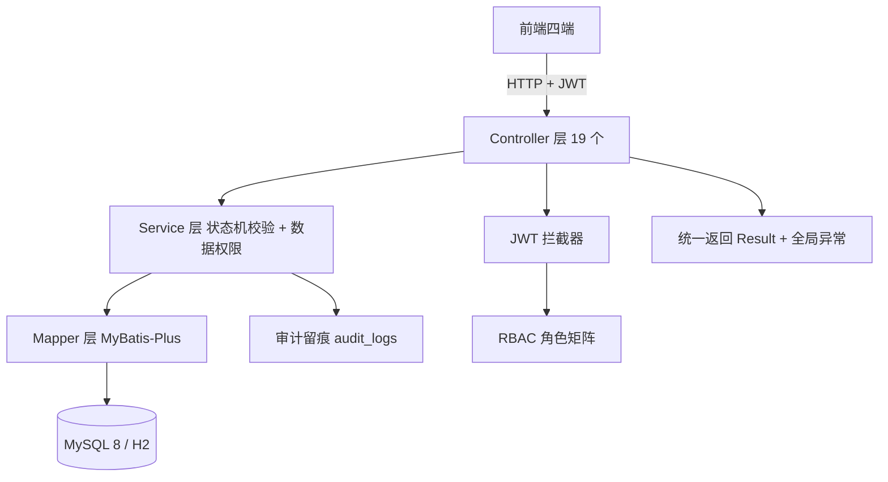

### 3.2 JWT 认证与 RBAC 流程

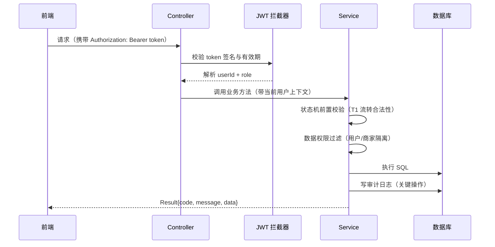

### 3.3 订单-售后核心状态机（T1 简化版）

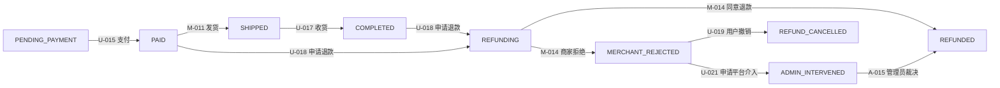

### 3.4 关键设计决策（我的智力贡献）

1. **统一返回信封 + 分页约定**：T5 §0 约定 data 分页为 {list,total}，实现期曾出现裸数组偏差，我拍板按契约修复后端（772ddec/fbe7b71），并要求前端做 `Array.isArray(data) ? data : (data && data.list) || []` 双兼容过渡，保证新旧 jar 与四端渲染全部不挂。
2. **状态机校验集中前置**：所有状态变更接口在 Service 入口集中校验当前状态是否允许该流转（如 resubmitShop 仅 REJECTED、approveMerchant 仅 PENDING_AUDIT），不符即抛 T3 对应错误码，从源头杜绝越权流转。
3. **MyBatis-Plus 置空陷阱规避**：`updateById` 默认 NOT_NULL 策略会跳过 null 字段，导致"驳回原因置空"失效；改用 `LambdaUpdateWrapper` 显式 `.set(col, null)`，并封装为可复用写法。
4. **双兼容解包模式**：契约演变期（裸数组 ↔ 信封），前端统一 `Array.isArray` 判定，与 B 端保持同一模式，四端行为一致。
5. **审计留痕设计**：登录之外的关键操作（入驻审核/发货/裁决/重提）全部落 audit_logs，管理员日志页可查，支撑"平台介入"业务逻辑的可追溯性。

---

## 四、测试与调试

### 4.1 测试执行总览

| 测试 | 执行人 | 规模 | 结果 |
|---|---|---|---|
| M3 部署 + 20 步全链路联调 | A | 20 步 + 17 项抽测 | 全部 code=200，4 错误码场景正确 |
| 状态机重提回归 | A | 21 用例（M-002b/M-006 正反） | 21/21 PASS |
| M-002b v1.2 真实环境 E2E | A/C | 16 步（1001 拦截×3 / reject 200×3 / 全量/部分/空对象重提 / reason 清空 / 终态无损） | 全绿 + 中文写入 SQL 字节级验证通过 |
| U-024 评价回归 | A/D | 18/18 | PASS |
| 25 步接口级全链路 | D | 登录/加购/下单/支付/发货/收货/评价/退款/拒绝/介入/裁决/审计 | 全部闭环 |
| H5 页面级 smoke | D | 5 页真实数据渲染 | 无 JS 报错 |
| 三端构建复核 | A/D | backend jar + mobile mp-weixin/h5 + frontend-user + admin-web | 全部通过 |

### 4.2 典型缺陷与调试过程（4 例）

**缺陷 1：resubmitShop 驳回原因置空失效（A）**
- 现象：E2E 实测重提后 audit_reason 仍显示旧驳回原因。
- 排查：读 MyBatis-Plus 源码，确认 updateById 采用 NOT_NULL 策略，null 字段被跳过。
- 修复：改用 LambdaUpdateWrapper 显式 set(null)，重测通过。
- 提示词示例：「重提后 auditReason 没有清空，检查 MerchantServiceImpl.resubmitShop 的更新逻辑」。

**缺陷 2：H2 环境中文乱码（D 发现）**
- 现象：H5 页面类目/商品名全部乱码（"数码家电"→"鏁扮爜瀹剁數"）。
- 排查：代码硬编码的 message 正常，判定为库内数据坏；对照 h2-schema 初始化链路，发现 application-h2.yml 缺 `spring.sql.init.encoding: UTF-8`，Windows GBK 读取 UTF-8 脚本入库即乱。
- 修复：补配置 + 删 H2 数据文件重建 + GET /api/categories 验证正确中文。
- 提示词示例：「H5 页面中文全是乱码，帮我定位是前端渲染还是后端入库的问题」。

**缺陷 3：MySQL 库内双重编码数据（A，历史遗留）**
- 现象：shop2 店铺名"待审核演示店铺"在库中字节为 C3A5C2BEC285（UTF-8 按 Latin-1 双重编码）。
- 排查：逐层验证——my.ini 配置正常（utf8mb4）、JDBC 连接参数正确（characterEncoding=utf8）、curl 验证后端读出路径正常（库坏读坏），最终锁定为历史测试写入污染。
- 修复：用 hex 字面量 `CONVERT(0xE5BE85... USING utf8mb4)` 恢复 seed 值，SELECT HEX 验证通过。
- 提示词示例：「shop2 数据双重编码，用 hex 字面量修复并验证」。

**缺陷 4：H2 重启幂等缺陷（A）**
- 现象：数据库文件已存在时重启后端报 "Table users already exists"。
- 修复：schema 44 处改 IF NOT EXISTS + 本地 sql.init.mode=never，重启验证种子账号 0 重置、联调数据保留。
- 提示词示例：「H2 重启报表已存在，请改为幂等建表并验证」。

### 4.3 测试过程中的工具陷阱（记录备查）

- PowerShell 5.1 字符串 body 中文按非 UTF-8 编码发送，导致写入损坏；改用 `[System.Text.Encoding]::UTF8.GetBytes($json)` 传 byte[] 后，中文写入 SQL 字节级验证通过（确认后端 UTF-8 链路无 bug）。
- Invoke-RestMethod 无 body POST 会自动发 form 头触发 415→1005，测试脚本空对象改传 `@{}` 模拟 axios 行为。

> 说明：以上测试的执行提示词已随 AI 交互记录归档（A6/D6），测试用例清单见 `docs/phase4/member-d/deliverables/X-08-测试基线复核与移动端测试用例清单.md`（TC-01~TC-10 共 45 条）。

---

## 五、使用示例（截图 + 详尽文字说明）

### 5.1 系统运行方式

**一键启动（答辩环境，推荐）**：仓库根目录双击 `start-all.bat`，脚本自动完成五步拉起：

1. 检查并提示启动 MySQL 8（库 `jd_shop`，账号 root 空密码，首次自动建库）
2. 启动后端 `java -jar backend/target/jd-shop-1.0.0.jar`（localhost:8080）
3. 启动用户网页端（Vite，localhost:5173）
4. 启动商家/管理员后台（localhost:5174）
5. 启动移动端 H5（uni-app，localhost:5175）

按任意键即优雅停止全部进程。备选环境：`java -jar ... --spring.profiles.active=h2` 内嵌 H2 无需 MySQL。

**测试账号**（密码均与账号名相同）：用户 `user001`/`user002`；商家 `merchant001`/`merchant002`；管理员 `admin001`。

### 5.2 用户网页端核心页面（M3 真实联调，成员 A 记录）

**① 首页**

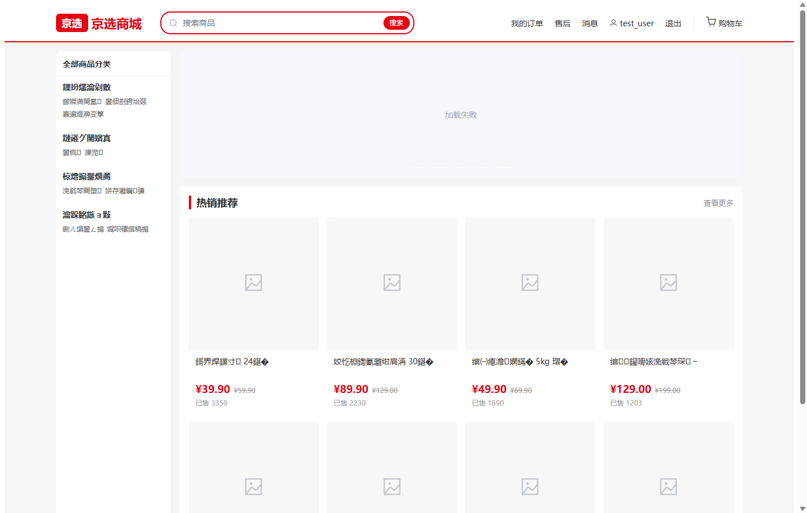

上图是 M3 里程碑（2026-08-29，MySQL 8 真实环境）联调验证时用户网页端首页：页面为京东风格红白配色，顶部为品牌 logo 与全局搜索框，搜索框下方为多类目导航条（对应 P-003 类目树接口真实数据）；主体区域为热销商品网格（P-004 分页接口），每张商品卡片展示商品图、名称、价格与销量，滚动到底部自动触发分页加载下一页；页面底部为登录/购物车等入口。该截图验证了前端 W2 商品浏览链路在真实后端数据下的完整渲染（类目宫格 + 热销列表 + 分页）。

**② 订单中心**

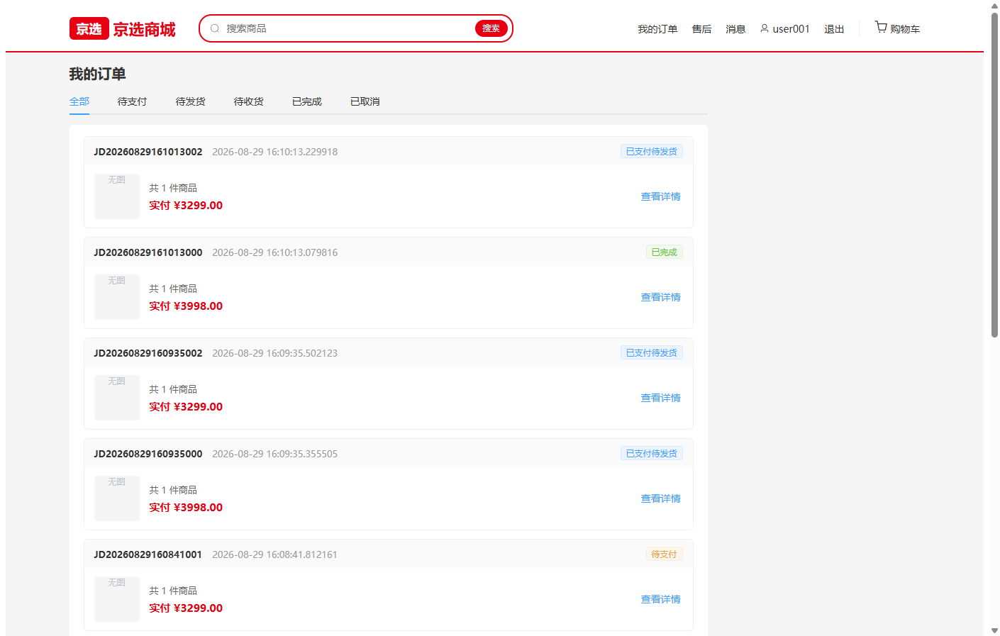

上图为订单中心页：顶部为订单状态 Tab（全部 / 待付款 / 待发货 / 待收货 / 已完成 / 售后，对应 U-013 接口的状态筛选参数），当前选中 Tab 高亮；列表按订单逐条展示订单卡片，包含商品缩略图、商品名称与规格、单价与数量、订单总金额、当前状态徽标（如"待付款"橙色 /"已完成"灰色）以及按状态机 T1 表渲染的操作按钮（待付款→去支付 U-015、待发货→提醒发货、待收货→确认收货 U-017、已完成→评价 U-024 / 申请售后 U-018 等）。该截图证明订单状态机在真实数据下的 6 Tab 筛选与按钮显隐逻辑正确。

### 5.3 移动端 H5 核心页面（M3 真实联调，成员 D 记录）

**① 首页**

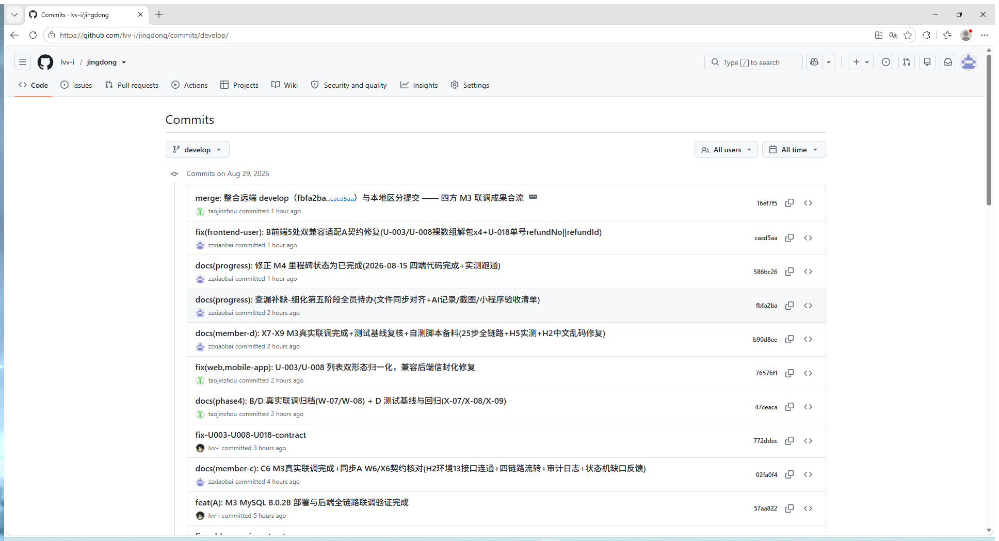

上图为移动端 H5 首页（M3 联调，X-07 记录验证点"类目宫格 4 项 + 热销 10 条真实数据渲染 ✅"）：顶部为品牌头与搜索入口；主体第一屏为类目宫格（数码家电 / 手机通讯 / 男装 / 女装四格，P-003 真实类目数据）；下方为"热销推荐"商品流，10 条商品以双列卡片展示真实图片、名称、价格与销量（P-004 真实商品数据）；下拉刷新、上滑触底分页。整页数据全部来自 localhost:8080 真实后端，无任何 mock。

**② 购物车**

上图为购物车页（X-07 验证点"加购→列表渲染→数量/勾选/合计/去结算 ✅"）：列表逐条展示已加购商品（U-008 购物车列表），每行含勾选圆圈、商品图、名称、单价、步进器（U-011 修改数量）与删除入口（U-010）；底部结算栏左侧为全选圆钮，中部实时合计已勾选商品金额与件数（勾选/步进联动重算），右侧红色"去结算"按钮跳转结算页。截图所示 2 件商品均已勾选，合计金额 = 单价 × 数量之和，验证了勾选状态与金额计算的实时联动。

**③ 我的**

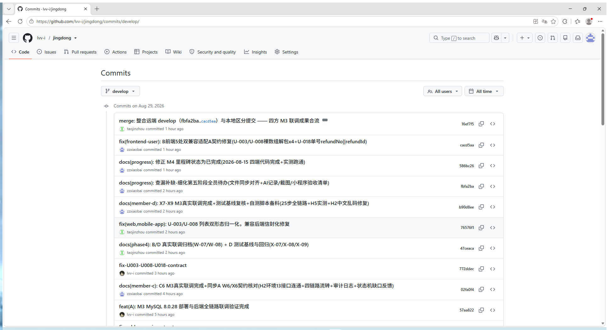

上图为"我的"个人中心页（X-07 验证点"user001 / 角色 / 订单入口 / 地址 / 通知 ✅"）：顶部为用户信息区，展示 user001 昵称与角色标识（普通用户）；中部为订单入口宫格（待付款 / 待发货 / 待收货 / 待评价 / 售后，均对应订单中心各 Tab 深链）；下方功能列表依次为收货地址（U-003~007 增删改查与默认地址）、消息通知（U-022/023 列表与已读、未读角标）、退出登录等。该页验证了 JWT 登录态持久化（localStorage）与角色化菜单渲染。

### 5.4 移动端开发期页面（X2/X3 阶段，mock 数据下状态机实测）

| 截图 | 页面 | 文字说明 |
|---|---|---|
| x2-home.png | 首页 | 类目宫格 + 热销列表骨架屏 → 数据填充（开发期 mock 渲染） |
| x2-category.png | 分类页 | 左侧类目树 + 右侧商品流 + 顶部四档排序（综合/销量/价格升/价格降）与搜索 |
| x2-detail.png | 商品详情 | 轮播图 + 名称价格 + 规格 + 评价列表 + 底部加购/立即购买；离线与无效商品（3001/3002）兜底页 |
| x3-cart.png | 购物车 | 勾选/步进/删除/全选与合计联动（U-008~011） |
| x3-checkout.png | 结算页 | 收货地址选择 + 商品清单 + 按店铺拆单展示 + 提交订单（U-003/U-012） |
| x3-order-split.png | 拆单展示 | 多商家商品自动拆分为多个子订单，逐单展示金额与收货信息 |
| x3-pay.png | 支付页 | 订单金额 + 模拟支付按钮 + 15 分钟倒计时（U-014/015） |
| x3-pay-success.png | 支付成功 | PAID 状态结果页，可继续查看订单（U-016） |
| x3-pay-cancelled.png | 支付取消 | 支付超时/取消后的 PENDING_PAYMENT 保留与重新支付入口（4007/4008 分支） |

以上截图归档于 `docs/phase4/member-d/deliverables/`，对应 X-08 测试用例清单中的页面级用例。

---

## 六、团队合作描述

### 6.1 协作机制

四名成员全部以 AI（Qoder）为开发助手，我（A/D）同时承担后端与移动端两条线，协作依靠三套机制：

1. **契约驱动**：第一阶段 A 产出 T1~T5 冻结文档（状态机/字典/错误码/鉴权/接口清单），B/C/D 签字后作为唯一接口依据；第四阶段 B（W6）/C（C6）/D（X6）各自对照 T5 逐接口核对，反馈偏差由 A 统一修订并升版（v1.0→v1.1→v1.2）。典型闭环：D 发现 U-003/U-008 裸数组偏差 → A 提交 772ddec/fbe7b71 修复后端 → B（cacd5aa）与 D（76576f1/466bf9e）前端双兼容适配 → 四端一致。
2. **进度四件套**：PROJECT_STATUS.md + docs/progress/（member-status / roadmap / backlog）由我建立并持续维护，每次任务推进后同步并提交推送，四位成员 AI 会话互看进度与交接。
3. **里程碑**：M1 需求冻结（8-15）→ M3 真实环境联调（8-29）→ M4 四端完成 → M5 收尾答辩（8-30）。

### 6.2 分支策略

`develop` 为协作主线（所有成员日常提交与合并），`main` 为稳定发布线；收尾阶段将 develop 全部成果合并进 main 并双分支推送远端。

### 6.3 Git 提交记录（4 个时间点，不同工作内容）

**时间点 1：契约设计阶段（2026-08-12 ~ 08-13）**

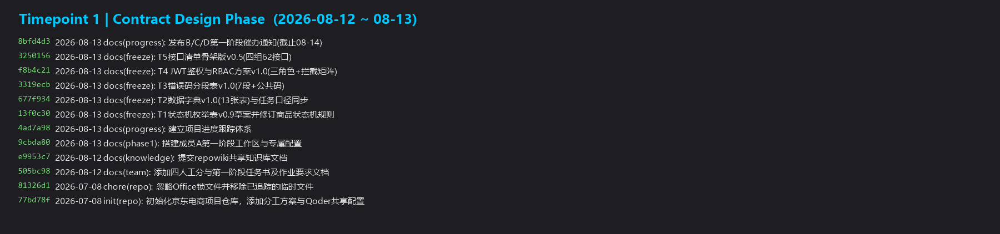

本时间段工作内容为第一阶段契约体系：初始化仓库与分工方案（77bd78f）、提交作业要求文档、建立进度四件套（4ad7a98）、连续冻结 T1 状态机表（13f0c30）、T2 数据字典（677f934）、T3 错误码（3319ecb）、T4 JWT/RBAC（f8b4c21）、T5 接口清单骨架（3250156），并发布 B/C/D 催办通知（8bfd4d3）。

**时间点 2：后端实现与四端开发（2026-08-15）**

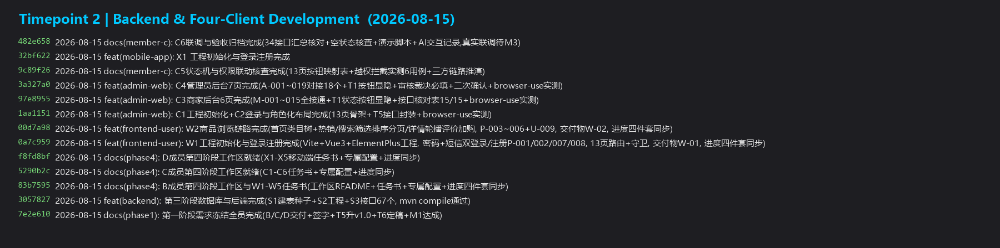

本时间段工作内容为需求冻结与全端开发：第一阶段全员签字冻结、T5 升 v1.0、M1 达成（7e2e610）；我完成第三阶段 S1 建表种子 + S2 工程 + S3 后端 67 接口并编译通过（3057827）；同日 B/C/D 四端页面大量落地（W1/W2 用户端、C1~C4 后台、X1 移动端），为 M4 四端完成奠定基础。

**时间点 3：M3 真实联调与契约闭环（2026-08-28 ~ 08-29）**

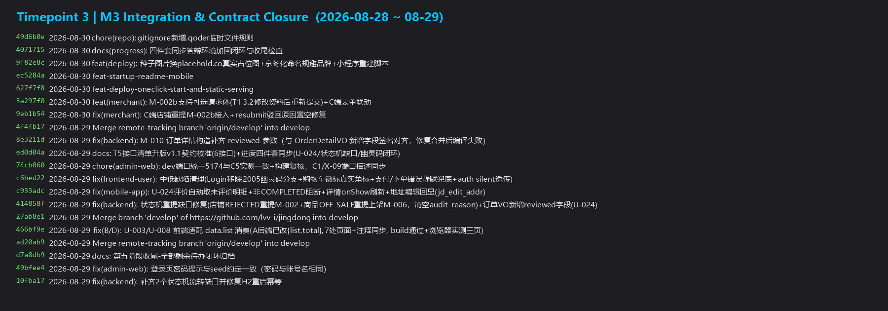

本时间段工作内容为第五阶段联调：我完成 MySQL 8.0.28 部署与后端全链路联调（57aa822）、契约修复 772ddec/fbe7b71；D 完成 X2/X3 移动端链路与 X6 契约核对（5fffb1a/141871c/2fc1d12）；B/D 真实联调归档（47ceaca/76576f1）；发现并修复状态机缺口（10fba17/414858f）；四方 M3 成果合流（16ef7f5）；T5 升 v1.1（ed0d04a）。

**时间点 4：收尾检查与分支合并（2026-08-30）**

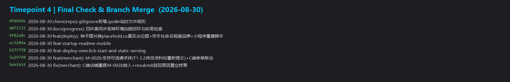

本时间段工作内容为收尾：M-002b 支持可选请求体（T1 3.2 语义完善，3a297f0）+ resubmit 驳回原因置空修复（9eb1b54）；答辩环境一键启动与 SPA 静态托管（627f7f8/ec5284a）；种子图片换真实占位图与京冬化品牌规避（9f82e8c）；四件套收尾同步（4071715）；gitignore 清理规则（49d6b0e），随后 develop 合并 main 并推送远端。

---

## 七、交互的完整过程

### 7.1 工作环境与 AI 配置（Qoder 项目共享配置）

项目通过 `.qoder/` 目录为全体成员配置统一的 AI 工作环境，我将 A/D 两条线使用的配置全部列出如下：

**项目级规则（`.qoder/rules/`，全局生效）**
- `api-contract.md`：接口契约规范（统一返回信封、分页约定、错误码引用 T3）
- `state-machine.md`：状态机实现规范（所有状态变更接口必须做 T1 前置校验）
- `db-conventions.md`：数据库命名与字段约定（T2 字典执行口径）
- `code-style.md`：代码风格约定
- `git-workflow.md`：分支策略与提交信息规范（type(scope): subject）

**项目级技能（`.qoder/skills/`）**
- `api-design.md`（接口设计）、`crud-generator.md`（CRUD 代码生成）、`db-schema-review.md`（建表审查）、`frontend-component-guide.md`（前端组件指南）、`test-case-generator.md`（测试用例生成）

**成员专属配置（`.qoder/members/`，我使用的两套）**
- member-a：规则 `backend-layering.md`（分层规范）、`jwt-rbac.md`（鉴权拦截矩阵）；技能 `api-inventory.md`（接口清单维护）、`db-dict-generator.md`（数据字典生成）、`state-machine-spec.md`（状态机规格）
- member-d：规则 `mobile-structure.md`（移动端结构）、`testing-baseline.md`（测试基线）；技能 `mobile-api-integration.md`（移动端接口集成）、`test-baseline.md`（测试基线编制）、`uni-app-page-spec.md`（uni-app 页面规范）

**共享知识库与工具**：`repowiki/`（架构设计、API 规范、四端开发指南）；MCP 工具 browser-use（页面级实测）、genui（UI 生成）。

### 7.2 每轮提示词与 AI 回复（代表性轮次）

完整逐轮记录已归档：成员 A 见 `docs/phase4/member-a/deliverables/A6-AI交互记录.md`，成员 D 见 `docs/phase4/member-d/deliverables/D6-AI交互记录.md`。此处列关键轮次（与第二部分交互概要对应）：

| # | 轮次 | 我的提示词 | AI 回复/动作 | 我的判断与下一轮调整 |
|---|---|---|---|---|
| 1 | T1 状态机 | 「按任务书生成 T1 状态机枚举表」 | 输出状态流转表初稿 | 发现缺"修改资料后重新提交"场景，要求补流转 |
| 2 | T2 字典 | 「生成 13 张表数据字典」 | 输出字段/约束/索引 | 核对业务口径后要求冻结 |
| 3 | S3 接口 | 「按 S2/S3 任务书实现全部接口」 | 生成 19 Controller 67 接口 | 要求每个状态变更接口附 T1 依据注释 |
| 4 | M3 部署 | 「部署 MySQL 8 并做 20 步全链路联调」 | 部署脚本 + 联调步骤 | 实测 17 项抽测 + 4 错误码反测 |
| 5 | X1 初始化 | 「按 X-01 任务书初始化 mobile-app」 | 生成 uni-app 工程 + 请求封装 | 要求未登录守卫与平台工具 |
| 6 | X6 核对 | 「对照 T5 核对契约」 | 33 接口比对表 + 偏差登记 | 反馈 A 修后端，前端改双兼容解包 |
| 7 | 缺口修复 | 「实测发现 T1 3.2/4.2 无对应接口，请补 M-002b/M-006」 | 新增 resubmit 接口 + 回归脚本 | 21/21 回归后再做真实环境 16 步 E2E |
| 8 | X-07 联调 | 「按 X-07 做 25 步全链路联调」 | 25 步接口级联调 + H5 实测 | 发现 H2 中文乱码并修复，缺陷根因写入记录 |
| 9 | 缺陷修复 | 「重提后 auditReason 没有清空，检查更新逻辑」 | 定位 MyBatis-Plus NOT_NULL 策略 | 要求改 LambdaUpdateWrapper 显式置空并重测 |
| 10 | 收尾整合 | 「整理全部进度做最终检查与分支合并」 | 四件套终更 + 构建复核 + 合并方案 | 逐项核实改动保留，develop→main 合并推送 |

### 7.3 交互中的思考与总结

1. **AI 初稿必须人工核对**：状态机、数据字典这类契约文档，AI 会遗漏真实业务场景（如"修改资料后重新提交"），我的作用是把业务认知注入提示词并逐条审查。
2. **契约闭环由人拍板**：裸数组 ↔ 信封的演变期，我拍板"后端按契约修复 + 前端双兼容过渡"，兼顾了契约权威与四端不停摆。
3. **AI 生成的代码要回归验证**：每个 AI 输出批次我都要求附测试证据（curl/browser 截图/构建结果），缺陷发现集中在状态机边界与编码链路（本报告第四章 4 例），全部由实测暴露。
4. **把过程沉淀为规则**：工作中学到的经验（状态机前置校验、双兼容解包、提交信息规范）陆续写回 `.qoder/` 规则与进度四件套，使四个 AI 会话行为一致、经验可复用。

---

> 报告完。2026-08-30，成员 A + D + 项目整合。
